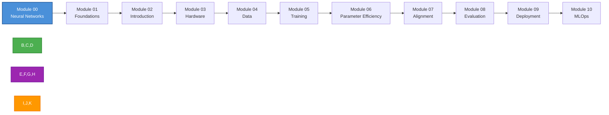
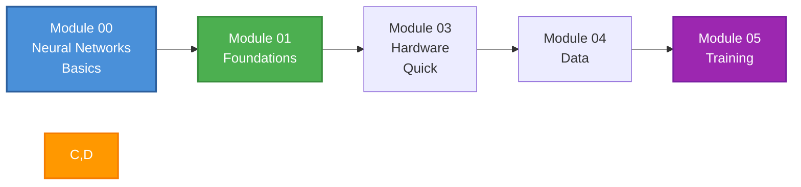

# Your First LLM Fine-Tune: A Step-by-Step Guide for Technical People

> **No machine learning background required.** From zero LLM knowledge to production-ready fine-tuning.

[](https://opensource.org/licenses/MIT)
[](https://www.python.org/downloads/)
[](https://huggingface.co/)

---

## Overview

This is a practical, end-to-end guide to fine-tuning Large Language Models for developers and DevOps engineers. No ML background required.

<div align="center">

| What You'll Learn | Tech Stack | Structure |
|-------------------|------------|-----------|
| Hardware setup & VRAM math | PyTorch, Transformers | 9 progressive modules |
| Data engineering & tokenization | PEFT, LoRA, QLoRA | Foundational -> Production |
| SFT, DPO, and ORPO | vLLM, TGI, GGUF | Clear visual guides |
| Evaluation & quantization | Hugging Face Hub, CI/CD | Self-paced learning paths |

</div>

---

## Learning Paths

Start wherever you are. Here's how to navigate:

### Path 1: Full Learning (Recommended)

A comprehensive journey from foundations to production deployment.



### Path 2: Quick Start to Training

For those ready to dive in quickly.



### Path 3: Skip Ahead

| Know This? | Start Here |
|------------|------------|
| Neural networks basics | Module 00: Neural Networks |
| Hardware/GPU | Module 03: Hardware Setup |
| Data engineering | Module 04: Data Engineering |
| SFT basics | Module 05: Training Dynamics |
| LoRA/QLoRA | Module 06: Parameter Efficiency |
| DPO/ORPO | Module 07: Alignment |
| Evaluation | Module 08: Evaluation |
| Deployment | Module 09: Model Deployment |

---

## Content Structure

```
content/
├── 00-preface.md                           # Welcome & navigation guide
├── 00-neural-networks-basics.md            # Neural networks primer (no math)
├── 01-foundations/                         # Core concepts, architecture decisions
│   └── 01-foundations-overview.md
├── 02-introduction/                        # Getting started, environment setup
│   └── 02-introduction-overview.md
├── 03-hardware-setup/                      # VRAM math, GPU selection, cluster setup
│   └── 03-hardware-setup-guide.md
├── 04-data-engineering/                    # Tokenization, ChatML, dataset curation
│   └── 04-data-engineering-guide.md
├── 05-training-dynamics/                   # SFT, hyperparameters, multi-GPU
│   └── 05-training-dynamics-guide.md
├── 06-parameter-efficiency/                # LoRA, QLoRA, adapters
│   └── 06-parameter-efficiency-guide.md
├── 07-alignment/                           # DPO, ORPO for behavior steering
│   └── 07-alignment-guide.md
├── 08-evaluation/                          # Benchmarking, custom evals
│   └── 08-evaluation-guide.md
├── 09-model-deployment/                    # Quantization, serving, production
│   └── 09-model-deployment-guide.md
├── 10-mlops-pipelines/                     # CI/CD, monitoring, automated pipelines
│   └── 10-mlops-pipelines-guide.md
└── 11-appendices/                          # Glossary, error reference, models
    └── 11-appendices-guide.md
```

---

## Quick Start

### Prerequisites

- Python > 3.10
- Hugging Face account (free)
- Basic Python knowledge (functions, loops, imports)
- Optional: NVIDIA GPU (can use cloud)

### Getting Started

```bash
# 1. Set up your environment
python -m venv venv
source venv/bin/activate  # or .venv\Scripts\activate on Windows

# 2. Install required packages
pip install torch transformers peft trl datasets accelerate

# 3. Authenticate with Hugging Face
huggingface-cli login

# 4. Choose your path
# - Full learning: Start at content/00-neural-networks-basics.md
# - Quick start: Jump to content/03-hardware-setup/
# - Skip ahead: See "Path 3" above
```

---

## What's Inside Each Module

| Module | Title | Key Takeaway |
|--------|-------|--------------|
| 00 | Neural Networks | Concepts without math - how LLMs actually work |
| 01 | Foundations | Core concepts that won't change |
| 02 | Introduction | Environment setup, tooling, workflow |
| 03 | Hardware Matrix | VRAM math, GPU selection, cluster setup |
| 04 | Data Engine | Tokenization, ChatML, dataset curation |
| 05 | Training Dynamics | SFT, hyperparameters, multi-GPU |
| 06 | Parameter Efficiency | LoRA, QLoRA, adapters for efficiency |
| 07 | Alignment | DPO, ORPO without RL complexity |
| 08 | Evaluation | Avoid overfitting, custom evals |
| 09 | Model Deployment | GGUF, AWQ, vLLM, TGI for production |
| 10 | MLOps | CI/CD, monitoring, automated pipelines |

---

## Target Audience

| Audience | Why You'll Love This Guide |
|----------|----------------------------|
| Developers | Learn fine-tuning without ML theory overload |
| DevOps Engineers | Deploy and operationalize custom models |
| Technical Founders | Build product-specific LLMs |
| Enthusiasts | Hands-on learning with real examples |

---

## Tech Stack

| Category | Tools & Frameworks |
|----------|-------------------|
| Training | PyTorch, Transformers, PEFT, TRL |
| Fine-tuning | LoRA, QLoRA, DPO, ORPO |
| Serving | vLLM, TGI, llama.cpp (GGUF) |
| Quantization | GGUF, AWQ, EXL2, EXL3 |
| MLOps | Hugging Face Hub, GitHub Actions, Docker |

---

## What You'll Build

By the end of this guide, you'll have:

1. **Custom fine-tuned models** for your specific use case
2. **Production-ready pipelines** for continuous training
3. **Automated evaluation** frameworks
4. **Optimized deployment** strategies for inference
5. **CI/CD workflows** for MLOps

---

## Contributing

This is a living document! Contributions are welcome. To contribute:

1. Fork the repository
2. Create your feature branch (`git checkout -b feature/AmazingFeature`)
3. Commit your changes (`git commit -m 'Add some AmazingFeature'`)
4. Push to the branch (`git push origin feature/AmazingFeature`)
5. Open a Pull Request

See [CONTRIBUTING.md](CONTRIBUTING.md) for details.

---

## License

This project is licensed under the MIT License - see the [LICENSE](LICENSE) file for details.

---

## Acknowledgments

- Built with inspiration from the Hugging Face community
- Thank you to all the open-source LLM researchers and developers
- Special thanks to the transformers, peft, and trl teams

---

## Contact & Support

- **Author**: Parv Khatri
- **Email**: khatriparv@gmail.com
- **GitHub**: https://github.com/Parv17k
- **LinkedIn**: https://www.linkedin.com/in/parvkhatri/

---

<div align="center">

**Happy fine-tuning!**

[Back to Top](#-your-first-llm-fine-tune)

</div>
