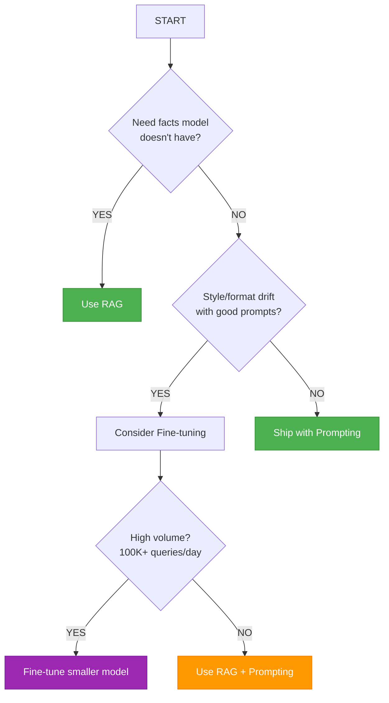

# Your First LLM Fine-Tune: A Step-by-Step Guide for Technical People

> **No machine learning background required.** From zero LLM knowledge to production-ready fine-tuning in 10 modules.

<div align="center">

[](https://opensource.org/licenses/MIT)
[](https://www.python.org/downloads/)
[](https://github.com/Parv17k/llm-fine-tuning-guide/commits/main)
[](https://github.com/Parv17k/llm-fine-tuning-guide/issues)
[](https://github.com/Parv17k/llm-fine-tuning-guide/stargazers)
[](https://huggingface.co/)

**Paper-validated content** from LoRA, QLoRA, DPO, and ORPO research

[📖 Browse Documentation](https://parv17k.github.io/llm-fine-tuning-guide/) · [Get Started](#quick-start) · [View Modules](#content-structure) · [Report Issues](https://github.com/Parv17k/llm-fine-tuning-guide/issues)

</div>

---

## Why This Guide Exists

Most LLM fine-tuning resources assume you have a machine learning PhD. This guide is built for:

| You Are | This Guide Helps You |
|---------|---------------------|
| **Developer** | Fine-tune models using Python skills you already have |
| **DevOps Engineer** | Provision GPUs, debug OOM errors, deploy to production |
| **Technical Lead** | Make architecture decisions: Prompt vs RAG vs Fine-tune |
| **Founder** | Build product-specific LLMs without hiring ML team |

**What makes this different:**

- **Paper-validated content** — Every technical claim backed by arXiv papers (LoRA, QLoRA, DPO, ORPO)
- **No math prerequisites** — Neural networks explained without calculus or linear algebra
- **Production-focused** — Deployment, quantization, MLOps pipelines included
- **Decision frameworks** — Know *when* to fine-tune, not just *how*

---

## Quick Start

### 5-Minute Setup

```bash
# 1. Create environment
python -m venv venv && source venv/bin/activate

# 2. Install core packages
pip install torch transformers peft trl datasets accelerate

# 3. Authenticate with Hugging Face
huggingface-cli login

# 4. Start learning
# Open content/01-foundations/01-foundations-overview.md
```

### Prerequisites

- Python 3.10+
- Hugging Face account (free tier works)
- Basic Python (functions, loops, imports)
- Optional: NVIDIA GPU (cloud alternatives provided)

---

## Content Structure

```mermaid
flowchart LR
    subgraph Foundations["Foundations"]
        A[00: Neural Networks]
        B[01: Foundations]
    end
    
    subgraph Setup["Setup"]
        C[02: Introduction]
        D[03: Hardware]
        E[04: Data]
    end
    
    subgraph Training["Training"]
        F[05: Training Dynamics]
        G[06: Parameter Efficiency]
        H[07: Alignment]
    end
    
    subgraph Production["Production"]
        I[08: Evaluation]
        J[09: Deployment]
        K[10: MLOps]
    end
    
    Foundations --> Setup --> Training --> Production
    
    style Foundations fill:#4a90d9,stroke:#2c5f9d,color:#ffffff
    style Setup fill:#4caf50,stroke:#388e3c,color:#ffffff
    style Training fill:#9c27b0,stroke:#7b1fa2,color:#ffffff
    style Production fill:#ff9800,stroke:#f57c00,color:#ffffff
```



### Module Overview

| Module | Title | Key Takeaway | Status |
|--------|-------|--------------|--------|
| 00 | Neural Networks | How LLMs work — no math | Complete |
| **01** | **Foundations** | **Prompt vs RAG vs Fine-tune** | **Complete** |
| 02 | Introduction | Environment, tooling, workflow | In Progress |
| 03 | Hardware Matrix | VRAM math, GPU selection | Planned |
| 04 | Data Engineering | Tokenization, ChatML, curation | Planned |
| 05 | Training Dynamics | SFT, hyperparameters, multi-GPU | Planned |
| 06 | Parameter Efficiency | LoRA, QLoRA, adapters | Planned |
| 07 | Alignment | DPO, ORPO without RL | Planned |
| 08 | Evaluation | Benchmarking, custom evals | Planned |
| 09 | Deployment | GGUF, AWQ, vLLM, TGI | Planned |
| 10 | MLOps | CI/CD, monitoring, pipelines | Planned |
| 11 | Appendices | Glossary, error reference | Planned |

---

## Learning Paths

### Path 1: Full Learning (Recommended)

Complete journey from foundations to production:

```
00 → 01 → 02 → 03 → 04 → 05 → 06 → 07 → 08 → 09 → 10
```

**Time commitment:** 4-6 weeks, 5-10 hours/week

### Path 2: Quick Start to Training

Get to hands-on fine-tuning fast:

```
Neural Networks (00) → Foundations (01) → Hardware (03) → Data (04) → Training (05)
```

**Time commitment:** 2 weeks, 5-10 hours/week

### Path 3: Skip Ahead

| You Know | Start Here |
|----------|------------|
| Neural networks basics | Module 01: Foundations |
| Hardware/GPU setup | Module 04: Data Engineering |
| Data engineering | Module 05: Training Dynamics |
| SFT basics | Module 06: Parameter Efficiency |
| LoRA/QLoRA | Module 07: Alignment |
| Fine-tuning | Module 09: Deployment |

---

## What You'll Build

By the end of this guide:

1. **Custom fine-tuned models** for your specific use case
2. **Production-ready pipelines** for continuous training
3. **Automated evaluation frameworks** to measure quality
4. **Optimized deployment strategies** for inference at scale
5. **CI/CD workflows** for MLOps

---

## Tech Stack

| Category | Tools |
|----------|-------|
| **Training** | PyTorch, Transformers, PEFT, TRL, Accelerate |
| **Fine-tuning** | LoRA, QLoRA, DPO, ORPO |
| **Serving** | vLLM, TGI, llama.cpp (GGUF) |
| **Quantization** | GGUF, AWQ, EXL2, EXL3 |
| **MLOps** | Hugging Face Hub, GitHub Actions, Docker |

---

## Key Concepts You'll Master

### Fine-Tuning Methods

| Method | Trainable Params | VRAM (7B) | Best For |
|--------|-----------------|-----------|----------|
| Full Fine-Tuning | 100% | ~98 GB | Research, multi-GPU clusters |
| LoRA | 0.5-1% | ~18 GB | Production adapters |
| QLoRA | 0.5-1% | ~6 GB | Consumer GPUs, prototyping |

### Alignment Methods

| Method | Stages | Training Time | Reference Model |
|--------|--------|---------------|-----------------|
| DPO | 2 (SFT → DPO) | 2x | Required |
| ORPO | 1 (Direct) | 1x (56% faster) | Not required |

### Decision Framework



---

## Contributing

This is a living document! Contributions are welcome.

### Ways to Contribute

- **Fix typos or clarify** — Small improvements matter
- **Add examples** — Code snippets, troubleshooting guides
- **Review technical accuracy** — Especially if you have fine-tuning experience
- **Suggest topics** — Open an issue for missing content
- **Improve navigation** — Better links, tables of contents

### Getting Started

```bash
# 1. Fork the repository
git clone https://github.com/your-username/llm-fine-tuning-guide.git

# 2. Create a branch
git checkout -b feature/your-improvement

# 3. Make your changes
# Edit markdown files in content/

# 4. Submit a Pull Request
git push origin feature/your-improvement
```

See [CONTRIBUTING.md](CONTRIBUTING.md) for detailed guidelines.

---

## Roadmap

| Quarter | Focus |
|---------|-------|
| Q2 2026 | Complete Modules 02-05 (Setup → Training) |
| Q3 2026 | Complete Modules 06-10 (Efficiency → MLOps) |
| Q4 2026 | Add interactive notebooks, video walkthroughs |

---

## License

This project is licensed under the MIT License — see the [LICENSE](LICENSE) file for details.

---

## Acknowledgments

- Built with inspiration from the Hugging Face community
- Thank you to all the open-source LLM researchers and developers
- Special thanks to the transformers, peft, and trl teams

---

## Contact & Support

| | |
|---|---|
| **Author** | Parv Khatri |
| **Email** | khatriparv@gmail.com |
| **GitHub** | [@Parv17k](https://github.com/Parv17k) |
| **LinkedIn** | [parvkhatri](https://www.linkedin.com/in/parvkhatri/) |

**Found this helpful?** [Star the repo](https://github.com/Parv17k/llm-fine-tuning-guide/stargazers) to support ongoing development.

---

<div align="center">

**Happy fine-tuning!**

[Get Started](#quick-start) · [View Modules](#content-structure) · [Report Issues](https://github.com/Parv17k/llm-fine-tuning-guide/issues)

</div>
