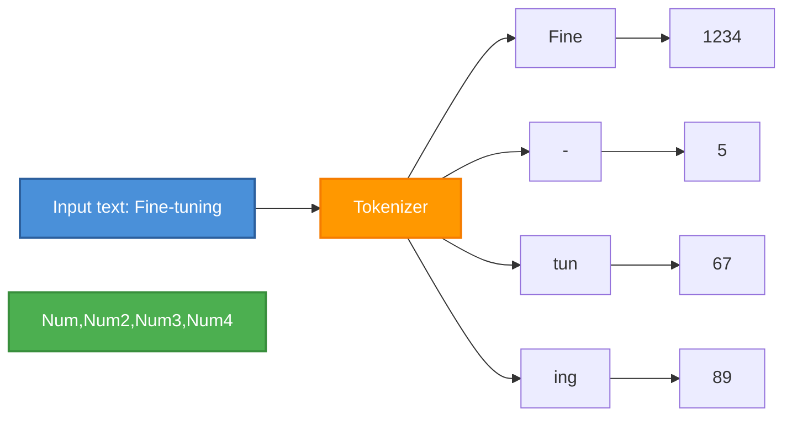
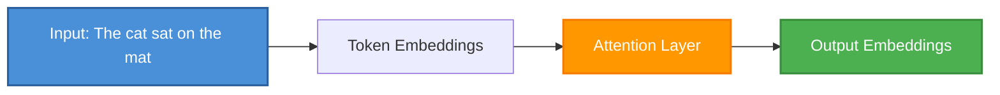
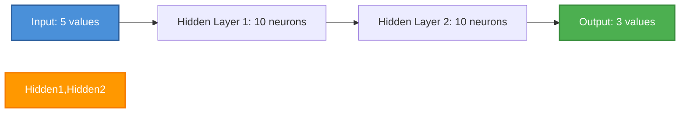
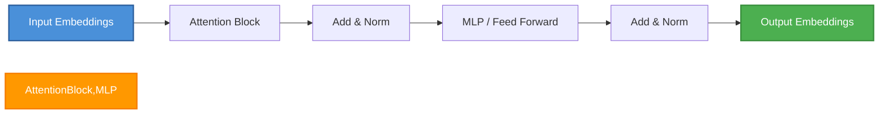
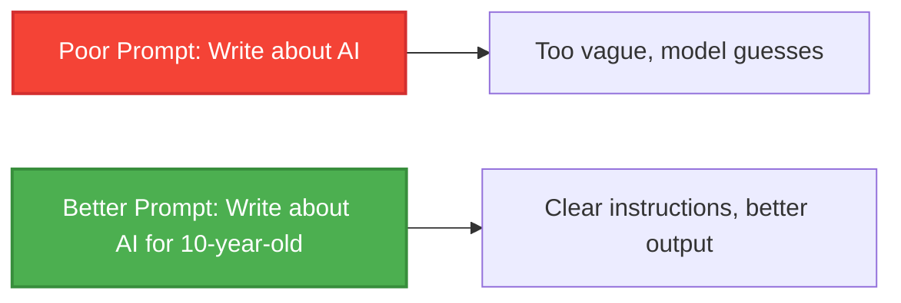
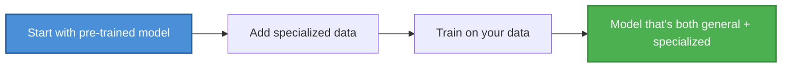

# Neural Networks for LLMs: A Developer's Primer

No math, no algorithms - just the concepts you need to understand how LLMs work.

---

## Why This Matters

You don't need to be a machine learning expert to fine-tune LLMs. You do need to understand:

- What a neural network actually does (beyond "magic")
- Key terms like embedding, attention, transformer
- How LLMs process text
- Why data quality matters
- What's happening during training and inference

This chapter gives you that foundation.

---

## Analogy: LLMs as Pattern Completion

Think of an LLM as an extremely sophisticated autocomplete on steroids.

**Key insight**: LLMs don't "know" facts. They predict the most statistically likely continuation of any text pattern they've seen.

---

## How LLMs Process Text

### Step 1: Tokenization

LLMs don't read words - they read **tokens** (pieces of words).

**Why**: Computers process numbers better than text. This creates a "vocabulary" of common word pieces.

### Step 2: Embedding

Numbers alone don't capture meaning. **Embeddings** convert tokens into vectors (lists of numbers) where similar meanings are close together.

**Simple visualization**: In vector space, "king" and "queen" are closer together (similar meaning), while "apple" is farther away (different concept).

### Step 3: Attention - The "Focus" Mechanism

**Attention** lets the model focus on relevant parts of input when generating output.

**Simple example**: When generating "mat", the model pays attention to what came before ("sat", "cat").

### Step 4: MLP (Multi-Layer Perceptron) - The Core Engine

Before transformers, **MLPs** were the fundamental building block of neural networks.

**Key ideas**:
- **Layers**: Collections of neurons that process data
- **Weights**: Parameters that get adjusted during training
- **Activation functions** (ReLU, etc.): Add non-linearity so the network can learn complex patterns
- **Backpropagation**: How errors flow backward to adjust weights

**Why MLP matters in LLMs**: The "Feed Forward" block in the Transformer architecture is just an MLP - it takes embeddings, processes them through layers, and outputs transformed embeddings. The magic of Transformers isn't the MLP itself, but how attention works alongside it.

### Step 5: Transformers - The Architecture

Modern LLMs use the **Transformer** architecture (introduced in 2017).

**Stacked transformers**: LLMs stack hundreds of these blocks, each learning different patterns.

---

## Key Concepts

### What is a "Large" Language Model?

| Model Size | Parameters | Rough Analogy |
|------------|------------|---------------|
| Small | 100M | Small vocabulary, simple patterns |
| Medium | 1B | Good grammar, basic facts |
| Large | 7B | Reasoning, multiple topics |
| Very Large | 70B | Close to human-level understanding |

**Parameters**: Think of these as the model's "knobs" it adjusts during training. More parameters = more capacity to learn complex patterns.

### Training vs. Inference

**Training (what happens during fine-tuning)**:

**Inference (what happens when you use the model)**:

### Prompt Engineering

A **prompt** is the input text you give to an LLM.

---

## How Fine-Tuning Works (High Level)

### Why Fine-Tune?

| Approach | Pros | Cons |
|----------|------|------|
| **Prompting** | Fast, no compute | Limited to what model already knows |
| **RAG** | Adds new data, no retraining | Can't change model behavior |
| **Fine-Tuning** | Custom behavior, better results | Requires data, compute, time |

---

## Memory Aid: The LLM Mental Model

**Remember**: 
- LLMs predict the next token based on patterns
- They don't "know" anything - they predict what comes next
- Training adjusts the model to predict better on your data
- More data + more compute = better predictions (up to a point)

---

## Next Steps

Now you understand:
- How LLMs process text (tokenization → embeddings → attention)
- What an MLP is (the building block of neural networks)
- What training actually does (adjusting parameters to predict better)
- The difference between prompting, RAG, and fine-tuning

This foundation will help you make better decisions when:
- Choosing models
- Preparing data
- Designing prompts
- Evaluating results
