# Neural Networks for LLMs: A technical's Primer

No math, no algorithms - just the concepts you need to understand how LLMs work.

---

## Why This Matters

You don't need to be a machine learning expert to fine-tune LLMs. You do need to understand:

- What a neural network actually does (beyond "magic")
- Key terms like embedding, attention, transformer
- How LLMs process text
- Why data quality matters
- What's happening during training and inference

This chapter gives you that foundation.

---

## Analogy: LLMs as Pattern Completion

Think of an LLM as an extremely sophisticated autocomplete on steroids.

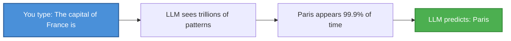

**Key insight**: LLMs don't "know" facts. They predict the most statistically likely continuation of any text pattern they've seen.

---

## How LLMs Process Text

### Step 1: Tokenization

LLMs don't read words - they read **tokens** (pieces of words).

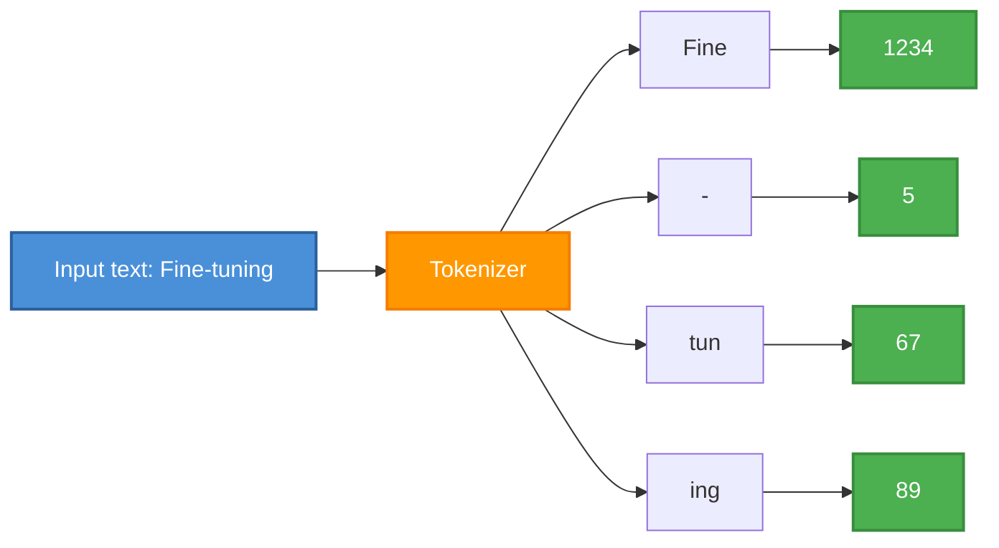

**Why**: Computers process numbers better than text. This creates a "vocabulary" of common word pieces.

### Step 2: Embedding

Numbers alone don't capture meaning. **Embeddings** convert tokens into vectors (lists of numbers) where similar meanings are close together.

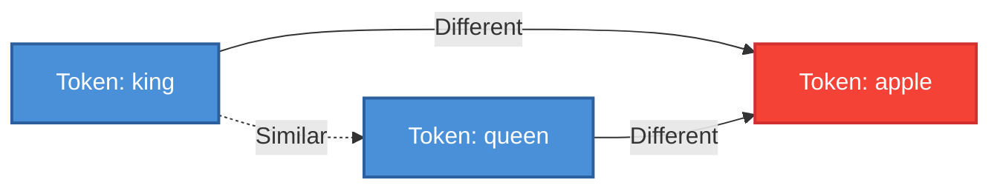

**Simple visualization**: In vector space, "king" and "queen" are closer together (similar meaning), while "apple" is farther away (different concept).

**Embedding matrix**: Think of it as a giant lookup table. Each row is a token from the vocabulary, and each column is a feature dimension. For a model with a 50,000-word vocabulary and 4,092 dimensions, the matrix looks like:

```
          Dim 1   Dim 2   Dim 3   ...   Dim 4096
Token 1   0.23   -0.87    0.45   ...    0.12
Token 2  -0.56    0.34   -0.21   ...   -0.67
Token 3   0.19    0.91    0.78   ...    0.44
   ...
Token 50000
```

When the model sees the word "king" (say, token ID 1234), it looks up row 1234 and gets a 4,096-number vector.

> **Note**: "King" might be row 1234 and "queen" could be row 4892 — completely unrelated row numbers. The similarity isn't in *where* the rows sit, but in *what numbers are inside* those rows.

**Why similar words look alike**: During training, the model reads trillions of sentences. It notices that "king" and "queen" both appear near words like "royal," "crown," "throne," "ruler." Because they share similar surroundings, the model adjusts their rows to have similar numbers. Over time, words that appear in similar contexts naturally end up with similar vectors — like two people who hang out in the same circles probably share similar interests.

### Step 3: Attention - The "Focus" Mechanism

**Attention** lets the model focus on relevant parts of input when generating output.

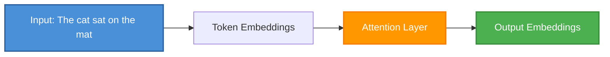

**Simple example**: When generating "mat", the model pays attention to what came before ("sat", "cat").

**What attention actually does**:

Imagine you're reading this sentence: *"The animal didn't cross the street because **it** was too tired."*

When you see "it", your brain instantly asks: *what does "it" refer to?* You look back and figure out — "it" = "the animal", not "the street". That's **attention** — the ability to connect related words across a sentence.

In an LLM, when generating each word, the model looks at *all* previous words and assigns a **weight** (importance score) to each one. For the word "it", the model would give a high weight to "animal" and a low weight to "street". This lets the model understand context no matter how far apart the related words are.

**Without attention**: The model would only see the immediately preceding word, like reading a sentence one word at a time with no memory.

**With attention**: The model can reach back across the entire sentence (or even the whole document) and pick out what matters.

### Step 4: MLP (Multi-Layer Perceptron) - The Core Engine

Before transformers, **MLPs** were the fundamental building block of neural networks.

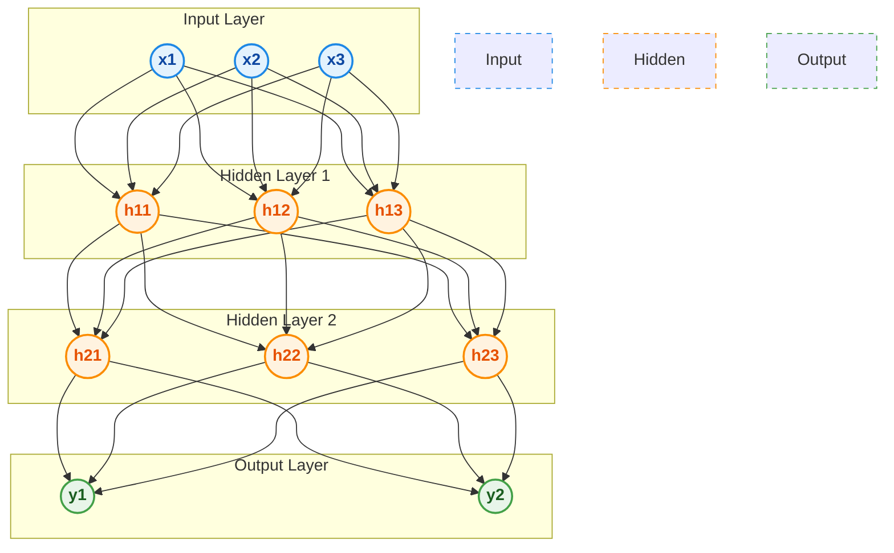

**How data flows through the network**:

1. **Input layer** — Your raw data enters (e.g., 3 numbers representing features)
2. **Hidden layers** — Each neuron multiplies its inputs by **weights** (the numbers on the arrows), adds them up, and passes the result through an **activation function** (like ReLU) to introduce non-linearity
3. **Output layer** — The final processed result

**What are weights?**
- Each connection between neurons has a **weight** — a number that determines how much influence one neuron has on another
- During training, the model adjusts these weights to minimize errors
- Think of weights as "knobs" that control signal strength: a weight of 0.9 means "this connection matters a lot", while 0.1 means "barely matters"

**What are neurons?**
- Each neuron is a tiny computation unit: it takes inputs, multiplies by weights, sums them up, applies an activation function, and passes the result forward
- Hidden layers are where the "thinking" happens — each layer learns progressively more complex patterns from the previous layer's output

### Step 5: Transformers - The Architecture

Modern LLMs use the **Transformer** architecture (introduced in 2017).

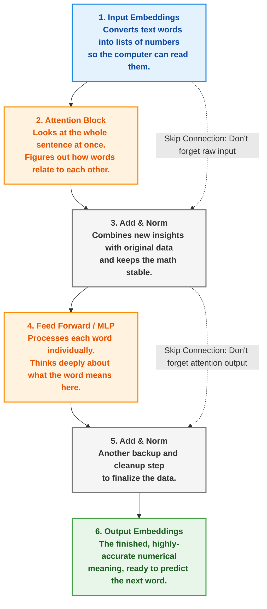

**Stacked transformers**: LLMs stack hundreds of these blocks, each learning different patterns.
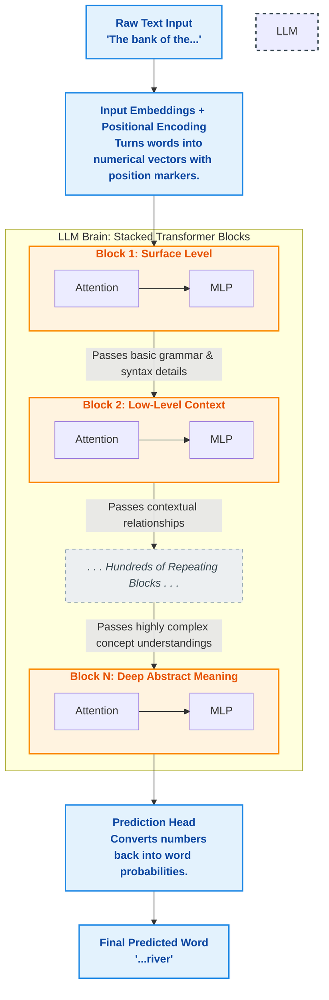


---

## Key Concepts

### What is a "Large" Language Model?

| Model Size | Parameters | Example Models | Rough Analogy |
|------------|------------|----------------|---------------|
| Tiny | 100-500M | SmolLM2-135M | Simple patterns, educational |
| Small | 1B-5B | Gemma-4-E2B, Qwen3.6-4B | Good grammar, fast edge deployment |
| Medium | 7B-30B | Llama-4-Scout-17B, Qwen3.6-27B | Reasoning, multiple topics, sweet spot |
| Large | 30B-100B | Gemma-4-31B, Qwen3.6-35B-A3B | Near human-level understanding |
| Very Large | 100B-500B | DeepSeek-V4-Pro, GLM-5.2 | State-of-the-art reasoning & coding |
| Massive | 500B-1T+ | Kimi-K2.5 (1T) | Frontier capabilities, multi-GPU only |

**Parameters**: Think of these as the model's "knobs" it adjusts during training. More parameters = more capacity to learn complex patterns. Modern models also use **Mixture of Experts (MoE)** architecture where only a subset of parameters are active per token — giving large capacity with efficient inference (e.g., **Qwen3.6-35B-A3B** has 35B total params but only 3B active per token, while **Kimi-K2.5** has 1T total but only 32B active).

### Training vs. Inference

**Training (what happens during fine-tuning)**:
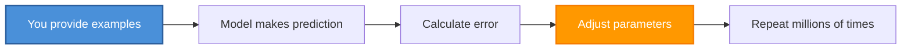

**Inference (what happens when you use the model)**:
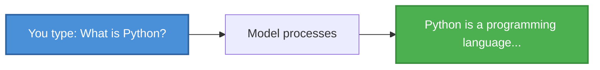

### Prompt Engineering

A **prompt** is the input text you give to an LLM. Modern prompts often include:

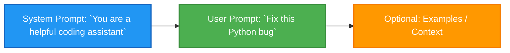

**Key prompt techniques**:
- **System prompts**: Set the model's role and behavior
- **Chain-of-thought**: Ask the model to "think step by step" for reasoning
- **Few-shot examples**: Provide examples in the prompt for better results
- **Role-playing**: Assign a specific persona or expertise area

---

## How Fine-Tuning Works (High Level)

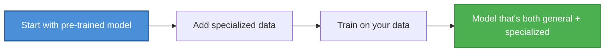

### Why Fine-Tune?

| Approach | Pros | Cons |
|----------|------|------|
| **Prompting** | Fast, no compute | Limited to what model already knows |
| **RAG** | Adds new data, no retraining | Can't change model behavior |
| **Fine-Tuning** | Custom behavior, better results | Requires data, compute, time |

---

## Memory Aid: The LLM Mental Model

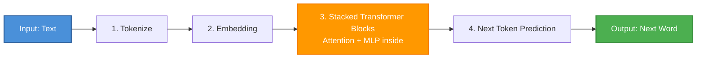

**Remember**: 
- LLMs predict the next token based on patterns
- They don't "know" anything - they predict what comes next
- Training adjusts the model to predict better on your data
- More data + more compute = better predictions (up to a point)

---

## Next Steps

Now you understand:
- How LLMs process text (tokenization → embeddings → attention)
- What an MLP is (the building block of neural networks)
- What training actually does (adjusting parameters to predict better)
- The difference between prompting, RAG, and fine-tuning

This foundation will help you make better decisions when:
- Choosing models
- Preparing data
- Designing prompts
- Evaluating results

---

## Related: LLM Architectures

For a deep dive into specific model architectures (Llama, Qwen, DeepSeek, Gemma, etc.), see:
- [LLM Architectures: From Transformer to 2026](./01-llm-architectures.md)
