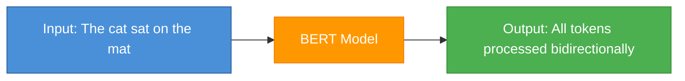
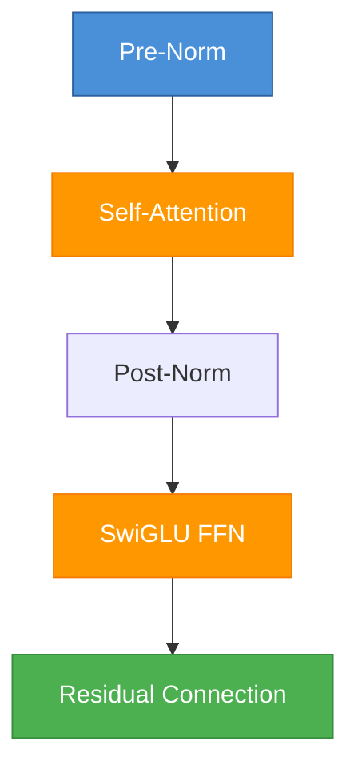
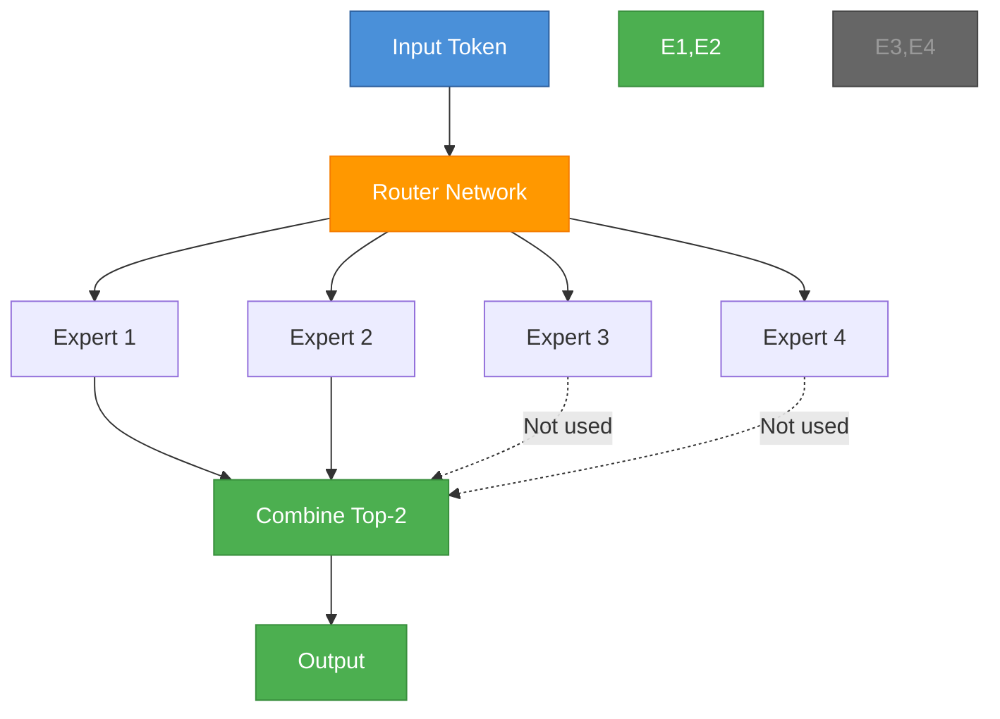
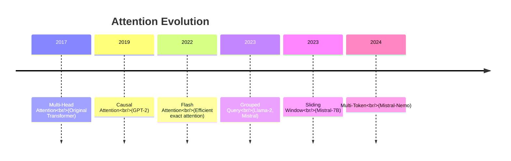

# LLM Architectures: From Transformer to Llama-3

Understanding the evolution of LLM architectures helps you choose the right model and configure fine-tuning properly.

---

## The Transformer Revolution (2017)

**Paper**: ["Attention Is All You Need"](https://arxiv.org/abs/1706.03762) - Vaswani et al., Google

Before transformers, RNNs/LSTMs dominated sequence modeling but had limitations:
- **Sequential processing**: Had to read word-by-word (slow)
- **Vanishing gradients**: Struggled with long sequences
- **Limited parallelization**: Couldn't use GPUs efficiently

### Transformer Innovation

```mermaid
graph TB
    subgraph Before["Before Transformer (RNN/LSTM)"]
        A1[Word 1] --> A2[Word 2] --> A3[Word 3] --> A4[Word 4]
        style A1 fill:#f44336
        style A2 fill:#f44336
        style A3 fill:#f44336
        style A4 fill:#f44336
    end
    
    subgraph After["Transformer (Parallel)"]
        B1[Word 1] --> C[Self-Attention]
        B2[Word 2] --> C
        B3[Word 3] --> C
        B4[Word 4] --> C
        C --> D[All positions processed at once]
        style B1 fill:#4caf50
        style B2 fill:#4caf50
        style B3 fill:#4caf50
        style B4 fill:#4caf50
        style C fill:#ff9800
        style D fill:#4caf50
    end
    
    style Before fill:#1a1a1a,stroke:#666
    style After fill:#1a3a1a,stroke:#3fb950
```



**Key innovations**:
1. **Self-Attention**: Every token can attend to every other token directly
2. **Parallelization**: Process entire sequence at once
3. **Positional Encoding**: Add position information (since no order inherently)

### Original Transformer Architecture

```
┌─────────────────────────────────────┐
│  Decoder (Generative)               │
│  ┌─────────────┐                    │
│  │ Masked Attn │ ← Can only see past│
│  └─────────────┘                    │
│  ┌─────────────┐                    │
│  │ Feed Forward│                    │
│  └─────────────┘                    │
│  (Repeat N times)                   │
└─────────────────────────────────────┘
```

---

## BERT Era (2018)

**Paper**: ["BERT: Pre-training of Deep Bidirectional Transformers"](https://arxiv.org/abs/1810.04805) - Google

**Innovation**: Encoder-only, bidirectional training



**Training objective**: Masked Language Modeling (MLM)
- Mask random tokens: "The cat sat on the [MASK]"
- Model predicts: "mat"
- Learns from context on BOTH sides

**Use cases**: Classification, QA, NER (not generation)

**Limitations for LLMs**:
- Bidirectional = can't do next-token prediction
- Encoder-only = not designed for generation

---

## GPT Evolution (2018-2023)

### GPT-1 (2018) - OpenAI

**Paper**: ["Improving Language Understanding by Generative Pre-Training"](https://cdn.openai.com/research-covers/language-unsupervised/language_understanding_paper.pdf)

**Architecture**: Decoder-only transformer
- **Causal attention**: Only sees previous tokens
- **Pre-training**: Next token prediction on books
- **Fine-tuning**: Task-specific training


### GPT-2 (2019) - Scale Works

**Key insight**: Scale model + data = better results

| Model | Parameters | Training Data |
|-------|------------|---------------|
| GPT-2 Small | 117M | 8M web pages |
| GPT-2 Medium | 345M | 8M web pages |
| GPT-2 Large | 762M | 8M web pages |
| GPT-2 XL | 1.5B | 8M web pages |

**Innovations**:
- Layer normalization moved to inside block
- Additional normalization on input
- Simpler architecture = easier to scale

### GPT-3 (2020) - Emergent Abilities

**Paper**: ["Language Models are Few-Shot Learners"](https://arxiv.org/abs/2005.14165)

| Model | Parameters | Context |
|-------|------------|---------|
| GPT-3 Ada | 350M | 2K tokens |
| GPT-3 Babbage | 1.3B | 2K tokens |
| GPT-3 Curie | 6.7B | 2K tokens |
| GPT-3 Davinci | 175B | 2K tokens |

**Breakthrough**: In-context learning (few-shot prompting)
- Model learns from examples in prompt (no fine-tuning!)

### GPT-4 (2023) - Multimodal

- Estimated 1.7T parameters (MoE architecture)
- 128K context window
- Trained on text + images

---

## Llama Family (2023-2024) - Meta

### Llama-1 (2023)

**Paper**: ["LLaMA: Open and Efficient Foundation Language Models"](https://arxiv.org/abs/2302.13971)

**Innovations**:
- **SwiGLU activation**: Better than ReLU for language
- **Rotary Embeddings (RoPE)**: Better position encoding
- **RMSNorm**: Faster normalization



**Model sizes**: 7B, 13B, 33B, 65B (efficient training)

### Llama-2 (2023) - RLHF Added

**Paper**: ["Llama 2: Open Foundation and Fine-Tuned Chat Models"](https://arxiv.org/abs/2307.09288)

**Improvements over Llama-1**:
- 2x more training data
- **Grouped Query Attention (GQA)**: Faster inference
- **RLHF alignment**: Better helpfulness/safety

| Model | Parameters | KV Heads |
|-------|------------|----------|
| Llama-2-7B | 7B | 32 (standard) |
| Llama-2-13B | 13B | 40 (standard) |
| Llama-2-70B | 70B | 8 (GQA!) |

**GQA benefit**: Fewer KV heads = less memory during inference

### Llama-3 (2024) - Production Ready

**Innovations**:
- **Tokenizer**: 128K vocab (was 32K) - better multilingual
- **Context**: 8K tokens (was 4K)
- **Training data**: 15T tokens (3x more)

| Model | Parameters | VRAM (4-bit) | Best For |
|-------|------------|--------------|----------|
| Llama-3-8B | 8B | 5 GB | Development, edge |
| Llama-3-70B | 70B | 40 GB | Production SOTA |

### Llama-3.1 (2024) - Extended Context

| Model | Context | Training Data | Release |
|-------|---------|---------------|---------|
| Llama-3.1-8B | 128K | 15T+ | Jul 2024 |
| Llama-3.1-70B | 128K | 15T+ | Jul 2024 |
| Llama-3.1-405B | 128K | 15T+ | Jul 2024 |

### Llama-3.2 (2024) - Edge Optimized

| Model | Parameters | VRAM (4-bit) | Use Case |
|-------|------------|--------------|----------|
| Llama-3.2-1B | 1B | 1 GB | Mobile, IoT |
| Llama-3.2-3B | 3B | 2.5 GB | Edge devices |

---

## Mistral Family (2023-2024)

### Mistral-7B (2023)

**Paper**: ["Mistral 7B"](https://arxiv.org/abs/2310.06825)

**Key innovations**:
- **Sliding Window Attention**: 8K context with efficiency
- **GQA**: Faster decoding
- **No MoE**: Dense model, simpler deployment

```
Mistral-7B Architecture:
├── Hidden size: 4096
├── Intermediate: 14336 (SwiGLU)
├── Num layers: 32
├── Num heads: 32
├── KV heads: 8 (GQA!)
└── Max position: 32768 (Sliding Window)
```

**Why popular**: Best 7B model for fine-tuning

### Mixtral-8x7B (2023) - MoE Architecture

**Paper**: ["Mixtral of Experts"](https://arxiv.org/abs/2401.04088)

**Mixture of Experts (MoE)**:
- 8 experts per layer
- Each token uses only 2 experts
- **Active params**: 12B (of 47B total)



**Benefit**: MoE = more capacity, same inference cost

### Mistral-Nemo (2024)

- 12B parameters (sweet spot between 7B and 70B)
- 128K context
- Multi-token predictions (faster training)

---

## Other Notable Architectures

### Qwen2 (Alibaba, 2024)

**Models**: 0.5B, 1.5B, 7B, 14B, 57B, 72B

**Strengths**:
- Best multilingual (Chinese, English, 29+ languages)
- 128K context on large models
- Strong coding capabilities

### Gemma-2 (Google, 2024)

**Models**: 2B, 9B, 27B

**Innovations**:
- **Local attention**: Windows within sequence
- **Query normalization**: Training stability
- **Knowledge distillation**: From larger models

### Phi-3 (Microsoft, 2024)

**Models**: 3.8B (Mini), 7B (Small), 14B (Medium)

**Unique approach**: Train on "textbook-quality" data (not web-scale)

**Result**: 3.8B competes with 7B models trained on 10x more data

---

## Architecture Comparison Matrix

| Architecture | Type | Best For | Fine-Tuning |
|--------------|------|----------|-------------|
| **BERT** | Encoder | Classification, NER | Full FT |
| **GPT-2/3** | Decoder | Generation | LoRA/QLoRA |
| **Llama-2/3** | Decoder | Chat, Code, General | LoRA/QLoRA |
| **Mistral-7B** | Decoder | Best 7B for FT | LoRA/QLoRA |
| **Mixtral** | MoE Decoder | High quality, fast | Full FT (hard) |
| **Qwen2** | Decoder | Multilingual | LoRA/QLoRA |
| **Phi-3** | Decoder | Edge deployment | Full FT |

---

## Attention Mechanisms Evolution



### Multi-Head Attention (MHA)

Standard: Each head has its own Q, K, V projections

```
Query Heads: 32
Key Heads: 32  
Value Heads: 32
Memory: High (stores all KV)
```

### Grouped Query Attention (GQA)

Groups of query heads share KV heads

```
Query Heads: 32
Key Heads: 8   (4 query groups per KV head)
Value Heads: 8
Memory: 4x less KV cache!
```

### Multi-Query Attention (MQA)

All query heads share single KV head

```
Query Heads: 32
Key Heads: 1
Value Heads: 1
Memory: Minimal, but quality drop
```

---

## Model Selection Guide

```mermaid
graph TD
    A[Start: Choose Model] --> B{Use Case?}
    B -->|Chat/General| C[Llama-3.1-8B/70B]
    B -->|Code| D[CodeLlama, StarCoder]
    B -->|Multilingual| E[Qwen2, Aya]
    B -->|Edge/Mobile| F[Phi-3, Llama-3.2-1B]
    B -->|Research| G[Mistral, Mixtral]
    
    C --> H{VRAM Budget?}
    H -->|<8GB| I[Llama-3.2-3B]
    H -->|8-24GB| J[Llama-3.1-8B]
    H -->|>24GB| K[Llama-3.1-70B]
    
    style A fill:#2d333b
    style B fill:#347d39
    style C fill:#238636
    style F fill:#238636
    style I fill:#1a1a1a
    style J fill:#1a1a1a
    style K fill:#1a1a1a
```



---

## Key Takeaways

1. **Decoder-only** (GPT/Llama/Mistral) = best for generation/fine-tuning
2. **GQA** = faster inference, less VRAM (Llama-2-70B, Mistral-7B)
3. **MoE** = more capacity, complex deployment (Mixtral)
4. **Sliding window** = long context, efficient (Mistral-7B)
5. **Llama-3** = current sweet spot for fine-tuning
6. **Phi-3** = best for edge/mobile deployment

---

## Next Steps

Now you understand:
- Transformer architecture and why it dominates
- Evolution from BERT → GPT → Llama → Mistral
- Key innovations (GQA, RoPE, SwiGLU, MoE)
- How to choose the right model for your use case

This knowledge helps you:
- Select appropriate base models
- Understand fine-tuning configurations
- Debug architecture-specific issues
- Make informed trade-offs (quality vs. speed vs. cost)
