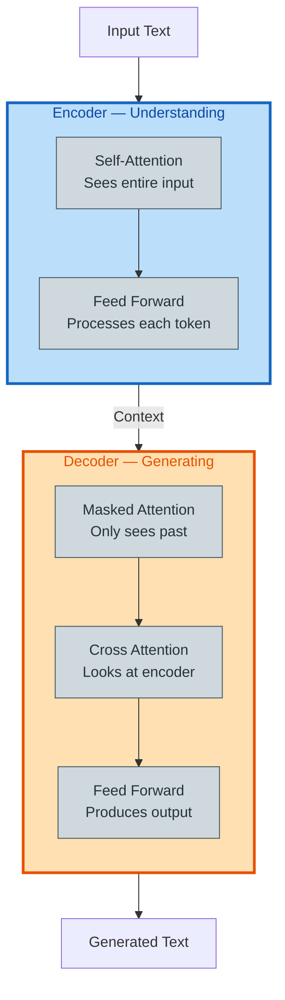
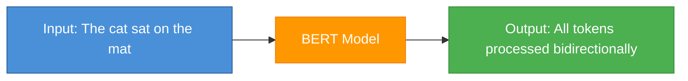
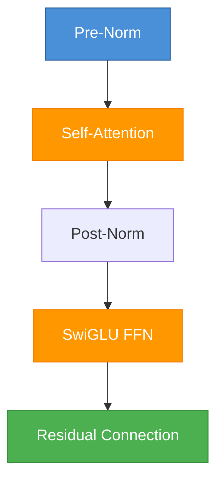
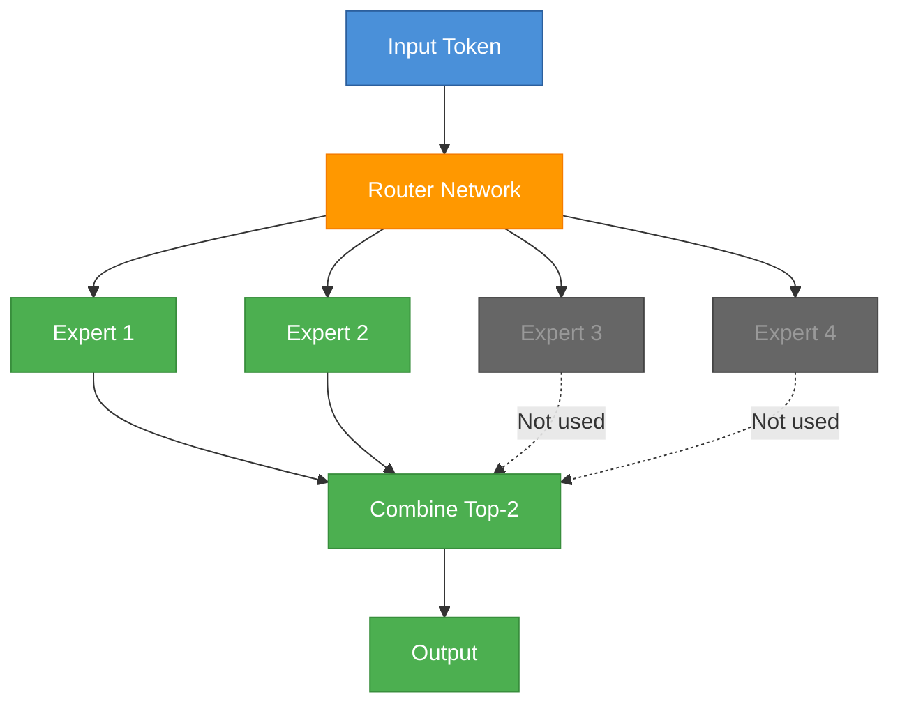
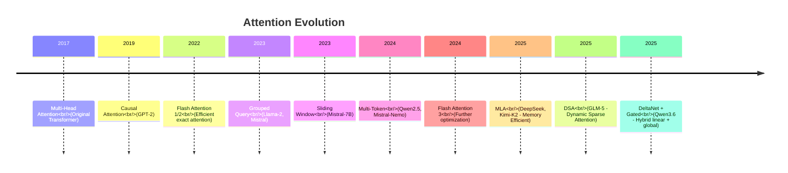

# LLM Architectures: From Transformer to 2026

Understanding the evolution of LLM architectures helps you choose the right model and configure fine-tuning properly.
> **You can skim over if it's too dense and read the details later when you need to make architecture decisions.**
---

## The Transformer Revolution (2017)

**Paper**: ["Attention Is All You Need"](https://arxiv.org/abs/1706.03762) - Vaswani et al., Google

Before transformers, RNNs/LSTMs dominated sequence modeling but had limitations:
- **Sequential processing**: Had to read word-by-word (slow)
- **Vanishing gradients**: Struggled with long sequences
- **Limited parallelization**: Couldn't use GPUs efficiently

### Transformer Innovation

```mermaid
graph TB
    subgraph Before["Before Transformer (RNN/LSTM)"]
        A1[Word 1] --> A2[Word 2] --> A3[Word 3] --> A4[Word 4]
        style A1 fill:#f44336
        style A2 fill:#f44336
        style A3 fill:#f44336
        style A4 fill:#f44336
    end
    
    subgraph After["Transformer (Parallel)"]
        B1[Word 1] --> C[Self-Attention]
        B2[Word 2] --> C
        B3[Word 3] --> C
        B4[Word 4] --> C
        C --> D[All positions processed at once]
        style B1 fill:#4caf50
        style B2 fill:#4caf50
        style B3 fill:#4caf50
        style B4 fill:#4caf50
        style C fill:#ff9800
        style D fill:#4caf50
    end
    
    style Before fill:#1a1a1a,stroke:#666
    style After fill:#1a3a1a,stroke:#3fb950
```



**Key innovations**:
1. **Self-Attention**: Every token can attend to every other token directly
2. **Parallelization**: Process entire sequence at once
3. **Positional Encoding**: Add position information (since no order inherently)

### Original Transformer Architecture

The 2017 Transformer had **two main parts**:



**What each part does**:

| Component | What it does | Simple analogy |
|-----------|--------------|----------------|
| **Encoder** | Reads the entire input sequence and builds a rich understanding | Like reading a paragraph and fully grasping its meaning |
| **Decoder** | Generates output one token at a time, using the encoder's understanding | Like writing an answer based on what you understood |
| **Self-Attention** (Encoder) | Every input token looks at every other token | Like underlining related words in a sentence |
| **Masked Attention** (Decoder) | Only looks at tokens generated so far | Like only reading what you've written before the current word |
| **Cross-Attention** (Decoder) | Connects decoder to encoder output | Like glancing at your notes while writing |
| **Feed Forward** | Processes each token independently through neural layers | Like refining your understanding of each word |

**Why two parts?**
- The **encoder** needs to see everything at once to understand context (bidirectional)
- The **decoder** generates one word at a time, so it can only look backward (causal)

**Modern LLMs simplified this**: Today's models (GPT, Llama, Qwen, etc.) use **decoder-only** architecture. They dropped the encoder entirely and just stack decoder blocks. This works because:
- For generation, you only need the decoder's causal attention
- It's simpler, faster, and scales better
- The encoder was mainly useful for translation (input → output), but for pure text generation, the decoder alone is sufficient

---

## BERT Era (2018)

**Paper**: ["BERT: Pre-training of Deep Bidirectional Transformers"](https://arxiv.org/abs/1810.04805) - Google

**Innovation**: Encoder-only, bidirectional training



**Training objective**: Masked Language Modeling (MLM)
- Mask random tokens: "The cat sat on the [MASK]"
- Model predicts: "mat"
- Learns from context on BOTH sides

**Use cases**: Classification, QA, NER (not generation)

**Limitations for LLMs**:
- Bidirectional = can't do next-token prediction
- Encoder-only = not designed for generation

---

## GPT Evolution (2018-2023)

### GPT-1 (2018) - OpenAI

**Paper**: ["Improving Language Understanding by Generative Pre-Training"](https://cdn.openai.com/research-covers/language-unsupervised/language_understanding_paper.pdf)

**Architecture**: Decoder-only transformer
- **Causal attention**: Only sees previous tokens
- **Pre-training**: Next token prediction on books
- **Fine-tuning**: Task-specific training


### GPT-2 (2019) - Scale Works

**Key insight**: Scale model + data = better results

| Model | Parameters | Training Data |
|-------|------------|---------------|
| GPT-2 Small | 117M | 8M web pages |
| GPT-2 Medium | 345M | 8M web pages |
| GPT-2 Large | 762M | 8M web pages |
| GPT-2 XL | 1.5B | 8M web pages |

**Innovations**:
- Layer normalization moved to inside block
- Additional normalization on input
- Simpler architecture = easier to scale

### GPT-3 (2020) - Emergent Abilities

**Paper**: ["Language Models are Few-Shot Learners"](https://arxiv.org/abs/2005.14165)

| Model | Parameters | Context |
|-------|------------|---------|
| GPT-3 Ada | 350M | 2K tokens |
| GPT-3 Babbage | 1.3B | 2K tokens |
| GPT-3 Curie | 6.7B | 2K tokens |
| GPT-3 Davinci | 175B | 2K tokens |

**Breakthrough**: In-context learning (few-shot prompting)
- Model learns from examples in prompt (no fine-tuning!)

### GPT-4 (2023) - Multimodal

- Estimated 1.7T parameters (MoE architecture)
- 128K context window
- Trained on text + images

---

## Llama Family (2023-2024) - Meta

### Llama-1 (2023)

**Paper**: ["LLaMA: Open and Efficient Foundation Language Models"](https://arxiv.org/abs/2302.13971)

**Innovations**:
- **SwiGLU activation**: Better than ReLU for language
- **Rotary Embeddings (RoPE)**: Better position encoding
- **RMSNorm**: Faster normalization



**Model sizes**: 7B, 13B, 33B, 65B (efficient training)

### Llama-2 (2023) - RLHF Added

**Paper**: ["Llama 2: Open Foundation and Fine-Tuned Chat Models"](https://arxiv.org/abs/2307.09288)

**Improvements over Llama-1**:
- 2x more training data
- **Grouped Query Attention (GQA)**: Faster inference
- **RLHF alignment**: Better helpfulness/safety

| Model | Parameters | KV Heads |
|-------|------------|----------|
| Llama-2-7B | 7B | 32 (standard) |
| Llama-2-13B | 13B | 40 (standard) |
| Llama-2-70B | 70B | 8 (GQA!) |

**GQA benefit**: Fewer KV heads = less memory during inference

### Llama-3 (2024) - Production Ready

**Innovations**:
- **Tokenizer**: 128K vocab (was 32K) - better multilingual
- **Context**: 8K tokens (was 4K)
- **Training data**: 15T tokens (3x more)

| Model | Parameters | VRAM (4-bit) | Best For |
|-------|------------|--------------|----------|
| Llama-3-8B | 8B | 5 GB | Development, edge |
| Llama-3-70B | 70B | 40 GB | Production SOTA |

### Llama-3.1 (2024) - Extended Context

| Model | Context | Training Data | Release |
|-------|---------|---------------|---------|
| Llama-3.1-8B | 128K | 15T+ | Jul 2024 |
| Llama-3.1-70B | 128K | 15T+ | Jul 2024 |
| Llama-3.1-405B | 128K | 15T+ | Jul 2024 |

### Llama-3.2 (2024) - Edge Optimized

| Model | Parameters | VRAM (4-bit) | Use Case |
|-------|------------|--------------|----------|
| Llama-3.2-1B | 1B | 1 GB | Mobile, IoT |
| Llama-3.2-3B | 3B | 2.5 GB | Edge devices |
| Llama-3.2-11B-Vision | 11B | 8 GB | Multimodal (vision + text) |
| Llama-3.2-90B-Vision | 90B | 60 GB | Multimodal production |

### Llama-3.3 (2025) - The New 70B

| Model | Parameters | VRAM (4-bit) | Best For |
|-------|------------|--------------|----------|
| Llama-3.3-70B-Instruct | 70B | 40 GB | Production SOTA |

**Key improvements**:
- Trained on more data with better quality filtering
- Improved instruction following and reasoning
- Better multilingual capabilities
- Now the go-to choice for open-weight models above 13B

### Llama-4-Scout-17B-16E (2025) - Meta's Llama 4

**Architecture**:
- 17B parameters, 16 expert layers
- Multimodal (image-text-to-text)
- Apache-style license with conditions

| Model | Type | Parameters | Context | Modalities |
|-------|------|------------|---------|------------|
| Llama-4-Scout-17B-16E | Base + Experts | 17B | 128K | Text + Image |
| Llama-4-Scout-17B-16E-Instruct | Fine-tuned | 17B | 128K | Text + Image |
| Llama-4-Scout-17B-16E-Original | Base | 17B | 128K | Text + Image |

**Why it matters**: Meta's first Llama 4 model — bridges the gap between Llama 3.3-70B and future larger Llama 4 models. Multimodal from the start.

**Quantized variants**: FP8 (Nvidia), NVFP4, GGUF available via Unsloth

---

## Mistral Family (2023) - Now Legacy

### Mistral-7B (2023)

**Paper**: ["Mistral 7B"](https://arxiv.org/abs/2310.06825)

**Key innovations**:
- **Sliding Window Attention**: 8K context with efficiency
- **GQA**: Faster decoding
- **No MoE**: Dense model, simpler deployment

```
Mistral-7B Architecture:
├── Hidden size: 4096
├── Intermediate: 14336 (SwiGLU)
├── Num layers: 32
├── Num heads: 32
├── KV heads: 8 (GQA!)
└── Max position: 32768 (Sliding Window)
```

**Note**: Largely superseded by Qwen3-8B and Llama-3.1-8B for fine-tuning, but still a capable model.

### Mixtral-8x7B (2023) - MoE Architecture

**Paper**: ["Mixtral of Experts"](https://arxiv.org/abs/2401.04088)

**Mixture of Experts (MoE)**:
- 8 experts per layer
- Each token uses only 2 experts
- **Active params**: 12B (of 47B total)



**Benefit**: MoE = more capacity, same inference cost

### Mistral-Nemo (2024)

- 12B parameters (sweet spot between 7B and 70B)
- 128K context
- Multi-token predictions (faster training)

---

## Other Notable Architectures

### Qwen2 / Qwen2.5 (2024) - Alibaba

**Models**: 0.5B, 1.5B, 3B, 7B, 14B, 32B, 72B

**Strengths**:
- Best multilingual (Chinese, English, 29+ languages)
- 128K context on large models
- Strong coding capabilities
- Apache 2.0 license (fully commercial)

### Qwen3 (2025) - Previous Generation

**Paper**: [arXiv:2505.09388](https://arxiv.org/abs/2505.09388)

**Key innovations**:
- **Dual-latency training**: Fast and thorough thinking modes
- **NMoE (Nested Mixture of Experts)**: Efficient scaling
- **119 languages** supported
- **FP8 quantization** built-in

| Model | Type | Parameters | Active | Context |
|-------|------|------------|--------|---------|
| Qwen3-0.6B | Dense | 0.6B | 0.6B | 32K |
| Qwen3-4B | Dense | 4B | 4B | 32K |
| Qwen3-8B | Dense | 8B | 8B | 32K |
| Qwen3-30B-A3B | MoE | 30B | 3B | 32K |
| Qwen3-235B-A22B | MoE | 235B | 22B | 32K |

### Qwen3.5 (Feb 2025) - Bridge to Qwen3.6

**Models**: 0.8B, 2B, 4B, 9B, 27B, 35B-A3B MoE, 122B-A10B MoE

**Key improvements over Qwen3**:
- Native multimodal (text + images) across all sizes
- Better coding and reasoning
- Improved instruction following

### Qwen3.6 (2025) - Latest Generation

**Paper**: [Qwen Blog](https://qwen.ai/blog?id=qwen3.6-35b-a3b)

**Key innovations**:
- **Gated DeltaNet + Gated Attention hybrid**: Novel hybrid architecture
  - 10 × (3 × (Gated DeltaNet → MoE) → 1 × (Gated Attention → MoE))
  - Combines linear attention efficiency with global awareness
- **Agentic Coding**: Repository-level reasoning, frontend workflows
- **Thinking Preservation**: Retain reasoning context from historical messages
- **Extreme Context**: 262K native, extensible to 1M+ tokens
- **Multimodal**: Text + images

| Model | Type | Parameters | Active | Experts | Context |
|-------|------|------------|--------|---------|---------|
| Qwen3.6-27B | Dense | 27B | 27B | - | 262K |
| Qwen3.6-35B-A3B | MoE | 35B total | 3B | 8 routed + 1 shared / 256 total | 262K |

**Qwen3.6-Coder**: Specialized coding variants (community fine-tunes)
**Qwen3.6-VL**: Multimodal vision-language variants

**SWE-bench Verified**: Qwen3.6-35B-A3B scores 73.4 — competitive with top proprietary models

**Why popular**: Apache 2.0 license, DeltaNet+Gated Attention hybrid architecture, extreme context, best-in-class agentic coding.

### Gemma-2 (2024) - Google

**Models**: 2B, 9B, 27B

**Innovations**:
- **Local attention**: Windows within sequence
- **Query normalization**: Training stability
- **Knowledge distillation**: From larger models

### Gemma-3 (2025) - Google

**Models**: 270m, 1B, 4B, 12B, 27B

**Key innovations**:
- **Native multimodal**: Text + images in one model
- **MoE variants**: Efficient scaling
- **FP8 support**: For faster inference

### Gemma-3n (2025) - Google

**Models**: E2B, E4B

**Key innovations**:
- **Truly multimodal**: Text, Image, Audio, Video in one model
- **Audio support**: Native automatic speech recognition and translation
- **Video understanding**: Video-text-to-text
- **Edge optimized**: Designed for on-device deployment

### Gemma-4 (2025) - Latest Generation

**Paper**: [Google Blog](https://blog.google/technology/ai/technology/developers-tools/gemma-4/) | [GitHub](https://github.com/google-gemma)

**Key innovations**:
- **Hybrid Attention**: Interleaves local sliding window with full global attention
- **Unified KV for long context**: Proportional RoPE (p-RoPE)
- **Native System Prompt**: Structured conversations with `system` role
- **Agentic Capabilities**: Native function-calling support
- **Configurable Thinking Modes**: Reasoning with controllable effort
- **262K vocabulary**: Better tokenization
- **Apache 2.0 License**: Fully open

#### Dense Models

| Property | E2B | E4B | 31B Dense |
| :--- | :--- | :--- | :--- |
| **Total Parameters** | 2.3B effective (5.1B with embeddings) | 4.5B effective (8B with embeddings) | 30.7B |
| **Layers** | 35 | 42 | 60 |
| **Sliding Window** | 512 tokens | 512 tokens | 1024 tokens |
| **Context Length** | 128K tokens | 128K tokens | 256K tokens |
| **Supported Modalities** | Text, Image, Audio | Text, Image, Audio | Text, Image |
| **Vision Encoder** | ~150M | ~150M | ~550M |
| **Audio Encoder** | ~300M | ~300M | No Audio |

*The "E" in E2B and E4B stands for "effective" parameters. These models use **Per-Layer Embeddings (PLE)** — each decoder layer gets its own small embedding for every token, maximizing parameter efficiency.*

#### MoE Model

| Property | 26B A4B MoE |
| :--- | :--- |
| **Total Parameters** | 25.2B |
| **Active Parameters** | 3.8B |
| **Layers** | 30 |
| **Sliding Window** | 1024 tokens |
| **Context Length** | 256K tokens |
| **Experts** | 8 active / 128 total + 1 shared |
| **Supported Modalities** | Text, Image |
| **Vision Encoder** | ~550M |

*The "A" in 26B A4B stands for "active parameters". By only activating a 4B subset during inference, it runs nearly as fast as a 4B model while matching 31B dense performance.*

**Why Gemma 4 matters**: Best balance of size, quality, and accessibility — from phones (E2B) to servers (31B), all Apache 2.0.

### DeepSeek-V3 / R1 / V4 / V4-Pro (2024-2026) - DeepSeek

**Paper**: [arXiv:2606.19348](https://arxiv.org/abs/2606.19348)

| Model | Type | Params | Active | License | Key Feature |
|-------|------|--------|--------|---------|-------------|
| DeepSeek-V3 | MoE | 671B | 37B | MIT | Ultra-efficient MoE |
| DeepSeek-R1 | MoE | 671B | 37B | MIT | Reasoning, chain-of-thought |
| DeepSeek-V4-Flash | MoE | New | - | MIT | Latest with FP8 |
| DeepSeek-V4-Pro | MoE | New | - | MIT | Flagship, highest quality |

**DeepSeek-R1 innovation**: Test-time compute scaling — longer reasoning = better answers.

**DeepSeek-V4-Pro**: The top-tier model in the V4 family, competing with Claude Opus 4.8 and GPT-5.5.

### GLM-5 / GLM-5.1 / GLM-5.2 (2025-2026) - Zhihu/THUDM

**Paper**: [arXiv:2602.15763](https://arxiv.org/abs/2602.15763) | [GLM-5.2 Paper](https://arxiv.org/abs/2603.12201)

**Architecture**: DSA (Dynamic Sparse Attention) MoE

| Model | Context | Key Feature |
|-------|---------|-------------|
| GLM-5 | 128K | First release with DSA MoE |
| GLM-5.1 | 256K | Improved long-horizon tasks |
| GLM-5.2 | 1M solid | IndexShare architecture, 2.9× FLOPs reduction at 1M context |

**GLM-5.2 innovations**:
- **IndexShare**: Reuses the same indexer across every four sparse attention layers
- **Improved MTP layer**: Speculative decoding with 20% longer acceptance
- **1M solid context**: Stable long-horizon work
- **Flexible thinking effort**: Balance performance vs latency
- **MIT License**: Fully open, no regional limits

**Features**:
- Strong Chinese + English
- FP8 native support
- DSA architecture for efficient attention
- Competitive with Claude Opus 4.8 and GPT-5.5 on many benchmarks

**Serve frameworks**: SGLang, vLLM, Transformers, Unsloth, KTransformers, Ascend NPU

### Kimi K2 / K2.5 / K2.6 / K2.7-Code (2025-2026) - Moonshot AI

**Paper**: [arXiv:2602.02276](https://arxiv.org/abs/2602.02276)

| Model | Type | Total Params | Active | Context |
|-------|------|-------------|--------|---------|
| Kimi-K2-Instruct | MoE | ~462B | 32B | 256K |
| Kimi-K2.5 | MoE | 1T | 32B | 256K |
| Kimi-K2.6 | MoE | 1T | 32B | 256K |
| Kimi-K2.7-Code | MoE | 1T | 32B | 256K |

**Key innovations**:
- **1 Trillion total params / 32B active** — largest efficient open MoE
- **MLA (Multi-Token Latent Attention)**: Memory-efficient attention
- **Native Multimodal**: Vision + language, agentic tool use grounded in visuals
- **Agent Swarm**: Self-directed, coordinated swarm-like execution
- **Coding with Vision**: Generate code from UI designs, video workflows
- **MoonViT**: 400M parameter vision encoder
- **Modified MIT License**: Commercial-friendly

**Why Kimi K2.5 matters**: The 1T-parameter model with only 32B active is a breakthrough — provides near-proprietory quality at a fraction of the compute cost.

### GPT-OSS (2025) - OpenAI

**Models**: 20B, 120B

**Significance**: Open-weight release of GPT capabilities
- Apache 2.0 license
- Trained on high-quality data
- Competitive with proprietary models

### SmolLM2 (2025) - Hugging Face

**Models**: 135M

**Features**:
- Tiny models for edge/embedded
- Surprisingly capable for size
- Great for learning and experimentation

### Phi-3.5 (2024) - Microsoft

**Models**: 3.8B (Mini), 7B (Small), 14B (Medium)

**Unique approach**: Train on "textbook-quality" data (not web-scale)

**Result**: 3.8B competes with 7B models trained on 10x more data

---

## Architecture Comparison Matrix

| Architecture | Type | Best For | Fine-Tuning |
|--------------|------|----------|-------------|
| **BERT** | Encoder | Classification, NER | Full FT |
| **GPT-2/3** | Decoder | Generation | LoRA/QLoRA |
| **Llama-3.1/3.3** | Decoder | Chat, Code, General | LoRA/QLoRA |
| **Llama-4-Scout** | Decoder + Experts | Multimodal (early Llama 4) | LoRA/QLoRA |
| **Qwen3 / 3.5 / 3.6** | Decoder / MoE | Multilingual, Coding, Agentic | LoRA/QLoRA |
| **Qwen3.6-35B-A3B** | MoE (DeltaNet+Gated) | Agentic coding, 1M context | LoRA/QLoRA |
| **DeepSeek-R1/V4/V4-Pro** | MoE Decoder | Reasoning | LoRA/QLoRA (harder) |
| **Gemma-3 / 3n / 4** | Decoder (MoE options) | Multimodal, agentic | LoRA/QLoRA |
| **Gemma-4-26B-A4B** | MoE (26B/3.8B) | Best MoE, fast inference | LoRA/QLoRA |
| **GLM-5.2** | DSA MoE | Long-horizon, 1M context | Full FT (hard) |
| **Kimi-K2.5/K2.6** | MoE (1T/32B) | Near-proprietory quality | LoRA/QLoRA (harder) |
| **GPT-OSS** | Decoder | Open-weight OpenAI | LoRA/QLoRA |
| **Mistral-7B** | Decoder | Legacy 7B | LoRA/QLoRA |
| **Mixtral** | MoE Decoder | High quality | Full FT (hard) |
| **SmolLM2** | Decoder | Edge, learning | Full FT |
| **Phi-3.5** | Decoder | Edge deployment | Full FT |

---

## Attention Mechanisms Evolution



### Multi-Head Attention (MHA)

Standard: Each head has its own Q, K, V projections

```
Query Heads: 32
Key Heads: 32  
Value Heads: 32
Memory: High (stores all KV)
```

### Grouped Query Attention (GQA)

Groups of query heads share KV heads

```
Query Heads: 32
Key Heads: 8   (4 query groups per KV head)
Value Heads: 8
Memory: 4x less KV cache!
```

### Multi-Query Attention (MQA)

All query heads share single KV head

```
Query Heads: 32
Key Heads: 1
Value Heads: 1
Memory: Minimal, but quality drop
```

---

## Model Selection Guide

```mermaid
graph TD
    A[Start: Choose Model] --> B{Use Case?}
    B -->|Chat/General| C[Qwen3.6-35B-A3B / Llama-3.3-70B]
    B -->|Code| D[Qwen3.6-35B-A3B / Qwen3.6-27B]
    B -->|Multilingual| E[Qwen3.6-27B, Qwen3.6-35B-A3B]
    B -->|Edge/Mobile| F[Gemma-4-E2B, Gemma-4-E4B, Qwen3.6-27B]
    B -->|Reasoning| G[GLM-5.2, DeepSeek-V4-Pro]
    B -->|Multimodal| H[Gemma-4-31B, Kimi-K2.5, Llama-4-Scout]
    B -->|Long Context| I[GLM-5.2-1M, Qwen3.6-27B-262K]
    
    C --> J{VRAM Budget?}
    J -->|<4GB| K[Gemma-4-E2B / Gemma-4-E4B]
    J -->|4-16GB| L[Llama-4-Scout-17B / Qwen3.6-27B]
    J -->|16-48GB| M[Gemma-4-26B-A4B / Qwen3.6-35B-A3B]
    J -->|48-100GB| N[Llama-3.3-70B / Kimi-K2.5 quantized]
    J -->|>100GB| O[DeepSeek-V4-Pro / GLM-5.2 / Kimi-K2.6]
    
    style A fill:#2d333b
    style B fill:#347d39
    style C fill:#238636
    style F fill:#238636
    style H fill:#238636
    style I fill:#238636
    style K fill:#1a1a1a
    style L fill:#1a1a1a
    style M fill:#1a1a1a
    style N fill:#1a1a1a
    style O fill:#1a1a1a
```



---

## Key Takeaways

1. **Decoder-only** (GPT/Llama/Qwen) = best for generation/fine-tuning
2. **GQA** = faster inference, less VRAM (Llama-2-70B, Mistral-7B)
3. **MoE** = more capacity, complex deployment (Gemma-4-26B-A4B, Kimi-K2.5, Qwen3.6-35B-A3B)
4. **Sliding window** = long context, efficient (Mistral-7B, Gemma-4)
5. **MLA / DSA / DeltaNet** = next-gen efficient attention (2025+)
6. **Qwen3.6-35B-A3B** = current sweet spot for open-weight fine-tuning (Apache 2.0)
7. **Gemma-4-26B-A4B** = best MoE balance (26B total / 3.8B active, Apache 2.0)
8. **Llama-4-Scout-17B-16E** = Meta's first multimodal Llama 4
9. **GLM-5.2** = best long-horizon reasoning (1M context, MIT)
10. **Kimi-K2.5** = largest efficient open MoE (1T total / 32B active)

---

## Next Steps

Now you understand:
- Transformer architecture and why it dominates
- Evolution from BERT → GPT → Llama → Mistral → Qwen → DeepSeek → 2026
- Key innovations (GQA, RoPE, SwiGLU, MoE, NMoE, DSA, MLA, DeltaNet)
- How to choose the right model for your use case
- The 2026 model landscape and licensing

This knowledge helps you:
- Select appropriate base models
- Understand fine-tuning configurations
- Debug architecture-specific issues
- Make informed trade-offs (quality vs. speed vs. cost)

---

## Quick Model Reference (2026)

### Best Models by Use Case

| Use Case | Recommended Model | Why |
|----------|------------------|-----|
| **Best overall open** | Qwen3.6-35B-A3B | Apache 2.0, DeltaNet+Gated, agentic coding |
| **Best 7-14B** | Llama-4-Scout-17B-16E | Multimodal Llama 4, 17B with experts |
| **Best MoE** | Gemma-4-26B-A4B | 26B/3.8B, fast inference, Apache 2.0 |
| **Best coding** | Qwen3.6-35B-A3B | SWE-bench Verified 73.4, agentic |
| **Best reasoning** | GLM-5.2 / DeepSeek-V4-Pro | 1M context, SOTA reasoning |
| **Best edge/small** | Gemma-4-E2B, Qwen3.6-27B | Phone to laptop deployment |
| **Best multilingual** | Qwen3.6-27B | 119+ languages, 262K context |
| **Best multimodal** | Gemma-4-31B, Kimi-K2.5 | Text+Image+Audio+Video |
| **Best budget** | Qwen3.6-27B, Gemma-4-12B | Great quality-to-size ratio |

### License Quick Reference

| Model Family | License | Commercial Use |
|-------------|---------|----------------|
| Llama-3.3 / Llama-4-Scout | Meta Community / Llama 4 | Yes (with conditions) |
| Qwen3 / 3.5 / 3.6 | Apache 2.0 | Yes (unrestricted) |
| Gemma-3 / 3n / 4 | Apache 2.0 | Yes (unrestricted) |
| DeepSeek-R1/V4/V4-Pro | MIT | Yes (unrestricted) |
| GLM-5 / 5.2 | MIT | Yes (unrestricted) |
| Kimi-K2.5/K2.6 | Modified MIT | Yes (with conditions) |
| GPT-OSS | Apache 2.0 | Yes (unrestricted) |
| Mistral-7B | Apache 2.0 | Yes (unrestricted) |
| SmolLM2 | Apache 2.0 | Yes (unrestricted) |
