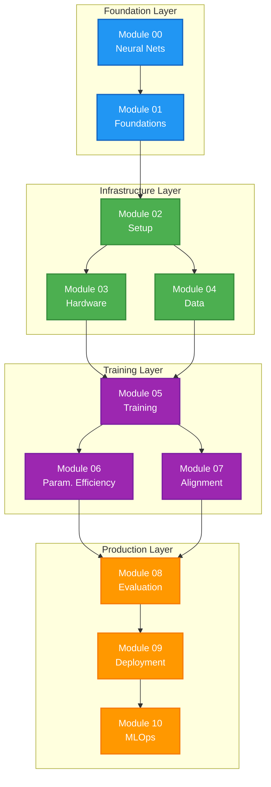
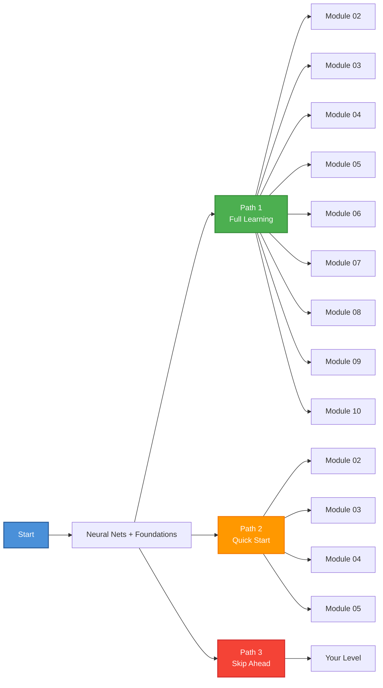
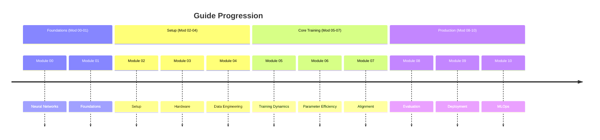

# Your First LLM Fine-Tune

A Step-by-Step Guide for Technical People

---

## What This Guide Covers

**From zero LLM knowledge to production-ready fine-tuning** - no machine learning background required.

### What You'll Learn

| Stage | Topic | Outcome |
|-------|-------|---------|
| 00 | Neural Network Basics | Understand how LLMs actually work |
| 01 | Foundations | Prompt vs RAG vs Fine-tune decisions |
| 02 | Setup & Environment | Get your tools ready |
| 03 | Hardware Setup | Understand VRAM requirements, choose right GPU |
| 04 | Data Prep | Format data for LLM training (ChatML, JSON) |
| 05 | Training Dynamics | Run SFT on a model |
| 06 | Parameter Efficiency | Master LoRA/QLoRA/Unsloth for cost savings |
| 07 | Alignment | Steer model behavior with DPO/ORPO |
| 08 | Evaluation | Validate your model properly |
| 09 | Deployment | Quantize and serve your custom model |
| 10 | MLOps | Build automated training pipelines |

### Who This Is For

- **Developers** who can write Python but don't know ML
- **DevOps Engineers** who want to deploy custom models
- **Technical Founders** who need custom LLMs for their product
- **Curious Enthusiasts** with basic programming skills

### What You Need

- Python > 3.10
- A Hugging Face account (free)
- Basic Python knowledge (functions, loops, imports)
- Optional: Access to an NVIDIA GPU (can use cloud, or free Colab/Gradient tiers)

---

## Guide Architecture



### Learning Paths Overview



---

## How to Use This Guide

### Path 1: Full Learning (Recommended)

Follow modules in order. Each builds on the previous.

```
Neural Nets → Foundations → Setup → Hardware → Data → 
Training → Parameter Efficiency → Alignment → Evaluation → 
Deployment → MLOps
```

### Path 2: Quick Start to Training

Skip theory and dive in quickly:

```
Neural Nets + Foundations (quick read) → Setup → Hardware → Data → Training
```

### Path 3: From Known to Advanced

| Know This? | Start Here |
|------------|------------|
| Basic LLM concepts | Module 02: Setup |
| Environment setup | Module 04: Data Engineering |
| Data engineering | Module 05: Training Dynamics |
| SFT basics | Module 06: Parameter Efficiency |
| LoRA/QLoRA | Module 07: Alignment |
| Fine-tuning | Module 09: Deployment |

---

## What's in Each Module

| Module | Title | Key Takeaway |
|--------|-------|--------------|
| 00 | Neural Networks | Core concepts that won't change |
| 01 | Foundations | Prompt vs RAG vs Fine-tune decisions |
| 02 | Setup & Environment | Tooling, libraries, environment |
| 03 | Hardware Matrix | VRAM math, GPU selection |
| 04 | Data Engineering | Tokenization, ChatML, curation |
| 05 | Training Dynamics | SFT, hyperparameters, multi-GPU |
| 06 | Parameter Efficiency | LoRA, QLoRA, Unsloth, adapters |
| 07 | Alignment | DPO, ORPO without RL |
| 08 | Evaluation | Avoid overfitting, custom evals |
| 09 | Model Deployment | GGUF, AWQ, FP8, vLLM, TGI |
| 10 | MLOps | CI/CD, monitoring, production |

### Module Progression Timeline



---

## Ready to Begin?

Head to **Module 00: Neural Networks** to understand how LLMs work (covering Llama 4, Qwen 3.6, Gemma 4, and more), or **Module 01: Foundations** for the big picture. If you already have the basics, jump straight to **Module 02: Setup** to get your environment ready.
