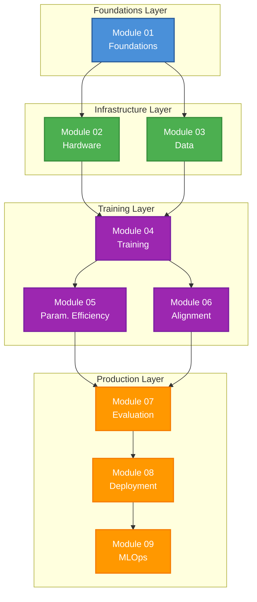
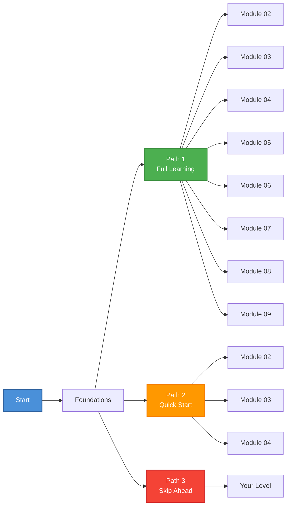
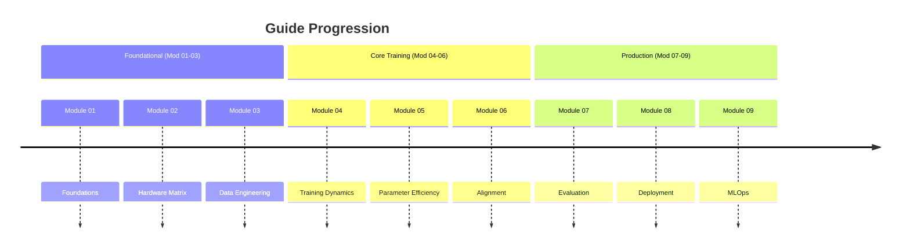

# Your First LLM Fine-Tune

A Step-by-Step Guide for Technical People

---

## What This Guide Covers

**From zero LLM knowledge to production-ready fine-tuning** - no machine learning background required.

### What You'll Learn

| Stage | Topic | Outcome |
|-------|-------|---------|
| 1 | Hardware Setup | Understand VRAM requirements, choose right GPU |
| 2 | Data Prep | Format data for LLM training (ChatML, JSON) |
| 3 | First Fine-Tune | Run SFT on a small model |
| 4 | Parameter Efficiency | Master LoRA/QLoRA for cost savings |
| 5 | Alignment | Steer model behavior with DPO/ORPO |
| 6 | Evaluation | Validate your model properly |
| 7 | Deployment | Quantize and serve your custom model |
| 8 | MLOps | Build automated training pipelines |

### Who This Is For

- **Developers** who can write Python but don't know ML
- **DevOps Engineers** who want to deploy custom models
- **Technical Founders** who need custom LLMs for their product
- **Curious Enthusiasts** with basic programming skills

### What You Need

- Python > 3.10
- A Hugging Face account (free)
- Basic Python knowledge (functions, loops, imports)
- Optional: Access to an NVIDIA GPU (can use cloud)

---

## Guide Architecture



### Learning Paths Overview



---

## How to Use This Guide

### Path 1: Full Learning (Recommended)

Follow modules in order. Each builds on the previous.

```
Foundations → Hardware → Data → Training → 
Parameter Efficiency → Alignment → Evaluation → 
Deployment → MLOps
```

### Path 2: Quick Start to Training

Skip theory and dive in quickly:

```
Hardware (quick read) → Data → Training
```

### Path 3: From Known to Advanced

| Know This? | Start Here |
|------------|------------|
| Hardware/GPU | Module 03: Data |
| SFT basics | Module 05: Parameter Efficiency |
| DPO/ORPO | Module 07: Evaluation |

---

## What's in Each Module

| Module | Title | Key Takeaway |
|--------|-------|--------------|
| 01 | Foundations | Core concepts that won't change |
| 02 | Hardware Matrix | VRAM math, GPU selection |
| 03 | Data Engine | Tokenization, ChatML, curation |
| 04 | Training Dynamics | SFT, hyperparameters, multi-GPU |
| 05 | Parameter Efficiency | LoRA, QLoRA, adapters |
| 06 | Alignment | DPO, ORPO without RL |
| 07 | Evaluation | Avoid overfitting, custom evals |
| 08 | Model Deployment | GGUF, AWQ, vLLM, TGI |
| 09 | MLOps | CI/CD, monitoring, production |

### Module Progression Timeline



---

## Ready to Begin?

Head to **Module 01: Foundations** to understand the big picture, or jump straight to **Hardware** if you're ready to set up your machine.
