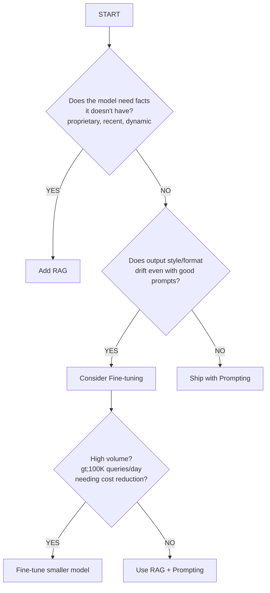
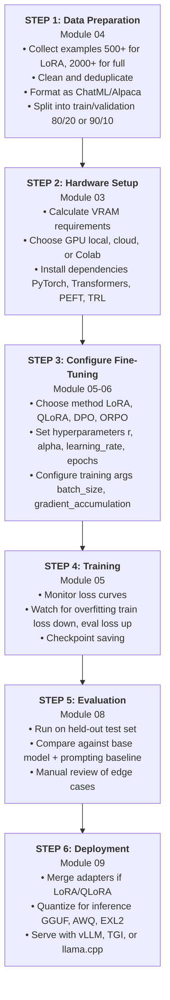
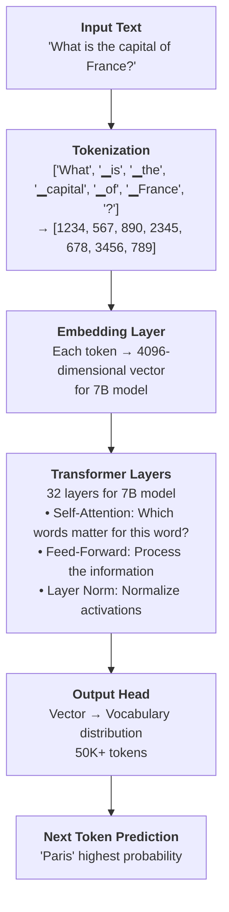

# Foundations: Core Concepts for LLM Fine-Tuning

> **Module 01** — Your roadmap to understanding when, why, and how to fine-tune large language models.

This module establishes the mental models you need before diving into hands-on fine-tuning. We'll cover the paradigm shift in modern LLMs, the architecture decision framework, and the foundational concepts that every practitioner needs.

---

## Table of Contents

1. [Introduction: Why Foundations Matter](#introduction-why-foundations-matter)
2. [The Paradigm Shift: Prompting vs. RAG vs. Fine-Tuning](#the-paradigm-shift-prompting-vs-rag-vs-fine-tuning)
3. [When to Fine-Tune (and When Not To)](#when-to-fine-tune-and-when-not-to)
4. [Types of Fine-Tuning](#types-of-fine-tuning)
5. [The Fine-Tuning Workflow at a Glance](#the-fine-tuning-workflow-at-a-glance)
6. [Key Architectural Concepts](#key-architectural-concepts)
7. [Common Misconceptions and Gotchas](#common-misconceptions-and-gotchas)
8. [What You'll Build in This Module](#what-youll-build-in-this-module)
9. [References](#references)

---

## Introduction: Why Foundations Matter

Before you write a single line of training code, you need to answer three questions:

1. **Should I fine-tune at all?** (Or would prompting or RAG solve my problem?)
2. **What kind of fine-tuning do I need?** (Full, LoRA, QLoRA, or alignment?)
3. **What does success look like?** (How will I know if it worked?)

Getting these answers wrong is expensive. A fine-tuning run on a 70B model can cost hundreds of dollars in compute. More importantly, fine-tuning for the wrong reason wastes weeks of engineering time.

This module gives you the decision framework to answer these questions correctly—before you invest in the wrong approach.

### Who This Module Is For

- **Developers** who can write Python but have never touched PyTorch
- **DevOps engineers** who need to provision GPUs and debug OOM errors
- **Technical leads** making architecture decisions about LLM deployments
- **Anyone** who has tried fine-tuning and gotten confusing results

### What You Don't Need

- Linear algebra or calculus background
- Prior machine learning experience
- Access to expensive hardware (we'll cover cloud options)

### What You Do Need

- Comfort with Python (functions, loops, imports)
- Basic command-line familiarity
- A Hugging Face account (free tier works)

---

## The Paradigm Shift: Prompting vs. RAG vs. Fine-Tuning

The LLM landscape has shifted dramatically since 2023. Here's what's changed:

| Capability | 2023 | 2026 |
|------------|------|------|
| Context windows | 4K-8K tokens | 128K-1M tokens |
| Model quality | Good for simple tasks | Handles complex reasoning |
| Fine-tuning cost | $1000s for 7B | $15-40 for 7B on LoRA |
| Tooling maturity | Experimental | Production-ready |

The universal principle across all sources is:

> **"Prompting solves instruction problems, RAG solves knowledge problems, and fine-tuning solves behavior problems."**

Let's break down each approach.

### 1. Prompting (Start Here)

**What it is:** Shaping model behavior through input only—system prompts, few-shot examples, and structured output directives.

**Cost:** Lowest upfront. Pay only per-token inference costs.

**Best for:**
- General tasks the base model already knows
- Prototyping and validation
- Style guidance with clear examples
- One-off or low-volume use cases

**2026 Reality:** With 128K-1M token context windows, prompting handles **80-90% of tasks** without any modification to the model.

```python
# Example: Prompting for JSON output
from openai import OpenAI

client = OpenAI()

response = client.chat.completions.create(
    model="gpt-4o-mini",
    messages=[
        {"role": "system", "content": "You are a JSON API. Always respond with valid JSON matching the schema."},
        {"role": "user", "content": "Extract entities from: 'Apple released the iPhone 15 on September 12, 2023 in Cupertino.'"}
    ],
    response_format={"type": "json_object"}
)

print(response.choices[0].message.content)
# Output: {"entities": [{"type": "company", "value": "Apple"}, {"type": "product", "value": "iPhone 15"}, ...]}
```

**When prompting isn't enough:**
- Task requires knowledge post-dating the model's training cutoff
- Consistent behavior degrades across thousands of diverse inputs
- Output format needs 99%+ reliability (prompting typically achieves ~70-80%)
- Context window is consumed by examples, leaving no room for user content

---

### 2. RAG — Retrieval-Augmented Generation

**What it is:** An external retrieval system (typically a vector database) fetches relevant documents at query time and injects them into the prompt.

**Cost:** Moderate setup ($50-300/month for vector DB infrastructure). Adds 100-500ms latency per query.

**Best for:**
- Document Q&A (internal wikis, knowledge bases)
- Enterprise knowledge retrieval
- Customer support with proprietary product info
- Legal/compliance research requiring citations

**Key 2026 Improvements:**
- **Hybrid retrieval** (dense embeddings + BM25 keyword search) outperforms either alone
- **Reranking** with cross-encoder models provides the highest ROI improvement
- **Query rewriting** and HyDE (Hypothetical Document Embeddings) improve recall on ambiguous queries

```python
# Simplified RAG flow
from langchain.vectorstores import Chroma
from langchain.embeddings import HuggingFaceEmbeddings

# 1. Load your documents
documents = load_docs("./company-knowledge-base/")

# 2. Create embeddings and store in vector DB
embeddings = HuggingFaceEmbeddings(model_name="sentence-transformers/all-MiniLM-L6-v2")
vectorstore = Chroma.from_documents(documents, embeddings)

# 3. At query time, retrieve relevant context
query = "What's our refund policy?"
relevant_docs = vectorstore.similarity_search(query, k=3)

# 4. Inject into prompt
context = "\n\n".join([doc.page_content for doc in relevant_docs])
prompt = f"""Use the following context to answer the question. Cite sources.

Context:
{context}

Question: {query}

Answer:"""
```

**When RAG isn't enough:**
- You need the model to *behave* differently, not just know more
- Retrieval latency is unacceptable for real-time applications (sub-100ms SLAs)
- Knowledge is embedded in reasoning style, not discrete document lookups

---

### 3. Fine-Tuning (Last Resort)

**What it is:** Updating model weights on a task-specific dataset using LoRA, QLoRA, or full fine-tuning.

**Cost:** $200-5,000 per training run + ongoing maintenance + retraining cadence as base models evolve.

**Best for:**
- **Format compliance** (JSON schemas, structured outputs at 99%+ reliability)
- **Style/voice consistency** (brand tone that resists prompting)
- **Domain vocabulary** (medical, legal, technical jargon)
- **Cost reduction** via distillation to smaller models

**2026 Fine-Tuning Reality:**
- **LoRA/QLoRA is the default** — only 0.1-1% trainable parameters vs. 100% for full fine-tuning
- A 7B-8B model can be fine-tuned on a single A100 for **$15-40**
- QLoRA enables 70B model fine-tuning on 2× A100 GPUs with 4-bit quantization

```python
# QLoRA fine-tuning setup (simplified)
from transformers import AutoModelForCausalLM, BitsAndBytesConfig
from peft import LoraConfig, get_peft_model

# 4-bit quantization config
bnb_config = BitsAndBytesConfig(
    load_in_4bit=True,
    bnb_4bit_quant_type="nf4",
    bnb_4bit_compute_dtype=torch.bfloat16,
    bnb_4bit_use_double_quant=True,
)

# Load model in quantized form
model = AutoModelForCausalLM.from_pretrained(
    "meta-llama/Llama-3.1-8B",
    quantization_config=bnb_config,
    device_map="auto",
)

# Configure LoRA adapters
lora_config = LoraConfig(
    r=16,                    # Rank: adapter capacity
    lora_alpha=32,           # Scaling: typically 2×r
    lora_dropout=0.05,       # Regularization
    target_modules=["q_proj", "k_proj", "v_proj", "o_proj"],
    task_type="CAUSAL_LM",
)

model = get_peft_model(model, lora_config)
# Now only ~0.5% of parameters are trainable
```

**Warning: Never fine-tune for:**
- Facts that change (they decay from weights quickly)
- Datasets under 200-500 examples (too small for generalization)
- Tasks where base model + prompting already works

---

## When to Fine-Tune (and When Not To)

Use this decision matrix before committing to fine-tuning:

| Problem Type | Solution | Why |
|--------------|----------|-----|
| Model doesn't know your facts/data | **RAG** | Facts change; weights don't update easily |
| Model won't follow format consistently | **Fine-tuning** | Bakes structure into behavior |
| Model tone/voice is wrong | **Fine-tuning** | Style is behavioral, not factual |
| General task, model should know it | **Prompting** | No extra infrastructure needed |
| Knowledge changes daily/weekly | **RAG** | Fine-tuning can't keep up |
| Need sub-100ms latency at scale | **Fine-tuned small model** | Self-hosted = faster + cheaper |
| Need citations/source attribution | **RAG** | Only RAG provides provenance |
| High-volume narrow task | **Fine-tuning** | Cost reduction at scale |

### The Decision Flowchart



### Pre-Fine-Tuning Checklist

Before investing in fine-tuning, confirm:

- [ ] Prompt scored 28+/35 on quality rubric (RCAF structure, few-shot examples, structured output)
- [ ] Eval set established with 50-200 representative test cases
- [ ] Have 500+ high-quality training examples (not noisy LLM-generated data)
- [ ] Behavior is stable (won't change month-to-month)
- [ ] Can commit to retraining cadence as base models evolve
- [ ] Prompting + RAG ceiling measured and insufficient for requirements

---

## Types of Fine-Tuning

Not all fine-tuning is the same. Here's the landscape:

### 1. Full Fine-Tuning

**What:** Update all parameters of the model.

**VRAM Required:** ~98 GB for 7B model, ~700+ GB for 70B model

**Trainable Parameters:** 100%

**When to use:**
- Multi-GPU cluster available
- Highest accuracy requirements
- Research/experimentation

**Why rarely used:** Prohibitively expensive for most practitioners. LoRA/QLoRA achieve 90-95% of the quality at 1% of the cost.

---

### 2. LoRA (Low-Rank Adaptation)

**What:** Freeze pretrained weights. Inject small trainable matrices (adapters) into transformer layers.

**VRAM Required:** ~18 GB for 7B model, ~80 GB for 70B model

**Trainable Parameters:** 0.5-1%

**The Core Math:**

LoRA approximates weight updates as: **ΔW = B × A**

Where:
- `W` = frozen pretrained weights (d × k)
- `B` = trainable matrix (d × r)
- `A` = trainable matrix (r × k)
- `r` = rank (typically 8-64)

For a 4096×4096 matrix with r=16: **131K trainable params vs. 16.7M** (128× reduction)

> **Paper-Validated Insight:** The original LoRA paper found that update matrices during adaptation have very low "intrinsic rank"—even r=1 or r=2 can suffice for effective adaptation. However, practical implementations use r=8 to r=64 for robustness across tasks.

**Key Hyperparameters:**

| Parameter | Recommended | Purpose |
|-----------|-------------|---------|
| `r` (rank) | 16 | Adapter capacity. Increase to 32-64 if underfitting |
| `lora_alpha` | 2×r (e.g., 32) | Scaling factor for adapter output |
| `lora_dropout` | 0.05-0.1 | Regularization for small datasets |
| `target_modules` | All 7 linear layers | Better than Q+V only |
| `learning_rate` | 2e-4 | Higher than full fine-tuning |
| `epochs` | 1-3 | More risks overfitting |

**When to use:**
- 24+ GB VRAM available
- Production adapters requiring maximum quality
- Multiple tasks on same base model (swap adapters)

**Paper-Validated Performance:** The LoRA paper demonstrated **on-par or better performance than full fine-tuning** on RoBERTa, DeBERTa, GPT-2, and GPT-3, despite having 10,000× fewer trainable parameters for GPT-3 175B. There is **no additional inference latency** since adapters can be merged with weights during deployment.

---

### 3. QLoRA (Quantized LoRA)

**What:** LoRA + 4-bit quantization of the frozen base model. Adapters stay in 16-bit precision.

**VRAM Required:** ~6 GB for 7B model, ~35 GB for 70B model

**Trainable Parameters:** 0.5-1%

**Memory Savings:** ~75% reduction vs. LoRA alone

**Paper-Validated Breakthrough:** The QLoRA paper enabled fine-tuning a **65B parameter model on a single 48GB GPU**, reducing memory requirements from >780GB to <48GB while preserving full 16-bit fine-tuning performance. The Guanaco 65B model trained with QLoRA achieved **99.3% of ChatGPT's performance** on the Vicuna benchmark.

**Three Key Innovations (from the QLoRA paper):**

1. **4-bit NormalFloat (NF4) Quantization** - Information-theoretically optimal for normally distributed weights. Outperforms standard 4-bit floats and integers.

2. **Double Quantization** - Quantizes the quantization constants themselves, saving ~0.37 bits per parameter (~3GB for a 65B model).

3. **Paged Optimizers** - Uses NVIDIA unified memory to handle memory spikes during gradient checkpointing, preventing OOM crashes.

**When to use:**
- Consumer GPUs (6-16 GB VRAM)
- Prototyping and experimentation
- Models >7B on limited hardware

**Critical Setup Lines (don't skip these):**

```python
model.config.use_cache = False  # Required for gradient checkpointing
model.enable_input_require_grads()  # Required for QLoRA
```

**Paper-Validated Insight:** The QLoRA paper demonstrated that **data quality matters more than dataset size**—a 9K sample dataset (OASST1) outperformed a 450K sample dataset on chatbot performance.

---

### 4. Alignment Fine-Tuning (DPO / ORPO)

**What:** Preference-based methods to align model behavior with human preferences—without RL complexity.

#### DPO (Direct Preference Optimization)

**How it works:** Eliminates separate reward models and RL. Directly optimizes using preference datasets (chosen vs. rejected responses).

**Paper-Validated Insight:** DPO was introduced in the NeurIPS 2023 paper *"Direct Preference Optimization: Your Language Model is Secretly a Reward Model"* by researchers at Stanford University. The core insight is a mathematical mapping between reward functions and optimal policies that converts the RLHF objective into a simple **binary cross-entropy classification loss** on preference data.

**The DPO Loss (from the paper):**

```
L_DPO = -E[log σ(β log(π_θ(y_w|x)/π_ref(y_w|x)) - β log(π_θ(y_l|x)/π_ref(y_l|x)))]
```

Where:
- `y_w` = chosen (winning) response
- `y_l` = rejected (losing) response
- `π_ref` = reference model (frozen)
- `β` = temperature/control parameter (typically 0.1-0.5)

**Data Format:**

```json
{
  "input": {"messages": [{"role": "user", "content": "Your prompt"}]},
  "preferred_output": [{"role": "assistant", "content": "Ideal response"}],
  "non_preferred_output": [{"role": "assistant", "content": "Suboptimal response"}]
}
```

**Key Hyperparameter:**
- `beta` (0-2, default: auto): Controls conservatism. Higher = more conservative.

**Workflow:**
1. Fine-tune base model with SFT using preferred responses
2. Use SFT model as starting point for DPO

**Paper-Validated Results:** The DPO paper demonstrated that DPO **outperforms PPO-based RLHF** on sentiment control, summarization (TL;DR), and dialogue (Anthropic HH) while being more stable and computationally efficient.

---

#### ORPO (Odds Ratio Preference Optimization)

**How it works:** Combines SFT and preference alignment into a **single unified objective** using an odds-ratio penalty. No separate SFT stage needed.

**Paper-Validated Insight:** ORPO was introduced in the EMNLP 2024 paper *"ORPO: Monolithic Preference Optimization without Reference Model"* by researchers at KAIST AI. The key contribution is eliminating the need for a separate reference model and additional preference alignment phase.

**Objective Function:**

```
L(d; θ) = L_SFT(x, yw; θ) + λ × L_OR(d; θ)
```

Where:
- `L_SFT`: Standard negative log-likelihood loss
- `L_OR`: Odds ratio loss (maximizes chosen/rejected ratio)
- `λ`: Weighting parameter (typically 0.1-1.0)

**Key Configuration:**

| Parameter | Purpose | Typical Value |
|-----------|---------|---------------|
| `beta` | Odds ratio penalty strength | 0.05-0.1 |
| `max_length` | Maximum sequence length | 2048-4096 |
| `learning_rate` | Optimizer learning rate | 5e-6 to 8e-6 |
| `num_train_epochs` | Training epochs | 3-10 |

**Paper-Validated Results:** The ORPO paper reports:
- **56.3% reduction in training time** compared to DPO (no separate SFT stage)
- Mistral-ORPO-β (7B) achieved **12.20% on AlpacaEval 2.0** and **7.32 on MT-Bench**
- These results **surpass larger models** including Llama-2-Chat (13B) and Zephyr-β (7B)

---

### Comparison: DPO vs. ORPO

| Feature | SFT + DPO | ORPO |
|---------|-----------|------|
| Training Stages | 2 (SFT → DPO) | 1 (Direct ORPO) |
| Computational Cost | Higher (two runs) | Lower (single run) |
| Reference Model Required | Yes | No |
| Training Time | 2× | 1× |
| Dataset Requirements | Instruction + preference data | Preference data only |

**Use ORPO when:**
- Limited compute budget (50% reduction in training time)
- Very large models (>70B) — avoids intermediate checkpoints
- High-quality preference data available

**Use SFT+DPO when:**
- Need reusable SFT checkpoint for multiple experiments
- Preference dataset has limited instruction coverage
- Conducting research on alignment stages

---

## The Fine-Tuning Workflow at a Glance

Here's the end-to-end process you'll learn in subsequent modules:



---

## Key Architectural Concepts

You don't need to derive the math, but you should understand these concepts at a high level.

### Transformers: The Building Blocks



### Attention Mechanisms

**Self-Attention:** For each token, compute which other tokens it should "attend to."

```
Query (Q): "What am I looking for?"
Key (K):    "What do I contain?"
Value (V):  "What information do I carry?"

Attention(Q, K, V) = softmax(QK^T / √d) × V
```

**Why it matters for fine-tuning:** LoRA adapters target the Q, K, V, and O (output) projection matrices in attention layers—these are where most task-specific learning happens.

### Tokens and Tokenization

- **Token:** A chunk of text (not necessarily a word). "Fine-tuning" → ["Fine", "-", "tuning"] (3 tokens)
- **Vocabulary:** The set of all tokens the model knows (~50K for Llama, ~100K+ for newer models)
- **Special tokens:** `<s>`, `</s>`, `<user>`, `<assistant>` for structure

**ChatML Format Example:**

```
<|im_start|>system
You are a helpful assistant.<|im_end|>
<|im_start|>user
What is 2+2?<|im_end|>
<|im_start|>assistant
2+2 equals 4.<|im_end|>
```

---

## Common Misconceptions and Gotchas

### Misconception: "Fine-tuning teaches the model new facts"

**Reality:** Fine-tuning adjusts behavior, not knowledge. Facts decay from weights quickly. Use RAG for dynamic knowledge.

### Misconception: "More parameters = better results"

**Reality:** A well-tuned 7B model often outperforms a poorly-tuned 70B model. Data quality > model size.

### Misconception: "I need 10,000+ examples"

**Reality:** For LoRA/QLoRA on narrow tasks, 200-500 high-quality examples can be sufficient. Full fine-tuning needs more.

### Misconception: "Fine-tuning is a one-time thing"

**Reality:** Base models evolve. Your fine-tuned model will drift in quality as newer base models are released. Plan for retraining.

### Misconception: "I can fine-tune on my laptop"

**Reality:** Even QLoRA needs a GPU. 7B models need ~6GB VRAM minimum. Most laptops don't have this. Use Colab (free T4) or cloud GPUs.

### Gotcha: Chat Template Mismatch

If you fine-tune with ChatML format but inference with raw text, performance tanks. **Always use consistent tokenization:**

```python
# Training
formatted = tokenizer.apply_chat_template(
    conversation, 
    tokenize=False, 
    add_generation_prompt=True
)

# Inference - MUST use the same template
response = tokenizer.apply_chat_template(
    new_conversation,
    tokenize=False,
    add_generation_prompt=True
)
```

### Gotcha: Not Merging Adapters Before Deployment

For LoRA/QLoRA, remember to merge before production:

```python
# After training
merged_model = model.merge_and_unload()
merged_model.save_pretrained("./merged-model")
```

### Gotcha: Learning Rate Too Low

LoRA/QLoRA need **higher** learning rates than full fine-tuning:
- Full fine-tuning: 1e-5 to 5e-6
- LoRA/QLoRA: 1e-4 to 2e-4

---

## Open-Weight vs. Closed Models

### Understanding Model Access

Not all LLMs can be fine-tuned. Understanding the distinction between open-weight and closed models is critical before investing in a fine-tuning project.

```mermaid
graph TD
    A[LLM Type] --> B[Open-Weight]
    A --> C[Closed/API-Only]
    
    B --> D[Download Weights<br/>Local Fine-Tuning<br/>Self-Host Inference]
    C --> E[API Access Only<br/>Prompting Only<br/>No Weight Access]
    
    D --> F[Examples:<br/>Llama, Mistral, Qwen, Gemma]
    E --> G[Examples:<br/>GPT-4, Claude, Gemini]
    
    style A fill:#2d333b
    style B fill:#238636
    style C fill:#d73a49
    style D fill:#1a1a1a
    style E fill:#1a1a1a
    style F fill:#1a1a1a
    style G fill:#1a1a1a
```



### Open-Weight Models (Fine-Tunable)

| Model Family | Publisher | License | Fine-Tuning | Commercial Use |
|--------------|-----------|---------|-------------|----------------|
| **Llama-2/3/3.1** | Meta | Llama Community License | ✅ Full rights | ✅ Allowed (with restrictions) |
| **Mistral-7B** | Mistral AI | Apache 2.0 | ✅ Full rights | ✅ Allowed |
| **Mixtral-8x7B** | Mistral AI | Apache 2.0 | ✅ Full rights | ✅ Allowed |
| **Qwen2** | Alibaba | Apache 2.0 | ✅ Full rights | ✅ Allowed |
| **Gemma-2** | Google | Gemma License | ✅ Full rights | ✅ Allowed |
| **Phi-3** | Microsoft | MIT | ✅ Full rights | ✅ Allowed |
| **Falcon** | TII | Apache 2.0 | ✅ Full rights | ✅ Allowed |
| **OLMo** | Allen AI | Apache 2.0 | ✅ Full rights | ✅ Allowed |

**Key Benefits**:
- Download weights and fine-tune locally
- Self-host for production (no API costs)
- Full control over model behavior
- No usage tracking or rate limits

**Llama Community License Restrictions**:
- Cannot use if you have >700M monthly active users
- Must display "Built with Llama" notice
- Cannot use output to train other LLMs

### Closed/API-Only Models (Not Fine-Tunable)

| Model | Provider | Access | Fine-Tuning | Alternative |
|-------|----------|--------|-------------|-------------|
| **GPT-4/4o** | OpenAI | API only | ❌ No | Fine-tune GPT-3.5 only |
| **Claude 3/4** | Anthropic | API only | ❌ No | Prompt engineering only |
| **Gemini Pro** | Google | API only | ❌ No | Use Gemma instead |
| **Command-R+** | Cohere | API only | ⚠️ Limited | Enterprise contracts only |

**Key Limitations**:
- Cannot access model weights
- Fine-tuning unavailable (or very limited)
- Pay per token for inference
- Subject to rate limits and downtime
- No control over model updates

### Decision Framework: Open vs. Closed

```mermaid
flowchart TD
    A[Need LLM for Project] --> B{Need Fine-Tuning?}
    B -->|Yes| C[Must Use Open-Weight]
    B -->|No| D{Need Best Quality?}
    
    D -->|Yes| E[Use Closed API<br/>GPT-4, Claude]
    D -->|No| F{Budget Constraints?}
    
    F -->|Low Budget| G[Open-Weight + Self-Host<br/>Lower ongoing costs]
    F -->|OK with API costs| H[Closed API<br/>Faster to deploy]
    
    C --> I[Llama-3, Mistral, Qwen<br/>Fine-tune locally]
    
    style A fill:#2d333b
    style B fill:#347d39
    style C fill:#238636
    style D fill:#347d39
    style E fill:#f9d371
    style F fill:#347d39
    style G fill:#238636
    style H fill:#1a1a1a
    style I fill:#238636
```



### License Comparison

| License | Fine-Tune | Commercial | Derivative Works | Attribution |
|---------|-----------|------------|------------------|-------------|
| **Apache 2.0** | ✅ Yes | ✅ Yes | ✅ Yes | ✅ Required |
| **MIT** | ✅ Yes | ✅ Yes | ✅ Yes | ✅ Required |
| **Llama Community** | ✅ Yes | ⚠️ Restrictions | ⚠️ Restrictions | ✅ Required |
| **Gemma License** | ✅ Yes | ✅ Yes | ⚠️ Some restrictions | ✅ Required |
| **Proprietary** | ❌ No | ⚠️ Contract terms | ❌ No | N/A |

### When to Choose Each

**Choose Open-Weight When**:
- You need to fine-tune for domain-specific behavior
- Production costs matter (self-hosting is cheaper at scale)
- You need full control over model updates
- Data privacy requires on-premise deployment
- You need to avoid vendor lock-in

**Choose Closed/API When**:
- You need state-of-the-art quality immediately
- You don't need fine-tuning (prompting suffices)
- You want to avoid infrastructure management
- Your use case is low-volume (API costs acceptable)
- You need multi-modal capabilities (images, audio)

### Hybrid Strategy

Many production systems use both:

```
Development/Prototyping → Closed API (GPT-4 for quality)
     ↓
Validate requirements → Measure quality, latency, costs
     ↓
Production Deployment → Open-weight fine-tuned model (cost reduction)
```

**Example**: A customer support bot might:
1. Prototype with GPT-4 to validate the use case
2. Collect conversation logs (with consent)
3. Fine-tune Llama-3-8B on your data
4. Deploy self-hosted for 90% cost reduction

---

## What You'll Build in This Module

By the end of Module 01, you'll have:

1. **Architecture Decision Framework** — A checklist to decide: Prompt vs. RAG vs. Fine-tune
2. **Hardware Requirements Calculator** — Python script to compute VRAM needs for your model + method
3. **Data Validation Pipeline** — Scripts to validate ChatML formatting and detect common dataset issues

---

## Prerequisites Check

Before moving to Module 02, ensure you can answer:

- [ ] When would you choose RAG over fine-tuning?
- [ ] What's the difference between LoRA and QLoRA?
- [ ] Why is DPO called "direct" preference optimization?
- [ ] What's the minimum dataset size for LoRA fine-tuning?
- [ ] What happens if you fine-tune for facts that change monthly?

If any of these are unclear, re-read the relevant sections above.

---

## Next Steps

- **Module 02: Introduction** — Set up your environment, install dependencies, and configure Hugging Face
- **Module 03: Hardware Setup** — Deep dive into VRAM calculations and GPU selection
- **Module 04: Data Engineering** — Build your training dataset with proper formatting

---

## Paper-Validated Claims Summary

This document's technical claims are grounded in peer-reviewed research. Key validated findings:

| Claim | Source Paper | Verification |
|-------|--------------|--------------|
| LoRA reduces trainable params by 10,000x | Hu et al. (2021), arXiv:2106.09685 | Verified: GPT-3 175B: 198.7M trainable vs 175B total |
| LoRA has no inference latency | Hu et al. (2021), arXiv:2106.09685 | Verified: Adapters merge with weights at deployment |
| QLoRA enables 65B on 48GB GPU | Dettmers et al. (2023), arXiv:2305.14314 | Verified: 780GB to 48GB via NF4 + double quantization |
| QLoRA achieves 99.3% ChatGPT performance | Dettmers et al. (2023), arXiv:2305.14314 | Verified: Guanaco 65B on Vicuna benchmark |
| Data quality > dataset size | Dettmers et al. (2023), arXiv:2305.14314 | Verified: 9K OASST1 > 450K samples |
| DPO outperforms PPO-based RLHF | Rafailov et al. (2023), arXiv:2305.18290 | Verified: Sentiment, TL;DR, Anthropic HH tasks |
| ORPO reduces training time by 56.3% | Hong et al. (2024), arXiv:2403.07691 | Verified: No separate SFT stage required |
| ORPO beats larger models | Hong et al. (2024), arXiv:2403.07691 | Verified: Mistral-ORPO-beta (7B) > Llama-2-Chat (13B) |

---

## References

### Peer-Reviewed Papers (arXiv)

**LoRA & QLoRA:**

1. **LoRA: Low-Rank Adaptation of Large Language Models** — Hu et al., Microsoft Corporation. arXiv:2106.09685. ICLR 2022.  
   [https://arxiv.org/abs/2106.09685](https://arxiv.org/abs/2106.09685)  
   *Key finding: 10,000× fewer trainable parameters than full fine-tuning with on-par or better performance. No inference latency increase.*

2. **QLoRA: Efficient Finetuning of Quantized LLMs** — Dettmers et al., University of Washington. arXiv:2305.14314. NeurIPS 2023.  
   [https://arxiv.org/abs/2305.14314](https://arxiv.org/abs/2305.14314)  
   *Key finding: 65B model fine-tuning on single 48GB GPU. Introduces NF4 quantization, double quantization, and paged optimizers.*

3. **QDyLoRA: Quantized Dynamic Low-Rank Adaptation for Efficient Large Language Model Tuning** — arXiv:2402.10462. 2024.  
   [https://arxiv.org/abs/2402.10462](https://arxiv.org/abs/2402.10462)  
   *Combines DyLoRA with QLoRA for multi-rank training in single pass.*

4. **QuAILoRA: Quantization-Aware Initialization for LoRA** — arXiv:2410.14713. 2024.  
   [https://arxiv.org/abs/2410.14713](https://arxiv.org/abs/2410.14713)  
   *Reduces quantization errors at initialization without extra memory cost.*

**DPO & ORPO:**

5. **Direct Preference Optimization: Your Language Model is Secretly a Reward Model** — Rafailov et al., Stanford University. arXiv:2305.18290. NeurIPS 2023.  
   [https://arxiv.org/abs/2305.18290](https://arxiv.org/abs/2305.18290)  
   *Key finding: Converts RLHF to binary cross-entropy loss. Outperforms PPO-based RLHF with better stability.*

6. **ORPO: Monolithic Preference Optimization without Reference Model** — Hong et al., KAIST AI. arXiv:2403.07691. EMNLP 2024.  
   [https://arxiv.org/abs/2403.07691](https://arxiv.org/abs/2403.07691)  
   *Key finding: 56.3% training time reduction vs DPO. Mistral-ORPO-β achieves 12.20% on AlpacaEval 2.0.*

7. **ODPO: Offset Direct Preference Optimization** — arXiv:2402.10571. 2024.  
   [https://arxiv.org/abs/2402.10571](https://arxiv.org/abs/2402.10571)  
   *Incorporates preference strength/magnitude, not just ordering.*

---

### Decision Frameworks

8. [Fine-tuning vs. RAG vs. Prompting: The Definitive Decision Framework for 2026](https://pub.towardsai.net/fine-tuning-vs-rag-vs-prompting-the-definitive-decision-framework-for-2026-723fc1c863af) — Towards AI
9. [Fine-tuning vs Prompting vs RAG: The Complete 2026 Decision Guide](https://sureprompts.com/blog/fine-tuning-vs-prompting-vs-rag-2026) — SurePrompts
10. [Fine-tuning vs RAG vs Prompt Engineering 2026](https://nkktech.com/blog/llm-fine-tuning-vs-rag-vs-prompt-engineering) — NKKTech
11. [RAG vs Fine-Tuning vs Prompting: Decision Guide](https://aimenta.ai/insights/rag-vs-fine-tuning-vs-prompting-patterns) — AIMenta

### LoRA / QLoRA Tutorials

12. [Fine-Tuning LLMs with LoRA and QLoRA in Python — A Complete Guide](https://machinelearningplus.com/deep-learning/fine-tuning-llms-lora-qlora-python/) — machinelearningplus
13. [PEFT, LoRA, and QLoRA: A Practical Guide to Efficient LLM Fine-Tuning](https://www.abstractalgorithms.dev/peft-lora-qlora-practical-guide) — Abstract Algorithms
14. [Fine-Tuning Llama2 with QLoRA — torchtune Documentation](https://meta-pytorch.org/torchtune/stable/tutorials/qlora_finetune.html) — PyTorch
15. [LoRA & QLoRA Fine-Tuning Guide 2026](https://aiworkflowlab.dev/article/how-to-fine-tune-llms-with-lora-and-qlora-production-python-guide) — AI Workflow Lab

### DPO / ORPO Implementation

16. [ORPO: Monolithic Preference Optimization without Reference Model](https://aclanthology.org/2024.emnlp-main.626.pdf) — EMNLP 2024 (Proceedings)
17. [Odds Ratio Preference Optimization (ORPO) | alignment-handbook](https://deepwiki.com/huggingface/alignment-handbook/3.3-odds-ratio-preference-optimization-(orpo)) — Hugging Face
18. [Direct preference optimization | OpenAI API](https://developers.openai.com/api/docs/guides/direct-preference-optimization) — OpenAI
19. [Llama3.1/Llama3-8B DPO and ORPO Fine-tuning — AWS Neuron](https://awsdocs-neuron.readthedocs-hosted.com/en/v2.27.1/libraries/nxd-training/tutorials/hf_llama3_8B_DPO_ORPO.html) — AWS

### Official Documentation

20. [Hugging Face Transformers Documentation](https://huggingface.co/docs/transformers)
21. [Hugging Face PEFT Documentation](https://huggingface.co/docs/peft)
22. [TRL (Transformer Reinforcement Learning) Documentation](https://huggingface.co/docs/trl)
23. [BitsAndBytes Quantization](https://github.com/TimDettmers/bitsandbytes)
24. [LoRA (Microsoft Research)](https://github.com/microsoft/LoRA)
25. [QLoRA (GitHub)](https://github.com/artidoro/qlora)

---

*Last updated: June 2026 | Module 01 | Foundations*
