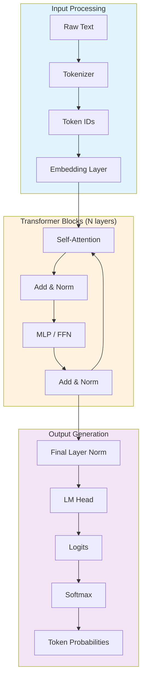
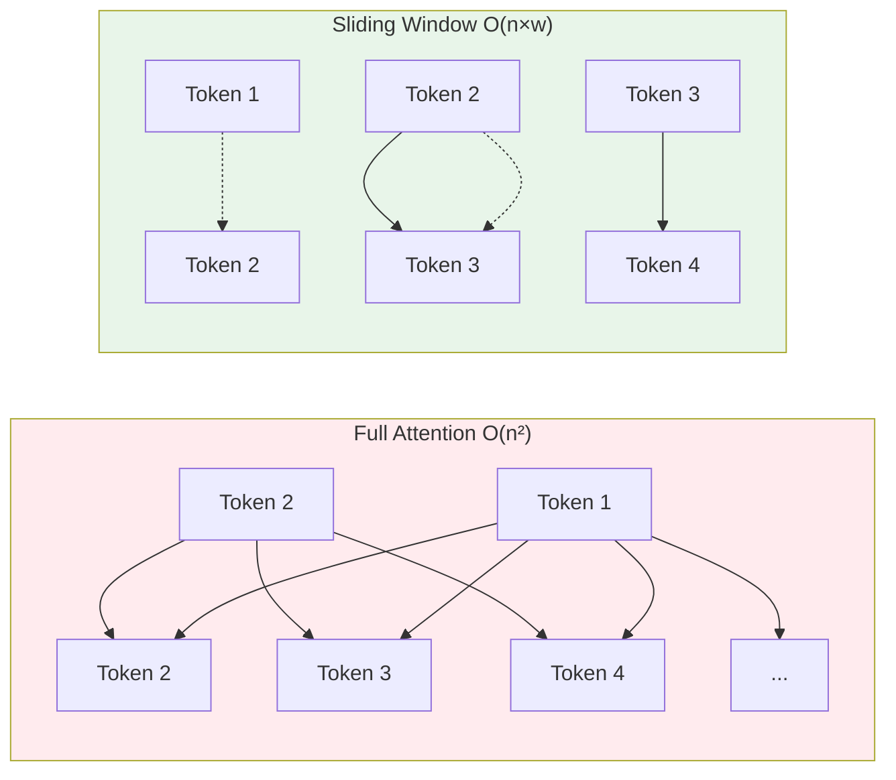

# Understanding LLM Architecture

> **Lesson 01** — Transformer architecture refresher, attention mechanisms, and model types.

This guide provides the architectural knowledge you need to fine-tune effectively. You don't need to derive attention formulas, but you do need to understand what each component does and how it affects training.

---

## Table of Contents

1. [Why Architecture Matters for Fine-Tuning](#why-architecture-matters-for-fine-tuning)
2. [Transformer Architecture Refresher](#transformer-architecture-refresher)
3. [Attention Mechanisms Deep Dive](#attention-mechanisms-deep-dive)
4. [Tokenization and Its Impact](#tokenization-and-its-impact)
5. [Base Models vs. Instruction-Tuned Models](#base-models-vs-instruction-tuned-models)
6. [Model Families and Their Quirks](#model-families-and-their-quirks)
7. [Architecture's Impact on Fine-Tuning](#architectures-impact-on-fine-tuning)

---

## Why Architecture Matters for Fine-Tuning

You can fine-tune without knowing architecture details. But understanding what happens under the hood helps you:

| Without Architecture Knowledge | With Architecture Knowledge |
|-------------------------------|----------------------------|
| Blindly copy hyperparameters | Adjust learning rate based on model size |
| Confused by OOM errors | Know which layers consume memory |
| Can't debug strange outputs | Understand attention failure modes |
| Treat models as black boxes | Make informed architecture choices |

**Key Insight:** Fine-tuning modifies specific parts of the transformer. Knowing which parts helps you choose between full fine-tuning, LoRA, and QLoRA.

---

## Transformer Architecture Refresher

### High-Level Overview

Every LLM follows this flow:

```
Input Text → Tokenization → Embeddings → Transformer Blocks → Output Logits → Next Token
```

Let's trace a forward pass:

```python
from transformers import AutoModelForCausalLM, AutoTokenizer

model = AutoModelForCausalLM.from_pretrained("mistralai/Mistral-7B-v0.1")
tokenizer = AutoTokenizer.from_pretrained("mistralai/Mistral-7B-v0.1")

text = "The capital of France is"
inputs = tokenizer(text, return_tensors="pt")

# Forward pass
with torch.no_grad():
    outputs = model(**inputs)

# outputs.logits contains probabilities for next token
next_token_id = outputs.logits[0, -1].argmax()
print(tokenizer.decode(next_token_id))  # "Paris"
```

### Component Breakdown



### Layer-by-Layer Breakdown

#### 1. Embedding Layer

Converts token IDs to dense vectors.

```python
# For a 7B model with 32K vocabulary and 4096 hidden size:
# Embedding matrix shape: [32000, 4096]
# Parameters: 32000 × 4096 = 131 million parameters (~25% of model)

embedding = torch.nn.Embedding(vocab_size=32000, hidden_size=4096)
token_ids = torch.tensor([101, 2054, 3421])  # Example tokens
embedded = embedding(token_ids)  # Shape: [3, 4096]
```

**Fine-tuning relevance:** Embeddings are typically frozen during LoRA. Full fine-tuning updates them.

#### 2. Self-Attention

The core innovation. Each position attends to all positions.

```python
# Scaled Dot-Product Attention (simplified)
def attention(Q, K, V):
    d_k = Q.shape[-1]
    scores = torch.matmul(Q, K.transpose(-2, -1)) / math.sqrt(d_k)
    weights = torch.softmax(scores, dim=-1)
    output = torch.matmul(weights, V)
    return output
```

**Key parameters:**
- `num_attention_heads`: How many attention "heads" (Mistral: 32)
- `head_dim`: Size of each head (Mistral: 4096/32 = 128)
- `max_position_embeddings`: Maximum context length (Mistral: 32K)

#### 3. MLP (Feed-Forward Network)

Processes attention output per-position.

```python
# Mistral uses SwiGLU activation
mlp = nn.Sequential(
    nn.Linear(4096, 14336),  # Expansion: 3.5× hidden size
    nn.SiLU(),
    nn.Linear(14336, 4096)
)
```

**Fine-tuning relevance:** MLP layers contain most parameters. LoRA often targets these.

#### 4. Layer Normalization

Stabilizes training by normalizing activations.

```python
# RMSNorm (used in Llama, Mistral)
class RMSNorm(nn.Module):
    def __init__(self, hidden_size, eps=1e-6):
        self.weight = nn.Parameter(torch.ones(hidden_size))
        self.variance_epsilon = eps
    
    def forward(self, x):
        variance = x.pow(2).mean(-1, keepdim=True)
        x = x * torch.rsqrt(variance + self.variance_epsilon)
        return self.weight * x
```

---

## Attention Mechanisms Deep Dive

### Types of Attention

| Type | Description | Used In |
|------|-------------|---------|
| **Causal (Masked)** | Tokens can only attend to previous tokens | All decoder LLMs |
| **Bidirectional** | Tokens attend to all positions | BERT, encoders |
| **Sliding Window** | Attend only to nearby tokens (e.g., 4K window) | Mistral, Llama-3 |
| **Global + Local** | Some tokens attend globally, others locally | Longformer |

### Sliding Window Attention (Mistral)

Mistral-7B uses sliding window attention for efficiency:



**Implication for fine-tuning:** Sliding window models handle longer contexts with less memory.

### Multi-Query Attention (MQA) and Grouped-Query Attention (GQA)

| Type | Key-Value Heads | Example |
|------|-----------------|---------|
| **Multi-Head (MHA)** | Same as query heads (32) | Llama-2-7B |
| **Multi-Query (MQA)** | 1 shared KV head | Falcon-7B |
| **Grouped-Query (GQA)** | Fewer KV heads (8) | Mistral-7B, Llama-3-8B |

**Why it matters:** GQA/MQA reduces memory during inference (KV cache is smaller). Fine-tuning doesn't change this architecture.

---

## Tokenization and Its Impact

### What is Tokenization?

Converting text to numbers the model understands:

```python
from transformers import AutoTokenizer

tokenizer = AutoTokenizer.from_pretrained("mistralai/Mistral-7B-v0.1")

text = "Fine-tuning is powerful"
tokens = tokenizer.tokenize(text)
print(tokens)  # ['▁Fine', '-', 'tuning', '▁is', '▁power', 'ful']

ids = tokenizer.encode(text)
print(ids)  # [1234, 567, 8901, 234, 5678, 901]

decoded = tokenizer.decode(ids)
print(decoded)  # "Fine-tuning is powerful"
```

### Tokenizer Types

| Type | Split Strategy | Example Models |
|------|----------------|----------------|
| **WordPiece** | Subword, merges common patterns | BERT |
| **Byte-Pair Encoding (BPE)** | Iteratively merges frequent pairs | GPT-2, GPT-3 |
| **SentencePiece** | Treats input as raw bytes | Llama, T5 |
| **TikToken** | Custom BPE variant | GPT-4, Claude |

### Vocabulary Size Impact

| Vocabulary | Pros | Cons |
|------------|------|------|
| **Small (32K)** | Smaller embedding layer, faster training | More tokens per text |
| **Large (100K+)** | Fewer tokens, better compression | Larger model, more memory |

**Fine-tuning implication:** If your domain has specialized vocabulary, consider extending the tokenizer:

```python
# Add domain-specific tokens
tokenizer.add_tokens(["cardiomyopathy", "echocardiogram", "troponin"])
model.resize_token_embeddings(len(tokenizer))
```

### Sequence Length and Memory

Memory scales with sequence length:

| Sequence Length | Memory (7B model, batch=1) |
|-----------------|---------------------------|
| 512 tokens | ~2 GB |
| 2048 tokens | ~4 GB |
| 8192 tokens | ~12 GB |
| 32768 tokens | ~40 GB |

**Rule of thumb:** Use the shortest context that works. Don't pad to max_length unnecessarily.

---

## Base Models vs. Instruction-Tuned Models

### Base Models

**What they are:** Trained on raw text to predict the next token.

**Behavior:** Completes patterns. If you prompt "What is 2+2?", it might continue "2+2? Let me think..." because that's common in training data.

**Examples:**
- `meta-llama/Llama-3-8B` (base)
- `mistralai/Mistral-7B-v0.1` (base)
- `Qwen/Qwen2-7B` (base)

**When to use:**
- You want full control over behavior
- Your task isn't conversational
- You're doing alignment training (DPO/ORPO)

### Instruction-Tuned Models

**What they are:** Fine-tuned on instruction-following datasets.

**Behavior:** Responds to prompts helpfully. "What is 2+2?" → "2+2 equals 4."

**Examples:**
- `meta-llama/Llama-3-8B-Instruct`
- `mistralai/Mistral-7B-Instruct-v0.1`
- `Qwen/Qwen2-7B-Instruct`

**When to use:**
- Chatbots and assistants
- General instruction following
- You want a helpful default behavior

### Fine-Tuning Implications

| Scenario | Base Model | Instruction Model |
|----------|------------|-------------------|
| **Continue fine-tuning** | Learns new domain well | May retain helpful behavior |
| **Alignment (DPO/ORPO)** | Better starting point | May conflict with existing alignment |
| **Format training** | Good | Good, but may resist |
| **Task training** | Requires more data | Works with less data |

**Recommendation:** Start with instruction-tuned models for most applications. Use base models for alignment work.

---

## Model Families and Their Quirks

### Llama 2/3 (Meta)

```python
from transformers import AutoModelForCausalLM

# Llama-3-8B
model = AutoModelForCausalLM.from_pretrained(
    "meta-llama/Llama-3-8B",
    torch_dtype=torch.bfloat16,  # Required
    attn_implementation="flash_attention_2"  # Optional, faster
)
```

**Quirks:**
- Requires bfloat16 (not float16)
- GQA attention (8 KV heads)
- SwiGLU activation
- RMSNorm (no bias)

### Mistral (Mistral AI)

```python
# Mistral-7B-v0.1
model = AutoModelForCausalLM.from_pretrained(
    "mistralai/Mistral-7B-v0.1",
    torch_dtype=torch.float16,  # Works with float16
)
```

**Quirks:**
- Sliding window attention (4096)
- GQA attention
- No bias in attention
- Works with float16 (unlike Llama)

### Qwen2 (Alibaba)

```python
# Qwen2-7B
model = AutoModelForCausalLM.from_pretrained(
    "Qwen/Qwen2-7B",
    torch_dtype=torch.bfloat16,
)
```

**Quirks:**
- Supports 128K context
- Multi-query attention in smaller models
- SwiGLU activation

### Phi-3 (Microsoft)

```python
# Phi-3-mini (3.8B)
model = AutoModelForCausalLM.from_pretrained(
    "microsoft/Phi-3-mini-4k-instruct",
    trust_remote_code=True,  # Required
)
```

**Quirks:**
- Small but capable
- Requires `trust_remote_code=True`
- Custom architecture

---

## Architecture's Impact on Fine-Tuning

### Memory Breakdown (7B Model)

| Component | Parameters | Memory (fp16) |
|-----------|------------|---------------|
| Embeddings | 131M | 262 MB |
| Attention (QKV) | 537M | 1.1 GB |
| MLP | 5.3B | 10.6 GB |
| Output Head | 131M | 262 MB |
| **Total** | **~7B** | **~14 GB** |

**Why this matters:**
- QLoRA quantizes weights to 4-bit: 14 GB → 3.5 GB
- LoRA adapters add ~8MB per layer (negligible)
- Gradients require same memory as parameters

### Which Layers to Target with LoRA

| Target | Effect | Recommended For |
|--------|--------|-----------------|
| `q_proj, v_proj` | Minimal, fast | Quick experiments |
| `q_proj, k_proj, v_proj, o_proj` | Standard | Most tasks |
| All attention + MLP | Maximum | Complex domain adaptation |
| All linear layers | Maximum + embeddings | Full adaptation |

```python
from peft import LoraConfig

# Standard configuration
config = LoraConfig(
    r=8,
    lora_alpha=32,
    target_modules=["q_proj", "k_proj", "v_proj", "o_proj"],
    lora_dropout=0.1,
)
```

### Architecture-Specific Recommendations

| Model | Recommended LoRA Targets | Learning Rate |
|-------|-------------------------|---------------|
| Llama-3-8B | All linear | 2e-4 |
| Mistral-7B | qkv + o_proj | 1e-4 |
| Qwen2-7B | All linear | 2e-4 |
| Phi-3-mini | All linear | 3e-4 |

---

## Next Steps

1. **Read [What is Fine-Tuning?](./02-what-is-fine-tuning.md)** — Transfer learning concepts
2. **Experiment with model loading:**
   ```python
   from transformers import AutoModelForCausalLM
   model = AutoModelForCausalLM.from_pretrained("mistralai/Mistral-7B-v0.1")
   print(model.config)
   ```
3. **Visualize attention patterns** using tools like [BertViz](https://github.com/jessevig/bertviz)

---

## References

- [Attention Is All You Need](https://arxiv.org/abs/1706.03762) — Vaswani et al., 2017
- [Llama 3 Model Card](https://huggingface.co/meta-llama/Llama-3-8B)
- [Mistral Architecture Details](https://mistral.ai/news/announcing-mistral-7b/)
- [The Illustrated Transformer](https://jalammar.github.io/illustrated-transformer/) — Jay Alammar
- [Hugging Face Model Hub](https://huggingface.co/models)
