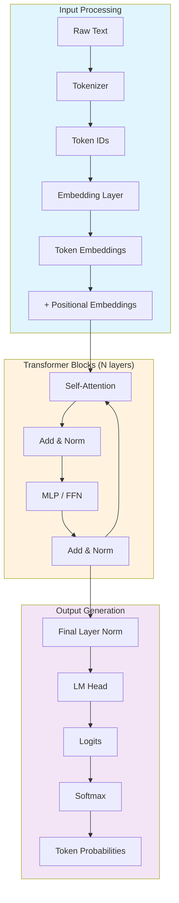

# Understanding LLM Architecture

> **Lesson 02** — Transformer architecture refresher, attention mechanisms, and model types.

This guide provides the architectural knowledge you need to fine-tune effectively. You don't need to derive attention formulas, but you do need to understand what each component does and how it affects training.

> **Beginner note**: If you're new to neural networks, read [Module 00: Neural Networks](../00-neural-networks-basics/) first for a beginner-friendly introduction to tokenization, embeddings, attention, and transformers. This lesson goes deeper with code examples and fine-tuning-specific details.

---

## Table of Contents

1. [Why Architecture Matters for Fine-Tuning](#why-architecture-matters-for-fine-tuning)
2. [Transformer Architecture Refresher](#transformer-architecture-refresher)
3. [Why N Layers? The Case for Depth](#why-n-layers-the-case-for-depth)
4. [The Output Head: Why Only One Layer](#the-output-head-why-only-one-layer)
5. [Attention Types at a Glance](#attention-types-at-a-glance)
6. [Architecture's Impact on Fine-Tuning](#architectures-impact-on-fine-tuning)

---

## Why Architecture Matters for Fine-Tuning

You can fine-tune without knowing architecture details. But understanding what happens under the hood helps you:

| Without Architecture Knowledge | With Architecture Knowledge |
|-------------------------------|----------------------------|
| Blindly copy hyperparameters | Adjust learning rate based on model size |
| Confused by OOM errors | Know which layers consume memory |
| Can't debug strange outputs | Understand attention failure modes |
| Treat models as black boxes | Make informed architecture choices |

**Key Insight:** Fine-tuning modifies specific parts of the transformer. Knowing which parts helps you choose between full fine-tuning, LoRA, and QLoRA.

---

## Transformer Architecture Refresher

### High-Level Overview

Every LLM follows this flow:

```
Input Text → Tokenization → Embeddings → Transformer Blocks → Output Logits → Next Token
```

Let's trace a forward pass:

```python
import torch
from transformers import AutoModelForCausalLM, AutoTokenizer

model = AutoModelForCausalLM.from_pretrained("mistralai/Mistral-7B-Instruct-v0.3")
tokenizer = AutoTokenizer.from_pretrained("mistralai/Mistral-7B-Instruct-v0.3")

text = "The capital of France is"
inputs = tokenizer(text, return_tensors="pt")

with torch.no_grad():
    outputs = model(**inputs)

# Extract the logits for the last token, get the most probable token ID as a Python int,
# then decode it to text
next_token_id = outputs.logits[0, -1, :].argmax().item()
print(tokenizer.decode(next_token_id))
```

### Component Breakdown



> **Interactive 3D visualization:** This diagram is a simplified 2D overview. To see the full architecture in 3D — exploring attention heads, KV caches, token flow, and step-by-step forward passes — try **[llm-visualized.com](https://www.llm-visualized.com/?token=4&generation=0&kvCache=0)**. It's an excellent companion for understanding exactly how the data flows through each component.

> **Note on attention types:** The "Self-Attention" box in this diagram shows the *conceptual role* attention plays, not the *mechanism*. In practice, different models use different attention variants: causal masking (standard decoder LLMs), sliding windows (Mistral 7B), grouped-query attention (Llama-3, Mistral v0.3), or mixed linear/full attention (Qwen3.6). We cover these briefly in [Attention Types at a Glance](#attention-types-at-a-glance).

### Layer-by-Layer Breakdown

#### 1. Embedding Layer

Converts token IDs to dense vectors.

```python
import torch

# For a 7B model with 32K vocabulary and 4096 embedding size:
# Embedding matrix shape: [32000, 4096]
# Parameters: 32000 × 4096 = 131 million parameters (~2% of model)

embedding = torch.nn.Embedding(vocab_size=32000, embedding_dim=4096)
token_ids = torch.tensor([101, 2054, 3421])  # Example tokens
embedded = embedding(token_ids)  # Shape: [3, 4096]
```

**Fine-tuning relevance:** Embeddings are typically frozen during LoRA. Full fine-tuning updates them.

#### 1.1 Positional Embeddings

Self-attention is **permutation-invariant** — it has no built-in notion of order. The sequence `["Paris", "is", "in", "France"]` would be treated identically to `["France", "is", "in", "Paris"]` without positional information. Positional embeddings solve this by adding an **order signal** to each token's position.

```python
# Positional embeddings are added to token embeddings
# before anything enters the transformer blocks

# Token embeddings:   [seq_len, hidden_dim]   = [4, 4096]
# Positional embeds: [max_seq_len, hidden_dim] = [32768, 4096]
# Input to blocks:   [seq_len, hidden_dim]   = [4, 4096]

input_to_transformer = token_embeddings + positional_embeddings
```

Modern LLMs use **RoPE (Rotary Positional Embeddings)** instead of fixed positional encodings. RoPE encodes position as a rotation in the embedding space — the relative angle between two positions encodes their distance. This gives two key advantages:

1. **Relative position awareness** — the model learns "tokens that are close together are related" rather than memorizing absolute positions.
2. **Better extrapolation** — RoPE-based models (Llama, Mistral) can generalize to context lengths longer than seen during training.

**Fine-tuning relevance:** If you fine-tune on longer contexts than the model was trained on, RoPE helps the model handle it. But if you truncate context too aggressively, the positional signals can become confused.

#### 2. Self-Attention

The core innovation. Each position attends to all positions.

```python
# Scaled Dot-Product Attention (simplified)
def attention(Q, K, V):
    d_k = Q.shape[-1]
    scores = torch.matmul(Q, K.transpose(-2, -1)) / math.sqrt(d_k)
    weights = torch.softmax(scores, dim=-1)
    output = torch.matmul(weights, V)
    return output
```

**Key parameters:**
- `num_attention_heads`: How many attention "heads" (Mistral: 32)
- `head_dim`: Size of each head (Mistral: 4096/32 = 128)
- `max_position_embeddings`: Maximum context length (Mistral: 32K)

#### 3. MLP (Feed-Forward Network)

Processes attention output per-position.

```python
# Mistral uses SwiGLU activation
mlp = nn.Sequential(
    nn.Linear(4096, 14336),  # Expansion: 3.5× hidden size
    nn.SiLU(),
    nn.Linear(14336, 4096)
)
```

**Fine-tuning relevance:** MLP layers contain most parameters. LoRA often targets these.

#### 4. Layer Normalization

Stabilizes training by normalizing activations.

```python
# RMSNorm (used in Llama, Mistral)
class RMSNorm(nn.Module):
    def __init__(self, hidden_size, eps=1e-6):
        self.weight = nn.Parameter(torch.ones(hidden_size))
        self.variance_epsilon = eps
    
    def forward(self, x):
        variance = x.pow(2).mean(-1, keepdim=True)
        x = x * torch.rsqrt(variance + self.variance_epsilon)
        return self.weight * x
```

---

### Why N Layers? The Case for Depth

You might look at a model specification and wonder: *why does a 7B model have 32 Transformer blocks, while a 70B model has 80? Can't a single block learn everything?*

The answer is yes and no — a single block *can* learn almost anything in isolation. But it can't learn **complex, hierarchical representations efficiently**. Think of stacked Transformer blocks like the floors of a skyscraper or stations in a restaurant kitchen:

| Layer Depth | What It Learns | Kitchen Analogy |
|-------------|----------------|-----------------|
| **Early layers** (1–4) | Syntax, grammar, word co-occurrence | Chopping ingredients |
| **Middle layers** (5–12) | Phrases, clauses, local context | Cooking individual components |
| **Deep layers** (13+) | Abstract meaning, reasoning, intent | Plating the final dish |

#### Hierarchical Feature Learning

Each block takes the representation from the one below it and **refines** it — it doesn't start from scratch:

```
Input: "The capital of France is"

Layer 1:  "These words co-occur in a grammatical pattern"        → word relationships
Layer 2:  "'capital of France' is a named entity"                → phrase recognition
Layer 3:  "This is a geography question expecting a city"         → semantic classification
Layer 4:  "The answer should be a proper noun, capitalized"       → format expectation
Layer 5:  "Paris is the most likely continuation"                 → factual knowledge
Layer 6:  "No extra text, just the name"                          → style / politeness
```

Each layer builds on the features the layers below it discovered. One block can do one "pass" of reasoning. Thirty-two blocks mean thirty-two passes, each layering abstraction on top of the last.

#### Why Can't One Block Do It All?

A single Transformer block has limited **representational capacity** and a fixed inductive bias. It performs one attention pass and one feed-forward transformation — essentially one step of thought. To simultaneously track grammar, semantics, pragmatics, world knowledge, and output format, a single step would need impossibly wide dimensions. Stacking blocks achieves the same result more efficiently because:

1. **Compositionality** — each layer reuses the same operations on increasingly abstract features, just as a CNN detects edges → shapes → objects.
2. **Parameter efficiency** — thirty-two 4,096-dim blocks use far fewer parameters than one block that tried to do everything in a single pass.
3. **Gradient flow** — residual connections between layers (the `x + sublayer(x)` pattern) let gradients flow deep during training, enabling the network to learn useful representations at every depth.

#### The Vision Analogy

This is directly analogous to convolutional networks for image recognition:

```
CNN (Images):              Transformer (Text):

Early layers → edges       Layer 1 → word relationships
Middle layers → shapes     Layer 3 → phrases & dependencies
Deep layers → objects      Layer 6 → meaning & intent
```

#### How Many Layers Does Your Model Need?

More layers generally mean more reasoning capacity — but also more compute and more training data required. Here's a rough guide:

| Model Class | Typical Layers | What It Handles Well |
|-------------|---------------|----------------------|
| Tiny (< 1B) | ~16–20 | Simple completions, keyword tasks |
| Small (1–3B) | ~24–28 | General chat, basic reasoning |
| Medium (7–13B) | ~32–40 | Complex reasoning, multi-step tasks |
| Large (30–70B) | ~60–80 | Multi-step reasoning, code, math |
| Huge (100B+) | ~80–100+ | Expert-level reasoning, agentic tasks |

**The takeaway:** depth is the model's "thinking time." A 300B parameter model with 80 layers can reason more deeply than a 7B model with 32 layers — not because it has smarter components, but because it has more layers to build on each component's output.

#### Fine-Tuning Relevance

This hierarchical view explains *why* parameter-efficient fine-tuning methods like LoRA are configured the way they are:

- **Early layers** encode grammar and syntax. Freezing them preserves the model's ability to generate fluent text. LoRA often skips them.
- **Middle layers** encode context understanding. Fine-tuning these helps the model reorient its understanding of domain-specific terminology.
- **Deep layers** encode reasoning and style. These are where LoRA has the biggest effect on task behavior.

```python
# A typical LoRA config targets attention + FFN across layers:
config = LoraConfig(
    r=8,
    target_modules=[
        "q_proj", "k_proj", "v_proj", "o_proj",  # attention — all depths
        "gate_proj", "up_proj", "down_proj",       # FFN — all depths
    ],
)
# Why all layers? Because different layers learned different things,
# and domain adaptation requires updating knowledge at every level.
```

---

### The Output Head: Why Only One Layer?

You might notice something odd in the architecture diagram: *N* Transformer blocks stack on top of each other, but there's only **one** output layer (often called the LM Head or language model head). Why the asymmetry?

The short answer: the Transformer blocks are the **brain**, and the output head is just the **mouth**. The brain does deep, hierarchical thinking. The mouth just speaks the final word.

#### What the LM Head Actually Does

The output head is a single linear projection — it's mathematically simple:

```python
# A 7B model with 4096 hidden size and 32K vocabulary:
lm_head = nn.Linear(4096, 32000)  # One matrix, one multiplication

# Given the final layer's representation for the last token:
# hidden_state shape: [4096]  (the model's final "thought" about this position)
logits = lm_head(hidden_state)   # Shape: [32000]  (one score per token)
probabilities = softmax(logits)  # Shape: [32000]  (probabilities over vocabulary)
```

That's it. One matrix multiplication. No hidden layers. No attention. The model's 32-layer brain has already done all the deep thinking — the LM Head just answers the question: *"given everything the model has figured out, which token in the vocabulary is most likely next?"

#### Why One Layer Is Enough

| Requirement | Handled By | Why |
|-------------|------------|-----|
| Word relationships | Transformer layers | Learned through attention across all positions |
| Context understanding | Transformer layers | Learned through successive refinements |
| Abstract reasoning | Transformer layers | Learned through deep hierarchical composition |
| **Token prediction** | **LM Head** | **Just a lookup — which vocabulary entry best matches this representation?** |

The LM Head doesn't need depth because it isn't *reasoning*. It's performing a **classification** — mapping the final representation to the nearest point in vocabulary space. Think of it as a high-dimensional nearest-neighbor lookup:

```
Final hidden state (4096 dims)  →  closest to "Paris" in vocabulary space  →  output "Paris"
```

#### Weight Tying: The Hidden Savings

In many models (Llama, Mistral, Gemma), the LM Head and the input embedding layer **share the same weights**. This is called *weight tying*:

```python
# The LM head and the embedding layer share the SAME matrix — not a separate transpose.
# In PyTorch: model.get_output_embeddings().weight = model.get_input_embeddings().weight
# Both shapes are [32000, 4096] — one tensor, two roles.

# Embedding: lookup row by token ID → 4096-dim vector
# LM head:   dot product of hidden state with every row → 32000 logits

# This saves ~131 million parameters (about 2% of a 7B model)
```

This makes intuitive sense: the same representation that *encodes* a token at the input should be the reference for *decoding* it at the output.

#### Fine-Tuning Relevance

The output head has important practical implications:

- **LoRA rarely targets the LM Head** — it doesn't need fine-tuning for most tasks. The 32-layer brain underneath already knows the domain; it just needs to project that knowledge to the vocabulary.
- **Full fine-tuning updates it** — when you train end-to-end, the head adapts its projection to match the shifted representations of the fine-tuned layers below.
- **Extending the vocabulary requires resizing it** — if you add new tokens (medical terms, code keywords), you must resize both the embedding and the LM Head together.

```python
# Adding new tokens: both layers must grow together
tokenizer.add_tokens(["my_special_token"])
model.resize_token_embeddings(len(tokenizer))
# Behind the scenes: this resizes BOTH the embedding matrix and the LM head
```

**The takeaway:** depth is for reasoning. The LM Head is a projection, not a reasoner. That's why the architecture is asymmetric — 32 layers of thinking, one layer of speaking.

---

## Attention Types at a Glance

You don't need to derive attention formulas to fine-tune, but you should know which type your model uses — it affects context length behavior:

| Type | How It Works | Models That Use It |
|------|-------------|-------------------|
| **Causal (Masked)** | Tokens attend only to previous tokens — standard for decoder-only LLMs | Llama, Mistral, Gemma, Qwen |
| **Sliding Window** | Tokens attend to nearby tokens within a fixed window — scales better with context | Mistral 7B, Gemma |
| **Grouped-Query (GQA)** | Multiple query heads share KV keys — faster inference, same quality | Llama-3, Mistral-v0.3 |
| **Multi-Query (MQA)** | All query heads share one KV pair — fastest inference | Falcon |

**Fine-tuning relevance:** Attention type is fixed at model creation — fine-tuning doesn't change it. But it affects how much context your model can process and how much GPU memory that costs (covered in [Section 6](#architecture-s-impact-on-fine-tuning)).

---

## Architecture's Impact on Fine-Tuning

Now that you know what's inside an LLM, let's see how that architecture shapes every fine-tuning decision — from which GPU you need to which layers you should adapt.

### The Training Memory Formula

When you fine-tune a model, GPU memory is split across **six buckets**. Understanding this breakdown explains why some methods fit on a single GPU while others need a cluster:

```
Total Memory = Base Weights
             + Trainable Weights   (adapters or full params)
             + Gradients
             + Optimizer States    (Adam tracks two extra values per trainable param)
             + Activations         (intermediate values stored for backprop)
             + Overhead            (framework buffers, fragmentation)
```

Here's the key insight: **optimizer states eat memory**. Adam (the default optimizer) stores two full-precision snapshots for every trainable parameter — 8 extra bytes per param. Full fine-tuning makes Adam work on all 7B parameters. LoRA makes it work on ~0.1% of them. That's the entire difference.

### Three Methods, Three Memory Budgets

| Method | Frozen Base | What Trains | Memory (7B model, seq=512) | GPU You Need |
|--------|-------------|-------------|---------------------------|--------------|
| **Full Fine-Tuning** | — (nothing) | All 7B params | ~72 GB | 2× RTX 3090, or A100-80GB |
| **LoRA (r=16)** | FP16 (14 GB) | ~35M params | ~26 GB | Single RTX 4090 |
| **QLoRA (4-bit)** | INT4 (3.5 GB) | ~35M params | ~13 GB | RTX 4060 (16 GB) |

**Rule of thumb:** Full fine-tuning needs roughly 10× the model weight size in GB. LoRA cuts that to ~1.5×. QLoRA brings it down to ~0.4×.

### Where Each Method Actually Makes Changes

Knowing what lives in each component helps you pick the right approach:

| Component | % of Params | What It Does | Method Impact |
|-----------|-------------|-------------|---------------|
| **Embeddings** | ~2% | Token-to-vector mapping | Rarely touched — changing these risks destabilizing the model |
| **Attention (QKV)** | ~7% | Decides which tokens focus on each other | LoRA here shapes *how* the model attends — great for format/style tasks |
| **MLP / FFN** | ~75% | Feature transformation — where most knowledge lives | LoRA here teaches *new facts* and domain concepts |
| **Output Head** | ~2% | Vector-to-token mapping | Usually frozen — adapts only for vocabulary changes |

**Architectural insight:** The MLP layers alone contain three-quarters of all parameters. If your fine-tuning task involves teaching new domain knowledge (medical terminology, legal reasoning, code), skipping the MLP layers means the model literally has nowhere to store that information.

### How Architecture Dictates Context Length Limits

The attention mechanism is the bottleneck. Every token in your sequence needs a **key-value pair** stored in memory so the model can attend to it:

```
KV Cache Memory = 2 × num_layers × num_kv_heads × head_dim × seq_len × batch_size × bytes_per_element
```

| Model | Config | KV Cache (1 sequence, BF16) |
|-------|--------|-----------------------------|
| Mistral 7B | 32 layers, 8 KV heads, 128 dim | ~512 MB @ 4K · ~4 GB @ 32K |
| Llama-3 8B | 32 layers, 8 KV heads, 128 dim | ~512 MB @ 4K · ~4 GB @ 32K |
| Llama-3 70B | 80 layers, 8 KV heads, 128 dim | ~1.3 GB @ 4K · ~10.5 GB @ 32K |

This means a 70B model with a 128K context window consumes more memory in KV cache alone than a 7B model does for its entire weight storage. If your fine-tuning data contains long sequences, you'll need gradient checkpointing (trades ~20% more compute for ~4× less activation memory) or shorter sequences.

### Choosing Fine-Tuning Method by Hardware

| VRAM Budget | What You Can Do | Example GPU |
|-------------|-----------------|-------------|
| **16 GB** | 7B QLoRA (small batches) | RTX 4060 Ti, RTX 4080 |
| **24 GB** | 7B LoRA, 13B QLoRA | RTX 4090, RTX 3090 |
| **40 GB** | 13B LoRA, 30B QLoRA | A100-40GB, RTX 5080 |
| **80 GB** | 7B Full FT, 70B QLoRA | A100-80GB, H100 |
| **160+ GB** | 70B LoRA, multi-GPU full FT | 2× H100, cluster |

**Quick decision guide:**
- **LoRA** — your practical default. 95–99% of full fine-tuning quality at a fraction of the cost.
- **QLoRA** — when you can't fit the base model for training. 4-bit quantization makes frontier models trainable on consumer hardware.
- **Full fine-tuning** — when you need maximum quality, have cluster resources, or are making fundamental behavioral changes to the model.

---

## Next Steps

1. **Read [Fine-Tuning Workflows Overview](./03-workflows.md)** — Full FT, LoRA, QLoRA, DPO, ORPO comparison
2. **Experiment with model loading:**
   ```python
   from transformers import AutoModelForCausalLM
   model = AutoModelForCausalLM.from_pretrained("mistralai/Mistral-7B-Instruct-v0.3")
   print(model.config)
   ```
3. **Visualize attention patterns** using tools like [BertViz](https://github.com/jessevig/bertviz)

---

## References

- [Attention Is All You Need](https://arxiv.org/abs/1706.03762) — Vaswani et al., 2017
- [LoRA: Low-Rank Adaptation of Large Language Models](https://arxiv.org/abs/2106.09685) — Hu et al., 2021
- [QLoRA: Efficient Finetuning of Quantized LLMs](https://arxiv.org/abs/2305.14314) — Dettmers et al., 2023
- [Using the Output Embedding to Improve Language Models](https://aclanthology.org/E17-2025) — Press & Wolf, 2017 (weight tying)
- [Transformer Math 101](https://www.lesswrong.com/posts/avgrwRkr8nSeCp4SP/transformer-math-101) — EleutherAI (parameter counting & memory estimation)
- [The Illustrated Transformer](https://jalammar.github.io/illustrated-transformer/) — Jay Alammar
