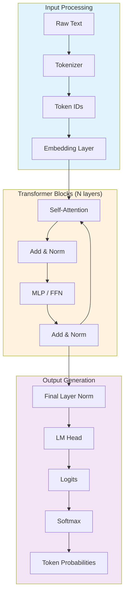
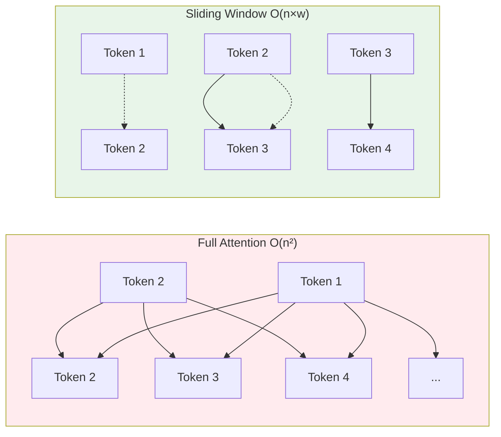

# Understanding LLM Architecture

> **Lesson 02** — Transformer architecture refresher, attention mechanisms, and model types.

This guide provides the architectural knowledge you need to fine-tune effectively. You don't need to derive attention formulas, but you do need to understand what each component does and how it affects training.

> **Beginner note**: If you're new to neural networks, read [Module 00: Neural Networks](../00-neural-networks-basics/) first for a beginner-friendly introduction to tokenization, embeddings, attention, and transformers. This lesson goes deeper with code examples and fine-tuning-specific details.

---

## Table of Contents

1. [Why Architecture Matters for Fine-Tuning](#why-architecture-matters-for-fine-tuning)
2. [Transformer Architecture Refresher](#transformer-architecture-refresher)
3. [Attention Mechanisms Deep Dive](#attention-mechanisms-deep-dive)
4. [Tokenization and Its Impact](#tokenization-and-its-impact)
5. [Base Models vs. Instruction-Tuned Models](#base-models-vs-instruction-tuned-models)
6. [Model Families and Their Quirks](#model-families-and-their-quirks)
7. [Architecture's Impact on Fine-Tuning](#architectures-impact-on-fine-tuning)

---

## Why Architecture Matters for Fine-Tuning

You can fine-tune without knowing architecture details. But understanding what happens under the hood helps you:

| Without Architecture Knowledge | With Architecture Knowledge |
|-------------------------------|----------------------------|
| Blindly copy hyperparameters | Adjust learning rate based on model size |
| Confused by OOM errors | Know which layers consume memory |
| Can't debug strange outputs | Understand attention failure modes |
| Treat models as black boxes | Make informed architecture choices |

**Key Insight:** Fine-tuning modifies specific parts of the transformer. Knowing which parts helps you choose between full fine-tuning, LoRA, and QLoRA.

---

## Transformer Architecture Refresher

### High-Level Overview

Every LLM follows this flow:

```
Input Text → Tokenization → Embeddings → Transformer Blocks → Output Logits → Next Token
```

Let's trace a forward pass:

```python
from transformers import AutoModelForCausalLM, AutoTokenizer

model = AutoModelForCausalLM.from_pretrained("mistralai/Mistral-7B-Instruct-v0.3")
tokenizer = AutoTokenizer.from_pretrained("mistralai/Mistral-7B-Instruct-v0.3")

text = "The capital of France is"
inputs = tokenizer(text, return_tensors="pt")

# Forward pass
with torch.no_grad():
    outputs = model(**inputs)

# outputs.logits contains probabilities for next token
next_token_id = outputs.logits[0, -1].argmax()
print(tokenizer.decode(next_token_id))  # "Paris"
```

### Component Breakdown



### Layer-by-Layer Breakdown

#### 1. Embedding Layer

Converts token IDs to dense vectors.

```python
# For a 7B model with 32K vocabulary and 4096 hidden size:
# Embedding matrix shape: [32000, 4096]
# Parameters: 32000 × 4096 = 131 million parameters (~25% of model)

embedding = torch.nn.Embedding(vocab_size=32000, hidden_size=4096)
token_ids = torch.tensor([101, 2054, 3421])  # Example tokens
embedded = embedding(token_ids)  # Shape: [3, 4096]
```

**Fine-tuning relevance:** Embeddings are typically frozen during LoRA. Full fine-tuning updates them.

#### 2. Self-Attention

The core innovation. Each position attends to all positions.

```python
# Scaled Dot-Product Attention (simplified)
def attention(Q, K, V):
    d_k = Q.shape[-1]
    scores = torch.matmul(Q, K.transpose(-2, -1)) / math.sqrt(d_k)
    weights = torch.softmax(scores, dim=-1)
    output = torch.matmul(weights, V)
    return output
```

**Key parameters:**
- `num_attention_heads`: How many attention "heads" (Mistral: 32)
- `head_dim`: Size of each head (Mistral: 4096/32 = 128)
- `max_position_embeddings`: Maximum context length (Mistral: 32K)

#### 3. MLP (Feed-Forward Network)

Processes attention output per-position.

```python
# Mistral uses SwiGLU activation
mlp = nn.Sequential(
    nn.Linear(4096, 14336),  # Expansion: 3.5× hidden size
    nn.SiLU(),
    nn.Linear(14336, 4096)
)
```

**Fine-tuning relevance:** MLP layers contain most parameters. LoRA often targets these.

#### 4. Layer Normalization

Stabilizes training by normalizing activations.

```python
# RMSNorm (used in Llama, Mistral)
class RMSNorm(nn.Module):
    def __init__(self, hidden_size, eps=1e-6):
        self.weight = nn.Parameter(torch.ones(hidden_size))
        self.variance_epsilon = eps
    
    def forward(self, x):
        variance = x.pow(2).mean(-1, keepdim=True)
        x = x * torch.rsqrt(variance + self.variance_epsilon)
        return self.weight * x
```

---

## Attention Mechanisms Deep Dive

### Types of Attention

| Type | Description | Used In |
|------|-------------|---------|
| **Causal (Masked)** | Tokens can only attend to previous tokens | All decoder LLMs |
| **Bidirectional** | Tokens attend to all positions | BERT, encoders |
| **Sliding Window** | Attend only to nearby tokens (e.g., 4K window) | Mistral 7B, Gemma |
| **Global + Local** | Some tokens attend globally, others locally | Longformer, BigBird |
| **Mixed-RoPE** | Short and long context RoPE heads | Qwen3 |
| **Linear Attention** | Hybrid linear + full attention layers | Qwen3.5/3.6 |

### Sliding Window Attention (Mistral)

Mistral-7B uses sliding window attention for efficiency:



**Implication for fine-tuning:** Sliding window models handle longer contexts with less memory.

### Multi-Query Attention (MQA) and Grouped-Query Attention (GQA)

| Type | Key-Value Heads | Example | Notes |
|------|-----------------|---------|-------|
| **Multi-Head (MHA)** | Same as query heads (32) | Llama-2-7B | Original attention |
| **Multi-Query (MQA)** | 1 shared KV head | Falcon-7B | Maximum inference speed |
| **Grouped-Query (GQA)** | Fewer KV heads (8) | Mistral-7B v0.3, Llama-3.2/3.3 | Best speed/quality balance |
| **Block-Grouped (BGQA)** | Variable KV heads | Qwen3 | Adaptive per-layer |

**Why it matters:** GQA/MQA reduces memory during inference (KV cache is smaller). Fine-tuning doesn't change this architecture.

### Flash Attention 2 (and 3 Preview)

Flash Attention is an optimized attention implementation that reduces memory complexity from O(n²d) to O(n) by computing attention in a streaming fashion:

```python
# Enable Flash Attention 2 (recommended for all models)
model = AutoModelForCausalLM.from_pretrained(
    "Qwen/Qwen3-8B",
    attn_implementation="flash_attention_2",
)
```

**Note on Flash Attention 3:** Flash Attention 3 is an ongoing research effort for Hopper/Blackwell GPUs. It is **not yet a supported `attn_implementation` value** in the `transformers` library. Only `"flash_attention_2"` is currently available. Follow the [flash-attn repo](https://github.com/Dao-AILab/flash-attention) for updates on FA3 integration.

**Performance gains:**
- 2-4x faster training vs. standard attention
- 40-60% less memory for activations
- Essential for training on 7B+ models on consumer GPUs
- Automatic fallback to standard attention if not supported

**Installation:**
```bash
pip install flash-attn --no-build-isolation
```

**Fine-tuning implication:** Enable Flash Attention 2 for all training. It's now the default for many models in transformers 5.x.

---

## Tokenization and Its Impact

### What is Tokenization?

Converting text to numbers the model understands:

```python
from transformers import AutoTokenizer

tokenizer = AutoTokenizer.from_pretrained("mistralai/Mistral-7B-Instruct-v0.3")

text = "Fine-tuning is powerful"
tokens = tokenizer.tokenize(text)
print(tokens)  # ['▁Fine', '-', 'tuning', '▁is', '▁power', 'ful']

ids = tokenizer.encode(text)
print(ids)  # [1234, 567, 8901, 234, 5678, 901]

decoded = tokenizer.decode(ids)
print(decoded)  # "Fine-tuning is powerful"
```

### Tokenizer Types

| Type | Split Strategy | Example Models |
|------|----------------|----------------|
| **WordPiece** | Subword, merges common patterns | BERT |
| **Byte-Pair Encoding (BPE)** | Iteratively merges frequent pairs | GPT-2, GPT-3, Llama |
| **SentencePiece** | Treats input as raw bytes | Llama, Mistral, T5 |
| **TikToken** | Custom BPE variant | GPT-4, Claude |
| **Unigram** | Probabilistic subword model | BERT multilingual, NLLB |

### Vocabulary Size Impact

| Vocabulary | Pros | Cons |
|------------|------|------|
| **Small (32K)** | Smaller embedding layer, faster training | More tokens per text |
| **Large (100K+)** | Fewer tokens, better compression | Larger model, more memory |

**Fine-tuning implication:** If your domain has specialized vocabulary, consider extending the tokenizer:

```python
# Add domain-specific tokens
tokenizer.add_tokens(["cardiomyopathy", "echocardiogram", "troponin"])
model.resize_token_embeddings(len(tokenizer))
```

### Sequence Length and Memory

Memory scales with sequence length:

| Sequence Length | Memory (7B model, batch=1) |
|-----------------|---------------------------|
| 512 tokens | ~2 GB |
| 2048 tokens | ~4 GB |
| 8192 tokens | ~12 GB |
| 32768 tokens | ~40 GB |

**Rule of thumb:** Use the shortest context that works. Don't pad to max_length unnecessarily.

---

## Base Models vs. Instruction-Tuned Models

### Base Models

**What they are:** Trained on raw text to predict the next token.

**Behavior:** Completes patterns. If you prompt "What is 2+2?", it might continue "2+2? Let me think..." because that's common in training data.

**Examples:**
- `meta-llama/Llama-3.2-3B` (base)
- `Qwen/Qwen3-8B` (base)
- `google/gemma-3-1b-pt` (base)
- `Qwen/Qwen3-8B` (base)
- `mistralai/Mistral-7B-Instruct-v0.3` (instruction-tuned)
- `mistralai/Mistral-7B-Instruct-v0.3` (instruction-tuned)

**When to use:**
- You want full control over behavior
- Your task isn't conversational
- You're doing alignment training (DPO/ORPO)

### Instruction-Tuned Models

**What they are:** Fine-tuned on instruction-following datasets.

**Behavior:** Responds to prompts helpfully. "What is 2+2?" → "2+2 equals 4."

**Examples:**
- `meta-llama/Llama-3.2-3B-Instruct`
- `meta-llama/Llama-3.3-70B-Instruct`
- `mistralai/Mistral-7B-Instruct-v0.3`
- `google/gemma-4-12B-it`
- `Qwen/Qwen3-8B` (base — fine-tune for instruction)
- `google/gemma-4-12B-it`
- `microsoft/Phi-4-mini-reasoning`
- `HuggingFaceTB/SmolLM2-1.7B-Instruct`

**When to use:**
- Chatbots and assistants
- General instruction following
- You want a helpful default behavior

### Fine-Tuning Implications

| Scenario | Base Model | Instruction Model |
|----------|------------|-------------------|
| **Continue fine-tuning** | Learns new domain well | May retain helpful behavior |
| **Alignment (DPO/ORPO)** | Better starting point | May conflict with existing alignment |
| **Format training** | Good | Good, but may resist |
| **Task training** | Requires more data | Works with less data |

**Recommendation:** Start with instruction-tuned models for most applications. Use base models for alignment work.

---

## Model Families and Their Quirks

### Model Families and Their Quirks

#### Llama 3.2 (Meta) — Compact & Edge-Optimized

```python
from transformers import AutoModelForCausalLM

# Llama-3.2-3B-Instruct (popular edge model)
model = AutoModelForCausalLM.from_pretrained(
    "meta-llama/Llama-3.2-3B-Instruct",
    torch_dtype=torch.bfloat16,
    attn_implementation="flash_attention_2",  # Flash Attention 2
)
```

**Quirks:**
- GQA attention (8 KV heads for 3B, 4 for 1B)
- SwiGLU activation
- RMSNorm (no bias)
- 128K context window
- Bfloat16 recommended

#### Llama 3.3 (Meta) — 70B Powerhouse

```python
model = AutoModelForCausalLM.from_pretrained(
    "meta-llama/Llama-3.3-70B-Instruct",
    torch_dtype=torch.bfloat16,
    attn_implementation="flash_attention_2",
)
```

**Quirks:**
- 128K context window
- GQA with 64 query heads, 8 KV heads
- Strongest single-model performance in class
- Requires multi-GPU for full fine-tuning

#### Llama 4 Scout (Meta) — Multimodal MoE Model

```python
model = AutoModelForCausalLM.from_pretrained(
    "meta-llama/Llama-4-Scout-17B-16E-Instruct",
    torch_dtype=torch.bfloat16,
)
```

**Quirks:**
- **109B total parameters** with 16 experts per token (MoE architecture)
- The "17B" in the model name refers to active/efficient parameter count, not total
- Vision-capable (multimodal, image-text-to-text)
- Supports tool calling and function composition
- Gated model — requires Meta approval on HuggingFace

#### Llama 4 Maverick (Meta) — Expert-Scale MoE Model

```python
model = AutoModelForCausalLM.from_pretrained(
    "meta-llama/Llama-4-Maverick-17B-128E-Instruct",
    torch_dtype=torch.bfloat16,
)
```

**Quirks:**
- **402B total parameters** with 128 experts (MoE architecture)
- The "17B" in the model name refers to active/efficient parameter count, not total
- Vision-capable (multimodal, image-text-to-text)
- Requires multi-GPU for full fine-tuning
- Gated model — requires Meta approval on HuggingFace

#### Mistral-Small-24B (Mistral AI) — Multilingual Leader

```python
model = AutoModelForCausalLM.from_pretrained(
    "mistralai/Mistral-Small-24B-Instruct-2501",
    torch_dtype=torch.bfloat16,
)
```

**Quirks:**
- Strong multilingual support (10+ languages)
- Better cost-performance ratio than larger models
- Supports function calling

#### Mistral-7B-v0.3 (Mistral AI) — Updated Standard

```python
model = AutoModelForCausalLM.from_pretrained(
    "mistralai/Mistral-7B-v0.3",
    torch_dtype=torch.bfloat16,  # v0.3 requires bfloat16
)
```

**Quirks:**
- Improved instruction following over v0.1
- GQA attention (8 KV heads)
- Sliding window attention (4096 tokens)
- 32K context window
- Now requires bfloat16 (was float16 in v0.1)
- 32K vocab (32,768 tokens)

#### Qwen3 (Alibaba) — Next Generation Base

```python
model = AutoModelForCausalLM.from_pretrained(
    "Qwen/Qwen3-8B",  # Available: 8B, 14B, 32B, 30B-A3B(MoE), 235B-A22B(MoE)
    torch_dtype=torch.bfloat16,
)
```

**Quirks:**
- Mixed-RoPE: short and long context RoPE heads
- Dense + MoE variants
- Native tool calling and agentic capabilities
- Up to 256K context
- **Note:** Qwen3 text-only models have no instruct variants (Qwen3-VL-8B-Instruct exists as a multimodal model). Fine-tune a base model or use the VL instruct variant.

#### Qwen3.5 (Alibaba) — Expanded Range

```python
model = AutoModelForCausalLM.from_pretrained(
    "Qwen/Qwen3.5-9B",  # Available: 0.8B, 2B, 4B, 9B, 27B, 35B-A3B(MoE), 122B-A10B(MoE), 397B-A17B(MoE)
    torch_dtype=torch.bfloat16,
)
```

**Quirks:**
- Extremely wide size range (0.8B to 397B)
- MoE variants: 35B-A3B, 122B-A10B, 397B-A17B (active params in parentheses)
- Strong coding and math capabilities
- **Note:** Base models only — fine-tune for instruction following

#### Qwen3.6 (Alibaba) — Refined Qwen3.5 Architecture

```python
model = AutoModelForCausalLM.from_pretrained(
    "Qwen/Qwen3.6-27B",  # Available: 27B, 35B-A3B
    torch_dtype=torch.bfloat16,
)
```

**Quirks:**
- Uses the same `qwen3_5` architecture family as Qwen3.5 with refinements:
  - `partial_rotary_factor: 0.25` (new — Qwen3.5 lacks this)
  - `output_gate_type: swish` (new — Qwen3.5 has None)
  - Larger hidden_size (5120 vs 4096 for 9B variant)
  - More layers (64 vs 32 for 9B variant)
- Alternating linear_attention + full_attention layers (full attention every 4th layer)
- Multimodal (image-text-to-text) — not text-only
- rope_theta: 10M (much higher than typical 10K)
- vocab_size: 248,320
- 256K context window
- **Note:** Base models only — fine-tune for instruction following

#### Qwen-AgentWorld (Alibaba) — Agentic Foundation

```python
model = AutoModelForCausalLM.from_pretrained(
    "Qwen/Qwen-AgentWorld-35B-A3B",
    torch_dtype=torch.bfloat16,
)
```

**Quirks:**
- 35B total / 3B active parameters (MoE)
- Designed for agentic workflows
- Image-text-to-text modality

#### Gemma 3 (Google) — Multimodal & Compact

```python
model = AutoModelForCausalLM.from_pretrained(
    "google/gemma-3-1b-it",  # Available: 270m, 1B, 4B, 12B, 27B, 3n-E2B(nMoE)
    torch_dtype=torch.bfloat16,
)
```

**Quirks:**
- Multimodal (text + image)
- FP8 quantization support for efficient inference
- Gemma 3n-E2B-it: nMoE (non-uniform mixture of experts) variant
- All sizes have instruct (IT) variants

#### Gemma 4 (Google) — Latest Generation

```python
model = AutoModelForCausalLM.from_pretrained(
    "google/gemma-4-12B-it",  # Available instruct: 12B(dense), 31B(dense), E4B(dense), E2B(dense); MoE: 26B-A4B
    torch_dtype=torch.bfloat16,
)
```

**Quirks:**
- Unified architecture across all sizes (gemma4_unified tag)
- **Dense variants**: 12B (16 heads, 8 KV), 31B (32 heads, 16 KV), E4B (8 heads, 2 KV), E2B (8 heads, 1 KV)
- **MoE variant**: 26B-A4B (128 experts, top-8 active, 16 heads, 2 global KV heads)
- The "E4B"/"E2B" naming refers to efficient KV configurations, NOT MoE
- 262K context window, vocab 262K, sliding window 1024
- All have instruct (IT) variants
- QAT (quantization-aware training) variants available

#### DeepSeek V4 (DeepSeek) — Advanced MoE

```python
model = AutoModelForCausalLM.from_pretrained(
    "deepseek-ai/DeepSeek-V4-Flash",
    torch_dtype=torch.bfloat16,
)
```

**Quirks:**
- Advanced MoE architecture with sparse routing
- FP8 support for inference
- Strong coding and math performance
- MIT licensed

#### GLM-5.2 (Zai-org) — MoE with Dynamic Sparse Attention

```python
model = AutoModelForCausalLM.from_pretrained(
    "zai-org/GLM-5.2",
    torch_dtype=torch.bfloat16,
)
```

**Quirks:**
- MoE architecture with Dynamic Sparse Attention (DSA)
- Bilingual (English + Chinese)
- High community engagement (3400+ likes)

#### Phi-4-mini-reasoning (Microsoft) — Reasoning Specialist

```python
model = AutoModelForCausalLM.from_pretrained(
    "microsoft/Phi-4-mini-reasoning",
    torch_dtype=torch.bfloat16,
)
```

**Quirks:**
- Optimized for mathematical and logical reasoning
- Compact and efficient
- Phi-4-mini-reasoning: the latest reasoning-focused model

#### SmolLM2/3 (HuggingFace) — Lightweight & Fun

```python
# SmolLM2-1.7B-Instruct
model = AutoModelForCausalLM.from_pretrained(
    "HuggingFaceTB/SmolLM2-1.7B-Instruct",
    torch_dtype=torch.bfloat16,
)
```

**Quirks:**
- SmolLM2: 360M-Instruct, 1.7B-Instruct (both instruct variants)
- SmolLM3: 3B (base only, no instruct variant)
- Designed for learning and prototyping
- Excellent for edge deployment

---

## Architecture's Impact on Fine-Tuning

### Memory Breakdown (7B Model)

| Component | Parameters | Memory (fp16) |
|-----------|------------|---------------|
| Embeddings | 131M | 262 MB |
| Attention (QKV) | 537M | 1.1 GB |
| MLP | 5.3B | 10.6 GB |
| Output Head | 131M | 262 MB |
| **Total** | **~7B** | **~14 GB** |

**Why this matters:**
- QLoRA quantizes weights to 4-bit: 14 GB → 3.5 GB
- LoRA adapters add ~8MB per layer (negligible)
- Gradients require same memory as parameters

### Which Layers to Target with LoRA

| Target | Effect | Recommended For |
|--------|--------|-----------------|
| `q_proj, v_proj` | Minimal, fast | Quick experiments |
| `q_proj, k_proj, v_proj, o_proj` | Standard | Most tasks |
| All attention + MLP | Maximum | Complex domain adaptation |
| All linear layers | Maximum + embeddings | Full adaptation |

```python
from peft import LoraConfig

# Standard configuration
config = LoraConfig(
    r=8,
    lora_alpha=32,
    target_modules=["q_proj", "k_proj", "v_proj", "o_proj"],
    lora_dropout=0.1,
)
```

### Architecture-Specific Recommendations

| Model | Recommended LoRA Targets | Learning Rate | Notes |
|-------|-------------------------|---------------|-------|
| Llama-4-Scout-17B-16E | qkv + o_proj + gate/up/down | 2e-4 | MoE — freeze expert routing |
| Llama-4-Maverick-17B-128E | qkv + o_proj + gate/up/down | 1e-4 | Massive MoE, use QLoRA |
| Llama-3.2-3B-Instruct | qkv + o_proj + gate/up/down | 2e-4 | All linear for best results |
| Llama-3.3-70B-Instruct | qkv + o_proj + gate/up/down | 1e-4 | Use QLoRA for 12GB GPUs |
| Mistral-Small-24B | All linear | 2e-4 | Full adaptation recommended |
| Mistral-7B-v0.3 | qkv + o_proj + gate/up/down | 2e-4 | All linear recommended |
| Qwen3-8B | All linear | 2e-4 | Dense attention |
| Qwen3.5-9B | All linear | 2e-4 | Strong across all modules |
| Qwen3.6-27B | All linear | 2e-4 | Successor to Qwen3.5 |
| Qwen3.5-35B-A3B | qkv + o_proj + gate/up/down | 2e-4 | MoE — freeze expert routing |
| Gemma-3-27b-it | All linear | 2e-4 | Largest Gemma 3 variant |
| Gemma-4-12B-it | All linear | 2e-4 | Unified architecture |
| Gemma-4-26B-A4B | All linear | 2e-4 | nMoE architecture |
| DeepSeek-V4-Flash | qkv + o_proj + gate/up/down | 2e-4 | MoE — freeze expert routing |
| GLM-5.2 | qkv + o_proj + gate/up/down | 2e-4 | MoE DSA architecture |
| Phi-4-mini-reasoning | qkv + o_proj + gate/up/down | 2e-4 | Reasoning-focused |
| SmolLM2-1.7B-Instruct | qkv + o_proj | 2e-4 | Compact but capable |

---

## Next Steps

1. **Read [Fine-Tuning Workflows Overview](./03-workflows.md)** — Full FT, LoRA, QLoRA, DPO, ORPO comparison
2. **Experiment with model loading:**
   ```python
   from transformers import AutoModelForCausalLM
   model = AutoModelForCausalLM.from_pretrained("mistralai/Mistral-7B-Instruct-v0.3")
   print(model.config)
   ```
3. **Visualize attention patterns** using tools like [BertViz](https://github.com/jessevig/bertviz)

---

## References

- [Attention Is All You Need](https://arxiv.org/abs/1706.03762) — Vaswani et al., 2017
- [Llama 4 Scout/Maverick Model Cards](https://huggingface.co/meta-llama/Llama-4-Scout-17B-16E-Instruct)
- [Llama 3.3 Model Card](https://huggingface.co/meta-llama/Llama-3.3-70B-Instruct)
- [Llama 3.2 Technical Report](https://ai.meta.com/research/publications/llama-3-2-reaching-the-capability-of-large-language-models-with-a-limited-compute-budget/)
- [Mistral-Small-24B](https://mistral.ai/news/mistral-small-24b/)
- [Qwen3 Technical Report](https://github.com/QwenLM/Qwen3)
- [Qwen3.5 Technical Report](https://github.com/QwenLM/Qwen3.5)
- [Qwen3.6 Technical Report](https://github.com/QwenLM/Qwen3.6)
- [Gemma 4 Model Card](https://huggingface.co/google/gemma-4-12B-it)
- [Flash Attention 2](https://github.com/Dao-AILab/flash-attention)
- [Flash Attention 3](https://arxiv.org/abs/2407.21783)
- [The Illustrated Transformer](https://jalammar.github.io/illustrated-transformer/) — Jay Alammar
- [Hugging Face Model Hub](https://huggingface.co/models)
- [PEFT Library](https://huggingface.co/docs/peft) — 40+ parameter-efficient tuning methods
