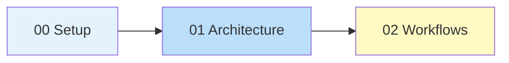

# Introduction to Fine-Tuning

> **Module 02** — Your gateway to LLM fine-tuning. Setup, architecture, workflows, and your first fine-tune.

This module takes you from zero to your first fine-tuned model. We cover environment setup, a transformer architecture refresher, workflow options, and a complete hands-on fine-tuning example.

---

## Table of Contents

| # | Lesson | Topic | Time |
|---|--------|-------|------|
| 00 | [Setting Up Your Environment](./00-setup.md) | Python env, PyTorch+CUDA, Hugging Face auth, essential libraries | 30 min |
| 01 | [Understanding LLM Architecture](./01-llm-architecture.md) | Transformer refresher, attention mechanisms, tokenization, model families | 45 min |
| 02 | [Fine-Tuning Workflows Overview](./03-workflows.md) | Full FT, LoRA, QLoRA, DPO, ORPO — when to use each | 30 min |

**Total**: ~1.5 hours

> **Hands-on**: For a complete end-to-end QLoRA fine-tuning example, see [Your First Fine-Tune](../06-parameter-efficiency/06-first-fine-tune.md) in Module 06.

---

## Prerequisites

| Requirement | Status |
|-------------|--------|
| Python 3.10+ | Required |
| Basic Python | Required |
| Command line basics | Required |
| ML experience | Not required |
| GPU access | Helpful (cloud options covered) |

> **Before this module**: Read [Module 00: Neural Networks](../00-neural-networks-basics/) and [Module 01: Foundations](../01-foundations/) for the big picture — when to fine-tune vs. prompt vs. RAG, and the core concepts behind LoRA/QLoRA.

---

## What You'll Build

By the end of this module:

1. **A working environment** — transformers 5.13+, peft 0.19+, trl 1.7+ installed and verified
2. **Architecture knowledge** — Understand what happens under the hood during fine-tuning
3. **Workflow awareness** — Know which method (LoRA, QLoRA, DPO, ORPO) fits your use case

> **Next hands-on**: A complete QLoRA fine-tuning example is in [Module 06: Your First Fine-Tune](../06-parameter-efficiency/06-first-fine-tune.md).

---

## Module Flow

---

## Key Concepts You'll Encounter

| Concept | Where to Learn More |
|---------|---------------------|
| **Transfer Learning** | [Module 01: Foundations](../01-foundations/#transfer-learning-fundamentals) |
| **LoRA / QLoRA** | [Module 01: Foundations](../01-foundations/#lora-low-rank-adaptation) + [Workflows](./03-workflows.md) |
| **DPO / ORPO** | [Module 01: Foundations](../01-foundations/#alignment-fine-tuning-dpo--orpo) |
| **Prompt vs RAG vs FT** | [Module 01: Foundations](../01-foundations/#the-paradigm-shift-prompting-vs-rag-vs-fine-tuning) |
| **Transformer Architecture** | [Module 00: Neural Networks](../00-neural-networks-basics/) (basics) → [Lesson 01](./01-llm-architecture.md) (deep-dive) |

---

## Common Pitfalls

| Pitfall | How to Avoid |
|---------|--------------|
| CUDA OOM errors | Use QLoRA, reduce batch size, enable gradient checkpointing |
| Wrong method choice | Read [Workflows](./03-workflows.md) before picking a method |
| Data formatting issues | Follow templates in [First Fine-Tune](./04-first-fine-tune.md) |
| Learning rate too high | Start with 2e-4 for LoRA, 1e-5 for full FT |
| Not validating | Always test on held-out examples |

---

## Next Module

Continue to [Module 03: Hardware Setup](../03-hardware-setup/) — GPU selection, cloud options, and cost optimization.
