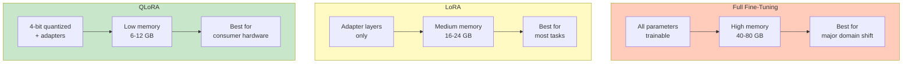
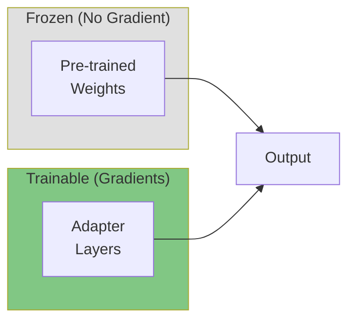
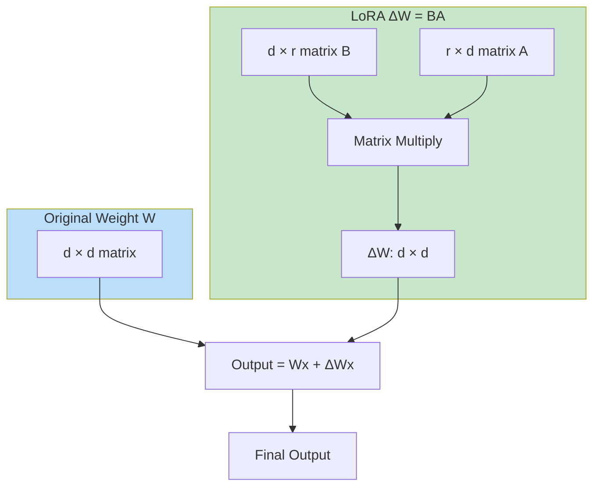
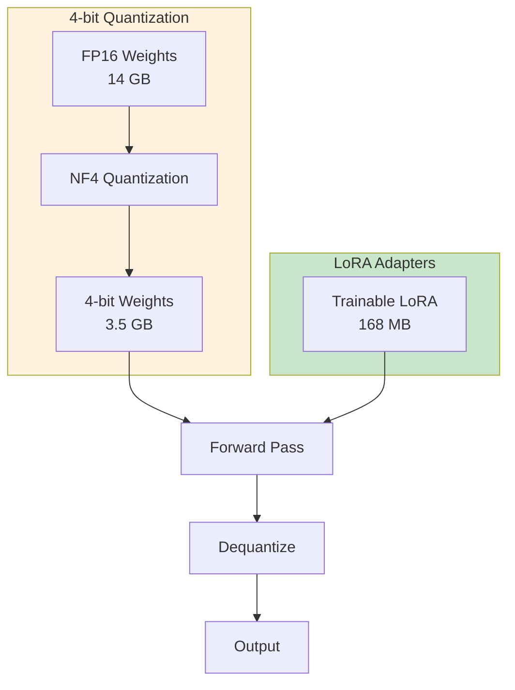
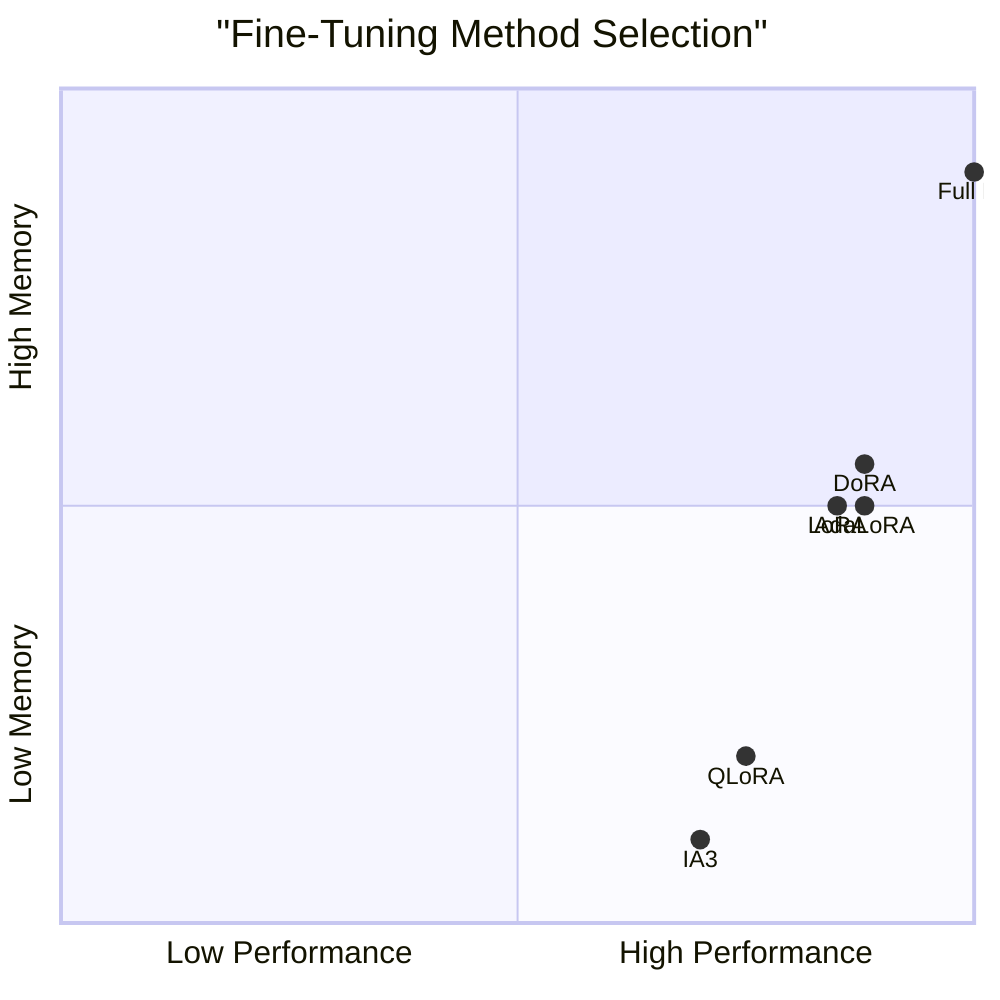
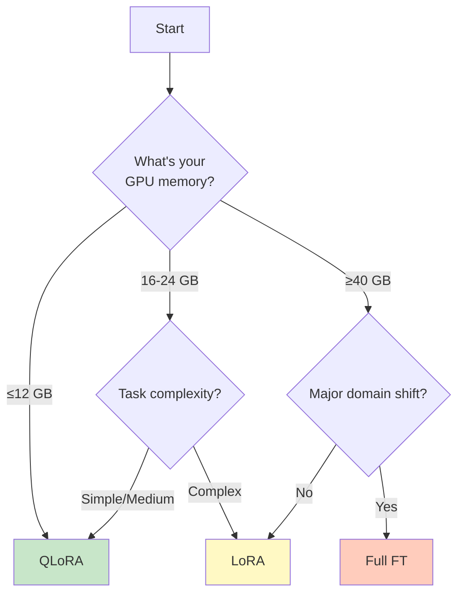

# Fine-Tuning Workflows Overview

> **Lesson 03** — Full fine-tuning, PEFT, LoRA vs. QLoRA, and method comparison.

This guide covers the three main fine-tuning workflows. Understanding the trade-offs helps you choose the right approach for your constraints.

---

## Table of Contents

1. [The Three Workflows](#the-three-workflows)
2. [Full Fine-Tuning](#full-fine-tuning)
3. [Parameter-Efficient Fine-Tuning (PEFT)](#parameter-efficient-fine-tuning-peft)
4. [LoRA: Low-Rank Adaptation](#lora-low-rank-adaptation)
5. [QLoRA: Quantized LoRA](#qlora-quantized-lora)
6. [Method Comparison](#method-comparison)
7. [Choosing the Right Workflow](#choosing-the-right-workflow)

---

## The Three Workflows



### Quick Comparison

| Method | Trainable Params | GPU Memory | Training Time | Best For |
|--------|------------------|------------|---------------|----------|
| **Full FT** | 100% (7B) | 40-80 GB | Fast | Research, major adaptation |
| **LoRA** | ~1% (80M) | 16-24 GB | Medium | Production, most tasks |
| **QLoRA** | ~1% (80M) | 6-12 GB | Slow+ | Consumer GPUs, prototyping |

---

## Full Fine-Tuning

### What It Is

Updating all parameters of the pre-trained model.

```python
from transformers import AutoModelForCausalLM, TrainingArguments
from transformers import Trainer

model = AutoModelForCausalLM.from_pretrained("meta-llama/Llama-3.2-3B-Instruct")

# All parameters require gradients
for param in model.parameters():
    param.requires_grad = True

training_args = TrainingArguments(
    output_dir="./llama32-finetuned",
    per_device_train_batch_size=4,
    gradient_accumulation_steps=4,
    fp16=True,  # Mixed precision
    bf16=True,  # Use bf16 on newer GPUs (Ampere+)
)

# Standard training loop
trainer = Trainer(
    model=model,
    args=training_args,
    train_dataset=dataset,
)
trainer.train()
```

### Memory Breakdown

| Component | Memory (7B model) |
|-----------|-------------------|
| Model weights (fp16) | 14 GB |
| Gradients (fp16) | 14 GB |
| Optimizer states (Adam) | 56 GB |
| Activations | 8 GB |
| **Total** | **~92 GB** |

**With optimizations:**
- Gradient checkpointing: -50% activation memory
- ZeRO-2 (DeepSpeed): -66% optimizer memory
- **Optimized total:** ~40-50 GB

### When to Use Full Fine-Tuning

| Scenario | Recommendation |
|----------|----------------|
| **Major domain shift** (general → medical) | ✓ Full FT |
| **Continued pre-training** | ✓ Full FT |
| **Research on model behavior** | ✓ Full FT |
| **Single GPU, <24 GB** | ✗ Use LoRA |
| **Production deployment** | ✗ LoRA often sufficient |

### Pros and Cons

| Pros | Cons |
|------|------|
| Maximum adaptation | Highest memory requirement |
| No architectural changes | Risk of catastrophic forgetting |
| Well-understood | Expensive (multi-GPU needed) |
| Best for major shifts | Full model storage per task |

---

## Parameter-Efficient Fine-Tuning (PEFT)

### What Is PEFT?

PEFT methods freeze the pre-trained model and add small trainable components.



### PEFT Methods Comparison

| Method | Trainable Params | Key Idea | When to Use |
|--------|------------------|----------|-------------|
| **LoRA** | 0.1-1% | Low-rank matrices in attention | Standard, most popular |
| **QLoRA** | ~0.1% | 4-bit quantized LoRA | Consumer GPUs, 70B models |
| **AdaLoRA** | 0.1-1% | Adaptive rank allocation | Better than fixed-rank LoRA |
| **IA3** | <0.01% | Scales existing weights | Minimal parameter change |
| **DoRA** | 0.1-1% | Magnitude-decomposed LoRA | More stable convergence |
| **LoKr** | <0.1% | Kronecker-factored LoRA | Very low parameter count |
| **Delora** (DeLoRAConfig) | 0.1-1% | Decoupled Low-rank Adaptation | Improved over standard LoRA |
| **Prefix Tuning** | 0.01% | Learnable prompt tokens | Non-parameter tuning |
| **Prompt Tuning** | 0.001% | Soft prompt embeddings | Minimal change, limited power |
| **Adapter Layers** | 1-5% | Small MLPs between layers | When LoRA underperforms |

**LoRA is the most widely used** — good balance of efficiency and performance.

---

## LoRA: Low-Rank Adaptation

### The Core Idea

Instead of updating weight matrix `W` directly, learn a low-rank decomposition:

```
W' = W + ΔW
ΔW = BA

Where:
- W is frozen (pre-trained weights)
- B ∈ ℝ^(d×r) and A ∈ ℝ^(r×d)
- r << d (rank is much smaller than dimension)
```



### Mathematical Details

For a 7B model with hidden size 4096 (note: projection matrices are rectangular, e.g., q_proj: 4096×4096, k_proj: 4096×1024):

| Parameter | Full FT | LoRA (r=8) |
|-----------|---------|------------|
| Weight matrix (q_proj example) | 4096 × 4096 = 16.7M | 4096 × 8 = 32K |
| Parameters per layer | 16.7M | 65K (B + A) |
| Reduction | 1× | 256× fewer |

**Key insight:** LoRA achieves similar performance with 1-2% of parameters.

### Implementation

```python
from peft import LoraConfig, get_peft_model, TaskType

# Configuration
lora_config = LoraConfig(
    r=8,                          # Rank (4-32 typical)
    lora_alpha=32,                # Scaling: alpha / r
    target_modules=[              # Which modules to adapt
        "q_proj", "k_proj", 
        "v_proj", "o_proj",       # Attention
        "gate_proj", "up_proj", 
        "down_proj"               # MLP (optional)
    ],
    lora_dropout=0.1,             # Dropout probability
    bias="none",                  # Don't train bias
    task_type=TaskType.CAUSAL_LM,
)

# Apply to model
model = AutoModelForCausalLM.from_pretrained("Qwen/Qwen3-8B")
model = get_peft_model(model, lora_config)

# Check trainable parameters
model.print_trainable_parameters()
# Output: trainable params: 83,886,080 || all params: 7,241,732,160 || trainable%: 1.1584
```

### Key Hyperparameters

| Parameter | Typical Values | Effect |
|-----------|----------------|--------|
| **r (rank)** | 4, 8, 16, 32 | Higher = more capacity |
| **lora_alpha** | 16, 32, 64 | Scaling factor |
| **lora_dropout** | 0.05-0.2 | Regularization |
| **target_modules** | qv, qkv, all linear | More modules = more adaptation |

### Memory Usage (7B Model)

| Component | Memory |
|-----------|--------|
| Base model (frozen, fp16) | 14 GB |
| LoRA adapters | 168 MB |
| Gradients (LoRA only) | 168 MB |
| Optimizer states | 672 MB |
| Activations | 4 GB |
| **Total** | **~19 GB** |

### When to Use LoRA

| Scenario | Recommendation |
|----------|----------------|
| **Domain adaptation** | ✓ LoRA |
| **Style transfer** | ✓ LoRA |
| **Instruction tuning** | ✓ LoRA |
| **Multiple tasks, one base** | ✓ LoRA (swap adapters) |
| **Major domain shift** | ⚠️ Consider full FT |
| **Continued pre-training** | ⚠️ Full FT may be better |

### Pros and Cons

| Pros | Cons |
|------|------|
| 90%+ of full FT performance | Slight performance gap |
| Fits on single GPU | Not ideal for major shifts |
| Fast training | Adapter inference overhead |
| Swap adapters for different tasks | |
| No catastrophic forgetting | |

---

## QLoRA: Quantized LoRA

### What Is QLoRA?

QLoRA combines LoRA with 4-bit quantization for extreme memory efficiency.

**Paper:** [QLoRA: Efficient Finetuning of Quantized LLMs](https://arxiv.org/abs/2305.14314) — Dettmers et al., 2023



### NF4 (Normal Float 4-bit) Data Type

QLoRA introduces NF4, optimized for normally distributed weights:

| Data Type | Bits | Range | Best For |
|-----------|------|-------|----------|
| **FP32** | 32 | ±3.4e38 | General purpose |
| **FP16** | 16 | ±65504 | Training |
| **INT8** | 8 | -128 to 127 | Quantization |
| **NF4** | 4 | Optimized distribution | LLM weights |

**Key insight:** LLM weights follow normal distribution. NF4 allocates more precision where weights are dense.

### Implementation

```python
from transformers import BitsAndBytesConfig
from peft import LoraConfig, get_peft_model

# 4-bit quantization config
bnb_config = BitsAndBytesConfig(
    load_in_4bit=True,
    bnb_4bit_quant_type="nf4",           # Normal Float 4-bit
    bnb_4bit_compute_dtype=torch.bfloat16,
    bnb_4bit_use_double_quant=True,      # Double quantization
)

# Load model in 4-bit
model = AutoModelForCausalLM.from_pretrained(
    "Qwen/Qwen3-8B",
    quantization_config=bnb_config,
    device_map="auto",
)

# LoRA config (same as before)
lora_config = LoraConfig(
    r=8,
    lora_alpha=32,
    target_modules=["q_proj", "v_proj"],
    lora_dropout=0.1,
)

# Apply LoRA
model = get_peft_model(model, lora_config)
```

### Memory Usage (7B Model)

| Component | Memory |
|-----------|--------|
| Base model (4-bit) | 3.5 GB |
| LoRA adapters | 168 MB |
| Gradients | 168 MB |
| Optimizer states | 672 MB |
| Activations | 2 GB |
| **Total** | **~6.5 GB** |

**Fits on:** RTX 3060 (12GB), RTX 4060 Ti (16GB), any cloud GPU. Larger sequences or batch sizes require more memory. Larger sequences or batch sizes require more memory.

### Performance Comparison

| Method | MMLU Score | Training Time | Memory |
|--------|------------|---------------|--------|
| **Full FT** | 60.2% | 1× | 80 GB |
| **LoRA** | 59.8% | 1.2× | 20 GB |
| **QLoRA** | 59.5% | 1.5× | 6.5 GB |

**Conclusion:** QLoRA achieves 99% of LoRA performance with 1/3 the memory.

### When to Use QLoRA

| Scenario | Recommendation |
|----------|----------------|
| **Consumer GPU (≤12 GB)** | ✓ QLoRA |
| **Prototyping** | ✓ QLoRA |
| **Large models (70B)** | ✓ QLoRA only option |
| **Production training** | ⚠️ LoRA if hardware allows |
| **Maximum performance** | ⚠️ Full FT or LoRA |

### Pros and Cons

| Pros | Cons |
|------|------|
| Fits on consumer GPUs | Slower training |
| Enables 70B fine-tuning | Quantization overhead |
| Near-LoRA performance | Slight accuracy drop |
| Cost-effective | |

### AdaLoRA: Adaptive Rank Allocation

AdaLoRA dynamically adjusts the rank of LoRA matrices during training, allocating more capacity where needed.

```python
from peft import AdaLoraConfig

config = AdaLoraConfig(
    init_r=8,           # Initial rank
    target_r=16,        # Target max rank
    tinit=100,          # Warmup steps
    tfinal=1000,        # Final step
    delta_t=10,         # Rank update frequency
    lora_alpha=32,
    target_modules=["q_proj", "v_proj"],
    lora_dropout=0.1,
)
```

**Advantages over LoRA:**
- Better parameter efficiency
- Automatically focuses on important weights
- Typically 1-3% better than fixed-rank LoRA

### DoRA: Magnitude-Decomposed LoRA

DoRA decomposes weight updates into magnitude and direction, improving stability.

```python
from peft import LoraConfig

# Use DoRA by setting init_lora_weights="dora" (requires PEFT ≥ 0.14.0)
config = LoraConfig(
    init_lora_weights="dora",  # Enable DoRA
    r=8,
    lora_alpha=32,
    target_modules=["q_proj", "v_proj"],
)
```

**Advantages over LoRA:**
- More stable convergence
- Better for low-learning rate regimes
- Equivalent to LoRA + adaptive initialization

### IA3: Infinitely Small Adapters

IA3 scales existing weights with learned vectors instead of adding matrices.

```python
from peft import IA3Config

config = IA3Config(
    target_modules=["key", "value"],
    feedforward_modules=["mlp"],
)
```

**Advantages:**
- ~100x fewer parameters than LoRA
- Zero inference overhead (scales existing weights)
- Good for very low-resource settings

---

## Method Comparison

### GraLoRA: Gradient-Based LoRA

GraLoRA uses gradient information to guide rank allocation, achieving high-rank fine-tuning parity with fewer parameters.

### TinyLoRA: Ultra-Minimal LoRA

TinyLoRA scales low-rank adapters down to just 13 parameters (26 bytes in bf16), showing that language models can learn to reason with virtually no trainable parameters when trained with reinforcement learning.

### PVeRA: Parameter-Efficient Variance Adaptation

PVeRA adapts parameters based on explained variance, providing an efficient alternative to standard LoRA with minimal trainable parameters.

### Comprehensive Comparison

| Aspect | Full FT | LoRA | QLoRA | AdaLoRA | DoRA | GraLoRA | TinyLoRA |
|--------|---------|------|-------|---------|------|---------|----------|
| **Trainable params** | 100% | 1-2% | 1-2% | 0.1-2% | 1-2% | 0.1-2% | ~13 params |
| **GPU Memory (7B)** | 40-80 GB | 16-24 GB | 6-12 GB | 16-24 GB | 16-24 GB | 16-24 GB | <1 GB |
| **GPU memory (70B)** | 800+ GB | 120+ GB | 40-80 GB | 120+ GB | 120+ GB | 120+ GB | <10 GB |
| **Training speed** | Fastest | Fast | Slower | Fast | Fast | Fast | Blazing fast |
| **Performance** | 100% | 95-98% | 92-96% | 96-98% | 96-99% | 97-99% | RL-effective |
| **Storage per task** | 14 GB | 200 MB | 200 MB | 200 MB | 200 MB | 200 MB | Bytes |
| **Hardware cost** | $100s/run | $10-30/run | $5-15/run | $10-30/run | $10-30/run | $10-30/run | <$1/run |
| **Best for** | Research | Production | Consumer GPUs | Best quality | Stable convergence | High-rank FT parity | RL training |

### Visual Comparison



### Cost Analysis (7B Model, 1 Hour Training)

| Method | Cloud GPU | Cost/Hour | Total Cost |
|--------|-----------|-----------|------------|
| **Full FT** | 8× A100 (80GB) | $32/hr | $32-100 |
| **LoRA** | 1× A10G (24GB) | $1.50/hr | $5-20 |
| **QLoRA** | 1× L4 (24GB) | $0.50/hr | $2-10 |
| **GraLoRA** | 1× A10G (24GB) | $1.50/hr | $5-20 |
| **TinyLoRA** | 1× RTX 4060 (8GB) | $0.30/hr | <$1 |
| **DoRA** | 1× A10G (24GB) | $1.50/hr | $5-20 |
| **PVeRA** | 1× RTX 4060 (8GB) | $0.30/hr | $1-5 |

---

## Choosing the Right Workflow

### Decision Tree



### Quick Recommendations

| Your Situation | Recommended Method |
|----------------|-------------------|
| **RTX 3060/4060 (12GB)** | QLoRA |
| **RTX 3090/4090 (24GB)** | LoRA |
| **Cloud budget $10-50** | QLoRA or LoRA |
| **Cloud budget $100+** | Full FT or LoRA |
| **Medical/legal domain** | Full FT or LoRA (all modules) |
| **Style/format training** | LoRA (qkv only) |
| **70B model** | QLoRA (only option) |
| **Multiple tasks** | LoRA (swap adapters) |

### Hybrid Strategies

1. **Prototype with QLoRA, deploy with LoRA**
   - Develop on consumer GPU
   - Scale up for production

2. **LoRA with selective modules**
   - Start with q_proj, v_proj (minimal)
   - Add more modules if needed

3. **Progressive fine-tuning**
   - QLoRA for initial adaptation
   - LoRA for final refinement

---

## Next Steps

1. **Read [Your First Fine-Tune](./04-first-fine-tune.md)** — Hands-on example
2. **Choose your workflow** based on hardware and task
3. **Set up your environment** if not already done

---

## References

- [LoRA: Low-Rank Adaptation](https://arxiv.org/abs/2106.09685) — Hu et al., 2021
- [QLoRA: Efficient Finetuning](https://arxiv.org/abs/2305.14314) — Dettmers et al., 2023
- [AdaLoRA: Adaptive Budget Allocation](https://arxiv.org/abs/2303.10512) — Zhang et al., 2023
- [DoRA: Weight-Decomposed Low-Rank Adaptation](https://arxiv.org/abs/2402.09353) — Liu et al., 2024
- [IA3: Infinitely Adaptive Attention for Efficient Fine-Tuning](https://arxiv.org/abs/2108.10187) — Gu et al., 2021
- [PEFT Library Documentation](https://huggingface.co/docs/peft)
- [BitsAndBytes Quantization](https://github.com/TimDettmers/bitsandbytes)
- [Liger Kernel](https://github.com/linkedin/Liger-Kernel)
- [Unsloth](https://github.com/unslothai/unsloth)
