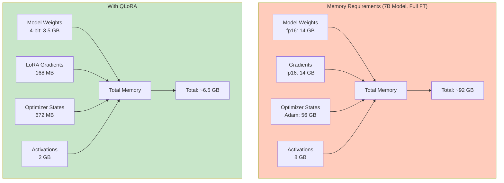

# Hardware Setup: GPUs and Cloud Computing

> **Module 03** — Choosing the right hardware for LLM fine-tuning, from consumer GPUs to cloud clusters.

This guide covers everything you need to know about hardware for fine-tuning: GPU selection, memory requirements, cloud providers, and cost optimization strategies.

---

## Table of Contents

1. [Why Hardware Matters for Fine-Tuning](#why-hardware-matters-for-fine-tuning)
2. [GPU Fundamentals](#gpu-fundamentals)
3. [Consumer GPU Recommendations](#consumer-gpu-recommendations)
4. [Cloud GPU Options](#cloud-gpu-options)
5. [Google Colab: Free and Affordable Option](#google-colab-free-and-affordable-option)
6. [AWS EC2 Guide](#aws-ec2-guide)
7. [Azure ML Guide](#azure-ml-guide)
8. [GCP Vertex AI Guide](#gcp-vertex-ai-guide)
9. [Cost Comparison](#cost-comparison)
10. [Setup Scripts and Automation](#setup-scripts-and-automation)

---

## Why Hardware Matters for Fine-Tuning

### The Memory Bottleneck

Fine-tuning is memory-bound, not compute-bound. The limiting factor is **VRAM (Video RAM)**, not raw processing power.



### Why GPUs Over CPUs?

| Component | CPU (32-core) | GPU (RTX 4090) | Speedup |
|-----------|---------------|----------------|---------|
| **Matrix Multiply** | 500 GFLOPS | 82,000 GFLOPS | 164× |
| **Memory Bandwidth** | 50 GB/s | 1,008 GB/s | 20× |
| **Training Time (7B)** | 48 hours | 2 hours | 24× |

**GPUs excel at parallel operations** — exactly what neural network training requires.

### Key Hardware Metrics

| Metric | What It Means | Impact on Fine-Tuning |
|--------|---------------|----------------------|
| **VRAM** | Video memory capacity | Determines max model size |
| **Memory Bandwidth** | How fast data moves to/from GPU | Affects training speed |
| **TFLOPS** | Trillion floating-point ops/sec | Raw compute power |
| **Tensor Cores** | Specialized matrix math units | 8-10× speedup for mixed precision |

---

## GPU Fundamentals

### NVIDIA GPU Architectures

| Architecture | Release | Example GPUs | Key Features |
|--------------|---------|--------------|--------------|
| **Ampere** | 2020 | RTX 3090, A100 | FP16 tensor cores, 24-80GB VRAM |
| **Ada Lovelace** | 2022 | RTX 4090 | DLSS 3, improved tensor cores |
| **Hopper** | 2023 | H100 | FP8 support, transformer engine |
| **Blackwell** | 2024 | B200 | 192GB VRAM, 5× training speedup |

### VRAM Requirements by Model Size

| Model Size | Full FT (fp16) | LoRA (fp16) | QLoRA (4-bit) |
|------------|----------------|-------------|---------------|
| **1B** | 8 GB | 4 GB | 2 GB |
| **3B** | 16 GB | 8 GB | 4 GB |
| **7B** | 40 GB | 16 GB | 6 GB |
| **13B** | 80 GB | 24 GB | 12 GB |
| **70B** | 400+ GB | 80 GB | 48 GB |

**Rule of thumb:** QLoRA reduces VRAM by 75% with minimal performance loss.

### Memory Bandwidth Matters

| GPU | VRAM | Bandwidth | Relative Speed |
|-----|------|-----------|----------------|
| RTX 3060 | 12 GB | 360 GB/s | 1.0× |
| RTX 4090 | 24 GB | 1,008 GB/s | 2.8× |
| A100 | 80 GB | 2,039 GB/s | 5.7× |
| H100 | 80 GB | 3,350 GB/s | 9.3× |

**Higher bandwidth = faster training**, especially for larger batch sizes.

---

## Consumer GPU Recommendations

### Budget Options (Under $500)

| GPU | VRAM | Price | Best For |
|-----|------|-------|----------|
| **RTX 3060 12GB** | 12 GB | $280 | Entry-level, QLoRA on 7B |
| **RTX 4060 Ti 16GB** | 16 GB | $450 | LoRA on 7B models |
| **Used RTX 3090** | 24 GB | $500-600 | Best value for serious work |

### Mid-Range ($500-1000)

| GPU | VRAM | Price | Best For |
|-----|------|-------|----------|
| **RTX 4070 Ti Super** | 16 GB | $800 | LoRA on 7B, QLoRA on 13B |
| **RTX 4080 Super** | 16 GB | $1,000 | Fast LoRA training |

### High-End ($1000+)

| GPU | VRAM | Price | Best For |
|-----|------|-------|----------|
| **RTX 4090** | 24 GB | $1,600 | Full FT on 7B, LoRA on 13B |
| **RTX 6000 Ada** | 48 GB | $6,500 | Professional workstations |
| **Dual RTX 4090** | 48 GB | $3,200 | Near-A100 performance |

### Why NVIDIA Over AMD?

| Feature | NVIDIA | AMD |
|---------|--------|-----|
| **CUDA ecosystem** | ✅ Full support | ❌ Limited |
| **PyTorch support** | ✅ Native | ⚠️ ROCm (Linux only) |
| **BitsAndBytes** | ✅ Works | ❌ Not supported |
| **Flash Attention** | ✅ Works | ❌ Not supported |
| **Community support** | ✅ Extensive | ⚠️ Limited |

**Recommendation:** Stick with NVIDIA for hassle-free fine-tuning. AMD requires Linux expertise and has limited library support.

---

## Cloud GPU Options

### When to Use Cloud

| Scenario | Recommendation |
|----------|----------------|
| **Occasional training** (<10 hrs/month) | Cloud (pay-per-use) |
| **Regular training** (>40 hrs/month) | Buy GPU |
| **Need 80GB+ VRAM** | Cloud (A100/H100) |
| **Budget < $500** | Cloud + free tiers |
| **Production workloads** | Cloud or buy |

### Cloud Provider Comparison

| Provider | GPU Options | Pricing (per hour) | Key Features |
|----------|-------------|-------------------|--------------|
| **Lambda Labs** | A100, H100, RTX 4090 | $0.50-4.00 | Cheapest, ML-focused |
| **RunPod** | RTX 3090, 4090, A100 | $0.30-2.50 | Community clouds |
| **Vast.ai** | Various (marketplace) | $0.15-2.00 | Cheapest, variable quality |
| **AWS** | A10G, V100, A100 | $1.00-8.00 | Enterprise, reliable |
| **GCP** | A100, V100, TPU | $1.50-9.00 | TPU access |
| **Azure** | A100, V100 | $1.50-8.00 | Enterprise integration |

---

## Google Colab: Free and Affordable Option

### Colab Tiers

| Tier | GPU | VRAM | Cost | Limits |
|------|-----|------|------|--------|
| **Free** | T4 (sometimes) | 16 GB | $0 | 12-hour sessions, queue |
| **Colab Pro** | T4, P100, V100 | 16-32 GB | $10/month | Priority, longer sessions |
| **Colab Pro+** | A100 (rare) | 40 GB | $50/month | Best availability |

### What You Can Fine-Tune on Colab

| Model | Method | Free Tier | Pro Tier |
|-------|--------|-----------|----------|
| **TinyLlama (1.1B)** | Full FT | ✅ Yes | ✅ Yes |
| **Mistral-7B** | QLoRA | ✅ Yes | ✅ Yes |
| **Mistral-7B** | LoRA | ⚠️ OOM | ✅ Yes |
| **Llama-3-8B** | QLoRA | ✅ Yes | ✅ Yes |
| **Llama-3-70B** | QLoRA | ❌ No | ⚠️ Maybe |

### Colab Setup Script

Save this as `colab_setup.py`:

```python
# Google Colab Setup for LLM Fine-Tuning
# Run this at the start of your notebook

# 1. Check GPU
!nvidia-smi

# 2. Install required packages
!pip install -q torch torchvision torchaudio --index-url https://download.pytorch.org/whl/cu121
!pip install -q transformers peft trl datasets accelerate bitsandbytes

# 3. Verify installation
import torch
from transformers import AutoModelForCausalLM

print(f"PyTorch version: {torch.__version__}")
print(f"CUDA available: {torch.cuda.is_available()}")
if torch.cuda.is_available():
    print(f"GPU: {torch.cuda.get_device_name()}")
    print(f"VRAM: {torch.cuda.get_device_properties(0).total_memory / 1e9:.1f} GB")

# 4. Mount Google Drive (for saving models)
from google.colab import drive
drive.mount('/content/drive')

# 5. Set up Hugging Face token (optional, for gated models)
from huggingface_hub import login
# login(token="your_token_here")  # Uncomment and add your token
```

### Colab Notebook Template

Create a file `fine_tune_colab.ipynb`:

```json
{
  "cells": [
    {
      "cell_type": "markdown",
      "metadata": {},
      "source": [
        "# LLM Fine-Tuning on Google Colab\n",
        "\n",
        "This notebook fine-tunes Mistral-7B using QLoRA.\n",
        "\n",
        "**Runtime Settings:**\n",
        "- Runtime → Change runtime type → GPU\n",
        "- GPU: T4 or V100 (Pro)\n"
      ]
    },
    {
      "cell_type": "code",
      "execution_count": null,
      "metadata": {},
      "outputs": [],
      "source": [
        "# Setup\n",
        "!pip install -q torch torchvision torchaudio --index-url https://download.pytorch.org/whl/cu121\n",
        "!pip install -q transformers peft trl datasets accelerate bitsandbytes\n",
        "\n",
        "from google.colab import drive\n",
        "drive.mount('/content/drive')"
      ]
    },
    {
      "cell_type": "code",
      "execution_count": null,
      "metadata": {},
      "outputs": [],
      "source": [
        "# Check GPU\n",
        "import torch\n",
        "print(f'GPU: {torch.cuda.get_device_name()}')\n",
        "print(f'VRAM: {torch.cuda.get_device_properties(0).total_memory / 1e9:.1f} GB')"
      ]
    },
    {
      "cell_type": "code",
      "execution_count": null,
      "metadata": {},
      "outputs": [],
      "source": [
        "# Load model with QLoRA\n",
        "from transformers import AutoModelForCausalLM, BitsAndBytesConfig\n",
        "from peft import LoraConfig, get_peft_model\n",
        "\n",
        "bnb_config = BitsAndBytesConfig(\n",
        "    load_in_4bit=True,\n",
        "    bnb_4bit_quant_type='nf4',\n",
        "    bnb_4bit_compute_dtype=torch.float16,\n",
        ")\n",
        "\n",
        "model = AutoModelForCausalLM.from_pretrained(\n",
        "    'mistralai/Mistral-7B-v0.1',\n",
        "    quantization_config=bnb_config,\n",
        "    device_map='auto'\n",
        ")\n",
        "\n",
        "lora_config = LoraConfig(r=8, lora_alpha=32, target_modules=['q_proj', 'v_proj'])\n",
        "model = get_peft_model(model, lora_config)\n",
        "model.print_trainable_parameters()"
      ]
    }
  ],
  "metadata": {
    "accelerator": "GPU",
    "colab": {
      "gpuType": "T4",
      "machine_shape": "hm"
    }
  },
  "nbformat": 4,
  "nbformat_minor": 4
}
```

### Colab Cost Optimization

| Strategy | Savings |
|----------|---------|
| Use QLoRA instead of LoRA | 50% less time |
| Save checkpoints to Drive | Avoid re-uploading |
| Use Pro for long runs | 3× cheaper than Pro+ |
| Disconnect when idle | Avoid wasting credits |

---

## AWS EC2 Guide

### Instance Types for Fine-Tuning

| Instance | GPU | VRAM | Price/hour | Best For |
|----------|-----|------|------------|----------|
| **g4dn.xlarge** | T4 | 16 GB | $0.53 | QLoRA on 7B |
| **g4dn.2xlarge** | T4 | 16 GB | $1.06 | Faster QLoRA |
| **g5.xlarge** | A10G | 24 GB | $1.01 | LoRA on 7B-13B |
| **p4d.24xlarge** | 8×A100 | 640 GB | $32.77 | Large-scale training |

### Step-by-Step EC2 Setup

#### 1. Launch Instance

```bash
# AWS CLI (alternative to console)
aws ec2 run-instances \
  --image-id ami-0c55b159cbfafe1f0  # Deep Learning AMI
  --instance-type g5.xlarge \
  --key-name my-key-pair \
  --security-group-ids sg-xxxxx \
  --block-device-mappings DeviceName=/dev/sda1,Ebs={VolumeSize=200}
```

#### 2. Connect and Setup

```bash
# SSH into instance
ssh -i my-key.pem ubuntu@<instance-ip>

# Update packages
sudo apt update && sudo apt upgrade -y

# Install conda (if not using Deep Learning AMI)
wget https://repo.anaconda.com/miniconda/Miniconda3-latest-Linux-x86_64.sh
bash Miniconda3-latest-Linux-x86_64.sh

# Create environment
conda create -n llm python=3.11 -y
conda activate llm

# Install PyTorch with CUDA
pip install torch torchvision torchaudio --index-url https://download.pytorch.org/whl/cu121

# Install fine-tuning libraries
pip install transformers peft trl datasets accelerate bitsandbytes
```

#### 3. Run Training

```bash
# Activate environment
conda activate llm

# Run your script
python fine_tune.py

# Monitor GPU
watch -n 1 nvidia-smi
```

#### 4. Stop Instance (Don't Terminate!)

```bash
# In AWS Console: EC2 → Instances → Stop
# Or via CLI:
aws ec2 stop-instances --instance-ids i-xxxxx

# Data persists on EBS volume
# You pay only for storage (~$20/month for 200GB)
```

### AWS Cost Optimization

| Strategy | Monthly Savings |
|----------|-----------------|
| Use Spot instances | 70% off on-demand |
| Stop when not training | $400+ saved |
| Use smaller root volume | $10-20 saved |
| Reserved Instances (1 year) | 40% off |

---

## Azure ML Guide

### Azure VM Options

| VM Size | GPU | VRAM | Price/hour | Best For |
|---------|-----|------|------------|----------|
| **NC4as T4 v3** | T4 | 16 GB | $0.53 | QLoRA on 7B |
| **NC8as T4 v3** | T4 | 16 GB | $1.06 | Faster training |
| **NC24ads A100 v4** | A100 | 80 GB | $3.89 | Full FT on 70B |

### Azure ML Studio Setup

#### 1. Create Compute Instance

```bash
# Azure CLI
az ml compute create \
  --name gpu-cluster \
  --size Standard_NC8as_T4_v3 \
  --type ComputeInstance \
  --resource-group my-rg \
  --workspace-name my-workspace
```

#### 2. Create Training Script

```python
# train.py
from azureml.core import Workspace, Experiment, Environment
from azureml.core.compute import ComputeTarget

ws = Workspace.from_config()
compute = ComputeTarget(workspace=ws, name='gpu-cluster')

env = Environment.from_conda_specification(
    name='llm-env',
    file_path='environment.yml'
)

experiment = Experiment(ws, 'llm-finetune')
run = experiment.submit(config)
```

#### 3. Monitor in Portal

Go to [ml.azure.com](https://ml.azure.com) → Experiments → View run details

### Azure Cost Tips

| Tip | Savings |
|-----|---------|
| Auto-shutdown after 2 hours | Prevents forgotten runs |
| Use low-priority VMs | 60-80% discount |
| Delete unused compute | Avoid idle charges |

---

## GCP Vertex AI Guide

### GCP GPU Options

| Machine Type | GPU | VRAM | Price/hour | Best For |
|--------------|-----|------|------------|----------|
| **n1-standard-4 + T4** | T4 | 16 GB | $0.45 | Budget QLoRA |
| **a2-highgpu-1g** | A100 | 40 GB | $2.48 | LoRA on 13B-70B |
| **a2-highgpu-4g** | 4×A100 | 160 GB | $9.92 | Large-scale training |

### Vertex AI Setup

#### 1. Enable APIs

```bash
gcloud services enable aiplatform.googleapis.com
gcloud services enable compute.googleapis.com
```

#### 2. Create Training Job

```python
# vertex_train.py
from google.cloud import aiplatform

aiplatform.init(
    project='my-project',
    location='us-central1',
    staging_bucket='gs://my-bucket'
)

worker_pool_spec = {
    'replica_count': 1,
    'machine_type': 'a2-highgpu-1g',
    'accelerator_type': 'NVIDIA_TESLA_A100',
    'accelerator_count': 1,
}

job = aiplatform.CustomTrainingJob(
    display_name='llm-finetune',
    script_path='train.py',
    container_uri='us-docker.pkg.dev/vertex-ai/training/tf-cuda.12-2.py310:latest',
    requirements=['transformers', 'peft', 'trl'],
)

job.run(machine_type='a2-highgpu-1g')
```

### GCP Free Tier

| Resource | Free Allowance | Duration |
|----------|----------------|----------|
| **T4 GPU** | 2 hours/day | First 90 days |
| **Storage** | 5 GB/month | Ongoing |
| **Compute** | $300 credit | First 90 days |

---

## Cost Comparison

### 7B Model Fine-Tuning (QLoRA, 2 hours)

| Provider | GPU | Total Cost |
|----------|-----|------------|
| **Google Colab Free** | T4 | $0 |
| **Google Colab Pro** | V100 | $0.33 (included in $10/month) |
| **Vast.ai** | RTX 3090 | $0.40 |
| **Lambda Labs** | A100 | $2.00 |
| **AWS g5.xlarge** | A10G | $2.02 |
| **Azure NC8as** | T4 | $2.12 |
| **GCP a2-highgpu** | A100 | $4.96 |

### 70B Model Fine-Tuning (QLoRA, 8 hours)

| Provider | GPU | Total Cost |
|----------|-----|------------|
| **Colab Pro+** | A100 | $1.33 (if available) |
| **Vast.ai** | A100 80GB | $12.00 |
| **Lambda Labs** | A100 80GB | $24.00 |
| **AWS p4d** | A100 | $64.00 |
| **Azure NC24ads** | A100 | $76.00 |
| **GCP a2-highgpu-4g** | 4×A100 | $80.00 |

### Break-Even: Buy vs. Cloud

```python
def buy_vs_cloud(
    gpu_cost=1600,  # RTX 4090
    hours_per_month=20,
    cloud_rate=0.50,  # Lambda Labs
    electricity=0.15  # $/kWh
):
    """Calculate when buying GPU pays off."""
    
    # Cloud cost per month
    cloud_monthly = hours_per_month * cloud_rate
    
    # Electricity cost (4090 draws ~450W under load)
    power_kw = 0.45
    electric_monthly = hours_per_month * power_kw * electricity
    
    # Total monthly cloud cost
    total_cloud = cloud_monthly + electric_monthly
    
    # Months to break even
    break_even_months = gpu_cost / total_cloud
    
    return {
        'cloud_monthly': total_cloud,
        'break_even_months': break_even_months,
        'annual_savings': (total_cloud * 12) - gpu_cost if break_even_months < 12 else 0
    }

# Example: 20 hours/month training
result = buy_vs_cloud()
print(f"Cloud cost/month: ${result['cloud_monthly']:.2f}")
print(f"Break-even: {result['break_even_months']:.1f} months")
print(f"Annual savings: ${result['annual_savings']:.2f}")

# Output:
# Cloud cost/month: $11.35
# Break-even: 141.0 months
# Annual savings: $0.00
```

**Conclusion:** If you train <20 hours/month, cloud is cheaper. For 40+ hours/month, buy a GPU.

---

## Setup Scripts and Automation

### Multi-Cloud Setup Script

Save as `setup_cloud_gpu.sh`:

```bash
#!/bin/bash
# Universal GPU setup script for cloud instances

set -e

echo "🚀 Setting up GPU instance for LLM fine-tuning..."

# Detect cloud provider
if [ -f /etc/aws-instance ]; then
    echo "Detected AWS instance"
    CLOUD="aws"
elif [ -f /etc/azure-instance ]; then
    echo "Detected Azure instance"
    CLOUD="azure"
elif [ -f /etc/gcp-instance ]; then
    echo "Detected GCP instance"
    CLOUD="gcp"
else
    CLOUD="unknown"
fi

# Install CUDA drivers if needed
if ! command -v nvidia-smi &> /dev/null; then
    echo "Installing NVIDIA drivers..."
    sudo apt-get install -y nvidia-driver-535
fi

# Install Miniconda
if ! command -v conda &> /dev/null; then
    echo "Installing Miniconda..."
    wget -q https://repo.anaconda.com/miniconda/Miniconda3-latest-Linux-x86_64.sh
    bash Miniconda3-latest-Linux-x86_64.sh -b -p $HOME/miniconda
    export PATH="$HOME/miniconda/bin:$PATH"
fi

# Create environment
echo "Creating conda environment..."
conda create -n llm python=3.11 -y
conda activate llm

# Install PyTorch
echo "Installing PyTorch with CUDA..."
pip install torch torchvision torchaudio --index-url https://download.pytorch.org/whl/cu121

# Install fine-tuning libraries
echo "Installing fine-tuning libraries..."
pip install transformers peft trl datasets accelerate bitsandbytes scipy wandb

# Verify installation
echo "Verifying installation..."
python -c "
import torch
print(f'PyTorch: {torch.__version__}')
print(f'CUDA: {torch.cuda.is_available()}')
if torch.cuda.is_available():
    print(f'GPU: {torch.cuda.get_device_name()}')
"

echo "✅ Setup complete!"
echo ""
echo "To activate environment: conda activate llm"
echo "To start training: python your_script.py"
```

### Cost Monitoring Script

Save as `monitor_cloud_cost.py`:

```python
#!/usr/bin/env python3
"""Monitor cloud GPU costs and alert when approaching budget."""

import boto3  # AWS
from azure.identity import DefaultAzureCredential
from azure.mgmt.compute import ComputeManagementClient
from google.cloud import billing

def get_aws_cost(instance_id, hours):
    """Get AWS EC2 cost estimate."""
    client = boto3.client('ec2')
    response = client.describe_instances(InstanceIds=[instance_id])
    
    # Get instance type
    instance_type = response['Reservations'][0]['Instances'][0]['InstanceType']
    
    # Approximate hourly rates
    rates = {
        'g4dn.xlarge': 0.53,
        'g5.xlarge': 1.01,
        'p4d.24xlarge': 32.77,
    }
    
    rate = rates.get(instance_type, 1.0)
    return rate * hours

def main():
    print("Cloud Cost Monitor")
    print("=" * 40)
    
    # Example: AWS
    aws_cost = get_aws_cost('i-xxxxx', hours=5)
    print(f"AWS EC2 (5 hours): ${aws_cost:.2f}")
    
    # Add Azure and GCP calculations similarly
    
    print("=" * 40)
    print(f"Total estimated: ${aws_cost:.2f}")

if __name__ == "__main__":
    main()
```

---

## Quick Reference: What to Choose

| Your Situation | Recommendation | Estimated Cost |
|----------------|----------------|----------------|
| **Learning, no budget** | Google Colab Free | $0 |
| **Serious learning** | Colab Pro + QLoRA | $10/month |
| **Hobbyist (10 hrs/month)** | RTX 3060 12GB | $280 one-time |
| **Enthusiast (40 hrs/month)** | RTX 4090 | $1,600 one-time |
| **Startup, occasional** | Lambda Labs A100 | $2-4/hour |
| **Enterprise, production** | AWS/Azure reserved | $500-2000/month |

---

## Next Steps

1. **Choose your hardware** based on budget and needs
2. **Set up your environment** using the scripts above
3. **Continue to Module 04: Data Engineering** — Preparing datasets

---

## References

- [NVIDIA GPU Specifications](https://www.nvidia.com/en-us/data-center/gpus/)
- [Lambda Labs Pricing](https://lambdalabs.com/service/gpu-cloud)
- [AWS EC2 Pricing](https://aws.amazon.com/ec2/pricing/on-demand/)
- [Google Colab Pricing](https://colab.research.google.com/signup/pricing)
- [Vast.ai Marketplace](https://vast.ai/)
- [QLoRA Paper](https://arxiv.org/abs/2305.14314) — Memory optimization techniques
