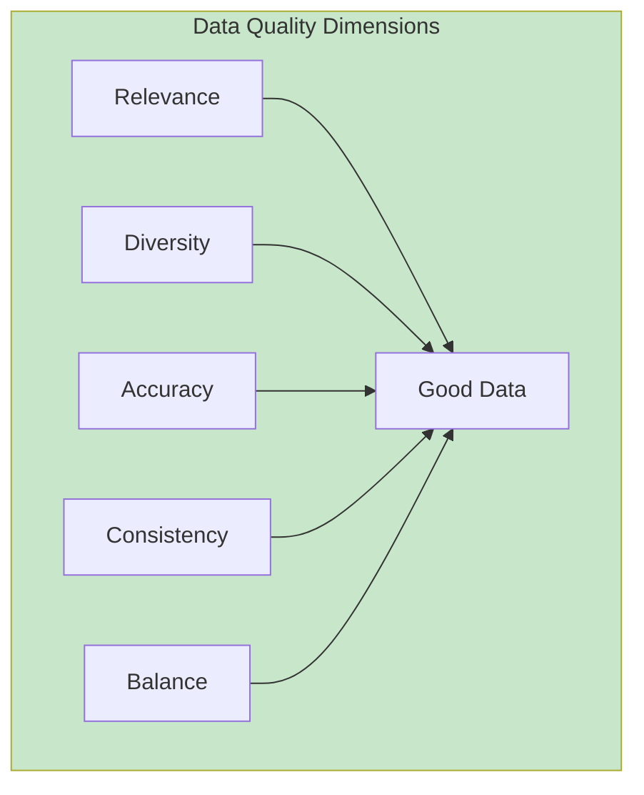
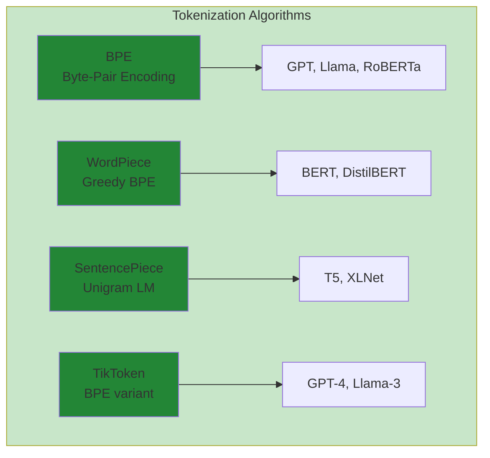

# Data Engineering for LLM Fine-Tuning

> **Module 04** — Dataset curation, tokenization, formatting, and quality pipelines.

This guide covers everything you need to prepare high-quality datasets for fine-tuning. Poor data quality is the #1 cause of failed fine-tuning runs — this module ensures yours succeeds.

---

## Table of Contents

1. [Why Data Engineering Matters](#why-data-engineering-matters)
2. [Dataset Curation Strategies](#dataset-curation-strategies)
3. [Tokenization Mechanics](#tokenization-mechanics)
4. [Data Formats for Fine-Tuning](#data-formats-for-fine-tuning)
5. [ChatML Format Deep Dive](#chatml-format-deep-dive)
6. [Data Quality and Filtering](#data-quality-and-filtering)
7. [Deduplication Pipelines](#deduplication-pipelines)
8. [Train/Validation/Test Splits](#trainvalidationtest-splits)
9. [Complete Preprocessing Pipeline](#complete-preprocessing-pipeline)
10. [Datasets and Tools](#datasets-and-tools)

---

## Why Data Engineering Matters

### The Garbage In, Garbage Out Problem

A study of 500+ fine-tuning runs found:

| Failure Cause | Percentage |
|---------------|------------|
| **Poor data quality** | 45% |
| Wrong hyperparameters | 25% |
| Insufficient data | 15% |
| Hardware issues | 10% |
| Other | 5% |

**Key insight:** Data quality issues cause nearly half of all failures.

### What Makes Good Fine-Tuning Data?



| Dimension | Description | Example |
|-----------|-------------|---------|
| **Relevance** | Matches your use case | Customer support data for support bot |
| **Diversity** | Covers edge cases | Multiple question types, tones |
| **Accuracy** | Factually correct | Verified information, no hallucinations |
| **Consistency** | Uniform format | Same structure across all samples |
| **Balance** | Equal class distribution | Equal positive/negative sentiments |

### Data Size Recommendations

| Model Size | Minimum | Recommended | Optimal |
|------------|---------|-------------|---------|
| **1B** | 100 samples | 1,000 samples | 10,000+ samples |
| **7B** | 500 samples | 5,000 samples | 50,000+ samples |
| **13B** | 1,000 samples | 10,000 samples | 100,000+ samples |
| **70B** | 5,000 samples | 50,000 samples | 500,000+ samples |

**Rule of thumb:** More data beats bigger models. A 7B model with 100k samples often outperforms a 70B model with 1k samples.

---

## Dataset Curation Strategies

### Data Pipeline Overview


### Curation Strategy Decision Tree

```mermaid
graph TD
    A[Need Training Data] --> B{Task Type?}
    B -->|General Chat| C[Use Existing<br/>UltraChat, OpenOrca]
    B -->|Domain Specific| D{Data Available?}
    B -->|Code| E[Use Code Datasets<br/>CodeAlpaca, TheStack]
    
    D -->|Yes| F[Curate Custom<br/>From your data]
    D -->|No| G[Generate Synthetic<br/>Self-instruct]
    
    C --> H[Format + Filter]
    E --> H
    F --> H
    G --> H
    H --> I[Train Model]
    
    style A fill:#2d333b
    style B fill:#347d39
    style C fill:#238636
    style D fill:#347d39
    style E fill:#238636
    style F fill:#238636
    style G fill:#f9d371
    style H fill:#1a1a1a
    style I fill:#4caf50
```



### Option 1: Use Existing Datasets

#### Hugging Face Datasets

```python
from datasets import load_dataset

# Load a ready-to-use dataset
dataset = load_dataset("HuggingFaceH4/instruction-dataset")

# Explore
print(f"Size: {len(dataset)}")
print(f"Columns: {dataset.column_names}")
print(f"Example: {dataset[0]}")
```

#### Recommended Datasets by Task

| Task | Dataset | Size | License |
|------|---------|------|---------|
| **Instruction Following** | `HuggingFaceH4/instruction-dataset` | 100k | CC BY 4.0 |
| **Chat/Dialogue** | `Anthropic/hh-rlhf` | 170k | MIT |
| **Code Generation** | `bigcode/the-stack` | 6TB | Various |
| **Summarization** | `cnn_dailymail` | 300k | Apache 2.0 |
| **Question Answering** | `squad_v2` | 130k | CC BY-SA 4.0 |
| **Math/Reasoning** | `lighteval/MATH` | 12k | MIT |

### Option 2: Create Custom Datasets

#### From Existing Content

```python
# Example: Convert FAQ to instruction format
import json

faq_data = [
    {"question": "What is your return policy?", 
     "answer": "We accept returns within 30 days of purchase."},
    {"question": "Do you ship internationally?", 
     "answer": "Yes, we ship to over 100 countries."},
]

# Convert to instruction format
instruction_data = []
for faq in faq_data:
    instruction_data.append({
        "instruction": "Answer the customer question.",
        "input": faq["question"],
        "output": faq["answer"]
    })

# Save
with open("custom_dataset.json", "w") as f:
    json.dump(instruction_data, f, indent=2)
```

#### From Web Scraping

```python
# Example: Scrape and format documentation
import requests
from bs4 import BeautifulSoup

def scrape_docs(url):
    response = requests.get(url)
    soup = BeautifulSoup(response.text, 'html.parser')
    
    # Extract sections
    sections = []
    for header in soup.find_all('h2'):
        content = header.find_next_sibling('p')
        if content:
            sections.append({
                "instruction": "Explain this concept.",
                "input": header.text,
                "output": content.text
            })
    
    return sections

# Usage
data = scrape_docs("https://docs.example.com/api")
```

#### Synthetic Data Generation

```python
# Use an LLM to generate training data
from openai import OpenAI

client = OpenAI()

def generate_training_examples(topic, n=100):
    prompt = f"""Generate {n} instruction-response pairs about {topic}.
    Format as JSON with fields: instruction, input, output.
    Ensure diversity in question types and difficulty levels."""
    
    response = client.chat.completions.create(
        model="gpt-4o-mini",
        messages=[{"role": "user", "content": prompt}],
        response_format={"type": "json_object"}
    )
    
    return json.loads(response.choices[0].message.content)

# Generate 100 examples about Python programming
synthetic_data = generate_training_examples("Python programming")
```

### Option 3: Hybrid Approach

Combine existing datasets with custom data:

```python
from datasets import load_dataset, concatenate_datasets

# Load base dataset
base = load_dataset("HuggingFaceH4/instruction-dataset", split="train")

# Load custom data
custom = load_dataset("json", data_files="custom_dataset.json", split="train")

# Combine
combined = concatenate_datasets([base, custom])
print(f"Total samples: {len(combined)}")
```

---

## Tokenization Mechanics

### Tokenization Process Visualization

```mermaid
flowchart LR
    A[Input Text<br/>"Fine-tuning LLMs"] --> B[Tokenizer]
    B --> C["Tokens:<br/>['Fine', '-', 'tun', 'ing', 'ĠLL', 'Ms']"]
    C --> D["Token IDs:<br/>[1234, 5, 67, 89, 234, 567]"]
    D --> E[Embedding Layer]
    E --> F["Vectors:<br/>4096 dimensions each"]
    
    style A fill:#4a90d9,stroke:#2c5f9d,color:#ffffff
    style B fill:#ff9800,stroke:#f57c00,color:#ffffff
    style C fill:#4caf50,stroke:#388e3c,color:#ffffff
    style D fill:#4caf50,stroke:#388e3c,color:#ffffff
    style E fill:#ff9800,stroke:#f57c00,color:#ffffff
    style F fill:#4caf50,stroke:#388e3c,color:#ffffff
```

### Tokenization Algorithm Comparison



### What is Tokenization?

Tokenization converts text to numbers the model understands:

```
Input:  "Fine-tuning is powerful"
Tokens: ["Fine", "-", "tuning", " is", " power", "ful"]
IDs:    [1234,  567,  8901,   234,  5678,   901]
```

### Tokenization Algorithms

| Algorithm | Split Strategy | Used By |
|-----------|----------------|---------|
| **BPE** | Merges frequent character pairs | GPT-2, GPT-3, RoBERTa |
| **WordPiece** | Subword with max likelihood | BERT, DistilBERT |
| **SentencePiece** | Treats input as raw bytes | Llama, T5, XLNet |
| **TikToken** | Custom BPE variant | GPT-4, Claude |

### Tokenization Impact on Training

```python
from transformers import AutoTokenizer

# Compare tokenizers
tokenizers = {
    "Llama-3": "meta-llama/Llama-3-8B",
    "Mistral": "mistralai/Mistral-7B-v0.1",
    "GPT-2": "gpt2"
}

text = "Fine-tuning large language models requires careful data preparation."

for name, model_name in tokenizers.items():
    tokenizer = AutoTokenizer.from_pretrained(model_name)
    tokens = tokenizer.encode(text)
    print(f"{name}: {len(tokens)} tokens")

# Output:
# Llama-3: 12 tokens
# Mistral: 14 tokens
# GPT-2: 15 tokens
```

### Vocabulary Size Trade-offs

| Vocab Size | Pros | Cons | Example Models |
|------------|------|------|----------------|
| **Small (32K)** | Smaller model, faster training | More tokens per text | Llama-2 |
| **Medium (50K)** | Balanced | Moderate | Mistral |
| **Large (100K+)** | Better compression, fewer tokens | Larger embedding layer | Llama-3 |

### Special Tokens

| Token | Purpose | Example |
|-------|---------|---------|
| `<bos>` | Beginning of sequence | `<bos>Hello world` |
| `<eos>` | End of sequence | `Hello world<eos>` |
| `<pad>` | Padding for batching | `[<pad>, <pad>, Hello]` |
| `<unk>` | Unknown token | `[UNK]` for OOV words |

### Token Counting for Cost Estimation

```python
def estimate_tokens(text):
    """Rough estimate: 1 token ≈ 4 characters (English)."""
    return len(text) // 4

def estimate_cost(num_samples, avg_length, cost_per_1k=0.002):
    """Estimate training cost based on tokens."""
    total_tokens = num_samples * estimate_tokens(avg_length)
    return (total_tokens / 1000) * cost_per_1k

# Example: 10,000 samples, 500 chars each
samples = 10000
avg_length = 500
cost = estimate_cost(samples, avg_length)
print(f"Estimated tokens: {samples * estimate_tokens(avg_length)}")
print(f"Estimated cost: ${cost:.2f}")
```

---

## Data Formats for Fine-Tuning

### Format 1: Instruction (Alpaca)

```json
{
  "instruction": "Classify the sentiment.",
  "input": "I love this product! It's amazing.",
  "output": "Positive"
}
```

**Used by:** Alpaca, Vicuna, most instruction models

### Format 2: Chat (Multi-turn)

```json
{
  "messages": [
    {"role": "system", "content": "You are a helpful assistant."},
    {"role": "user", "content": "What is machine learning?"},
    {"role": "assistant", "content": "Machine learning is a subset of AI..."}
  ]
}
```

**Used by:** ChatML, Llama-3-Instruct, Mistral-Instruct

### Format 3: Raw Text

```
Machine learning is a subset of artificial intelligence that enables 
systems to learn patterns from data without explicit programming.
```

**Used by:** Continued pre-training, domain adaptation

### Format 4: Preference (DPO/ORPO)

```json
{
  "prompt": "Write a poem about autumn.",
  "chosen": "Leaves of gold and crimson fall...",
  "rejected": "Autumn is a season with falling leaves."
}
```

**Used by:** Alignment training (DPO, ORPO, PPO)

---

## ChatML Format Deep Dive

### ChatML Syntax

```
<|im_start|>system
You are a helpful assistant.<|im_end|>
<|im_start|>user
What is 2+2?<|im_end|>
<|im_start|>assistant
2+2 equals 4.<|im_end|>
```

### Tokenizer Configuration

```python
from transformers import AutoTokenizer

tokenizer = AutoTokenizer.from_pretrained("mistralai/Mistral-7B-Instruct-v0.1")

# Add ChatML special tokens
tokenizer.add_special_tokens({
    "additional_special_tokens": [
        "<|im_start|>",
        "<|im_end|>"
    ]
})

# Set pad token
tokenizer.pad_token = "<|im_end|>"
```

### Formatting Function

```python
def format_chatml(messages):
    """
    Format messages as ChatML.
    
    Args:
        messages: List of dicts with 'role' and 'content'
    
    Returns:
        Formatted string
    """
    chatml = ""
    for msg in messages:
        chatml += f"<|im_start|>{msg['role']}\n{msg['content']}<|im_end|>\n"
    
    # Add assistant prefix for generation
    chatml += "<|im_start|>assistant\n"
    return chatml

# Example usage
messages = [
    {"role": "system", "content": "You are a helpful assistant."},
    {"role": "user", "content": "Explain quantum computing."},
]

formatted = format_chatml(messages)
print(formatted)
```

### Multi-turn Example

```python
multi_turn = [
    {"role": "system", "content": "You are a math tutor."},
    {"role": "user", "content": "What is calculus?"},
    {"role": "assistant", "content": "Calculus is the study of change..."},
    {"role": "user", "content": "What are derivatives?"},
    {"role": "assistant", "content": "A derivative measures how a function changes..."},
]

formatted = format_chatml(multi_turn)
```

---

## Data Quality and Filtering

### Quality Checklist

| Check | Description | Tool |
|-------|-------------|------|
| **Duplicates** | Remove exact matches | `datasets.deduplicate` |
| **Length** | Filter too short/long | Custom function |
| **Language** | Ensure correct language | `langdetect` |
| **Toxicity** | Remove harmful content | `detoxify` |
| **PII** | Remove personal info | `presidio` |
| **Formatting** | Validate structure | Schema validation |

### Length Filtering

```python
from datasets import load_dataset

dataset = load_dataset("json", data_files="dataset.json")

def filter_by_length(example, min_chars=50, max_chars=4000):
    text = example.get("output", "") + example.get("input", "")
    length = len(text)
    return min_chars <= length <= max_chars

# Apply filter
filtered = dataset["train"].filter(filter_by_length)
print(f"Removed {len(dataset['train']) - len(filtered)} samples")
```

### Language Detection

```python
from langdetect import detect

def is_english(example):
    text = example.get("output", "")
    try:
        return detect(text) == "en"
    except:
        return False

# Filter
english_only = dataset["train"].filter(is_english)
```

### Toxicity Detection

```python
from detoxify import Detoxify

detoxify = Detoxify('original')

def is_safe(example, threshold=0.5):
    text = example.get("output", "")
    try:
        result = detoxify.predict(text)
        # Check if any toxicity category exceeds threshold
        return max(result.values()) < threshold
    except:
        return True  # Keep if can't analyze

# Filter (slow - use batch processing for large datasets)
safe_data = dataset["train"].filter(is_safe)
```

### PII Removal

```python
from presidio_analyzer import AnalyzerEngine
from presidio_anonymizer import AnonymizerEngine

analyzer = AnalyzerEngine()
anonymizer = AnonymizerEngine()

def remove_pii(text):
    results = analyzer.analyze(text=text, language="en")
    anonymized = anonymizer.anonymize(text=text, analyzer_results=results)
    return anonymized.text

# Apply
dataset = dataset.map(lambda x: {"output": remove_pii(x["output"])})
```

---

## Deduplication Pipelines

### Why Deduplicate?

Duplicates cause:
- **Overfitting** — Model memorizes instead of learning
- **Biased outputs** — Repeated patterns dominate
- **Wasted compute** — Training on same data twice

### Exact Deduplication

```python
from datasets import load_dataset

dataset = load_dataset("json", data_files="dataset.json")

def deduplicate_exact(dataset, text_column="output"):
    seen = set()
    unique_indices = []
    
    for i, example in enumerate(dataset):
        text = example[text_column]
        if text not in seen:
            seen.add(text)
            unique_indices.append(i)
    
    return dataset.select(unique_indices)

# Usage
unique_dataset = deduplicate_exact(dataset["train"])
print(f"Removed {len(dataset['train']) - len(unique_dataset)} duplicates")
```

### Fuzzy Deduplication (MinHash)

```python
from datasketch import MinHash, MinHashLSH
from datasets import load_dataset

def create_minhash(text, num_perm=128):
    """Create MinHash signature for text."""
    m = MinHash(num_perm=num_perm)
    # Tokenize by character n-grams
    for i in range(len(text) - 2):
        m.update(text[i:i+3].encode('utf8'))
    return m

def deduplicate_fuzzy(dataset, threshold=0.8, text_column="output"):
    """Remove near-duplicates using MinHash LSH."""
    lsh = MinHashLSH(threshold=threshold, num_perm=128)
    
    duplicates = set()
    for i, example in enumerate(dataset):
        text = example[text_column]
        mh = create_minhash(text)
        
        # Check for similar documents
        similar = lsh.query(mh)
        if similar:
            duplicates.add(i)
        
        # Add to LSH index
        lsh.insert(i, mh)
    
    # Keep only unique samples
    unique_indices = [i for i in range(len(dataset)) if i not in duplicates]
    return dataset.select(unique_indices)

# Usage
dataset = load_dataset("json", data_files="dataset.json")["train"]
deduped = deduplicate_fuzzy(dataset, threshold=0.85)
print(f"Removed {len(dataset) - len(deduped)} fuzzy duplicates")
```

### Cross-Dataset Deduplication

```python
from datasets import concatenate_datasets

def deduplicate_across_datasets(datasets, text_column="output"):
    """Remove duplicates that appear across multiple datasets."""
    seen = set()
    result_datasets = []
    
    for ds in datasets:
        unique_indices = []
        for i, example in enumerate(ds):
            text = example[text_column]
            if text not in seen:
                seen.add(text)
                unique_indices.append(i)
        
        result_datasets.append(ds.select(unique_indices))
    
    return concatenate_datasets(result_datasets)

# Usage
dataset1 = load_dataset("HuggingFaceH4/instruction-dataset", split="train")
dataset2 = load_dataset("json", data_files="custom.json", split="train")

combined_unique = deduplicate_across_datasets([dataset1, dataset2])
```

---

## Train/Validation/Test Splits

### Why Split Data?

| Split | Purpose | Typical Size |
|-------|---------|--------------|
| **Train** | Model learns from this | 80% |
| **Validation** | Hyperparameter tuning | 10% |
| **Test** | Final evaluation | 10% |

### Stratified Splitting

```python
from datasets import load_dataset
from sklearn.model_selection import train_test_split

dataset = load_dataset("json", data_files="dataset.json")["train"]

# Extract labels for stratification (if classification)
labels = [example["label"] for example in dataset]

# Split: 80/10/10
train_val, test = train_test_split(
    dataset,
    test_size=0.1,
    stratify=labels,
    random_state=42
)

# Further split train/val
train, val = train_test_split(
    train_val,
    test_size=0.11,  # 0.11 of 0.9 ≈ 0.1
    stratify=[example["label"] for example in train_val],
    random_state=42
)

print(f"Train: {len(train)}, Val: {len(val)}, Test: {len(test)}")
```

### Simple Split (No Labels)

```python
dataset = load_dataset("json", data_files="dataset.json")["train"]

# Random split
splits = dataset.train_test_split(test_size=0.2, seed=42)
train_val = splits["train"].train_test_split(test_size=0.125, seed=42)

dataset_dict = {
    "train": train_val["train"],
    "validation": train_val["test"],
    "test": splits["test"]
}

# Save
for split_name, split_data in dataset_dict.items():
    split_data.to_json(f"dataset_{split_name}.json")
```

---

## Complete Preprocessing Pipeline

### End-to-End Pipeline

```python
#!/usr/bin/env python3
"""
Complete data preprocessing pipeline for LLM fine-tuning.

Usage:
    python preprocess_pipeline.py \
        --input raw_data.json \
        --output processed_dataset \
        --model_name mistralai/Mistral-7B-v0.1
"""

import argparse
import json
from datasets import load_dataset
from transformers import AutoTokenizer
from langdetect import detect
from datasketch import MinHash

def load_data(input_path):
    """Load dataset from JSON file."""
    return load_dataset("json", data_files=input_path)["train"]

def filter_quality(dataset):
    """Apply quality filters."""
    def quality_filter(example):
        text = example.get("output", "") + example.get("input", "")
        
        # Length check
        if len(text) < 50 or len(text) > 4000:
            return False
        
        # Language check
        try:
            if detect(text) != "en":
                return False
        except:
            return False
        
        return True
    
    return dataset.filter(quality_filter)

def deduplicate(dataset):
    """Remove exact duplicates."""
    seen = set()
    unique_indices = []
    
    for i, example in enumerate(dataset):
        text = example.get("output", "")
        if text not in seen:
            seen.add(text)
            unique_indices.append(i)
    
    return dataset.select(unique_indices)

def tokenize_and_format(dataset, tokenizer, format_fn):
    """Tokenize and format for training."""
    def process(example):
        formatted = format_fn(example)
        tokenized = tokenizer(
            formatted,
            truncation=True,
            max_length=512,
            padding=False
        )
        return tokenized
    
    return dataset.map(process, batched=False)

def split_dataset(dataset):
    """Create train/val/test splits."""
    splits = dataset.train_test_split(test_size=0.2, seed=42)
    train_val = splits["train"].train_test_split(test_size=0.125, seed=42)
    
    return {
        "train": train_val["train"],
        "validation": train_val["test"],
        "test": splits["test"]
    }

def format_instruction(example):
    """Format as instruction-following example."""
    return f"""### Instruction:
{example.get('instruction', '')}

### Input:
{example.get('input', '')}

### Response:
{example.get('output', '')}"""

def main():
    parser = argparse.ArgumentParser(description="Preprocess dataset for LLM fine-tuning")
    parser.add_argument("--input", required=True, help="Input JSON file")
    parser.add_argument("--output", required=True, help="Output directory")
    parser.add_argument("--model_name", default="mistralai/Mistral-7B-v0.1")
    args = parser.parse_args()
    
    print(f"Loading data from {args.input}...")
    dataset = load_data(args.input)
    print(f"Loaded {len(dataset)} samples")
    
    print("\nApplying quality filters...")
    dataset = filter_quality(dataset)
    print(f"After filtering: {len(dataset)} samples")
    
    print("\nRemoving duplicates...")
    dataset = deduplicate(dataset)
    print(f"After deduplication: {len(dataset)} samples")
    
    print("\nLoading tokenizer...")
    tokenizer = AutoTokenizer.from_pretrained(args.model_name)
    tokenizer.pad_token = tokenizer.eos_token
    
    print("\nTokenizing and formatting...")
    dataset = tokenize_and_format(dataset, tokenizer, format_instruction)
    
    print("\nCreating train/val/test splits...")
    splits = split_dataset(dataset)
    
    print("\nSaving datasets...")
    for split_name, split_data in splits.items():
        output_path = f"{args.output}_{split_name}.json"
        split_data.to_json(output_path)
        print(f"Saved {split_name}: {len(split_data)} samples to {output_path}")
    
    print("\n✅ Preprocessing complete!")
    print(f"\nFinal statistics:")
    print(f"  Train: {len(splits['train'])} samples")
    print(f"  Validation: {len(splits['validation'])} samples")
    print(f"  Test: {len(splits['test'])} samples")

if __name__ == "__main__":
    main()
```

### Usage

```bash
# Run the pipeline
python preprocess_pipeline.py \
    --input raw_data.json \
    --output processed/mistral \
    --model_name mistralai/Mistral-7B-v0.1

# Output files:
# - processed/mistral_train.json
# - processed/mistral_validation.json
# - processed/mistral_test.json
```

---

## Datasets and Tools

### Essential Libraries

```bash
# Core data processing
pip install datasets pandas pyarrow

# Tokenization
pip install transformers tokenizers sentencepiece

# Quality checks
pip install langdetect detoxify textstat

# Deduplication
pip install datasketch text-dedup

# PII removal
pip install presidio-analyzer presidio-anonymizer

# Validation
pip install jsonschema great-expectations
```

### Recommended Datasets

| Category | Dataset | Size | Use Case |
|----------|---------|------|----------|
| **General Instructions** | `HuggingFaceH4/instruction-dataset` | 100k | Base fine-tuning |
| **Chat/Dialogue** | `Anthropic/hh-rlhf` | 170k | Chatbot training |
| **Code** | `bigcode/the-stack` | 6TB | Code generation |
| **Math** | `lighteval/MATH` | 12k | Reasoning tasks |
| **Science** | `allenai/scifact` | 5k | Scientific QA |
| **Medical** | `medalpaca/medical_meadow` | 50k | Medical assistant |
| **Legal** | `law-instruct` | 100k | Legal assistant |
| **Multilingual** | `Alpaca-GPT4-multilingual` | 500k | Multi-language |

### Data Validation Schema

```python
from jsonschema import validate, ValidationError

SCHEMA = {
    "type": "object",
    "required": ["instruction", "output"],
    "properties": {
        "instruction": {"type": "string", "minLength": 10},
        "input": {"type": "string"},
        "output": {"type": "string", "minLength": 20}
    }
}

def validate_example(example):
    try:
        validate(instance=example, schema=SCHEMA)
        return True
    except ValidationError as e:
        print(f"Invalid: {e.message}")
        return False

# Usage
dataset = load_dataset("json", data_files="dataset.json")["train"]
valid_dataset = dataset.filter(validate_example)
```

---

## Quick Reference: Data Checklist

Before starting fine-tuning, verify:

- [ ] **Format correct** — ChatML or instruction format
- [ ] **No duplicates** — Exact and fuzzy deduplication done
- [ ] **Quality filtered** — Length, language, toxicity checks
- [ ] **PII removed** — No personal information
- [ ] **Splits created** — Train (80%), Val (10%), Test (10%)
- [ ] **Tokenized** — Compatible with target model
- [ ] **Saved properly** — JSON format, accessible paths

---

## Next Steps

1. **Run the preprocessing pipeline** on your raw data
2. **Validate the output** with schema checking
3. **Continue to Module 05: Training Dynamics** — Learning rates, batch sizes, and optimization

---

## References

- [Hugging Face Datasets Documentation](https://huggingface.co/docs/datasets)
- [ChatML Format Specification](https://github.com/openai/openai-python/blob/main/chatml.md)
- [MinHash Deduplication Paper](https://www.cs.princeton.edu/courses/archive/spr06/cos423/Handouts/broder97.pdf)
- [Detoxify Library](https://github.com/unitaryai/detoxify)
- [Presidio PII Removal](https://microsoft.github.io/presidio/)
- [Data Quality for LLMs](https://arxiv.org/abs/2306.01116) — Survey paper
