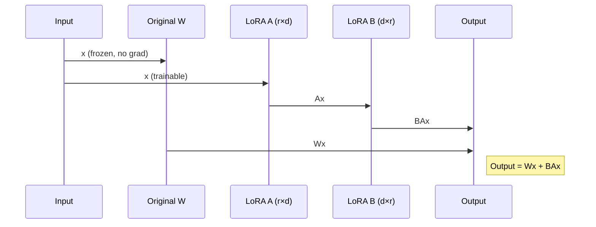
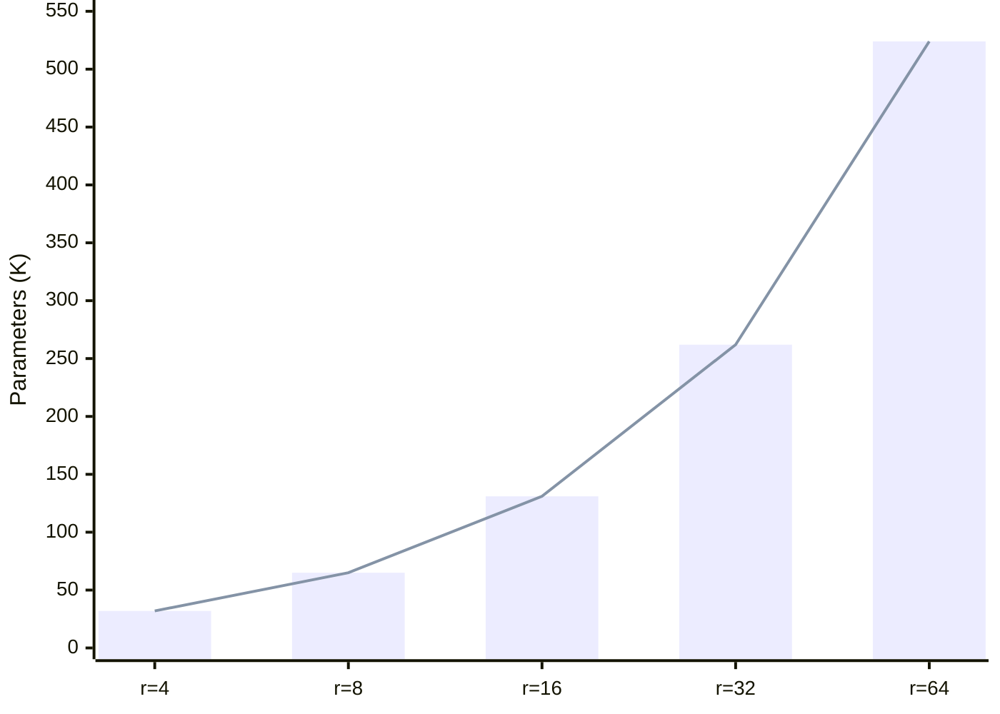
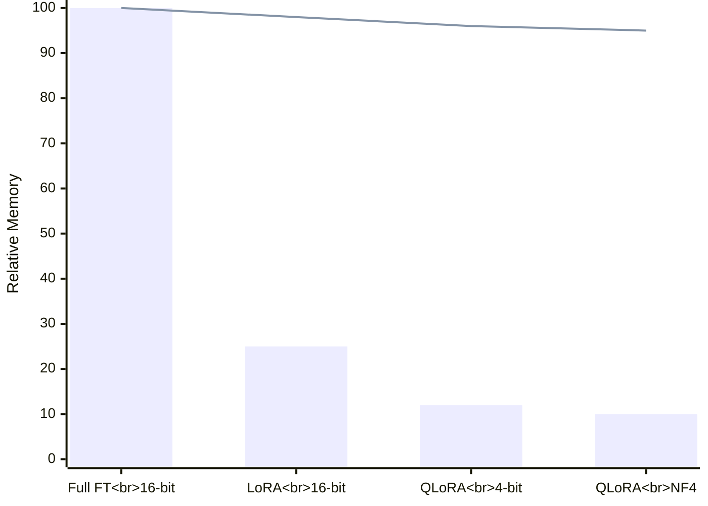
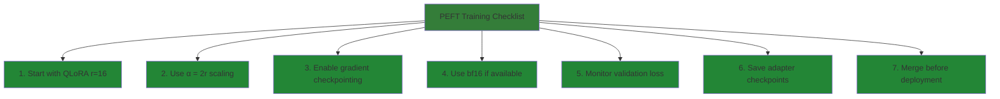

# Parameter-Efficient Fine-Tuning (PEFT)

Fine-tuning large language models efficiently using LoRA, QLoRA, DoRA, and GaLore—reducing memory by 10× while matching full fine-tuning performance.

## Overview

Full fine-tuning updates all model parameters, requiring:
- **7B model**: 28GB+ VRAM (16-bit)
- **13B model**: 52GB+ VRAM
- **70B model**: 280GB+ VRAM

PEFT methods freeze the base model and train small adapter modules:
- **7B with QLoRA**: ~3GB VRAM
- **7B with DoRA**: ~3.5GB VRAM
- **7B with GaLore**: ~15GB VRAM (trains all params, not just adapters)


---

## Chapter 1: Understanding LoRA

### Low-Rank Adaptation Theory

LoRA (Low-Rank Adaptation) injects trainable low-rank matrices into transformer layers instead of updating all weights.

**Core idea**: For a weight matrix `W ∈ ℝ^(d×d)`, instead of computing `W' = W + ΔW` where `ΔW` is full-rank, approximate:

```
ΔW = BA
where B ∈ ℝ^(d×r), A ∈ ℝ^(r×d), and r << d
```

For `d=4096, r=8`:
- Full `ΔW`: 16.7M parameters
- LoRA `BA`: 65K parameters (**256× reduction**)

```mermaid
graph TB
    subgraph Original["Original Attention (Frozen)"]
        Wq["W_q (d×d)"] --> Q[Query]
        Wk["W_k (d×d)"] --> K[Key]
        Wv["W_v (d×d)"] --> V[Value]
    end
    
    subgraph LoRA["LoRA Adaptation (Trainable)"]
        BAq["BA_q (d×r, r×d)"] -.-> Q
        BAk["BA_k (d×r, r×d)"] -.-> K
        BAv["BA_v (d×r, r×d)"] -.-> V
    end
    
    style Original fill:#1a1a1a,stroke:#666
    style LoRA fill:#1a3a1a,stroke:#3fb950
    style Wq fill:#2d333b
    style Wk fill:#2d333b
    style Wv fill:#2d333b
    style BAq fill:#238636
    style BAk fill:#238636
    style BAv fill:#238636
```



### LoRA Architecture



**Key properties**:
1. **A initialized to zero**: `BA = 0` at start, no initial distortion
2. **B initialized randomly**: Breaks symmetry
3. **Scaling factor**: Output scaled by `α/r` (typically `α = 2r`)
4. **Mergeable**: After training, `W' = W + BA` becomes a single matrix

### Rank (r) Selection

Rank controls the capacity of LoRA adapters:

| Rank | Parameters | Use Case | VRAM (7B) |
|------|------------|----------|-----------|
| r=4 | 32K | Tiny adjustments, style transfer | ~2GB |
| r=8 | 65K | Standard fine-tuning | ~2.5GB |
| r=16 | 131K | Complex tasks, more data | ~3GB |
| r=32 | 262K | Domain adaptation | ~4GB |
| r=64 | 524K | Maximum capacity | ~5GB |



**Guidelines**:
- Start with `r=8` or `r=16`
- Increase if model underfits (training loss stays high)
- Decrease if overfitting (validation loss increases)
- For QLoRA, use `r=16` or `r=32` (quantization already reduces capacity)

### Alpha (α) Scaling

LoRA output is scaled: `output = Wx + (α/r)BAx`

- **α = r**: No additional scaling (standard)
- **α = 2r**: Common default (LoRA paper uses α=32, r=16)
- **α < r**: More conservative adaptation

**Rule**: Keep `α/r` ratio constant when changing rank. If doubling `r`, also double `α`.

### What Gets Trained vs. Frozen

```mermaid
graph TB
    subgraph Frozen["Frozen (No Gradients)"]
        Embed[Embedding Layer]
        Attn[Attention Layers<br/>W_q, W_k, W_v, W_o]
        MLP[MLP Layers<br/>W_gate, W_up, W_down]
        Norm[LayerNorm]
    end
    
    subgraph Trainable["Trainable (LoRA Adapters)"]
        LoRA_q[LoRA on W_q]
        LoRA_k[LoRA on W_k]
        LoRA_v[LoRA on W_v]
        LoRA_o[LoRA on W_o]
        LoRA_mlp[LoRA on MLP]
    end
    
    Frozen -.-> Trainable
    
    style Frozen fill:#1a1a1a,stroke:#d73a49
    style Trainable fill:#1a3a1a,stroke:#3fb950
    style LoRA_q fill:#238636
    style LoRA_k fill:#238636
    style LoRA_v fill:#238636
    style LoRA_o fill:#238636
    style LoRA_mlp fill:#238636
```



**Typical configuration**:
- **Frozen**: Embeddings, attention weights, MLP weights, layer norms
- **Trainable**: LoRA adapters on attention (q, k, v, o) and optionally MLP (gate, up, down)

---

## Chapter 2: QLoRA (Quantized LoRA)

### 4-bit Quantization Basics

QLoRA quantizes the base model to 4-bit, then applies LoRA on top:


**Memory breakdown** (7B model):

| Component | 16-bit FT | QLoRA |
|-----------|-----------|-------|
| Model weights | 14 GB | 3.5 GB |
| Gradients | 14 GB | 0.1 GB |
| Optimizer states | 28 GB | 0.2 GB |
| Activations | 8 GB | 2 GB |
| **Total** | **64 GB** | **~6 GB** |

### NF4 (NormalFloat 4-bit)

NF4 is optimized for normally distributed weights:

```
Standard 4-bit: Uniform spacing across range
NF4: Denser spacing near zero, sparser at extremes

Weight distribution:  ████████▓▓░░░░░░  (most weights near 0)
NF4 quantization: ||||| ||| || |   |  (more bins near 0)
```

**Why NF4 works**: Neural network weights follow normal distribution—NF4 allocates more quantization levels where weights actually exist.

### Double Quantization

QLoRA uses two-level quantization:

1. **First quantization**: Weights → 4-bit NF4
2. **Second quantization**: Quantization constants → 8-bit

Saves additional ~0.4 bits per parameter (~5% memory reduction).

### Memory vs. Quality Tradeoffs



| Method | Memory | Quality Loss | Training Speed |
|--------|--------|--------------|----------------|
| Full FT (16-bit) | 100% | 0% | Baseline |
| LoRA (16-bit) | 25% | 1-2% | Faster |
| QLoRA (4-bit) | 12% | 3-5% | Fastest |
| QLoRA (NF4) | 10% | 4-6% | Fastest |

**When to use QLoRA**:
- Limited VRAM (<12GB)
- Rapid prototyping
- Training very large models (30B+)
- Multiple fine-tuning experiments

**When to avoid QLoRA**:
- Maximum quality required
- Small dataset (every bit of capacity matters)
- Production deployment (train with QLoRA, merge, deploy full precision)

---

## Chapter 3: Adapter Integration

### Types of Adapters

```mermaid
graph TD
    PEFT[PEFT Methods] --> LoRA[LoRA]
    PEFT --> Prefix[Prefix Tuning]
    PEFT --> Prompt[Prompt Tuning]
    PEFT --> Adapter[Adapter Layers]
    
    LoRA --> LoRA_variants[LoRA, QLoRA, DoRA]
    LoRA --> GaLore_variants[GaLore (gradient projection)]
    Prefix --> Prefix_variants[Prefix, P-Tuning v2]
    Prompt --> Prompt_variants[Prompt, Soft Prompt]
    Adapter --> Adapter_variants[Houlsby, Pfeiffer, Compacter]
    
    style PEFT fill:#347d39
    style LoRA fill:#238636
    style Prefix fill:#238636
    style Prompt fill:#238636
    style Adapter fill:#238636
```

### Loading and Merging Adapters

```python
from peft import PeftModel, AutoPeftModelForCausalLM

# Load base model
base_model = AutoModelForCausalLM.from_pretrained("mistralai/Mistral-7B-v0.1")

# Load adapter
model = PeftModel.from_pretrained(base_model, "./adapter-checkpoint")

# Merge adapter into base model (optional, for deployment)
merged_model = model.merge_and_unload()

# Save merged model
merged_model.save_pretrained("./merged-model")
```

### Adapter Stacking

Stack multiple adapters for multi-task learning:

```python
from peft import LoraConfig, get_peft_model

# First adapter: Domain knowledge (medical)
lora_config_1 = LoraConfig(r=16, lora_alpha=32, task_type="CAUSAL_LM")
model = get_peft_model(base_model, lora_config_1, adapter_name="medical")

# Second adapter: Task skill (summarization)
model.add_adapter("summarization", lora_config_1)

# Activate specific adapter
model.set_adapter("medical")      # For medical Q&A
model.set_adapter("summarization") # For summarization

# Combine adapters (weighted)
model.add_weighted_adapter(
    adapters=["medical", "summarization"],
    weights=[0.7, 0.3],
    adapter_name="combined"
)
model.set_adapter("combined")
```

### Multi-Adapter Scenarios

```mermaid
graph LR
    subgraph Base["Base Model (Frozen)"]
        L1[Layer 1]
        L2[Layer 2]
        L3[Layer N]
    end
    
    subgraph Adapters["Adapters (Trainable)"]
        A1[Adapter A<br/>Task 1]
        A2[Adapter B<br/>Task 2]
        A3[Adapter C<br/>Task 3]
    end
    
    Base --> A1
    Base --> A2
    Base --> A3
    
    style Base fill:#1a1a1a,stroke:#666
    style A1 fill:#238636
    style A2 fill:#238636
    style A3 fill:#238636
```



**Use cases**:
- **Multi-task**: One adapter per task, swap at inference
- **Multi-lingual**: Separate adapters per language
- **Multi-domain**: Domain-specific adapters with shared base
- **Continual learning**: New adapters for new tasks, old adapters frozen

---

## Chapter 4: Rank Selection Guide

### Dataset Size Guidelines

```mermaid
graph LR
    A[Dataset Size] --> B{Size?}
    B -->|<1k samples| C[r=4 to r=8]
    B -->|1k-10k samples| D[r=8 to r=16]
    B -->|10k-100k samples| E[r=16 to r=32]
    B -->|>100k samples| F[r=32 to r=64]
    
    style A fill:#2d333b
    style B fill:#347d39
    style C fill:#238636
    style D fill:#238636
    style E fill:#238636
    style F fill:#238636
```



### Recommended Starting Points

| Dataset Size | Task Complexity | Starting Rank | Alpha | Dropout |
|--------------|-----------------|---------------|-------|---------|
| <1k | Simple (classification) | r=4 | 8 | 0.1 |
| <1k | Complex (generation) | r=8 | 16 | 0.1 |
| 1k-10k | Simple | r=8 | 16 | 0.05 |
| 1k-10k | Complex | r=16 | 32 | 0.05 |
| 10k-100k | Any | r=16 | 32 | 0.05 |
| >100k | Any | r=32 | 64 | 0.0 |

### Ablation Study Methodology

```python
import wandb

# Run ablation study with Weights & Biases sweeps
sweep_config = {
    "method": "grid",
    "parameters": {
        "rank": {"values": [4, 8, 16, 32]},
        "alpha": {"values": [8, 16, 32, 64]},
        "dropout": {"values": [0.0, 0.05, 0.1]},
    }
}

# Track validation loss for each configuration
# Select rank where val_loss plateaus
```

**Process**:
1. Train with `r=[4, 8, 16, 32]` (keep α/r constant)
2. Plot validation loss vs. rank
3. Select smallest rank where loss plateaus
4. Fine-tune dropout at selected rank

```mermaid
xychart-beta
    x-axis ["r=4", "r=8", "r=16", "r=32", "r=64"]
    y-axis "Validation Loss" 0 --> 2
    line [1.45, 1.28, 1.15, 1.14, 1.14]
```

Above: Loss plateaus at r=16—higher ranks don't help.

---

## Chapter 5: Training Tips

### Optimizing for Speed vs. Quality

```mermaid
graph TB
    A[Goal?] -->|Speed| B[QLoRA 4-bit<br/>r=8<br/>batch_size=32]
    A -->|Quality| C[LoRA 16-bit<br/>r=16-32<br/>batch_size=16]
    A -->|Balanced| D[QLoRA NF4<br/>r=16<br/>batch_size=24]
    
    B --> E[~2GB VRAM<br/>Fast training<br/>Good for prototyping]
    C --> F[~6GB VRAM<br/>Best quality<br/>Production ready]
    D --> G[~3GB VRAM<br/>Good quality<br/>Recommended default]
    
    style A fill:#2d333b
    style B fill:#347d39
    style C fill:#347d39
    style D fill:#347d39
    style E fill:#1a1a1a
    style F fill:#1a1a1a
    style G fill:#1a1a1a
```



### Memory Profiling

```python
import torch

def profile_memory(model, batch_size, seq_length):
    """Profile memory usage before training."""
    
    # Create dummy input
    input_ids = torch.randint(0, 10000, (batch_size, seq_length)).cuda()
    attention_mask = torch.ones_like(input_ids)
    
    # Measure memory
    torch.cuda.reset_peak_memory_stats()
    model(input_ids, attention_mask)
    peak_memory = torch.cuda.max_memory_allocated() / 1e9
    
    print(f"Peak memory: {peak_memory:.2f} GB")
    print(f"Estimated max batch: {int(8 / peak_memory * batch_size)}")
```

### Gradient Checkpointing with LoRA

Reduces memory by ~40% at cost of ~20% slower training:

```python
from peft import LoraConfig

lora_config = LoraConfig(
    r=16,
    lora_alpha=32,
    target_modules=["q_proj", "k_proj", "v_proj", "o_proj"],
    enable_lora=None,  # All target modules
)

# Enable gradient checkpointing in TrainingArguments
training_args = TrainingArguments(
    ...
    gradient_checkpointing=True,  # Saves memory
)
```

### Best Practices Checklist



---

## LoRA Configuration Reference

### Quick Reference Table

| Parameter | Typical Values | Recommendation |
|-----------|---------------|----------------|
| r (rank) | 4, 8, 16, 32, 64 | Start at 16, adjust based on dataset |
| alpha | 16, 32, 64 | Use α = 2r (e.g., r=16 → α=32) |
| dropout | 0.0 to 0.5 | 0.05 for most tasks, 0.1 for small datasets |
| bias | none, all, lora_only | "none" (default), "lora_only" for slight boost |
| target_modules | See below | Match your model architecture |

### Common target_modules by Model

```python
# Llama 2/3, Mistral, Qwen
target_modules = [
    "q_proj", "k_proj", "v_proj", "o_proj",  # Attention
    "gate_proj", "up_proj", "down_proj",     # MLP
]

# Phi-3
target_modules = [
    "qkv_proj",      # Combined QKV
    "o_proj",
    "dense_h_to_4h", # MLP
    "dense_4h_to_h",
]

# BERT, RoBERTa (encoder models)
target_modules = [
    "query", "key", "value",  # Attention
    "dense",                  # Output
]
```

### Complete LoRA Configuration Example

```python
from peft import LoraConfig, get_peft_model, prepare_model_for_kbit_training
from transformers import AutoModelForCausalLM, BitsAndBytesConfig

# 4-bit quantization config
bnb_config = BitsAndBytesConfig(
    load_in_4bit=True,
    bnb_4bit_quant_type="nf4",
    bnb_4bit_compute_dtype=torch.bfloat16,
    bnb_4bit_use_double_quant=True,
)

# Load model
model = AutoModelForCausalLM.from_pretrained(
    "mistralai/Mistral-7B-v0.1",
    quantization_config=bnb_config,
    device_map="auto",
)

# Prepare for k-bit training
model = prepare_model_for_kbit_training(model)

# LoRA config
lora_config = LoraConfig(
    r=16,
    lora_alpha=32,
    target_modules=[
        "q_proj", "k_proj", "v_proj", "o_proj",
        "gate_proj", "up_proj", "down_proj",
    ],
    lora_dropout=0.05,
    bias="none",
    task_type="CAUSAL_LM",
    inference_mode=False,
)

# Apply LoRA
model = get_peft_model(model, lora_config)
model.print_trainable_parameters()
# Output: trainable params: 11M || all params: 7B || trainable%: 0.16%
```

---

## Comparison: PEFT Methods

```mermaid
graph TB
    subgraph Memory["Memory Efficiency"]
        QLoRA[QLoRA<br/>~3GB for 7B]
        LoRA[LoRA<br/>~6GB for 7B]
        Full[Full FT<br/>~28GB for 7B]
    end
    
    subgraph Quality["Quality"]
        FullQ[Full FT<br/>Baseline]
        LoRAQ[LoRA<br/>98-99%]
        QLoRAQ[QLoRA<br/>95-97%]
    end
    
    subgraph Speed["Training Speed"]
        QLoRAS[QLoRA<br/>Fastest]
        LoRAS[LoRA<br/>Fast]
        FullS[Full FT<br/>Baseline]
    end
    
    style QLoRA fill:#238636
    style LoRA fill:#238636
    style Full fill:#d73a49
    style FullQ fill:#d73a49
    style LoRAQ fill:#238636
    style QLoRAQ fill:#347d39
    style QLoRAS fill:#238636
    style LoRAS fill:#238636
    style FullS fill:#2d333b
```



| Method | Memory | Quality | Speed | Best For |
|--------|--------|---------|-------|----------|
| **QLoRA** | ⭐⭐⭐ | ⭐⭐ | ⭐⭐⭐ | Limited VRAM, prototyping |
| **LoRA** | ⭐⭐ | ⭐⭐⭐ | ⭐⭐ | Production, best quality |
| **DoRA** | ⭐⭐ | ⭐⭐⭐ | ⭐⭐ | Best PEFT quality, lower ranks |
| **GaLore** | ⭐⭐⭐ | ⭐⭐⭐⭐ | ⭐ | Full-parameter, best generalization |
| **Full FT** | ⭐ | ⭐⭐⭐⭐ | ⭐ | Research, maximum performance |

---

## Chapter 6: Advanced PEFT (The Next Generation of LoRA)

LoRA and QLoRA are the standard starting points—but they both share a fundamental limitation. LoRA constrains the entire training to a low-rank subspace, which means the model can only learn within that narrow "tube." This sometimes creates a quality gap between PEFT and full fine-tuning.

Two techniques have emerged to close that gap.

### DoRA: Weight-Decomposed Low-Rank Adaptation

**The problem with LoRA**: Every time LoRA adjusts a weight matrix, it changes both the *magnitude* (how big the weights are) and the *direction* (which way they point) at the same time. These two changes are proportional—you can't make a big directional change without also shifting the magnitude, and vice versa.

**What DoRA does**: It splits the weight matrix into two independent parts and trains them separately:

```
Weight = Magnitude (m)  ×  Direction (V)
```

- **Magnitude** (`m`): How large each column of weights is. Learned as a small vector—only ~0.02% more parameters than LoRA.
- **Direction** (`V`): Which way the weights point. Updated using standard LoRA matrices (A × B).

```mermaid
graph LR
    subgraph LoRA["Standard LoRA"]
        L1[W + BA<br/>magnitude AND direction<br/>change together] 
    end
    subgraph DoRA["DoRA"]
        D1[m (magnitude)<br/>learned separately] --> D2[V + ΔV<br/>(direction via LoRA)<br/>normalized] --> D3[m × V_normalized<br/>final weight]
    end
    
    style LoRA fill:#2d333b
    style DoRA fill:#347d39
    style D1 fill:#238636
    style D2 fill:#238636
    style D3 fill:#238636
```

The key insight: because magnitude and direction are independent, DoRA can make a big directional shift without touching magnitude, or scale up magnitude without changing direction—just like full fine-tuning does.

**What this means in practice**:

| Aspect | LoRA | DoRA |
|--------|------|------|
| Trainable params | 1-2% | ~1-2% (adds ~0.02% for magnitude) |
| VRAM overhead | Baseline | +5-10% (for magnitude vector) |
| Quality vs. FT | 95-98% | 97-99% |
| Lower-rank performance | Degrades quickly | Still strong (rank=8 often beats LoRA rank=16) |
| Inference overhead | None | None (can merge to weights) |

**When to use DoRA**:
- You need the best possible quality from PEFT (closest to full fine-tuning)
- You want to use lower ranks (saves memory, fewer parameters)
- You're training for many epochs (DoRA converges slightly slower than LoRA, so it benefits from longer training)

**Quick setup**:

```python
from peft import LoraConfig

# Just add use_dora=True to your LoraConfig
config = LoraConfig(
    r=8,              # DoRA often works well with lower ranks
    lora_alpha=16,
    use_dora=True,    # Enable DoRA
    target_modules=["q_proj", "k_proj", "v_proj", "o_proj"],
)
```

> **Tip**: Start with half the rank you'd use for LoRA (e.g., r=8 instead of r=16). Use a slightly lower learning rate, and give it more training steps—DoRA converges slower but reaches higher quality.

### GaLore: Gradient Low-Rank Projection

**The problem with both LoRA and DoRA**: They freeze most of the model and only train a tiny subset of adapter weights. This means the bulk of the model never participates in training. For maximum quality, you want *all* parameters to learn—but updating every parameter normally requires massive memory.

**What GaLore does**: It lets you train **all parameters** while using only PEFT-level memory. The trick? It works on the *gradients*, not the weights.

Here's the key difference:

```
LoRA:    Add small adapters → only adapters train
GaLore:  All parameters train → gradients are projected into a low-rank space
```

GaLore's process during each training step:

```mermaid
sequenceDiagram
    participant FW as Forward Pass
    participant BP as Backward Pass<br/>(full gradients computed)
    participant SV as SVD Projection<br/>(every ~200 steps)
    participant Opt as AdamW in<br/>low-rank subspace
    participant Up as Update all<br/>model weights
    
    FW->>BP: Compute loss, backprop
    BP->>SV: Project gradient G<br/>into low-rank subspace
    SV->>Opt: Low-rank gradient<br/>(r << d)
    Opt->>Up: Full-parameter update
    Up->>FW: Next forward pass
```

1. **Backprop as usual**: Full gradients `G` are computed for all weights.
2. **Project into low-rank**: Instead of storing the full `m×n` gradient matrix, GaLore uses SVD to project it into a much smaller `r×n` subspace (typically r=128-256). This is the memory-saving step.
3. **Update optimizer state**: AdamW stores its momentum/covariance stats only in the compressed `r×n` space—**not** the full `m×n` space. This saves ~65% of optimizer memory.
4. **Update all weights**: The weight update is reconstructed to full rank and applied to *every parameter* in the model.

The projection matrix (the SVD basis) is refreshed every 200 steps or so. Between refreshes, it's just a cheap matrix multiply.

**Why this works**: Gradients change slowly during training and are approximately low-rank. The important learning signal lives in a small subspace—the rest is mostly noise that the optimizer would filter out anyway.

**GaLore vs. LoRA — the trade-off**:

| Aspect | LoRA | GaLore |
|--------|------|--------|
| What trains | Adapters only (~1-2%) | **All parameters (100%)** |
| VRAM (7B model) | ~3GB (QLoRA) | ~15-18GB (BF16) |
| Quality vs. FT | 95-98% | 97-99% |
| Inference | Merge adapters | None needed (full weights) |
| Training speed | Fast | Slower (~2×, due to SVD refresh) |
| Convergence | Faster early on | Slightly slower, better long-term |

**When to use GaLore**:
- You need full-parameter expressiveness (best long-term generalization)
- You're training for many epochs (the quality advantage grows)
- You want a clean checkpoint (no adapter merge step needed)
- You have a 24-40GB GPU (runs 7B models on consumer hardware like an RTX 4090)

**When NOT to use GaLore**:
- You have very limited VRAM (<12GB) — use QLoRA instead
- You need fast iteration — training is ~2× slower than LoRA
- Your dataset is small (<1k samples) — LoRA is sufficient

**Quick setup with HuggingFace Trainer**:

```python
from transformers import TrainingArguments, Trainer

training_args = TrainingArguments(
    output_dir="./output",
    optim="galore_adamw_8bit_layerwise",  # 8-bit GaLore optimizer
    optim_target_modules=["attn", "mlp"], # Apply to attention + MLP
    optim_args="rank=128, update_proj_gap=200, scale=0.25",
    # ... rest of your training args
)
```

Or with `galore-torch` directly:

```python
from galore_torch import GaLoreAdamW8bit

# Split params: GaLore for weight matrices, standard for biases/norms
galore_params = [p for p in model.parameters() 
                 if p.dim() == 2 and p.requires_grad]
standard_params = [p for p in model.parameters() 
                   if p.dim() != 2 or not p.requires_grad]

optimizer = GaLoreAdamW8bit(
    [
        {"params": galore_params, "rank": 128, 
         "update_proj_gap": 200, "scale": 0.25},
        {"params": standard_params},
    ],
    lr=2e-5
)
```

### Quick Decision Guide

```
Need to fine-tune with limited VRAM?
├── < 12GB  → QLoRA (fastest, smallest footprint)
├── 12-20GB → DoRA (best quality for PEFT, minimal extra VRAM)
└── > 20GB  → GaLore (full-parameter training, best generalization)
```

---

## Summary

**Key takeaways**:

1. **LoRA** reduces trainable params by 100× with minimal quality loss
2. **QLoRA** enables 7B fine-tuning on 3GB VRAM via 4-bit quantization
3. **Rank selection**: Start at r=16, adjust based on dataset size
4. **Alpha scaling**: Keep α/r ≈ 2 for optimal performance
5. **Adapters** enable multi-task learning with shared base model
6. **Merge adapters** before deployment for inference efficiency
7. **DoRA** improves on LoRA by splitting weights into magnitude and direction — better quality at lower ranks, no inference overhead
8. **GaLore** trains all parameters with PEFT-level memory by projecting gradients into a low-rank subspace — best long-term generalization

**Next**: Module 07 covers RLHF and alignment techniques.
