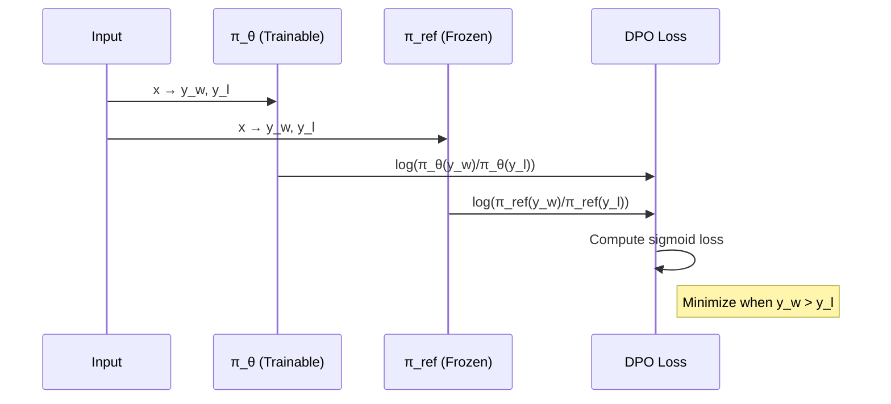
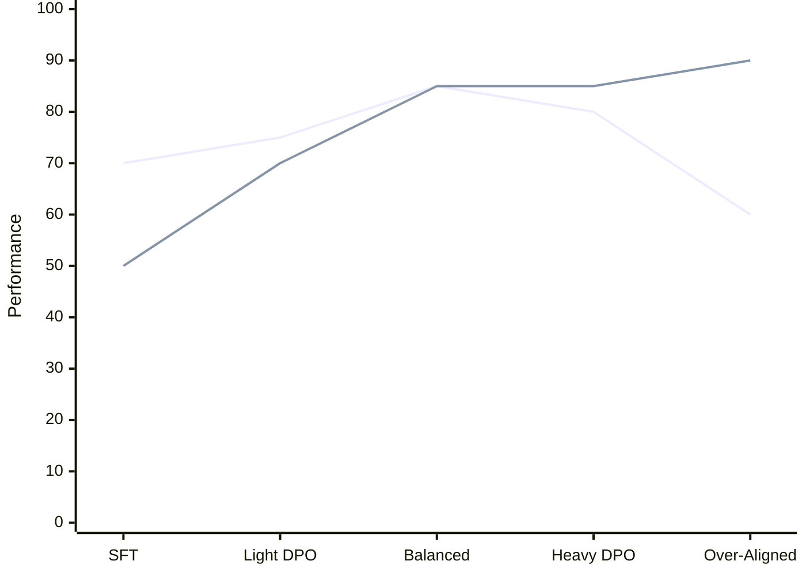

# Alignment & Optimization

Align model behavior with human preferences using DPO and ORPO—without the complexity of RLHF.

## Overview

After supervised fine-tuning (SFT), models may still produce unwanted outputs:
- Harmful or toxic content
- Refusals to helpful requests
- Incorrect but confident statements
- Misaligned tone or style

**Alignment** steers model behavior toward human preferences.


**Alignment methods compared**:

| Method | Complexity | Data Required | Performance | Best For |
|--------|------------|---------------|-------------|----------|
| **SFT** | Low | Instruction-response | Baseline | Task learning |
| **RLHF** | Very High | Preferences + RL | Best | Production systems |
| **DPO** | Medium | Preference pairs | Near-RLHF | Most use cases |
| **ORPO** | Medium | Preference pairs | Near-DPO | Efficient training |

---

## Chapter 1: Why Alignment Matters

### The RLHF Complexity Problem

Traditional RLHF (Reinforcement Learning from Human Feedback) requires:
1. Train reward model on preference data
2. Use PPO (Proximal Policy Optimization) for RL
3. Careful tuning to avoid reward hacking

```mermaid
graph TB
    subgraph RLHF["RLHF Pipeline (Complex)"]
        A[Preference Data] --> B[Reward Model]
        B --> C[PPO Training]
        C --> D[Aligned Model]
    end
    
    subgraph DPO["DPO Pipeline (Simple)"]
        E[Preference Data] --> F[DPO Training]
        F --> G[Aligned Model]
    end
    
    style RLHF fill:#1a1a1a,stroke:#d73a49
    style DPO fill:#1a3a1a,stroke:#3fb950
```



**DPO/ORPO advantage**: Skip reward modeling and RL—optimize directly on preferences.

### When You Need Alignment

```mermaid
graph TD
    A[Use Case] --> B{Safety Critical?}
    B -->|Yes| C[Need Alignment]
    B -->|No| D{Public Facing?}
    D -->|Yes| C
    D -->|No| E{Specific Tone?}
    E -->|Yes| C
    E -->|No| F[SFT May Suffice]
    
    style A fill:#2d333b
    style B fill:#347d39
    style C fill:#238636
    style D fill:#347d39
    style E fill:#347d39
    style F fill:#1a1a1a
```



**Alignment is essential for**:
- Customer-facing chatbots
- Medical/legal advice
- Educational applications
- Brand-aligned content generation

---

## Chapter 2: Direct Preference Optimization (DPO)

### Theory and Derivation

DPO reformulates RLHF as a classification problem on preference pairs.

**Key insight**: Optimal policy for RLHF can be extracted directly from preferences without explicit reward modeling.

**DPO loss**:
```
L_DPO = -log(σ(β * log(π_θ(y_w|x)/π_ref(y_w|x)) - β * log(π_θ(y_l|x)/π_ref(y_l|x))))
```

Where:
- `y_w` = preferred (winning) response
- `y_l` = dispreferred (losing) response
- `π_ref` = reference model (usually SFT checkpoint)
- `β` = temperature (typically 0.1-0.5)



### Preference Dataset Structure

```python
# DPO dataset format
{
    "prompt": "How do I stay motivated?",
    "chosen": "Here are some evidence-based strategies...",  # Preferred
    "rejected": "Just push through it."  # Dispreferred
}
```

**Sources of preference data**:
- Human annotations (best quality)
- AI feedback (scalable)
- Self-generated (model critiques its outputs)
- Upvote/downvote logs (from deployed systems)

### DPO Training Implementation

```python
from trl import DPOTrainer, DPOConfig
from transformers import AutoModelForCausalLM, AutoTokenizer

# Load model and reference
model = AutoModelForCausalLM.from_pretrained("mistral-7b-sft")
ref_model = AutoModelForCausalLM.from_pretrained("mistral-7b-sft")

# DPO configuration
dpo_config = DPOConfig(
    output_dir="./dpo-output",
    per_device_train_batch_size=4,
    gradient_accumulation_steps=4,
    learning_rate=5e-7,  # Much lower than SFT
    beta=0.1,            # KL regularization
    max_length=512,
    num_train_epochs=3,
    logging_steps=10,
)

# DPO trainer
trainer = DPOTrainer(
    model=model,
    ref_model=ref_model,
    args=dpo_config,
    train_dataset=preference_dataset,
    tokenizer=tokenizer,
)

trainer.train()
```

### Hyperparameter Differences from SFT

| Hyperparameter | SFT | DPO |
|----------------|-----|-----|
| Learning rate | 2e-5 | 5e-7 to 1e-6 |
| Batch size | 4-16 | 2-8 |
| Epochs | 2-3 | 1-2 |
| Beta (KL reg) | N/A | 0.1-0.5 |

---

## Chapter 3: ORPO (Odds Ratio Preference Optimization)

### Simplified DPO Formulation

ORPO combines SFT and preference optimization into a single loss:

```
L_ORPO = L_SFT + λ * L_odds_ratio
```

**Odds ratio loss**:
```
L_odds = -log(σ(log(odds(y_w)) - log(odds(y_l))))
where odds(y) = P(y|x) / (1 - P(y|x))
```


### Advantages over DPO

| Aspect | DPO | ORPO |
|--------|-----|------|
| Reference model | Required | Not needed |
| Training passes | 2 (policy + ref) | 1 (policy only) |
| Memory | Higher | ~30% lower |
| Speed | Baseline | 1.5× faster |
| Performance | Baseline | Comparable |

### ORPO Training

```python
from trl import ORPOConfig, ORPOTrainer

# ORPO configuration
orpo_config = ORPOConfig(
    output_dir="./orpo-output",
    per_device_train_batch_size=4,
    gradient_accumulation_steps=4,
    learning_rate=1e-6,
    max_length=512,
    beta=0.1,
    num_train_epochs=2,
)

# No reference model needed!
trainer = ORPOTrainer(
    model=model,
    args=orpo_config,
    train_dataset=preference_dataset,
    tokenizer=tokenizer,
)

trainer.train()
```

---

## Chapter 4: Preference Dataset Creation

### Generating Win/Lose Pairs

```python
from openai import OpenAI

# Generate preference data using AI feedback
def generate_preference_pair(prompt, client):
    # Generate two responses
    response_a = client.chat.completions.create(
        model="gpt-4",
        messages=[{"role": "user", "content": prompt}]
    )
    response_b = client.chat.completions.create(
        model="gpt-4",
        messages=[{"role": "user", "content": prompt}]
    )
    
    # Judge which is better
    judge_prompt = f"""
    Compare these responses to: {prompt}
    
    Response A: {response_a.choices[0].message.content}
    Response B: {response_b.choices[0].message.content}
    
    Which is more helpful, harmless, and honest? Reply 'A' or 'B'.
    """
    
    judgment = client.chat.completions.create(
        model="gpt-4",
        messages=[{"role": "user", "content": judge_prompt}]
    )
    
    chosen = response_a if "A" in judgment else response_b
    rejected = response_b if "A" in judgment else response_a
    
    return {
        "prompt": prompt,
        "chosen": chosen.choices[0].message.content,
        "rejected": rejected.choices[0].message.content
    }
```

### Self-Instruct for Preferences

```python
# Generate synthetic preference data
def self_instruct_preferences(base_model, prompts, n_variants=2):
    """Generate multiple responses and rank them."""
    preference_data = []
    
    for prompt in prompts:
        # Generate n_variants responses with different temperatures
        responses = []
        for temp in [0.3, 0.7, 1.0]:
            output = base_model.generate(prompt, temperature=temp)
            responses.append((temp, output))
        
        # Score each response (use reward model or heuristics)
        scored = []
        for temp, resp in responses:
            score = score_response(resp)  # Your scoring function
            scored.append((score, resp))
        
        # Sort by score
        scored.sort(reverse=True)
        
        preference_data.append({
            "prompt": prompt,
            "chosen": scored[0][1],      # Best
            "rejected": scored[-1][1],   # Worst
        })
    
    return preference_data
```

### Human Annotation Strategies

```mermaid
graph TB
    A[Raw Prompts] --> B[Generate Responses]
    B --> C{Annotation Method}
    C --> D[Crowdsourcing<br/>Scale: High<br/>Cost: Medium]
    C --> E[Expert Review<br/>Scale: Low<br/>Cost: High]
    C --> F[User Feedback<br/>Scale: Very High<br/>Cost: Low]
    
    D --> G[Preference Dataset]
    E --> G
    F --> G
    
    style A fill:#2d333b
    style B fill:#347d39
    style C fill:#238636
    style D fill:#1a1a1a
    style E fill:#1a1a1a
    style F fill:#1a1a1a
    style G fill:#1a1a1a,stroke:#3fb950
```



**Best practices**:
1. **Clear guidelines**: Define "helpful," "harmless," "honest"
2. **Calibration**: Annotators review example pairs first
3. **Multiple annotators**: 3+ per pair, use majority vote
4. **Quality checks**: Insert gold-standard pairs

---

## Chapter 5: Common Pitfalls

### Over-Alignment



**Over-alignment symptoms**:
- Excessive refusals ("As an AI...")
- Loss of helpful specificity
- Robotic, overly cautious tone
- Degraded performance on non-safety tasks

**Prevention**:
- Monitor refusal rate
- Include non-safety evals during training
- Use validation set with diverse queries
- Stop training when helpfulness drops

### Preference Noise Handling

**Problem**: Noisy or inconsistent preferences hurt training.

**Solutions**:
1. **Filter low-confidence pairs**: Remove ambiguous annotations
2. **Weight by agreement**: Down-weight pairs with annotator disagreement
3. **Label smoothing**: Prevent overfitting to noisy labels

```python
# Weighted DPO loss
class WeightedDPOTrainer(DPOTrainer):
    def compute_loss(self, model, inputs):
        loss, weights = super().compute_loss(model, inputs)
        # Down-weight uncertain pairs
        uncertainty = inputs.get("uncertainty", 1.0)
        return (loss * weights * uncertainty).mean()
```

### Evaluation Challenges

**Challenge**: Aligned models may score worse on traditional metrics.

| Metric | SFT Model | Aligned Model |
|--------|-----------|---------------|
| Perplexity | Lower | Higher (more varied) |
| Exact Match | Higher | Lower (more nuanced) |
| Human Rating | Medium | Higher |

**Solution**: Use multiple evaluation methods:
- Human preference tests (A/B)
- Safety benchmarks
- Task-specific metrics
- Qualitative review

---

## Alignment Configuration Reference

### DPO Template

```yaml
# dpo_config.yaml
model_name: "mistral-7b-sft"
beta: 0.1
loss_type: "sigmoid"  # sigmoid, hinge, cosine
max_length: 512
learning_rate: 5e-7
per_device_batch_size: 4
gradient_accumulation: 4
epochs: 1-2
warmup_ratio: 0.1
```

### ORPO Template

```yaml
# orpo_config.yaml
model_name: "mistral-7b-base"
beta: 0.1
max_length: 512
learning_rate: 1e-6
per_device_batch_size: 4
gradient_accumulation: 4
epochs: 2
```

---

## Summary

**Key takeaways**:

1. **DPO** simplifies RLHF to classification on preference pairs
2. **ORPO** is faster (no reference model) with comparable performance
3. **Preference data** can come from humans, AI, or self-generation
4. **Avoid over-alignment**: Monitor helpfulness during training
5. **Evaluate holistically**: Safety + task performance + human ratings

**Next**: Module 08 covers evaluation methodologies and benchmarks.
