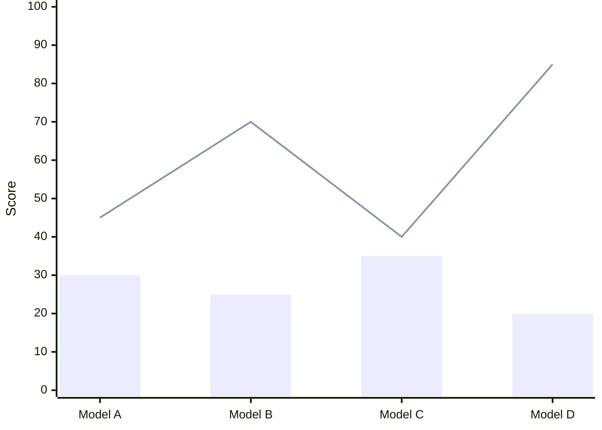
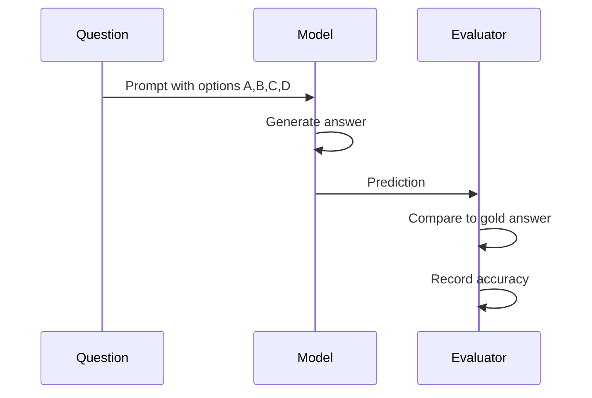
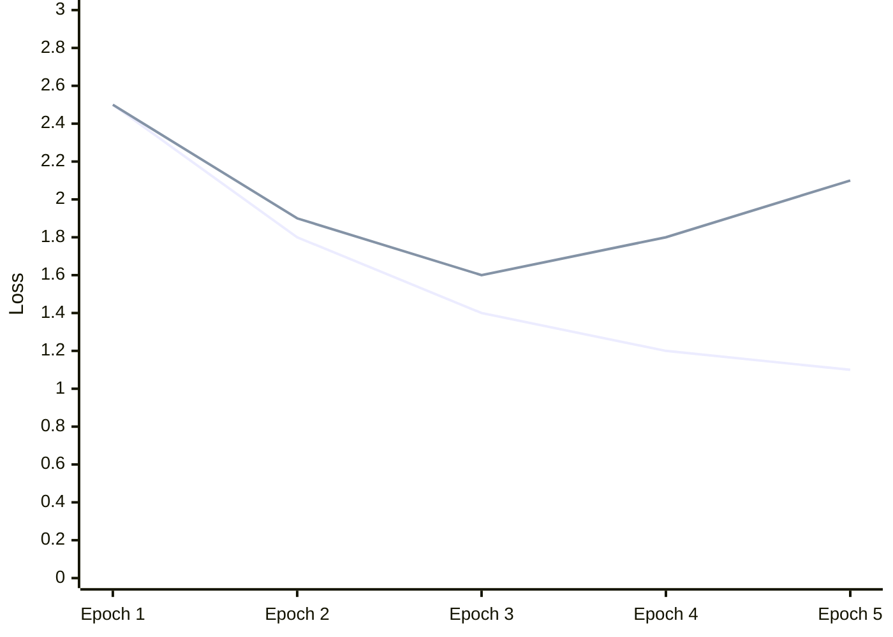

# Evaluation

Benchmarking fine-tuned models and avoiding overfitting.

## Overview

Evaluation determines if your fine-tuned model actually works—beyond just training loss.

```mermaid
graph LR
    A[Fine-Tuned Model] --> B{Evaluation Type}
    B --> C[Automated<br/>Benchmarks]
    B --> D[Task-Specific<br/>Metrics]
    B --> E[Human<br/>Evaluation]
    
    C --> F[MMLU, TruthfulQA, HellaSwag]
    D --> G[Exact Match, F1, ROUGE]
    E --> H[Preference Tests, Ratings]
    
    style A fill:#2d333b
    style B fill:#347d39
    style C fill:#238636
    style D fill:#238636
    style E fill:#238636
    style F fill:#1a1a1a
    style G fill:#1a1a1a
    style H fill:#1a1a1a
```



**Evaluation hierarchy**:

| Level | Method | Cost | Reliability | Speed |
|-------|--------|------|-------------|-------|
| **L1: Automated** | Perplexity, BLEU | Low | Medium | Instant |
| **L2: Benchmark** | MMLU, GSM8K | Low-Medium | High | Minutes |
| **L3: Human** | A/B tests, ratings | High | Highest | Days |

---

## Chapter 1: Evaluation Fundamentals

### Perplexity vs. Task Accuracy

**Perplexity** measures how "surprised" the model is by test data:
```
PPL = exp(-1/N * Σ log P(tokens))
```

**Lower perplexity = better language modeling**, but doesn't guarantee task success.


*Bars = Perplexity (lower is better), Line = Task Accuracy*

**Key insight**: Model D has lowest perplexity AND highest accuracy. Model B has low perplexity but poor task performance—likely overfit to language modeling.

### Holding Out Validation Data

```mermaid
graph TB
    A[Full Dataset] --> B[Train 70%]
    A --> C[Validation 15%]
    A --> D[Test 15%]
    
    B --> E[Fine-Tuning]
    C --> F[Hyperparameter Tuning<br/>Early Stopping]
    D --> G[Final Evaluation<br/>No Touching During Training]
    
    style A fill:#2d333b
    style B fill:#347d39
    style C fill:#238636
    style D fill:#1a1a1a,stroke:#d73a49
    style E fill:#347d39
    style F fill:#238636
    style G fill:#1a1a1a,stroke:#d73a49
```



**Golden rule**: Test set must NEVER touch training—no hyperparameter tuning, no early stopping decisions, no model selection.

### Avoiding Data Leakage

Common leakage sources:

| Source | Problem | Prevention |
|--------|---------|------------|
| **Train/test overlap** | Inflated scores | Deduplicate across splits |
| **Prompt contamination** | Model saw similar prompts | Check training corpus |
| **Evaluation leakage** | Using test for tuning | Strict train/val/test split |
| **Temporal leakage** | Future data in training | Time-based splits |

```python
# Check for data leakage
from sklearn.feature_extraction.text import HashingVectorizer

def detect_leakage(train_texts, test_texts):
    """Detect overlapping samples between train and test."""
    vectorizer = HashingVectorizer(n_features=2**20)
    train_hashes = set(vectorizer.transform(train_texts).nonzero()[0])
    test_hashes = set(vectorizer.transform(test_texts).nonzero()[0])
    
    overlap = train_hashes & test_hashes
    print(f"Potential leakage: {len(overlap)} overlapping samples")
    return len(overlap)
```

---

## Chapter 2: Benchmarking Frameworks

### Common Benchmarks

```mermaid
graph TB
    subgraph Knowledge["Knowledge Benchmarks"]
        MMLU[MMLU<br/>57 subjects]
        TruthfulQA[TruthfulQA<br/>Misconceptions]
    end
    
    subgraph Reasoning["Reasoning Benchmarks"]
        GSM8K[GSM8K<br/>Math word problems]
        HellaSwag[HellaSwag<br/>Commonsense]
    end
    
    subgraph Language["Language Benchmarks"]
        BIG[BIG-Bench<br/>Diverse tasks]
        ARC[ARC<br/>Science QA]
    end
    
    style MMLU fill:#238636
    style TruthfulQA fill:#238636
    style GSM8K fill:#347d39
    style HellaSwag fill:#347d39
    style BIG fill:#2d333b
    style ARC fill:#2d333b
```



### Running Benchmarks with lm-evaluation-harness

```bash
# Install
pip install lm-eval

# Run MMLU on your model
lm_eval --model hf \
    --model_args pretrained=./your-model \
    --tasks mmlu \
    --batch_size 4 \
    --device cuda \
    --output_path ./eval-results

# Multiple benchmarks
lm_eval --model hf \
    --model_args pretrained=./your-model \
    --tasks mmlu,truthfulqa,hellaswag \
    --batch_size 4
```

### Benchmark Score Interpretation

| Benchmark | What It Tests | Good Score | Excellent Score |
|-----------|---------------|------------|-----------------|
| **MMLU** | Knowledge (57 subjects) | 40-50% | 60%+ |
| **TruthfulQA** | Avoiding misconceptions | 30-40% | 50%+ |
| **HellaSwag** | Commonsense reasoning | 50-60% | 70%+ |
| **GSM8K** | Math reasoning | 30-40% | 60%+ |
| **ARC-C** | Science QA | 40-50% | 60%+ |

### Domain-Specific Evaluations

```python
# Custom domain evaluation for medical QA
medical_eval = {
    "name": "Medical-QA",
    "samples": [
        {
            "question": "What is the first-line treatment for hypertension?",
            "answer": "Thiazide diuretics",
            "options": [
                "Thiazide diuretics",
                "Beta blockers",
                "ACE inhibitors",
                "Calcium channel blockers"
            ]
        },
        # ... more questions
    ]
}

def evaluate_multiple_choice(model, tokenizer, eval_set):
    correct = 0
    for sample in eval_set["samples"]:
        prompt = f"Question: {sample['question']}\n\nOptions:\n"
        for i, opt in enumerate(sample["options"]):
            prompt += f"{chr(65+i)}. {opt}\n"
        prompt += "\nAnswer:"
        
        inputs = tokenizer(prompt, return_tensors="pt")
        outputs = model.generate(**inputs, max_new_tokens=5)
        pred = tokenizer.decode(outputs[0], skip_special_tokens=True)
        
        if sample["answer"][0].upper() in pred.upper():
            correct += 1
    
    return correct / len(eval_set["samples"])
```

---

## Chapter 3: Building Custom Evaluations

### Exact Match vs. Soft Metrics

**Exact Match (EM)**: Prediction must match answer exactly.
```python
def exact_match(pred, answer):
    return pred.strip().lower() == answer.strip().lower()
```

**Soft Metrics**: Partial credit for similar answers.

```python
from rouge_score import rouge_scorer

# ROUGE for summarization
scorer = rouge_scorer.RougeScorer(['rouge1', 'rougeL'], use_stem=True)
scores = scorer.score("reference text", "generated text")
print(f"ROUGE-1: {scores['rouge1'].fmeasure:.3f}")
print(f"ROUGE-L: {scores['rougeL'].fmeasure:.3f}")

# F1 for QA
from sklearn.metrics import f1_score

def qa_f1(pred, answer):
    """Token-level F1 for QA."""
    pred_tokens = set(pred.lower().split())
    answer_tokens = set(answer.lower().split())
    
    if not pred_tokens or not answer_tokens:
        return 0.0
    
    common = pred_tokens & answer_tokens
    precision = len(common) / len(pred_tokens)
    recall = len(common) / len(answer_tokens)
    
    if precision + recall == 0:
        return 0.0
    
    return 2 * precision * recall / (precision + recall)
```

### Multiple Choice Evaluation



```python
def evaluate_mc(model, tokenizer, questions):
    """Evaluate multiple choice questions."""
    results = []
    
    for q in questions:
        # Format prompt
        prompt = f"{q['question']}\n\n"
        for i, opt in enumerate(q['options']):
            prompt += f"{chr(65+i)}) {opt}\n"
        prompt += "\nAnswer:"
        
        # Get model prediction
        inputs = tokenizer(prompt, return_tensors="pt")
        if torch.cuda.is_available():
            inputs = {k: v.cuda() for k, v in inputs.items()}
        
        outputs = model.generate(
            **inputs,
            max_new_tokens=10,
            do_sample=False,  # Greble decoding for consistency
        )
        
        pred = tokenizer.decode(outputs[0], skip_special_tokens=True)
        pred = pred.split("Answer:")[-1].strip()
        
        # Extract predicted letter
        pred_letter = None
        for letter in "ABCD":
            if letter in pred.upper():
                pred_letter = letter
                break
        
        results.append({
            "question": q['question'],
            "correct_answer": q['answer'],
            "predicted": pred_letter,
            "correct": pred_letter == q['answer'][0].upper()
        })
    
    accuracy = sum(r['correct'] for r in results) / len(results)
    return accuracy, results
```

### Generation Length Analysis

```python
def analyze_generation_lengths(model, tokenizer, prompts, max_length=500):
    """Analyze how generation length varies with prompts."""
    lengths = []
    
    for prompt in prompts:
        inputs = tokenizer(prompt, return_tensors="pt")
        if torch.cuda.is_available():
            inputs = {k: v.cuda() for k, v in inputs.items()}
        
        outputs = model.generate(
            **inputs,
            max_new_tokens=max_length,
            do_sample=True,
            temperature=0.7,
        )
        
        gen_length = outputs.shape[1] - inputs['input_ids'].shape[1]
        lengths.append(gen_length)
    
    # Plot distribution
    plt.figure(figsize=(10, 5))
    plt.hist(lengths, bins=20, edgecolor='black', alpha=0.7)
    plt.xlabel('Generation Length (tokens)')
    plt.ylabel('Count')
    plt.title('Distribution of Generation Lengths')
    plt.axvline(np.mean(lengths), color='red', linestyle='--', label=f'Mean: {np.mean(lengths):.1f}')
    plt.legend()
    plt.grid(True, alpha=0.3)
    plt.show()
    
    return lengths
```

---

## Chapter 4: Overfitting Detection

### Train vs. Eval Loss Gap


*Blue = Train Loss, Yellow = Eval Loss. After epoch 3, eval loss increases = overfitting.*

```python
def detect_overfitting(train_losses, eval_losses, threshold=0.5):
    """Detect overfitting from loss curves."""
    gaps = [t - e for t, e in zip(train_losses, eval_losses)]
    
    # Find epoch with minimum eval loss (optimal stopping point)
    optimal_epoch = eval_losses.index(min(eval_losses))
    
    # Check if current gap exceeds threshold
    if optimal_epoch < len(eval_losses) - 1:
        current_gap = gaps[-1] - gaps[optimal_epoch]
        if current_gap > threshold:
            print(f"⚠️ Overfitting detected! Gap increased by {current_gap:.3f}")
            print(f"Optimal stopping: Epoch {optimal_epoch + 1}")
    
    return optimal_epoch
```

### Early Stopping Strategies

```python
from transformers import EarlyStoppingCallback, TrainerCallback

# Built-in early stopping
early_stopping = EarlyStoppingCallback(
    early_stopping_patience=3,      # Stop after 3 evals without improvement
    early_stopping_threshold=1e-4,  # Minimum improvement to count
)

# Custom callback with gap monitoring
class OverfittingCallback(TrainerCallback):
    def __init__(self, gap_threshold=0.5):
        self.gap_threshold = gap_threshold
        self.train_losses = []
        self.eval_losses = []
    
    def on_log(self, args, state, control, logs=None, **kwargs):
        if 'loss' in logs:
            self.train_losses.append(logs['loss'])
        if 'eval_loss' in logs:
            self.eval_losses.append(logs['eval_loss'])
            
            if len(self.train_losses) >= len(self.eval_losses):
                gap = self.train_losses[-1] - self.eval_losses[-1]
                if gap > self.gap_threshold:
                    print(f"⚠️ Large train/eval gap detected: {gap:.3f}")
                    control.should_training_stop = True

# Usage
trainer = Trainer(
    model=model,
    args=training_args,
    train_dataset=train_data,
    eval_dataset=eval_data,
    callbacks=[EarlyStoppingCallback(early_stopping_patience=3)],
)
```

### Regularization for Eval Performance

| Technique | Effect | When to Use |
|-----------|--------|-------------|
| **Dropout** | Reduces co-adaptation | Increase from 0.0 to 0.1 |
| **Weight decay** | L2 regularization | 0.01-0.1 |
| **Label smoothing** | Prevents overconfidence | 0.05-0.1 |
| **Early stopping** | Stop before overfitting | Always use with eval |

---

## Chapter 5: Quantitative vs. Qualitative

### Automated Metrics Limitations

```mermaid
graph TB
    A[Automated Metrics] --> B[Pros]
    A --> C[Limitations]
    
    B --> D[Fast, cheap, reproducible]
    B --> E[Good for regression detection]
    
    C --> F[Miss nuance and context]
    C --> G[Can be gamed]
    C --> H[Don't capture helpfulness]
    
    style A fill:#347d39
    style B fill:#238636
    style C fill:#d73a49
    style D fill:#1a1a1a
    style E fill:#1a1a1a
    style F fill:#1a1a1a
    style G fill:#1a1a1a
    style H fill:#1a1a1a
```



**Example**: A model can have high BLEU score but produce unhelpful responses:
```
Reference: "I recommend seeing a doctor if symptoms persist."
Model A:   "You should consult a physician if symptoms continue."  (BLEU: 0.45)
Model B:   "I recommend seeing a doctor if symptoms persist."      (BLEU: 1.0)
```
Model B has perfect BLEU but just copied the reference. Model A is equally helpful but scores lower.

### Manual Review Checklist

```python
# Human evaluation template
evaluation_template = """
Response Evaluation

Prompt: {prompt}
Response: {response}

Rate 1-5 (5 = best):
□ Helpfulness: Does it answer the question? [ ]
□ Accuracy: Is the information correct? [ ]
□ Safety: Is it harmless and appropriate? [ ]
□ Clarity: Is it easy to understand? [ ]
□ Conciseness: Is it appropriately brief? [ ]

Additional comments:
_________________________________
"""
```

### Case Study: Customer Support Bot

**Scenario**: Fine-tuned model for e-commerce support.

| Metric | Before SFT | After SFT | After DPO |
|--------|------------|-----------|-----------|
| **Perplexity** | 15.2 | 8.4 | 9.1 |
| **Exact Match** | 32% | 58% | 54% |
| **Human Rating** | 2.8/5 | 3.9/5 | 4.4/5 |
| **Escalation Rate** | 45% | 28% | 22% |

**Insight**: DPO lowered exact match slightly but significantly improved human ratings—responses became more helpful and empathetic.

---

## Evaluation Checklist

```mermaid
graph TD
    A[Model Ready for Eval] --> B[1. Held-out Test Set]
    B --> C[2. Multiple Metrics]
    C --> D[3. Baseline Comparison]
    D --> E[4. OOD Testing]
    E --> F[5. Human Review]
    
    style A fill:#2d333b
    style B fill:#347d39
    style C fill:#238636
    style D fill:#238636
    style E fill:#238636
    style F fill:#1a1a1a,stroke:#3fb950
```



- [ ] Eval on held-out data (not used in training)
- [ ] Multiple metrics (not just one)
- [ ] Compare against baseline model
- [ ] Test on out-of-distribution data
- [ ] Human review for critical applications

---

## Summary

**Key takeaways**:

1. **Perplexity ≠ Task Performance**: Use task-specific metrics
2. **Strict data splits**: Never leak test data into training
3. **Multiple benchmarks**: MMLU, TruthfulQA, HellaSwag for general capability
4. **Custom evals**: Build domain-specific tests for your use case
5. **Monitor overfitting**: Train/eval gap, early stopping
6. **Human evaluation**: Essential for production systems

**Next**: Module 09 covers model deployment and serving.
