# Model Deployment

Quantization, serving, and production readiness for fine-tuned models.

## Overview

Deploying a fine-tuned model requires more than just saving weights. Production systems need:
- **Efficiency**: Low latency, high throughput
- **Reliability**: Uptime, error handling
- **Scalability**: Handle varying load
- **Monitorability**: Track performance, detect issues

```mermaid
graph LR
    A[Fine-Tuned Model] --> B[Checkpoint Merging]
    B --> C[Quantization]
    C --> D{Deployment Target}
    D --> E[Cloud API<br/>vLLM/TGI]
    D --> F[Edge Device<br/>llama.cpp]
    D --> G[Mobile<br/>CoreML/TFLite]
    
    style A fill:#2d333b
    style B fill:#347d39
    style C fill:#238636
    style D fill:#347d39
    style E fill:#1a1a1a
    style F fill:#1a1a1a
    style G fill:#1a1a1a
```



---

## Chapter 1: Checkpoint Merging

### Merging LoRA Adapters

After LoRA/QLoRA training, merge adapters into base model for deployment:

```python
from peft import PeftModel
from transformers import AutoModelForCausalLM, AutoTokenizer

# Load base model
base_model = AutoModelForCausalLM.from_pretrained(
    "mistralai/Mistral-7B-v0.1",
    torch_dtype=torch.bfloat16,
    device_map="auto",
)

# Load adapter
model = PeftModel.from_pretrained(
    base_model,
    "./lora-checkpoint",
)

# Merge adapter into base model
merged_model = model.merge_and_unload()

# Save merged model
merged_model.save_pretrained("./merged-model")
tokenizer.save_pretrained("./merged-model")

print(f"Merged model saved. Size: {merged_model.config.hidden_size}")
```

### Why Merge?

| Aspect | Adapter + Base | Merged |
|--------|----------------|--------|
| **Load time** | Load 2 models | Load 1 model |
| **Memory** | Base + adapter overhead | Single model |
| **Inference** | Two forward passes | Single pass |
| **Deployment** | Complex | Simple |

```mermaid
sequenceDiagram
    participant App as Application
    participant Adapter as LoRA Adapter
    participant Base as Base Model
    
    App->>Base: Input
    Base->>Adapter: Hidden states
    Adapter->>Base: LoRA adjustment
    Base->>App: Output (combined)
    
    Note right: Before merge: 2 components
    
    App->>Merged: Input
    Merged->>App: Output (single model)
    
    Note right: After merge: 1 component
```

---

## Chapter 2: Quantization Methods

### Quantization Overview

Reduce model size and memory by using lower precision weights:

```mermaid
graph TB
    A[16-bit Model<br/>2 bytes/param] --> B{Quantization}
    B --> C[8-bit<br/>50% size]
    B --> D[4-bit<br/>25% size]
    B --> E[2-bit<br/>12.5% size]
    
    C --> F[Good quality]
    D --> G[Acceptable quality]
    E --> H[Degraded quality]
    
    style A fill:#2d333b
    style B fill:#347d39
    style C fill:#238636
    style D fill:#238636
    style E fill:#d73a49
    style F fill:#1a1a1a
    style G fill:#1a1a1a
    style H fill:#1a1a1a
```



### GGUF (llama.cpp format)

**GGUF** (GGML Unified Format) is optimized for CPU inference:

```bash
# Convert to GGUF
python llama.cpp/convert_hf_to_gguf.py \
    ./merged-model \
    --outfile model-f16.gguf \
    --outtype f16

# Quantize to 4-bit
./llama.cpp/quantize \
    model-f16.gguf \
    model-Q4_K_M.gguf \
    Q4_K_M

# Run inference
./llama.cpp/main \
    -m model-Q4_K_M.gguf \
    -p "Hello, how are you?" \
    -n 256
```

**GGUF Quantization Types**:

| Type | Size (7B) | Quality | Use Case |
|------|-----------|---------|----------|
| **Q2_K** | 2.5 GB | Poor | Testing only |
| **Q3_K_S** | 3.0 GB | Acceptable | Very limited RAM |
| **Q4_K_M** | 4.0 GB | Good | Default choice |
| **Q5_K_M** | 4.5 GB | Very Good | Quality priority |
| **Q6_K** | 5.0 GB | Excellent | Near-lossless |
| **Q8_0** | 6.0 GB | Near-perfect | Production |

### AWQ (Activation-aware Weight Quantization)

AWQ preserves important weights based on activation magnitude:

```bash
# Install autoawq
pip install autoawq

# Quantize model
from awq import AutoAWQForCausalLM

model_path = "./merged-model"
quant_path = "./model-awq"

# Load and quantize
model = AutoAWQForCausalLM.from_pretrained(model_path)
model.quantize(
    n_parallel=4,
    w_bit=4,           # 4-bit
    q_group_size=128,  # Group size
)

# Save
model.save_quantized(quant_path)
```

**AWQ vs. GGUF**:

| Aspect | AWQ | GGUF |
|--------|-----|------|
| **Hardware** | GPU | CPU/GPU |
| **Speed** | Fast (GPU) | Medium (CPU) |
| **Quality** | Excellent | Good-Excellent |
| **Best for** | Server deployment | Edge/local |

### EXL2 (Efficient LLM EXtensions)

EXL2 offers fine-grained bit control (2-8 bits):

```bash
# Install exllamav2
pip install exllamav2

# Quantize with specific bits
from exllamav2 import ExllamaV2Model, ExllamaV2Config

config = ExllamaV2Config()
config.model_dir = "./merged-model"
config.quantize = True
config.bits = 4.5  # Fractional bits supported!

model = ExllamaV2Model(config)
model.save_quantized("./model-exl2")
```

---

## Chapter 3: Serving Fine-Tuned Models

### vLLM (High-Throughput Serving)

**vLLM** uses PagedAttention for 2-4× throughput vs. naive serving:

```bash
# Install vllm
pip install vllm

# Start server
python -m vllm.entrypoints.api_server \
    --model ./merged-model \
    --host 0.0.0.0 \
    --port 8000 \
    --tensor-parallel-size 1 \
    --max-num-seqs 256

# Query API
curl http://localhost:8000/generate \
  -d '{
    "prompt": "What is machine learning?",
    "max_tokens": 100
  }'
```

**vLLM Configuration**:

| Parameter | Description | Recommended |
|-----------|-------------|-------------|
| `tensor-parallel-size` | GPUs for model parallelism | 1 for <13B, 2+ for larger |
| `max-num-seqs` | Max concurrent sequences | 256-512 |
| `gpu-memory-utilization` | Fraction of GPU memory | 0.9-0.95 |

### TGI (Text Generation Inference)

**TGI** by Hugging Face is optimized for production:

```dockerfile
# Dockerfile for TGI
FROM ghcr.io/huggingface/text-generation-inference:latest

COPY ./merged-model /app/model

ENV MODEL_ID=/app/model
ENV NUM_SHARD=1
ENV MAX_INPUT_LENGTH=2048
ENV MAX_TOTAL_TOKENS=4096
```

```bash
# Run with Docker
docker run --gpus all \
    -p 8080:80 \
    -v ./merged-model:/app/model \
    ghcr.io/huggingface/text-generation-inference:latest \
    --model-id /app/model
```

### FastAPI Wrapper

Simple custom serving with FastAPI:

```python
from fastapi import FastAPI
from pydantic import BaseModel
from transformers import AutoModelForCausalLM, AutoTokenizer
import torch

app = FastAPI()

# Load model
model = AutoModelForCausalLM.from_pretrained(
    "./merged-model",
    torch_dtype=torch.bfloat16,
    device_map="auto",
)
tokenizer = AutoTokenizer.from_pretrained("./merged-model")

class GenerateRequest(BaseModel):
    prompt: str
    max_tokens: int = 100
    temperature: float = 0.7

@app.post("/generate")
async def generate(req: GenerateRequest):
    inputs = tokenizer(req.prompt, return_tensors="pt").to(model.device)
    
    outputs = model.generate(
        **inputs,
        max_new_tokens=req.max_tokens,
        temperature=req.temperature,
        do_sample=req.temperature > 0,
        top_p=0.9,
    )
    
    response = tokenizer.decode(outputs[0], skip_special_tokens=True)
    return {"response": response}

# Run: uvicorn server:app --host 0.0.0.0 --port 8000
```

### Streaming Responses

```python
from fastapi.responses import StreamingResponse
import asyncio

async def stream_tokens(prompt, max_tokens=100):
    """Stream tokens as they're generated."""
    inputs = tokenizer(prompt, return_tensors="pt").to(model.device)
    
    # Generate one token at a time
    generated = inputs['input_ids']
    for _ in range(max_tokens):
        outputs = model.generate(
            **inputs,
            max_new_tokens=1,
            do_sample=True,
            temperature=0.7,
        )
        
        new_token = outputs[0, -1].item()
        token_text = tokenizer.decode([new_token])
        
        yield token_text
        
        # Append for next iteration
        generated = torch.cat([generated, outputs[:, -1:]], dim=1)
        inputs = {'input_ids': generated}

@app.post("/generate/stream")
async def generate_stream(req: GenerateRequest):
    return StreamingResponse(
        stream_tokens(req.prompt, req.max_tokens),
        media_type="text/event-stream",
    )
```

---

## Chapter 4: Production Considerations

### Model Versioning

```mermaid
graph LR
    A[Model Registry] --> B[v1.0<br/>Production]
    A --> C[v1.1<br/>Staging]
    A --> D[v2.0<br/>Development]
    
    B --> E[API Gateway]
    C --> F[Testing]
    D --> G[Evaluation]
    
    style A fill:#347d39
    style B fill:#238636
    style C fill:#1a1a1a
    style D fill:#1a1a1a
    style E fill:#2d333b
    style F fill:#2d333b
    style G fill:#2d333b
```



**Versioning strategies**:
- **Semantic versioning**: `major.minor.patch` (e.g., `1.2.0`)
- **Date-based**: `2024-01-15` for reproducible snapshots
- **Git-based**: Use commit hash as version

```python
# Model registry with Hugging Face Hub
from huggingface_hub import HfApi

api = HfApi()

# Upload with version
api.upload_folder(
    folder_path="./merged-model",
    repo_id="your-org/your-model",
    revision="v1.2.0",  # Version tag
    commit_message="Upload model v1.2.0",
)
```

### A/B Testing

```mermaid
graph TB
    A[User Request] --> B{Load Balancer}
    B -->|90%| C[Model A<br/>Control]
    B -->|10%| D[Model B<br/>Variant]
    C --> E[Log Metrics]
    D --> E
    E --> F[Compare Performance]
    
    style A fill:#2d333b
    style B fill:#347d39
    style C fill:#238636
    style D fill:#238636
    style E fill:#1a1a1a
    style F fill:#347d39
```



```python
# Simple A/B testing router
import random

class ABTestRouter:
    def __init__(self, model_a, model_b, traffic_split=0.1):
        self.model_a = model_a
        self.model_b = model_b
        self.traffic_split = traffic_split
    
    def select_model(self):
        if random.random() < self.traffic_split:
            return self.model_b, "B"
        return self.model_a, "A"
    
    def generate(self, prompt, **kwargs):
        model, variant = self.select_model()
        response = model.generate(prompt, **kwargs)
        
        # Log for analysis
        self.log_metrics(variant, response)
        
        return response, variant
```

### Rate Limiting and Scaling

```python
from slowapi import Limiter, _rate_limit_exceeded_handler
from slowapi.util import get_remote_address
from slowapi.errors import RateLimitExceeded

# Rate limiter
limiter = Limiter(key_func=get_remote_address)
app.state.limiter = limiter
app.add_exception_handler(RateLimitExceeded, _rate_limit_exceeded_handler)

@app.post("/generate")
@limiter.limit("100/minute")  # 100 requests per minute per IP
async def generate(req: GenerateRequest, request: Request):
    ...
```

**Scaling strategies**:

| Strategy | When to Use | Complexity |
|----------|-------------|------------|
| **Vertical** | Single GPU, increase memory | Low |
| **Horizontal** | Multiple replicas behind LB | Medium |
| **Tensor Parallel** | Single model across GPUs | High |
| **Pipeline Parallel** | Layer distribution across GPUs | High |

### Monitoring and Alerting

```python
import prometheus_client
from prometheus_client import Counter, Histogram, Gauge

# Metrics
REQUEST_COUNT = Counter('llm_requests_total', 'Total requests')
REQUEST_LATENCY = Histogram('llm_request_latency_seconds', 'Request latency')
TOKEN_COUNT = Counter('llm_tokens_generated_total', 'Tokens generated')
GPU_MEMORY = Gauge('llm_gpu_memory_bytes', 'GPU memory usage')

@app.post("/generate")
async def generate(req: GenerateRequest):
    start_time = time.time()
    REQUEST_COUNT.inc()
    
    # Generate
    outputs = model.generate(...)
    
    # Record metrics
    latency = time.time() - start_time
    REQUEST_LATENCY.observe(latency)
    TOKEN_COUNT.inc(outputs.shape[1])
    GPU_MEMORY.set(torch.cuda.memory_allocated())
    
    return {"response": response}
```

**Key metrics to track**:
- Request latency (p50, p95, p99)
- Token throughput (tokens/sec)
- GPU memory utilization
- Error rate (4xx, 5xx)
- Queue depth (pending requests)

---

## Chapter 5: Edge Deployment

### ONNX Export

Export model for cross-platform inference:

```python
from transformers import AutoModelForCausalLM, AutoTokenizer
import torch

# Load model
model = AutoModelForCausalLM.from_pretrained("./merged-model")
tokenizer = AutoTokenizer.from_pretrained("./merged-model")

# Export to ONNX
dummy_input = torch.randint(0, 1000, (1, 128))
torch.onnx.export(
    model,
    dummy_input,
    "model.onnx",
    input_names=["input_ids"],
    output_names=["logits"],
    dynamic_axes={
        "input_ids": {0: "batch_size", 1: "sequence_length"},
        "logits": {0: "batch_size", 1: "sequence_length"},
    },
)
```

### Mobile Deployment

**iOS (CoreML)**:
```bash
# Convert to CoreML
pip install coremltools

import coremltools as ct

# Load ONNX model
onnx_model = ct.converters.onnx.convert(model="model.onnx")

# Save CoreML model
onnx_model.save("model.mlmodel")

# Use in iOS app
# import YourModel
# let model = YourModel()
```

**Android (TFLite)**:
```python
# Convert to TFLite
import tensorflow as tf

converter = tf.lite.TFLiteConverter.from_saved_model("./saved_model")
converter.optimizations = [tf.lite.Optimize.DEFAULT]
tflite_model = converter.convert()

with open('model.tflite', 'wb') as f:
    f.write(tflite_model)
```

### Model Size Optimization

| Technique | Size Reduction | Quality Impact |
|-----------|----------------|----------------|
| **8-bit quantization** | 50% | Minimal |
| **4-bit quantization** | 75% | Small |
| **Pruning (20%)** | 20% | Minimal |
| **Pruning (50%)** | 50% | Moderate |
| **Knowledge distillation** | 90% | Depends on teacher |

---

## Serving Comparison

| Server | Max Throughput | Memory | Best For |
|--------|---------------|--------|----------|
| **vLLM** | Very High | Moderate | API services |
| **TGI** | High | Low | Production |
| **llama.cpp** | Low | Minimal | Local/edge |
| **Transformers** | Low | High | Development |

---

## Summary

**Key takeaways**:

1. **Merge adapters** before deployment for efficiency
2. **Quantization** reduces size 4-8× with minimal quality loss
3. **vLLM/TGI** for high-throughput serving
4. **Monitor** latency, throughput, and errors in production
5. **Edge deployment** requires ONNX/CoreML/TFLite conversion

**Next**: Module 10 covers MLOps pipelines and CI/CD.
