# MLOps & DevOps

CI/CD for LLMs, automated training, and production monitoring.

## Overview

MLOps brings software engineering practices to machine learning:
- **CI/CD**: Automated testing and deployment
- **CT**: Continuous training on new data
- **Monitoring**: Track performance in production
- **Reproducibility**: Version control for models and data

```mermaid
graph LR
    A[Code Commit] --> B[CI Pipeline]
    B --> C[Auto Training]
    C --> D[Evaluation]
    D --> E{Quality Gate}
    E -->|Pass| F[Deploy to Prod]
    E -->|Fail| G[Alert Team]
    F --> H[Monitoring]
    H --> I[Drift Detected?]
    I -->|Yes| C
    I -->|No| H
    
    style A fill:#2d333b
    style B fill:#347d39
    style C fill:#238636
    style D fill:#238636
    style E fill:#347d39
    style F fill:#1a1a1a,stroke:#3fb950
    style G fill:#1a1a1a,stroke:#d73a49
    style H fill:#238636
    style I fill:#347d39
```



---

## Chapter 1: CI/CD for Model Training

### GitHub Actions for Automated Training

```yaml
# .github/workflows/train-model.yml
name: Train Model

on:
  push:
    branches: [main]
    paths: ['data/**', 'configs/**']  # Trigger on data/config changes
  workflow_dispatch:  # Manual trigger

jobs:
  train:
    runs-on: ubuntu-latest
    
    steps:
    - uses: actions/checkout@v4
    
    - name: Setup Python
      uses: actions/setup-python@v5
      with:
        python-version: '3.10'
    
    - name: Install dependencies
      run: |
        pip install -r requirements.txt
        pip install wandb
    
    - name: Download dataset
      run: |
        huggingface-cli download your-org/dataset --local-dir ./data
    
    - name: Train model
      run: python train.py
      env:
        HF_TOKEN: ${{ secrets.HF_TOKEN }}
        WANDB_API_KEY: ${{ secrets.WANDB_API_KEY }}
    
    - name: Upload model to Hugging Face
      run: |
        huggingface-cli upload \
          your-org/your-model \
          ./output \
          --revision ${{ github.sha }}
    
    - name: Notify on success
      if: success()
      uses: slackapi/slack-github-action@v1
      with:
        payload: |
          {"text": "Model training completed successfully!"}
```

### GPU Job Orchestration

For training that requires GPUs, use self-hosted runners or cloud services:

```yaml
# .github/workflows/train-gpu.yml
name: Train on GPU

on:
  workflow_dispatch:
    inputs:
      model_size:
        description: 'Model size to train'
        required: true
        default: '7b'
        type: choice
        options: ['7b', '13b', '70b']

jobs:
  train:
    runs-on: [self-hosted, gpu, a100]
    
    steps:
    - uses: actions/checkout@v4
    
    - name: Setup environment
      run: |
        docker pull nvidia/cuda:12.0-base
        docker run --gpus all -v ${{ github.workspace }}:/workspace nvidia/cuda:12.0-base \
          python train.py --model_size ${{ github.event.inputs.model_size }}
    
    - name: Upload artifacts
      uses: actions/upload-artifact@v4
      with:
        name: model-checkpoint
        path: ./output
```

### Buildkite Pipeline

```yaml
# .buildkite/pipeline.yml
steps:
  - label: ":python: Install dependencies"
    command:
      - pip install -r requirements.txt
    agents:
      queue: "cpu"

  - label: ":test_tube: Run tests"
    command:
      - pytest tests/ -v
    agents:
      queue: "cpu"

  - label: ":gpu: Train model"
    command:
      - python train.py
    agents:
      queue: "gpu"
    env:
      HF_TOKEN: "${HF_TOKEN}"
    artifact_paths:
      - "./output/**"

  - label: ":evaluation: Evaluate model"
    command:
      - python evaluate.py
    agents:
      queue: "gpu"
    depends_on: "train"

  - label: ":rocket: Deploy"
    command:
      - ./deploy.sh
    agents:
      queue: "deploy"
    depends_on: "evaluate"
    if: build.branch == "main"
```

---

## Chapter 2: Automated Model Packaging

### Model Cards

```python
# generate_model_card.py
from huggingface_hub import ModelCard

def generate_model_card(model_path, training_config, eval_results):
    """Generate comprehensive model card."""
    
    card = ModelCard.from_template(
        template_path="model_card_template.md",
        model_name="My Fine-Tuned Model",
        model_type="Llama-3.2-3B",
        language=["en"],
        license="apache-2.0",
        tags=["llm", "fine-tuned", "text-generation"],
        
        # Training details
        training_config=training_config,
        training_data="your-org/dataset",
        training_steps=1000,
        
        # Evaluation results
        eval_results=eval_results,
        
        # Usage
        pipeline_tag="text-generation",
    )
    
    card.save(f"{model_path}/README.md")
    return card

# Usage
card = generate_model_card(
    "./output",
    training_config={"lr": 2e-5, "epochs": 3, "batch_size": 16},
    eval_results={"mmlu": 45.2, "truthfulqa": 38.5},
)
```

### Docker Containerization

```dockerfile
# Dockerfile for model serving
FROM nvidia/cuda:12.0-runtime-ubuntu22.04

WORKDIR /app

# Install Python
RUN apt-get update && apt-get install -y \
    python3.10 \
    python3-pip \
    && rm -rf /var/lib/apt/lists/*

# Install dependencies
COPY requirements.txt .
RUN pip3 install -r requirements.txt

# Copy model
COPY ./output /app/model
COPY server.py .

# Environment variables
ENV MODEL_PATH=/app/model
ENV PORT=8000

# Expose port
EXPOSE 8000

# Health check
HEALTHCHECK --interval=30s --timeout=10s --start-period=5s --retries=3 \
    CMD curl -f http://localhost:8000/health || exit 1

# Run server
CMD ["python3", "server.py"]
```

```yaml
# docker-compose.yml
version: '3.8'

services:
  llm-api:
    build: .
    ports:
      - "8000:8000"
    environment:
      - MODEL_PATH=/app/model
      - MAX_TOKENS=512
    volumes:
      - ./output:/app/model:ro
    deploy:
      resources:
        reservations:
          devices:
            - driver: nvidia
              count: 1
              capabilities: [gpu]
```

### Hugging Face Model Upload

```python
from huggingface_hub import HfApi, create_repo

api = HfApi()

# Create repository
create_repo(
    repo_id="your-org/your-model",
    repo_type="model",
    exist_ok=True,
    private=False,  # Set True for private models
)

# Upload model files
api.upload_folder(
    folder_path="./output",
    repo_id="your-org/your-model",
    commit_message="Upload fine-tuned model",
)

# Upload with version tag
api.upload_folder(
    folder_path="./output",
    repo_id="your-org/your-model",
    revision="v1.0.0",
    commit_message="Release v1.0.0",
)
```

---

## Chapter 3: Continuous Training (CT)

### Triggering on New Data

```mermaid
graph LR
    A[New Data] --> B{Quality Check}
    B -->|Pass| C[Trigger Training]
    B -->|Fail| D[Alert Data Team]
    C --> E[Train New Model]
    E --> F[Evaluate]
    F --> G{Better than Current?}
    G -->|Yes| H[Update Production]
    G -->|No| I[Archive Model]
    
    style A fill:#2d333b
    style B fill:#347d39
    style C fill:#238636
    style D fill:#d73a49
    style E fill:#238636
    style F fill:#238636
    style G fill:#347d39
    style H fill:#1a1a1a,stroke:#3fb950
    style I fill:#1a1a1a
```



```python
# continuous_training.py
import subprocess
from pathlib import Path
from datetime import datetime

class ContinuousTraining:
    def __init__(self, data_dir: str, model_dir: str, threshold: float = 0.02):
        self.data_dir = Path(data_dir)
        self.model_dir = Path(model_dir)
        self.threshold = threshold  # Minimum improvement to deploy
    
    def check_new_data(self) -> bool:
        """Check if new data is available."""
        latest_checkpoint = self.model_dir / "data_checkpoint.txt"
        
        if not latest_checkpoint.exists():
            return True
        
        with open(latest_checkpoint) as f:
            last_hash = f.read().strip()
        
        # Compute current data hash
        current_hash = self._compute_data_hash()
        
        return current_hash != last_hash
    
    def _compute_data_hash(self) -> str:
        """Compute hash of all data files."""
        import hashlib
        hasher = hashlib.md5()
        
        for data_file in sorted(self.data_dir.glob("*.jsonl")):
            with open(data_file, 'rb') as f:
                hasher.update(f.read())
        
        return hasher.hexdigest()
    
    def train(self) -> str:
        """Run training pipeline."""
        timestamp = datetime.now().strftime("%Y%m%d_%H%M%S")
        output_dir = self.model_dir / f"checkpoint_{timestamp}"
        output_dir.mkdir(parents=True, exist_ok=True)
        
        subprocess.run([
            "python", "train.py",
            "--output_dir", str(output_dir),
            "--data_dir", str(self.data_dir),
        ], check=True)
        
        return str(output_dir)
    
    def evaluate(self, model_path: str) -> dict:
        """Evaluate trained model."""
        result = subprocess.run(
            ["python", "evaluate.py", "--model", model_path],
            capture_output=True,
            text=True,
            check=True,
        )
        
        return json.loads(result.stdout)
    
    def should_deploy(self, new_metrics: dict, current_metrics: dict) -> bool:
        """Check if new model is better enough to deploy."""
        for metric in ["accuracy", "f1"]:
            improvement = new_metrics[metric] - current_metrics[metric]
            if improvement < self.threshold:
                return False
        return True
    
    def run(self):
        """Run continuous training pipeline."""
        if not self.check_new_data():
            print("No new data. Skipping training.")
            return
        
        print("New data detected. Starting training...")
        model_path = self.train()
        
        print("Evaluating new model...")
        new_metrics = self.evaluate(model_path)
        
        # Load current metrics
        current_metrics = self._load_current_metrics()
        
        if self.should_deploy(new_metrics, current_metrics):
            print(f"Model improved! Deploying...")
            self.deploy(model_path)
        else:
            print("Model not better enough. Archiving.")
            self.archive(model_path)
```

### Model Registry Integration

```python
import mlflow

class ModelRegistry:
    def __init__(self, registry_uri: str):
        mlflow.set_tracking_uri(registry_uri)
    
    def register(self, model_path: str, metrics: dict, tags: dict = None):
        """Register model in MLflow."""
        with mlflow.start_run():
            # Log parameters
            mlflow.log_params({
                "model_type": "llm",
                "architecture": "llama-3.2",
            })
            
            # Log metrics
            for name, value in metrics.items():
                mlflow.log_metric(name, value)
            
            # Log model
            mlflow.pytorch.log_model(
                model_path,
                artifact_path="model",
                registered_model_name="llm-fine-tuned",
            )
            
            # Add tags
            if tags:
                mlflow.set_tags(tags)
    
    def get_best_model(self, metric: str = "accuracy") -> str:
        """Get path to best model by metric."""
        client = mlflow.tracking.MlflowClient()
        
        versions = client.search_model_versions(
            "name='llm-fine-tuned'",
            order_by=f"metrics.{metric} DESC",
            max_results=1,
        )
        
        if versions:
            return client.get_model_version_download_link(versions[0].run_id)
        
        return None
```

### Rollback Strategies

```python
class RollbackManager:
    def __init__(self, registry, max_rollback_versions: int = 3):
        self.registry = registry
        self.max_rollback = max_rollback_versions
        self.rollback_history = []
    
    def rollback(self, reason: str):
        """Rollback to previous model version."""
        current_version = self._get_current_version()
        
        # Get previous version
        previous = self._get_previous_version(current_version)
        
        if not previous:
            raise Exception("No previous version to rollback to")
        
        # Deploy previous version
        self._deploy_version(previous)
        
        # Log rollback
        self.rollback_history.append({
            "from": current_version,
            "to": previous,
            "reason": reason,
            "timestamp": datetime.now().isoformat(),
        })
        
        print(f"Rolled back from {current_version} to {previous}")
    
    def auto_rollback(self, metrics: dict, thresholds: dict):
        """Automatically rollback if metrics below threshold."""
        for metric, threshold in thresholds.items():
            if metrics.get(metric, 0) < threshold:
                self.rollback(reason=f"{metric} below threshold: {metrics[metric]} < {threshold}")
                return True
        return False
```

---

## Chapter 4: Automated Evaluation

### Running Evals on Commit

```yaml
# .github/workflows/evaluate.yml
name: Evaluate Model

on:
  push:
    paths: ['output/**', 'evals/**']

jobs:
  evaluate:
    runs-on: gpu
    
    steps:
    - uses: actions/checkout@v4
    
    - name: Setup Python
      uses: actions/setup-python@v5
      with:
        python-version: '3.10'
    
    - name: Install dependencies
      run: pip install -r requirements.txt lm-eval
    
    - name: Run MMLU
      run: |
        lm_eval --model hf \
          --model_args pretrained=./output \
          --tasks mmlu \
          --batch_size 4 \
          --output_path ./eval-results/mmlu
    
    - name: Run TruthfulQA
      run: |
        lm_eval --model hf \
          --model_args pretrained=./output \
          --tasks truthfulqa \
          --batch_size 4 \
          --output_path ./eval-results/truthfulqa
    
    - name: Upload results
      uses: actions/upload-artifact@v4
      with:
        name: eval-results
        path: ./eval-results/
    
    - name: Check quality gate
      run: python check_quality_gate.py ./eval-results
```

### Quality Gates

```python
# check_quality_gate.py
import sys
import json

QUALITY_GATES = {
    "mmlu": {"min": 40.0, "target": 50.0},
    "truthfulqa": {"min": 30.0, "target": 40.0},
    "hellaswag": {"min": 50.0, "target": 60.0},
}

def check_quality_gate(eval_results: dict) -> bool:
    """Check if model passes quality gates."""
    all_passed = True
    
    for metric, thresholds in QUALITY_GATES.items():
        actual = eval_results.get(metric, 0)
        
        if actual < thresholds["min"]:
            print(f"❌ {metric}: {actual} < {thresholds['min']} (MIN)")
            all_passed = False
        elif actual < thresholds["target"]:
            print(f"⚠️ {metric}: {actual} < {thresholds['target']} (TARGET)")
        else:
            print(f"✓ {metric}: {actual} >= {thresholds['target']} (PASS)")
    
    return all_passed

if __name__ == "__main__":
    results_path = sys.argv[1]
    
    with open(f"{results_path}/summary.json") as f:
        results = json.load(f)
    
    if check_quality_gate(results):
        print("\n✓ All quality gates passed!")
        sys.exit(0)
    else:
        print("\n❌ Quality gates failed!")
        sys.exit(1)
```

### Performance Thresholds

| Metric | Minimum | Target | Excellent |
|--------|---------|--------|-----------|
| **MMLU** | 40% | 50% | 60%+ |
| **TruthfulQA** | 30% | 40% | 50%+ |
| **HellaSwag** | 50% | 60% | 70%+ |
| **Latency (p95)** | <500ms | <200ms | <100ms |
| **Throughput** | >10 tok/s | >50 tok/s | >100 tok/s |

---

## Chapter 5: Monitoring in Production

### Latency Tracking

```python
from prometheus_client import Histogram, observe
import time

# Define metrics
REQUEST_LATENCY = Histogram(
    'llm_request_latency_seconds',
    'Request latency',
    buckets=[0.1, 0.25, 0.5, 1.0, 2.5, 5.0, 10.0],
)

TOKEN_LATENCY = Histogram(
    'llm_token_latency_seconds',
    'Per-token latency',
    buckets=[0.01, 0.05, 0.1, 0.25, 0.5, 1.0],
)

@app.post("/generate")
async def generate(req: GenerateRequest):
    start_time = time.time()
    
    # Generate
    outputs = model.generate(...)
    
    # Record metrics
    total_latency = time.time() - start_time
    tokens_generated = outputs.shape[1] - inputs["input_ids"].shape[1]
    per_token_latency = total_latency / tokens_generated
    
    REQUEST_LATENCY.observe(total_latency)
    TOKEN_LATENCY.observe(per_token_latency)
    
    return {"response": response, "latency_ms": total_latency * 1000}
```

### Token Consumption Tracking

```python
from prometheus_client import Counter

TOKENS_GENERATED = Counter(
    'llm_tokens_generated_total',
    'Total tokens generated',
    labelnames=['model_version', 'endpoint'],
)

@app.post("/generate")
async def generate(req: GenerateRequest):
    # ... generation code ...
    
    TOKENS_GENERATED.labels(
        model_version="v1.0.0",
        endpoint="/generate",
    ).inc(tokens_generated)
    
    return {"response": response}
```

### Drift Detection

```mermaid
graph TB
    A[Production Traffic] --> B[Sample Requests]
    B --> C[Compute Embeddings]
    C --> D[Compare to Training]
    D --> E{Drift Score}
    E -->|High| F[Alert: Data Drift]
    E -->|Normal| G[Continue Monitoring]
    F --> H[Trigger Retraining]
    
    style A fill:#2d333b
    style B fill:#347d39
    style C fill:#238636
    style D fill:#238636
    style E fill:#347d39
    style F fill:#d73a49
    style G fill:#238636
    style H fill:#347d39
```



```python
import numpy as np
from scipy import stats

class DriftDetector:
    def __init__(self, reference_data: np.ndarray, threshold: float = 0.1):
        self.reference = reference_data
        self.threshold = threshold
    
    def compute_drift(self, current_data: np.ndarray) -> float:
        """Compute drift score using KS test."""
        # Compare distributions
        ks_statistic, p_value = stats.ks_2samp(
            self.reference.flatten(),
            current_data.flatten(),
        )
        
        return ks_statistic  # Higher = more drift
    
    def check_drift(self, current_data: np.ndarray) -> tuple:
        """Check if drift exceeds threshold."""
        drift_score = self.compute_drift(current_data)
        
        if drift_score > self.threshold:
            return True, drift_score
        return False, drift_score

# Usage
detector = DriftDetector(reference_data=training_embeddings)

# Check periodically
is_drifting, score = detector.check_drift(current_embeddings)

if is_drifting:
    print(f"⚠️ Data drift detected! Score: {score:.3f}")
    # Trigger retraining
```

### Alerting Setup

```python
# alerting.py
import requests

class AlertManager:
    def __init__(self, slack_webhook: str, pagerduty_key: str):
        self.slack_webhook = slack_webhook
        self.pagerduty_key = pagerduty_key
    
    def send_slack(self, message: str, severity: str = "warning"):
        """Send Slack alert."""
        color = {"warning": "orange", "critical": "red", "info": "green"}[severity]
        
        payload = {
            "attachments": [{
                "color": color,
                "title": f"LLM Alert: {severity.upper()}",
                "text": message,
            }]
        }
        
        requests.post(self.slack_webhook, json=payload)
    
    def send_pagerduty(self, description: str, severity: str = "error"):
        """Trigger PagerDuty incident."""
        payload = {
            "routing_key": self.pagerduty_key,
            "event_action": "trigger",
            "payload": {
                "summary": description,
                "severity": severity,
                "source": "llm-production",
            }
        }
        
        requests.post("https://events.pagerduty.com/v2/enqueue", json=payload)
    
    def alert_on_latency(self, p95_latency: float, threshold: float):
        """Alert if latency exceeds threshold."""
        if p95_latency > threshold:
            self.send_slack(
                f"High latency detected: p95={p95_latency*1000:.0f}ms (threshold: {threshold*1000:.0f}ms)",
                severity="warning",
            )
    
    def alert_on_error_rate(self, error_rate: float, threshold: float):
        """Alert if error rate exceeds threshold."""
        if error_rate > threshold:
            self.send_pagerduty(
                f"High error rate: {error_rate*100:.1f}% (threshold: {threshold*100:.1f}%)",
                severity="critical",
            )
```

---

## GitHub Actions Template

```yaml
name: Fine-Tune Model

on:
  push:
    branches: [main]
    paths: ['data/**']

jobs:
  train:
    runs-on: ubuntu-latest
    steps:
      - uses: actions/checkout@v4
      - name: Setup Python
        uses: actions/setup-python@v5
      - name: Install dependencies
        run: pip install -r requirements.txt
      - name: Fine-tune
        run: python train.py
        env:
          HF_TOKEN: ${{ secrets.HF_TOKEN }}
      - name: Upload model
        run: huggingface-cli upload your-org/your-model ./output
```

---

## Summary

**Key takeaways**:

1. **CI/CD pipelines** automate training on data/code changes
2. **Model packaging** includes cards, containers, and registry uploads
3. **Continuous training** triggers on new data with quality gates
4. **Automated evaluation** runs on every commit with pass/fail thresholds
5. **Production monitoring** tracks latency, tokens, errors, and drift

**Next**: Module 11 (Appendices) covers additional resources and reference materials.
