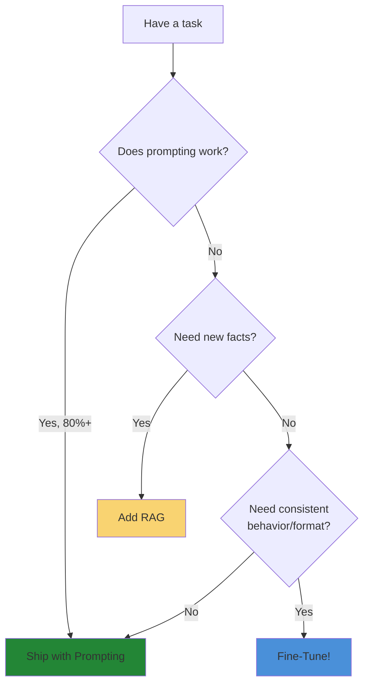

# Quick Revision: Fine-Tuning in a Hurry

> **5-Minute Cheat Sheet** — Everything you need to fine-tune an LLM quickly.

---

## Decision Tree: Should You Fine-Tune?



**Quick Answer**: Fine-tune when:
- ✅ Format compliance (JSON, structured output)
- ✅ Style/voice consistency
- ✅ Domain vocabulary (medical, legal, tech)
- ❌ NOT for facts that change (use RAG)

---

## Model Selection (60 Seconds)

| Your VRAM | Max Model | Method |
|-----------|-----------|--------|
| **<6 GB** | 7B | QLoRA |
| **6-12 GB** | 13B | QLoRA |
| **12-24 GB** | 13B | LoRA |
| **24-48 GB** | 70B | QLoRA |
| **>48 GB** | 70B | LoRA |

**Default Pick**: `Llama-3.1-8B` — best balance of quality and efficiency.

---

## Quick Setup (5 Minutes)

### Install Dependencies

```bash
pip install torch transformers peft trl datasets accelerate bitsandbytes
```

### Verify GPU

```python
import torch
print(f"GPU: {torch.cuda.get_device_name()}")
print(f"VRAM: {torch.cuda.get_device_properties(0).total_memory/1e9:.1f} GB")
```

---

## Minimal Fine-Tuning Script (QLoRA)

```python
from transformers import AutoModelForCausalLM, AutoTokenizer, TrainingArguments
from peft import LoraConfig, get_peft_model
from trl import SFTTrainer
from datasets import load_dataset

# 1. Load model with 4-bit quantization
model = AutoModelForCausalLM.from_pretrained(
    "meta-llama/Llama-3.2-3B",
    load_in_4bit=True,
    device_map="auto",
)
tokenizer = AutoTokenizer.from_pretrained("meta-llama/Llama-3.2-3B")
tokenizer.pad_token = tokenizer.eos_token

# 2. Configure LoRA
lora_config = LoraConfig(
    r=16,
    lora_alpha=32,
    target_modules=["q_proj", "k_proj", "v_proj", "o_proj"],
    lora_dropout=0.05,
    task_type="CAUSAL_LM",
)
model = get_peft_model(model, lora_config)

# 3. Load dataset
dataset = load_dataset("mlabonne/FineTome-100k", split="train[:1000]")

# 4. Train
args = TrainingArguments(
    output_dir="./output",
    per_device_train_batch_size=4,
    gradient_accumulation_steps=4,
    learning_rate=2e-4,
    num_train_epochs=2,
    fp16=True,
)

trainer = SFTTrainer(
    model=model,
    args=args,
    train_dataset=dataset,
    dataset_text_field="text",
)
trainer.train()

# 5. Save
trainer.save_model("./my-fine-tuned-model")
```

---

## Hyperparameter Quick Reference

| Parameter | QLoRA | LoRA | Full FT |
|-----------|-------|------|---------|
| **Learning Rate** | 2e-4 | 2e-4 | 2e-5 |
| **Batch Size** | 4-8 | 4-8 | 2-4 |
| **Gradient Accum** | 4-8 | 4-8 | 8-16 |
| **Epochs** | 2-3 | 2-3 | 1-2 |
| **LoRA Rank (r)** | 16-32 | 8-16 | N/A |
| **LoRA Alpha** | 2×r | 2×r | N/A |

**Rule**: If loss isn't decreasing → increase LR. If loss spikes → decrease LR.

---

## Data Format (ChatML)

```python
conversation = [
    {"role": "system", "content": "You are a helpful assistant."},
    {"role": "user", "content": "What is Python?"},
    {"role": "assistant", "content": "Python is a programming language."},
]

formatted = tokenizer.apply_chat_template(
    conversation,
    tokenize=False,
    add_generation_prompt=True
)
```

**Minimum Data**: 200-500 high-quality examples for LoRA/QLoRA.

---

## Common Errors & Quick Fixes

| Error | Quick Fix |
|-------|-----------|
| **OOM (Out of Memory)** | Reduce batch_size, enable `gradient_accumulation` |
| **NaN Loss** | Lower learning rate, add `max_grad_norm=1.0` |
| **Tokenizer mismatch** | Use `tokenizer.from_pretrained(model.config._name_or_path)` |
| **CUDA not available** | Check `torch.cuda.is_available()`, reinstall with CUDA |
| **Model not converging** | Increase LR, check data quality, add warmup steps |

---

## Evaluation Quick Check

```python
# Test inference
from transformers import pipeline

pipe = pipeline("text-generation", model="./my-fine-tuned-model")
result = pipe("Hello, how can I help?")
print(result[0]['generated_text'])
```

**Quick Metrics**:
- Generate 10 samples → check format compliance
- Compare against base model → verify improvement
- Manual review → spot-check 20 outputs

---

## Deployment Checklist

- [ ] Merge LoRA adapters: `model.merge_and_unload()`
- [ ] Save merged model: `model.save_pretrained("./merged")`
- [ ] Test inference on merged model
- [ ] Quantize for production (optional): GGUF/AWQ
- [ ] Deploy with vLLM or TGI for high throughput

---

## Cost Estimates (Single Run)

| Model | Method | VRAM | Time | Cost (Cloud) |
|-------|--------|------|------|--------------|
| **7B** | QLoRA | 6 GB | 1 hr | $0.50 |
| **7B** | LoRA | 16 GB | 1 hr | $1.00 |
| **13B** | QLoRA | 12 GB | 2 hr | $2.00 |
| **70B** | QLoRA | 48 GB | 8 hr | $24.00 |

*Based on Lambda Labs A100 pricing.*

---

## One-Page Decision Matrix

| Need | Solution | Time | Cost |
|------|----------|------|------|
| **Quick prototype** | Prompting + GPT-4 | 10 min | $0.01 |
| **Add company knowledge** | RAG + embedding DB | 2 hrs | $50/mo |
| **Consistent format** | QLoRA on 7B | 2 hrs | $5 |
| **Custom behavior** | LoRA on 13B | 4 hrs | $20 |
| **Maximum quality** | Full FT on 70B | 24 hrs | $500+ |

---

## Emergency Troubleshooting

**Training loss not decreasing?**
1. Increase learning rate (try 5e-4)
2. Check data is properly formatted
3. Verify tokenizer matches model

**Validation loss increasing?**
1. Reduce epochs (overfitting)
2. Add dropout (0.1)
3. Get more training data

**Model outputs garbage?**
1. Check ChatML format consistency
2. Verify special tokens added correctly
3. Test base model first (isolate issue)

**Keep getting OOM?**
1. Switch to QLoRA (4-bit)
2. Reduce `per_device_train_batch_size`
3. Increase `gradient_accumulation_steps`

---

## Key Commands Reference

```bash
# Check GPU
nvidia-smi

# Check CUDA
python -c "import torch; print(torch.cuda.is_available())"

# Monitor training
watch -n 1 nvidia-smi

# Run script with CUDA
CUDA_VISIBLE_DEVICES=0 python train.py

# Upload to Hugging Face
huggingface-cli upload your-username/your-model ./output
```

---

## Paper-Validated Defaults

| Method | Paper-Validated Settings |
|--------|-------------------------|
| **LoRA** | r=16, alpha=32, target=all linear layers |
| **QLoRA** | NF4 quantization, double quantization ON |
| **DPO** | beta=0.1, reference model = SFT checkpoint |
| **ORPO** | beta=0.1, no reference model needed |

---

## Next Steps After Quick Win

1. ✅ Get it working (this guide)
2. 📊 Evaluate properly (Module 08)
3. 🔄 Optimize hyperparameters (Module 05)
4. 🚀 Deploy to production (Module 09)
5. 📈 Monitor and retrain (Module 10)

---

*Print this page for quick reference during your first fine-tuning run.*
