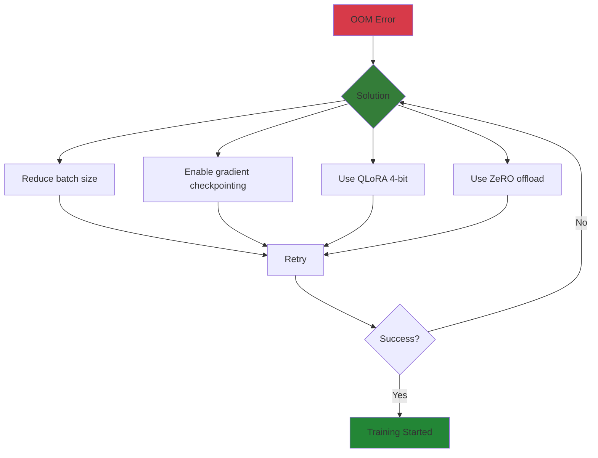
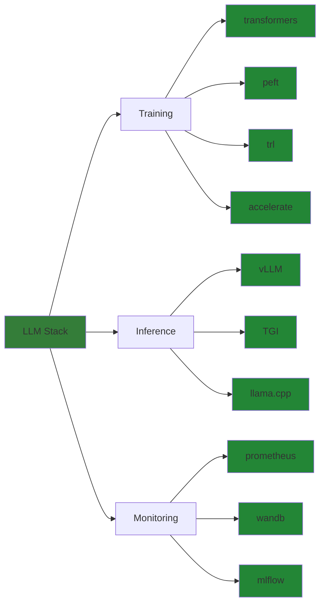

# Appendices

Reference material, troubleshooting, and supplementary resources for LLM fine-tuning.

---

## Glossary

### A-C

| Term | Definition |
|------|------------|
| **Adapter** | Small trainable module inserted into frozen model layers |
| **Alignment** | Steering model behavior toward human preferences |
| **Attention Mask** | Binary tensor indicating which tokens to attend to |
| **Batch Size** | Number of samples processed before gradient update |
| **Beam Search** | Decoding strategy exploring multiple hypotheses |
| **BFT** | Behavior Fine-Tuning, aligning model responses |
| **Causal LM** | Language model with unidirectional (left-to-right) attention |
| **Checkpoint** | Saved model state during/after training |
| **CoT** | Chain-of-Thought, prompting for step-by-step reasoning |
| **Cross-Entropy** | Loss function measuring prediction vs. target distribution |

### D-F

| Term | Definition |
|------|------------|
| **Data Leakage** | Test/validation data contaminating training set |
| **DDP** | Distributed Data Parallel, multi-GPU training |
| **DeepSpeed** | Microsoft's library for large model training |
| **DoRA** | Decomposed Low-Rank Adaptation, LoRA variant |
| **DPO** | Direct Preference Optimization, RLHF alternative |
| **Dropout** | Regularization technique, randomly zeroing activations |
| **Embedding** | Vector representation of tokens |
| **Epoch** | One complete pass through training data |
| **EXL2** | Efficient LLM EXtensions, high-bit quantization |
| **F1 Score** | Harmonic mean of precision and recall |

### G-L

| Term | Definition |
|------|------------|
| **GGUF** | GGML Unified Format, CPU-optimized model format |
| **Gradient Accumulation** | Accumulating gradients over multiple batches |
| **Gradient Checkpointing** | Memory optimization, recomputing activations |
| **GQA** | Grouped Query Attention, efficient attention variant |
| **Instruction Tuning** | Fine-tuning on instruction-following datasets |
| **KL Divergence** | Measure of difference between distributions |
| **LLM** | Large Language Model |
| **LoRA** | Low-Rank Adaptation, parameter-efficient fine-tuning |
| **Loss Spike** | Sudden increase in training loss |
| **LR Scheduler** | Learning rate adjustment over training |

### M-P

| Term | Definition |
|------|------------|
| **MAUVE** | Metric comparing generated vs. human text |
| **MinHash** | Locality-sensitive hashing for deduplication |
| **MQA** | Multi-Query Attention, shared KV heads |
| **NF4** | NormalFloat 4-bit, quantization format |
| **NMT** | Neural Machine Translation |
| **OOM** | Out Of Memory (GPU/CPU) |
| **ORPO** | Odds Ratio Preference Optimization |
| **Overfitting** | Model memorizes training data, poor generalization |
| **PagedAttention** | vLLM's memory-efficient attention |
| **PEFT** | Parameter-Efficient Fine-Tuning |
| **Perplexity** | Exponential of cross-entropy, lower is better |
| **PPO** | Proximal Policy Optimization, RL algorithm |
| **Prefix Tuning** | PEFT method, trainable prefix vectors |
| **Prompt Tuning** | PEFT method, trainable soft prompts |

### Q-Z

| Term | Definition |
|------|------------|
| **QLoRA** | Quantized LoRA, 4-bit LoRA fine-tuning |
| **Quantization** | Reducing numerical precision of weights |
| **RAG** | Retrieval-Augmented Generation |
| **RLHF** | Reinforcement Learning from Human Feedback |
| **ROUGE** | Recall-Oriented Understudy for Gisting Evaluation |
| **SFT** | Supervised Fine-Tuning |
| **Softmax** | Activation function converting logits to probabilities |
| **Temperature** | Sampling parameter controlling randomness |
| **Token** | Unit of text (word, subword, or character) |
| **Tokenizer** | Converts text to token IDs |
| **Top-p** | Nucleus sampling, probability mass threshold |
| **Transformer** | Neural network architecture with self-attention |
| **VRAM** | Video RAM (GPU memory) |
| **ZeRO** | Zero Redundancy Optimizer, DeepSpeed memory optimization |

---

## Common Errors & Solutions

### CUDA Out of Memory

```
torch.cuda.OutOfMemoryError: CUDA out of memory.
Tried to allocate 2.00 GiB (GPU 0; 24.00 GiB total capacity)
```

**Causes**:
- Batch size too large
- Model too large for GPU
- Memory fragmentation

**Solutions**:

```yaml
# 1. Reduce batch size
per_device_train_batch_size: 2  # Was 8

# 2. Enable gradient accumulation
gradient_accumulation_steps: 4  # Maintain effective batch size

# 3. Enable gradient checkpointing
gradient_checkpointing: true    # Saves ~40% memory

# 4. Use mixed precision
bf16: true                      # or fp16: true

# 5. Use QLoRA
quantization_config:
  load_in_4bit: true
  bnb_4bit_quant_type: "nf4"
```



### Tokenizer Mismatch

```
ValueError: Tokenizer class mismatch: 
Expected LlamaTokenizer, got PreTrainedTokenizerFast
```

**Causes**:
- Loading wrong tokenizer for model
- Cached tokenizer conflict

**Solutions**:

```python
# Always load tokenizer from same checkpoint as model
tokenizer = AutoTokenizer.from_pretrained(model.config._name_or_path)

# Or explicitly specify
tokenizer = LlamaTokenizer.from_pretrained("meta-llama/Llama-2-7b-hf")

# Clear cache if needed
# rm -rf ~/.cache/huggingface/hub/*
```

### NaN Loss

```
Loss: nan
Step: 142
```

**Causes**:
- Learning rate too high
- Corrupted training data
- Numerical instability

**Solutions**:

```yaml
# 1. Reduce learning rate
learning_rate: 1e-6  # Was 2e-4

# 2. Add gradient clipping
max_grad_norm: 1.0

# 3. Warmup steps
warmup_steps: 100
warmup_ratio: 0.1

# 4. Check data for corruption
python check_data.py --dataset ./data

# 5. Use stable attention
attn_implementation: "sdpa"  # Scaled Dot-Product Attention
```

```python
# Debug NaN detection
def check_nan(model, inputs):
    outputs = model(**inputs)
    if torch.isnan(outputs.loss):
        print("NaN detected in loss!")
        for name, param in model.named_parameters():
            if torch.isnan(param.grad).any():
                print(f"NaN gradient in {name}")
```

### Model Not Responding / Hanging

```
Training started but no output for 30+ minutes
```

**Causes**:
- Deadlock in distributed training
- Data loading bottleneck
- Network issues (multi-node)

**Solutions**:

```yaml
# 1. Check data loading
dataloader_num_workers: 4
dataloader_prefetch_factor: 2

# 2. Disable unnecessary logging
logging_steps: 100  # Reduce frequency

# 3. For DDP, check NCCL settings
torchrun --nnodes=1 --nproc_per_node=4 \
    --master_port=29500 train.py

# 4. Add timeout
timeout 2h python train.py
```

### LoRA Adapter Not Loading

```
OSError: Unable to load weights from pytorch_checkpoint
```

**Causes**:
- Wrong adapter format
- Missing base model specification

**Solutions**:

```python
# Always specify base model explicitly
from peft import PeftModel

base_model = AutoModelForCausalLM.from_pretrained("mistralai/Mistral-7B-v0.1")
model = PeftModel.from_pretrained(
    base_model,
    "./adapter-checkpoint",
    is_trainable=False,  # For inference
)
```

---

## Dataset Catalog

### Public Datasets by Domain

| Dataset | Size | Domain | License | Quality |
|---------|------|--------|---------|---------|
| **Alpaca** | 52K | General | CC BY-NC 4.0 | ⭐⭐⭐ |
| **Dolly** | 15K | General | CC BY-SA 3.0 | ⭐⭐⭐⭐ |
| **OpenOrca** | 1M+ | General | Apache 2.0 | ⭐⭐⭐⭐ |
| **UltraChat** | 1.5M | Chat | Apache 2.0 | ⭐⭐⭐⭐⭐ |
| **FineTome** | 100K | Chat | Apache 2.0 | ⭐⭐⭐⭐ |
| **CodeAlpaca** | 20K | Code | CC BY-SA 4.0 | ⭐⭐⭐ |
| **Evol-Instruct** | 250K | General | Apache 2.0 | ⭐⭐⭐⭐ |
| **GSM8K** | 8.5K | Math | MIT | ⭐⭐⭐⭐⭐ |
| **MedQA** | 10K | Medical | MIT | ⭐⭐⭐⭐ |
| **LawInstruct** | 50K | Legal | MIT | ⭐⭐⭐ |

### Loading Datasets

```python
from datasets import load_dataset

# Hugging Face Hub
dataset = load_dataset("teknium/OpenHermes-2.5", split="train")

# Local files
dataset = load_dataset("json", data_files="./data.jsonl", split="train")

# Multiple files
dataset = load_dataset(
    "json",
    data_files={"train": "train.jsonl", "test": "test.jsonl"},
)
```

### License Considerations

```mermaid
graph TB
    A[Dataset License] --> B{Commercial Use?}
    B -->|Yes| C[Check NC Clause]
    B -->|No| D[OK for Research]
    
    C -->|NC| E[Cannot Use Commercially]
    C -->|Permissive| F[OK for Commercial]
    
    E --> G[Find Alternative]
    F --> H[Proceed]
    
    style A fill:#2d333b
    style B fill:#347d39
    style C fill:#f9d371
    style D fill:#238636
    style E fill:#d73a49
    style F fill:#238636
    style G fill:#1a1a1a
    style H fill:#1a1a1a
```



**Common licenses**:
- **Apache 2.0**: Fully permissive, commercial OK
- **MIT**: Fully permissive, commercial OK
- **CC BY-SA**: Share-alike, commercial OK with attribution
- **CC BY-NC**: Non-commercial only
- **CC0**: Public domain

---

## Model Comparison Matrix

### Small Models (<10B)

| Model | Size | Context | VRAM (16-bit) | VRAM (4-bit) | Best For |
|-------|------|---------|---------------|--------------|----------|
| **Phi-3 Mini** | 3.8B | 128K | 8 GB | 3 GB | Edge, mobile |
| **Llama-3.2** | 3B | 8K | 6 GB | 2.5 GB | Development |
| **Llama-3.2** | 1B | 8K | 2 GB | 1 GB | IoT, embedded |
| **Gemma-2** | 9B | 8K | 18 GB | 5 GB | Reasoning |
| **Qwen2** | 7B | 32K | 14 GB | 4 GB | Multilingual |
| **Mistral** | 7B | 32K | 14 GB | 4 GB | General purpose |
| **TinyLlama** | 1.1B | 2K | 2 GB | 1 GB | Learning/testing |

### Medium Models (10B-40B)

| Model | Size | Context | VRAM (16-bit) | VRAM (4-bit) | Best For |
|-------|------|---------|---------------|--------------|----------|
| **Llama-3.1** | 8B | 128K | 16 GB | 5 GB | Production |
| **Mistral-Nemo** | 12B | 128K | 24 GB | 7 GB | Balanced |
| **Qwen2** | 14B | 128K | 28 GB | 8 GB | Multilingual |
| **Command-R** | 35B | 128K | 70 GB | 20 GB | RAG, tools |

### Large Models (40B+)

| Model | Size | Context | VRAM (16-bit) | VRAM (4-bit) | Best For |
|-------|------|---------|---------------|--------------|----------|
| **Llama-3.1** | 70B | 128K | 140 GB | 40 GB | Production SOTA |
| **Qwen2** | 72B | 128K | 144 GB | 42 GB | Multilingual SOTA |
| **Gemma-2** | 27B | 8K | 54 GB | 15 GB | Reasoning |
| **Yi-34B** | 34B | 200K | 68 GB | 18 GB | Long context |

### Model Selection Flowchart

```mermaid
graph TD
    A[Start] --> B{Use Case?}
    B -->|Edge/Mobile| C[Phi-3 Mini / Llama-3.2-1B]
    B -->|Development| D[Llama-3.2-3B / TinyLlama]
    B -->|Production| E{Budget?}
    B -->|SOTA| F[Llama-3.1-70B / Qwen2-72B]
    
    E -->|<8GB VRAM| G[Mistral-7B / Qwen2-7B]
    E -->|8-24GB VRAM| H[Llama-3.1-8B / Gemma-2-9B]
    E -->|>24GB VRAM| I[Command-R-35B / Yi-34B]
    
    style A fill:#2d333b
    style B fill:#347d39
    style C fill:#238636
    style D fill:#238636
    style E fill:#347d39
    style F fill:#238636
    style G fill:#238636
    style H fill:#238636
    style I fill:#238636
```



---

## CLI Reference

### Transformers CLI

```bash
# Convert model to GGUF
python src/transformers/models/llama/convert_llama_weights_to_gguf.py \
    --model_name_or_path ./model \
    --dump_path ./gguf-output

# Download model
huggingface-cli download meta-llama/Llama-2-7b-hf \
    --local-dir ./llama-2-7b

# Upload model
huggingface-cli upload your-org/your-model ./output

# Login
huggingface-cli login
```

### PEFT CLI

```bash
# No dedicated PEFT CLI, use Python API
python -c "
from peft import PeftModel
from transformers import AutoModelForCausalLM

model = AutoModelForCausalLM.from_pretrained('base-model')
model = PeftModel.from_pretrained(model, './adapter')
model.save_pretrained('./merged')
"
```

### TRL CLI

```bash
# SFT Training
trl sft \
    --model_name mistralai/Mistral-7B-v0.1 \
    --dataset_name mlabonne/FineTome-100k \
    --output_dir ./sft-output \
    --per_device_train_batch_size 4 \
    --learning_rate 2e-5 \
    --num_train_epochs 3

# DPO Training
trl dpo \
    --model_name ./sft-output \
    --dataset_name argilla/ultrafeedback-binarized \
    --output_dir ./dpo-output \
    --per_device_train_batch_size 2 \
    --learning_rate 5e-7 \
    --beta 0.1
```

### vLLM CLI

```bash
# Start API server
python -m vllm.entrypoints.api_server \
    --model ./merged-model \
    --host 0.0.0.0 \
    --port 8000 \
    --tensor-parallel-size 1

# Start OpenAI-compatible server
python -m vllm.entrypoints.openai.api_server \
    --model ./merged-model \
    --api-key sk-xxx
```

---

## Further Reading

### Key Papers

| Paper | Year | Impact | Link |
|-------|------|--------|------|
| **Attention Is All You Need** | 2017 | Transformer architecture | [arXiv:1706.03762](https://arxiv.org/abs/1706.03762) |
| **LoRA: Low-Rank Adaptation** | 2021 | Parameter-efficient FT | [arXiv:2106.09685](https://arxiv.org/abs/2106.09685) |
| **QLoRA** | 2023 | 4-bit fine-tuning | [arXiv:2305.14314](https://arxiv.org/abs/2305.14314) |
| **DPO** | 2023 | RLHF alternative | [arXiv:2305.18290](https://arxiv.org/abs/2305.18290) |
| **ORPO** | 2024 | Simplified alignment | [arXiv:2403.07691](https://arxiv.org/abs/2403.07691) |
| **LLaMA 2** | 2023 | Open foundation models | [arXiv:2307.09288](https://arxiv.org/abs/2307.09288) |
| **DeepSpeed** | 2020 | Large model training | [arXiv:1910.02054](https://arxiv.org/abs/1910.02054) |

### Essential Blogs

- **Hugging Face Blog**: https://huggingface.co/blog
  - RLHF, DPO, SFT tutorials
  - PEFT library guides
  
- **Sebastian Raschka**: https://magazine.sebastianraschka.com
  - LLM fine-tuning deep dives
  - Practical ML engineering

- **Tim Dettmers**: https://timdettmers.com
  - QLoRA, quantization research
  - GPU memory optimization

### Community Resources

| Resource | Type | Description |
|----------|------|-------------|
| **Hugging Face Discord** | Community | 50K+ ML practitioners |
| **r/LocalLLaMA** | Forum | Local model deployment |
| **ML Twitter** | Social | Latest research updates |
| **Papers With Code** | Database | Papers + implementations |
| **Hugging Face Course** | Tutorial | Free LLM fine-tuning course |

### Tools & Libraries



---

## Quick Reference Cards

### Training Configuration

```yaml
# Full Fine-Tuning (7B model, 24GB GPU)
model: "mistralai/Mistral-7B-v0.1"
per_device_train_batch_size: 4
gradient_accumulation_steps: 4
learning_rate: 2e-5
num_train_epochs: 3
bf16: true

# LoRA (7B model, 16GB GPU)
model: "mistralai/Mistral-7B-v0.1"
per_device_train_batch_size: 8
gradient_accumulation_steps: 4
learning_rate: 2e-4
lora_r: 16
lora_alpha: 32

# QLoRA (7B model, 8GB GPU)
model: "mistralai/Mistral-7B-v0.1"
load_in_4bit: true
per_device_train_batch_size: 4
gradient_accumulation_steps: 8
learning_rate: 2e-4
lora_r: 32
lora_alpha: 64
```

### Inference Configuration

```python
# High-quality generation
model.generate(
    **inputs,
    max_new_tokens=512,
    temperature=0.7,
    top_p=0.9,
    top_k=50,
    do_sample=True,
    repetition_penalty=1.1,
)

# Deterministic generation
model.generate(
    **inputs,
    max_new_tokens=256,
    do_sample=False,  # Greedy decoding
    num_beams=5,      # Beam search
)

# Fast generation
model.generate(
    **inputs,
    max_new_tokens=128,
    do_sample=True,
    temperature=1.0,  # Faster sampling
)
```

---

## Summary

This appendix provides:
- **Glossary**: A-Z of LLM fine-tuning terminology
- **Troubleshooting**: Common errors with solutions
- **Datasets**: Catalog with quality ratings and licenses
- **Models**: Comparison matrix for selection
- **CLI**: Command reference for key tools
- **Resources**: Papers, blogs, and community links
