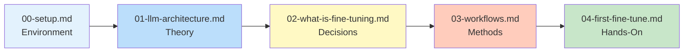

# Introduction

> **Module 02** — Your gateway to LLM fine-tuning. Setup, architecture, and your first fine-tune.

This module takes you from zero to your first fine-tuned model. We cover environment setup, transformer architecture refresher, decision frameworks, and a complete hands-on fine-tuning example.

---

## Table of Contents

### Environment & Foundations

- [**Setting Up Your Environment**](./00-setup.md)
  - Python virtual environment setup
  - Installing PyTorch with CUDA support
  - Hugging Face Hub authentication
  - Essential libraries: `transformers`, `peft`, `trl`, `datasets`
  - Docker alternative for reproducibility
  - Environment verification script

- [**Understanding LLM Architecture**](./01-llm-architecture.md)
  - Transformer architecture refresher
  - Attention mechanisms: Causal, Sliding Window, GQA, Mixed-RoPE
  - Flash Attention 2 & 3
  - Tokenization and its impact on training
  - Base models vs. instruction-tuned models
  - Model families: Llama 4 Scout/Maverick, Gemma 3/4, Qwen3/3.5/3.6, DeepSeek V4, GLM-5.2, Mistral-Small-24B
  - Memory breakdown by component

### Concepts & Decisions

- [**What is Fine-Tuning?**](./02-what-is-fine-tuning.md)
  - Transfer learning fundamentals
  - The fine-tuning spectrum: Prompting → LoRA → QLoRA → DPO → ORPO → GRPO → GMPO
  - PEFT methods: AdaLoRA, DoRA, GraLoRA, TinyLoRA, Lily, PeaNut, DeLoRA, RoAd, ALoRA
  - Alignment methods: DPO, ORPO, KTO, GRPO, RLOO, GMPO, AsyncGRPO
  - When to fine-tune vs. when to prompt
  - When to use RAG instead
  - Cost-benefit analysis with ROI calculator
  - Decision framework with case studies

- [**Fine-Tuning Workflows Overview**](./03-workflows.md)
  - Full fine-tuning: When and why
  - Parameter-Efficient Fine-Tuning (PEFT): 40+ methods including GraLoRA, Lily, PeaNut, TinyLoRA
  - LoRA, QLoRA, AdaLoRA, DoRA, GraLoRA, DeLoRA, RoAd, ALoRA, Cartridges
  - Alignment methods: DPO, ORPO, KTO, GRPO, RLOO, GMPO, AsyncGRPO
  - Method comparison: Memory, speed, performance
  - Choosing the right workflow for your constraints

### Hands-On

- [**Your First Fine-Tune**](./04-first-fine-tune.md)
  - Complete end-to-end example with Qwen3-8B
  - Casual → Formal text conversion
  - QLoRA configuration for 12GB GPUs
  - Training with TRL v1.7 (SFTConfig, SFTTrainer)
  - DoRA for stable convergence
  - Training, evaluation, and inference
  - Save and deploy your adapter

---

## Module Roadmap

---

## Prerequisites

| Requirement | Status |
|-------------|--------|
| Python 3.10+ | Required |
| Basic Python | Required |
| Command line basics | Required |
| ML experience | Not required |
| GPU access | Helpful (cloud options covered) |

---

## What You'll Build

By the end of this module:

1. **A working environment** — transformers 5.13+, peft 0.19+, trl 1.7+ installed and verified
2. **A decision framework** — Know when to fine-tune vs. prompt vs. RAG
3. **Your first fine-tuned model** — Qwen3-8B adapted for formal writing
4. **Understanding of trade-offs** — Full FT vs. LoRA vs. QLoRA vs. GraLoRA vs. TinyLoRA vs. DoRA
5. **Knowledge of alignment methods** — DPO, ORPO, KTO, GRPO, RLOO, GMPO for preference optimization

---

## Estimated Time

| Lesson | Time |
|--------|------|
| 00-setup | 30 min |
| 01-llm-architecture | 45 min |
| 02-what-is-fine-tuning | 30 min |
| 03-workflows | 30 min |
| 04-first-fine-tune | 60 min (includes training) |
| **Total** | **~3-4 hours** |

---

## Key Concepts

| Concept | Description |
|---------|-------------|
| **Transfer Learning** | Pre-train once, fine-tune for many tasks |
| **LoRA** | Train 1% of parameters, get 95% of full FT performance |
| **QLoRA** | 4-bit quantization enables 7B fine-tuning on 12GB GPU |
| **GraLoRA** | Granular LoRA — better full FT parity at high ranks |
| **DoRA** | Magnitude-decomposed LoRA, more stable convergence |
| **AdaLoRA** | Adaptive rank allocation for better efficiency |
| **TinyLoRA** | Train ~13 parameters — extreme parameter efficiency |
| **Lily** | Cross-layer parameter sharing for high-rank training |
| **DPO** | Direct Preference Optimization — alignment without RL |
| **ORPO** | Odds Ratio Preference Optimization — 1-stage alignment |
| **GRPO** | Group Relative Policy Optimization — new RLHF approach |
| **RLOO** | Reward Likelihood Optimization — greedy reward |
| **GMPO** | Geometric-Mean Policy Optimization — experimental RLHF |
| **Prompting vs. FT** | Prompting for knowledge, FT for behavior |
| **RAG** | Retrieval for facts, FT for style |

---

## Common Pitfalls

| Pitfall | How to Avoid |
|---------|--------------|
| CUDA OOM errors | Use QLoRA, reduce batch size, gradient checkpointing |
| Wrong method choice | Use decision framework in 02-what-is-fine-tuning.md |
| Data formatting issues | Follow templates in 04-first-fine-tune.md |
| Learning rate too high | Start with 2e-4 for LoRA, 1e-5 for full FT |
| Not validating | Always test on held-out examples |

---

## Next Module

Continue to [Module 03: Hardware Setup](../03-hardware-setup/) — GPU selection, cloud options, and cost optimization.

---

## Quick Links

- [Environment Setup Script](./00-setup.md#full-environment-check-script)
- [Decision Framework](./02-what-is-fine-tuning.md#the-decision-framework)
- [LoRA Implementation](./03-workflows.md#lora-low-rank-adaptation)
- [Complete Fine-Tuning Script](./04-first-fine-tune.md#complete-script)
