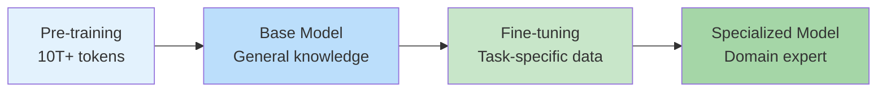
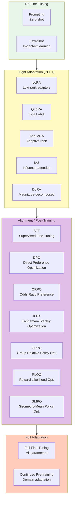
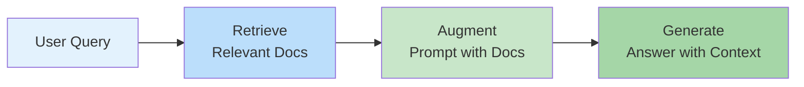
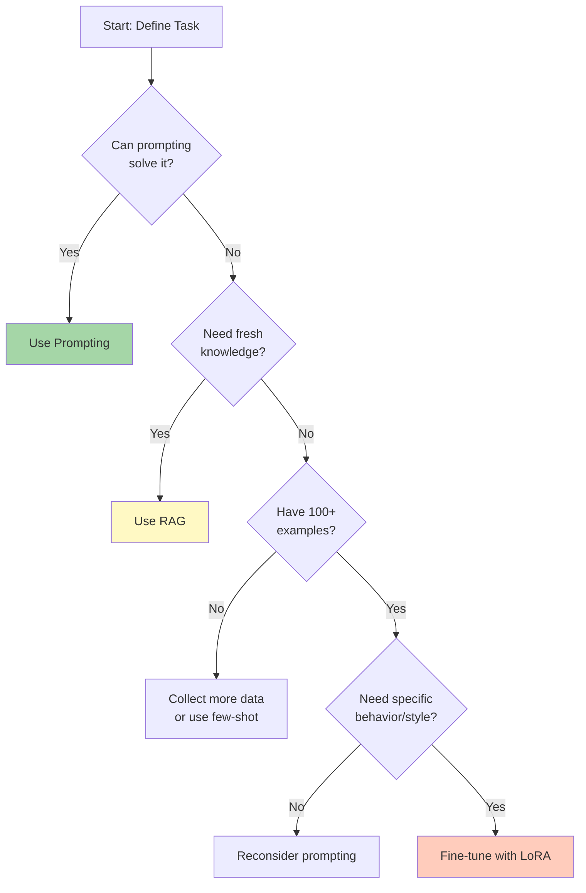

# What is Fine-Tuning?

> **Lesson 02** — Transfer learning, when to fine-tune vs. prompt, and cost-benefit analysis.

Fine-tuning is the process of adapting a pre-trained language model to a specific task or domain. This guide explains the theory, decision frameworks, and practical considerations.

---

## Table of Contents

1. [Transfer Learning Fundamentals](#transfer-learning-fundamentals)
2. [The Fine-Tuning Spectrum](#the-fine-tuning-spectrum)
3. [When to Fine-Tune vs. When to Prompt](#when-to-fine-tune-vs-when-to-prompt)
4. [When to Use RAG Instead](#when-to-use-rag-instead)
5. [Cost-Benefit Analysis](#cost-benefit-analysis)
6. [The Decision Framework](#the-decision-framework)
7. [Case Studies](#case-studies)

---

## Transfer Learning Fundamentals

### What is Transfer Learning?

Transfer learning is training a model on one task and adapting it to another related task.



### Why Transfer Learning Works

Language models learn generalizable representations:

| Layer | What It Learns | Transferability |
|-------|----------------|-----------------|
| **Early (1-8)** | Syntax, grammar, basic patterns | Universal across tasks |
| **Middle (9-20)** | Semantics, reasoning, facts | Somewhat task-specific |
| **Late (21-32)** | Task-specific behavior | Highly task-specific |

**Key Insight:** Fine-tuning primarily modifies the late layers. Early layers remain largely unchanged because syntax doesn't change between domains.

### The Two Phases

#### Phase 1: Pre-training

**Goal:** Learn general language patterns and world knowledge.

**Data:** Diverse, high-quality text from the internet.

**Objective:** Next token prediction.

```python
# Pre-training objective (simplified)
# Given: "The capital of France is"
# Target: "Paris"

loss = cross_entropy(model(input_text), target_token)
loss.backward()  # Update all parameters
```

**Cost:** Millions of dollars, weeks of training.

#### Phase 2: Fine-tuning

**Goal:** Adapt to specific task or domain.

**Data:** Task-specific, curated examples.

**Objective:** Depends on fine-tuning type.

```python
# Fine-tuning objective (simplified)
# Given: "What is the treatment for hypertension?"
# Target: "First-line treatment includes ACE inhibitors..."

loss = cross_entropy(model(question), answer)
loss.backward()  # Update subset of parameters (LoRA) or all (full)
```

**Cost:** $10-500, minutes to hours.

---

## The Fine-Tuning Spectrum

Fine-tuning isn't binary. It's a spectrum of adaptation:



### No Fine-Tuning

**Prompting:** Zero-shot or few-shot learning.

```python
# Zero-shot
prompt = "Classify: 'Great movie!' Sentiment:"
# Model completes: "Positive"

# Few-shot
prompt = """
Classify sentiment:
"Love this!" → Positive
"Hate it." → Negative
"Great movie!" →
"""
# Model completes: "Positive"
```

**When to use:**
- General tasks
- Limited data (<100 examples)
- Quick prototyping

### Light Adaptation (PEFT)

**LoRA (Low-Rank Adaptation):** Add small adapter layers.

```python
from peft import LoraConfig, get_peft_model

config = LoraConfig(
    r=8,              # Rank: 8
    lora_alpha=32,    # Scaling factor
    target_modules=["q_proj", "v_proj"],
    lora_dropout=0.1,
)

model = get_peft_model(base_model, config)
# Now only LoRA parameters are trainable
```

**Parameters:** ~0.1% of original model.

**Newer PEFT variants (PEFT 0.19+):**
- **AdaLoRA** — Adaptive rank allocation (better than fixed-rank LoRA)
- **IA3** — Infinitely small adapters, scales existing weights
- **DoRA** — Magnitude-decomposed LoRA, more stable convergence
- **GraLoRA** — Granular LoRA, better full FT parity at high ranks
- **TinyLoRA** — Extreme parameter efficiency (~13 params), great for RL
- **Lily** — Cross-layer parameter sharing, higher ranks with low param count
- **PeaNut** — Neural network tweakers, maximum expressivity
- **DeLoRA** — Decoupled angle/magnitude, prevents divergence
- **RoAd** — 2D Rotary Adaptation, fast inference with mixed adapters
- **ALoRA** — Activated LoRA, selective adapter use per token
- **WaveFT** — Wavelet domain updates, preserves subject fidelity
- **PVeRA** — Probabilistic vector-based, extends VeRA with sampling
- **PSOFT** — Principal subspace adaptation, preserves base model structure
- **Cartridges** — Context compression, long context → short context
- **BD-LoRA** — Block-diagonal for tensor parallel serving
- **LoKr** — Kronecker-factored LoRA, fewer parameters
- **AdaMSS** — Adaptive multi-subspace, dynamic budget allocation

**When to use:**
- Domain adaptation
- Style transfer
- Limited compute (single GPU)
- Multi-task deployment (swap adapters)

### Full Adaptation

**Full Fine-Tuning:** Update all parameters.

```python
# All parameters require gradients
for param in model.parameters():
    param.requires_grad = True
```

**When to use:**
- Major domain shift (e.g., general → medical)
- Large datasets (100K+ examples)
- Maximum performance required

---

## When to Fine-Tune vs. When to Prompt

### The Decision Matrix

| Factor | Prompting | Fine-Tuning |
|--------|-----------|-------------|
| **Data available** | <100 examples | 100+ examples |
| **Task complexity** | Simple, general | Complex, specialized |
| **Latency requirements** | OK with API calls | Need low latency |
| **Cost sensitivity** | Low volume | High volume |
| **Customization need** | Standard behavior | Specific style/format |
| **Knowledge freshness** | Static knowledge | Evolving domain |

### Detailed Breakdown

#### Choose Prompting When:

1. **The task is general knowledge**
   ```python
   # Good for prompting
   "Explain quantum computing to a 10-year-old"
   "Write a haiku about autumn"
   "Summarize this article in 3 sentences"
   ```

2. **You have <100 examples**
   - Not enough data for meaningful fine-tuning
   - Few-shot prompting works better

3. **You need flexibility**
   - One model handles multiple tasks
   - Easy to switch prompts

4. **Cost isn't a concern**
   - Low volume (<10K requests/month)
   - API pricing is acceptable

#### Choose Fine-Tuning When:

1. **The task requires domain expertise**
   ```python
   # Needs fine-tuning
   "Diagnose based on these symptoms: fever, rash, joint pain"
   "Extract entities from legal contracts"
   "Generate code in our internal DSL"
   ```

2. **You have 100+ high-quality examples**
   - Enough data for gradient updates
   - Diverse coverage of edge cases

3. **You need consistent behavior**
   - Always follow specific format
   - Never deviate from style guide
   - Reduce prompt engineering

4. **Cost or latency matters**
   - High volume (>100K requests/month)
   - Need sub-100ms responses
   - Want to run locally

### The 80/20 Rule

**Observation:** 80% of tasks can be solved with prompting alone.

**Fine-tuning is the last 20%** — where you need:
- Domain-specific knowledge
- Consistent output format
- Specialized behavior
- Cost optimization

---

## When to Use RAG Instead

### What is RAG?

Retrieval-Augmented Generation combines retrieval with generation:



### RAG vs. Fine-Tuning

| Aspect | RAG | Fine-Tuning |
|--------|-----|-------------|
| **Knowledge source** | External documents | Model weights |
| **Update frequency** | Real-time | Requires re-training |
| **Hallucination risk** | Lower (grounded) | Higher |
| **Setup complexity** | Medium | High |
| **Best for** | Factual QA | Behavior/style |

### When RAG Wins

1. **Factual questions with specific answers**
   ```python
   # RAG is better
   "What's our Q3 revenue according to the earnings report?"
   "What's the policy for remote work?"
   "Summarize the latest research on protein folding"
   ```

2. **Rapidly changing information**
   - News, stock prices, product updates
   - Fine-tuning can't keep up

3. **Auditability required**
   - Need to cite sources
   - Must verify answers

### When Fine-Tuning Wins

1. **Behavioral adaptation**
   ```python
   # Fine-tuning is better
   "Write in our brand voice"
   "Format outputs as SQL queries"
   "Act as a supportive therapist"
   ```

2. **Domain-specific reasoning**
   - Medical diagnosis patterns
   - Legal argumentation
   - Code generation in specific frameworks

3. **Latency-critical applications**
   - No retrieval step
   - Single forward pass

### The Hybrid Approach

Combine RAG + Fine-Tuning:

```python
# Fine-tuned model for behavior + RAG for knowledge
system_prompt = """You are a medical assistant. 
Answer based on the provided guidelines.
If unsure, say 'I need more information.'"""

retrieved_docs = retrieve(query, knowledge_base)
prompt = f"{system_prompt}\n\nGuidelines:\n{retrieved_docs}\n\nQuery: {query}"
response = model.generate(prompt)
```

---

## Cost-Benefit Analysis

### Cost Components

| Component | Prompting | Fine-Tuning |
|-----------|-----------|-------------|
| **Development** | Low (hours) | High (days-weeks) |
| **Data collection** | None | $1K-50K (annotation) |
| **Training** | $0 | $50-500 per run |
| **Inference (per 1K tokens)** | $0.0001-0.001 | $0.00001 (self-hosted) |
| **Maintenance** | Low | Medium (re-training) |

### Break-Even Analysis

**Scenario:** Customer support chatbot, 1M queries/month.

| Approach | Monthly Cost | Annual Cost |
|----------|--------------|-------------|
| **API (Prompting)** | $500 (at $0.0005/query) | $6,000 |
| **Self-hosted (Fine-tuned)** | $100 (GPU rental) + $200 (setup amortized) | $3,600 |

**Break-even:** ~6 months.

### ROI Calculator

```python
def calculate_roi(
    monthly_queries: int,
    api_cost_per_query: float,
    gpu_monthly_cost: float,
    setup_cost: float,
    months: int
) -> float:
    """Calculate savings from fine-tuning vs. API."""
    
    api_total = monthly_queries * api_cost_per_query * months
    fine_tune_total = setup_cost + (gpu_monthly_cost * months)
    
    savings = api_total - fine_tune_total
    roi = (savings / fine_tune_total) * 100
    
    return savings, roi

# Example: 1M queries/month, $0.0005/query, $200/month GPU, $500 setup
savings, roi = calculate_roi(
    monthly_queries=1_000_000,
    api_cost_per_query=0.0005,
    gpu_monthly_cost=200,
    setup_cost=500,
    months=12
)

print(f"Annual savings: ${savings:,.0f}")
print(f"ROI: {roi:.0f}%")
# Output: Annual savings: $4,200, ROI: 175%
```

### Hidden Costs

| Hidden Cost | Description | Mitigation |
|-------------|-------------|------------|
| **Data annotation** | $0.10-1.00 per example | Use synthetic data |
| **Evaluation** | Human review time | Automated evals |
| **Re-training** | Domain drift over time | Schedule quarterly |
| **Debugging** | Strange outputs | Extensive testing |
| **Opportunity cost** | Engineer time | Start with prompting |

---

## The Decision Framework

### Step-by-Step Decision Tree



### Questions to Ask

1. **What problem am I solving?**
   - Knowledge retrieval → RAG
   - Behavior adaptation → Fine-tuning
   - General task → Prompting

2. **What data do I have?**
   - <100 examples → Prompting
   - 100-1000 examples → LoRA
   - 1000+ examples → Full fine-tuning

3. **What are my constraints?**
   - Budget < $100 → Prompting
   - Single GPU → LoRA/QLoRA/Dora
   - Multi-GPU cluster → Full fine-tuning / AsyncGRPO

4. **How will I measure success?**
   - Accuracy on test set
   - Human evaluation
   - Business metrics (conversion, satisfaction)

---

## Case Studies

### Case Study 1: Legal Document Review

**Problem:** Law firm needs to extract clauses from contracts.

**Initial approach:** Prompting with GPT-4.
- Accuracy: 78%
- Cost: $2,000/month (50K documents)

**Fine-tuning approach:**
- Collected 5,000 annotated examples
- Fine-tuned Qwen3-8B with DoRA (PEFT 0.19)
- Training cost: $150
- Inference: Self-hosted, $300/month

**Result:**
- Accuracy: 92%
- Monthly savings: $1,700
- Payback period: <1 month

### Case Study 2: Customer Support Chatbot

**Problem:** E-commerce company needs 24/7 support.

**Initial approach:** Rule-based chatbot.
- Resolution rate: 45%
- Escalation to humans: 55%

**Fine-tuning approach:**
- Collected 10K support conversations
- Fine-tuned Mistral-Small-24B-Instruct-2501 with DPO
- Added RAG for product information

**Result:**
- Resolution rate: 82%
- Human escalation: 18%
- Customer satisfaction: +35%

### Case Study 3: Medical Triage Assistant

**Problem:** Hospital needs symptom checker.

**Constraints:**
- Must be accurate (safety-critical)
- Need to cite guidelines
- Frequent guideline updates

**Solution:** RAG + Fine-tuning
- Fine-tuned for medical communication style with DPO
- RAG for current guidelines
- Human review for edge cases

**Result:**
- Accuracy: 94% (validated by physicians)
- Safe deployment with oversight
- Easy guideline updates via RAG

---

## Next Steps

1. **Read [Fine-Tuning Workflows Overview](./03-workflows.md)** — Full FT, LoRA, QLoRA
2. **Assess your task** using the decision framework
3. **Start collecting data** if fine-tuning is the right choice

---

## References

- [Transfer Learning Survey](https://arxiv.org/abs/2006.04140) — Zhuang et al., 2020
- [When to Fine-Tune vs. Prompt](https://arxiv.org/abs/2305.11170) — Li et al., 2023
- [RAG vs. Fine-Tuning](https://arxiv.org/abs/2307.11866) — Gao et al., 2023
- [LoRA: Low-Rank Adaptation](https://arxiv.org/abs/2106.09685) — Hu et al., 2021
- [QLoRA: Efficient Finetuning of Quantized LLMs](https://arxiv.org/abs/2305.14314) — Dettmers et al., 2023
- [AdaLoRA: Adaptive Budget Allocation](https://arxiv.org/abs/2303.10512) — Zhang et al., 2023
- [DoRA: Weight-Decomposed Low-Rank Adaptation](https://arxiv.org/abs/2402.09353) — Liu et al., 2024
- [GraLoRA: Granular Low-Rank Adaptation](https://arxiv.org/abs/2505.20355) — 2025
- [TinyLoRA: Learning to Reason in 13 Parameters](https://arxiv.org/abs/2602.04118) — 2026
- [Lily: Low-Rank Interconnected Adaptation](https://arxiv.org/abs/2407.09946) — 2024
- [PeaNuT: Parameter-Efficient Adaptation with Weight-aware Neural Tweakers](https://arxiv.org/abs/2410.01870) — 2024
- [DPO: Direct Preference Optimization](https://arxiv.org/abs/2305.18290) — Rafailov et al., 2023
- [ORPO: Odds Ratio Preference Optimization](https://arxiv.org/abs/2402.01714) — Meng et al., 2024
- [KTO: Kahneman-Tversky Optimization](https://arxiv.org/abs/2402.01306) — Yehuda et al., 2024
- [GRPO: Group Relative Policy Optimization](https://arxiv.org/abs/2402.03300) — Shao et al., 2024
- [GMPO: Geometric-Mean Policy Optimization](https://huggingface.co/papers/2507.20673) — 2025
